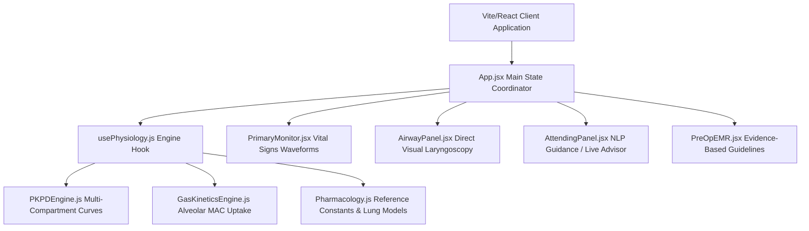
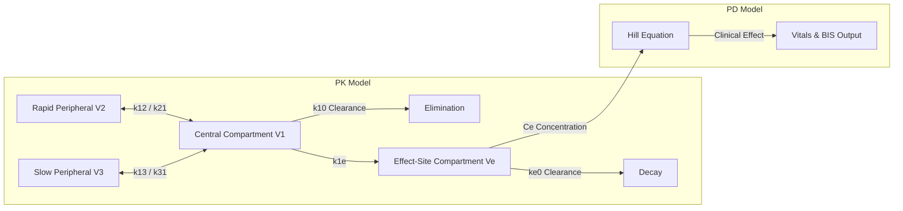
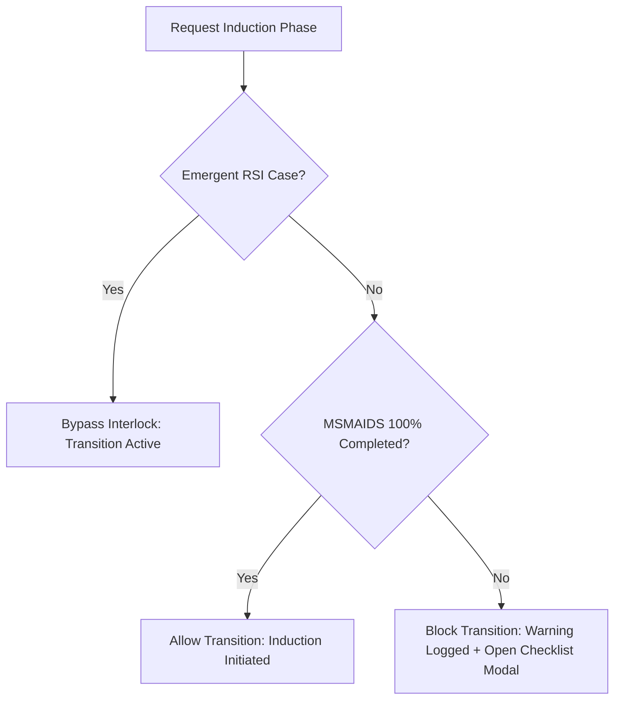

# Clinical Anesthesia & Physiological Airway Simulator
## High-Fidelity System Architecture & Golden Version Ground Truth

---

## 1. Technical Stack & State Architecture

The application is a high-fidelity, real-time clinical training simulator representing the human cardiovascular, respiratory, pharmacological, and airway-axis responses during general anesthesia induction.



### 1.1 Technical Stack Specifications
*   **Core**: React 18 with Vite build system, ES Modules.
*   **Aesthetics**: Glassmorphic, dark-mode medical instrumentation UI styled with Vanilla GFM CSS variables and custom flex grids.
*   **Vitals Waveforms**: High-frequency `<canvas>`-based rendering loop for real-time multi-lead electrocardiogram (ECG), arterial line (A-line) pressure pulse, pulse oximetry ($SpO_2$ plethysmograph), and capnography ($EtCO_2$) waveforms.
*   **NLP Brain**: Local regex-driven intent parser linking live physiological states directly to interactive click-to-execute UI nodes.

### 1.2 State Lifecycle & The Engine Clock Bridge
The simulator operates on a synchronous **1-second (1000ms) interval clock** instantiated within the `usePhysiology.js` custom hook. To prevent stale React state closures during rapid physical iterations without forcing interval resets, a specialized **State Bridge Ref Pattern** (`stateRef`) is utilized.

```javascript
// The Physics Engine State Bridge.
const stateRef = useRef({ time, vitals, targetVitals, patient, activeMeds, gasModels, intravascularVolume, electrolytes, ventSettings, gasSettings, surgicalPhase, msmaidsComplete });

useEffect(() => {
  stateRef.current = { time, vitals, targetVitals, patient, activeMeds, gasModels, intravascularVolume, electrolytes, ventSettings, gasSettings, surgicalPhase, msmaidsComplete };
});
```
Every clock tick, the simulator extracts parameters from `stateRef.current`, executes physiological mathematical adjustments, modifies target thresholds, calculates compartmental PK/PD decay, and updates state hooks accordingly.

---

## 2. Cardiovascular & Hemodynamic Physiology Engine

Hemodynamics are modeled as an interactive system where blood pressure is a product of vascular tone, intravascular volume, and myocardial work.

### 2.1 Core Hemodynamic Equations
*   **Mean Arterial Pressure (MAP)**:
    $$MAP = DBP + \frac{SBP - DBP}{3}$$
*   **Cardiac Output (CO)**:
    $$CO = \frac{HR \cdot SV}{1000} \quad \text{[L/min]}$$
    *   *Baseline Stroke Volume ($SV$)*: $70\text{ mL}$ for healthy adults, scaled up to $85\text{ mL}$ in obesity, or restricted under structural disease (e.g., fixed $SV$ in severe Aortic Stenosis).
*   **Systemic Vascular Resistance (SVR)**:
    $$SVR = \frac{MAP \cdot 80}{CO} \quad \text{[dyn}\cdot\text{s}\cdot\text{cm}^{-5}\text{]}$$
    *   *Normal range*: $900 - 1400\text{ dyn}\cdot\text{s}\cdot\text{cm}^{-5}$.
    *   *Sepsis/Vasoplegia*: Drops drastically down to $600\text{ dyn}\cdot\text{s}\cdot\text{cm}^{-5}$.
    *   *Hypertension*: Elevated to $1450\text{ dyn}\cdot\text{s}\cdot\text{cm}^{-5}$ or above.

### 2.2 Myocardial Ischemia & Metabolic Demand
Myocardial oxygen demand is indexed via the **Rate Pressure Product (RPP)**:
$$RPP = HR \cdot SBP$$
If $RPP > 15,000$, and the patient has coronary artery disease (CAD), myocardial ischemia is triggered, causing ST-segment depression on the monitor, acute myocardial stunning, and a subsequent drop in Stroke Volume.

### 2.3 Cardiac Arrest & ACLS Resuscitation Model
*   **Arrest Conditions**: Triggered immediately if:
    1. Arterial oxygen tension ($PaO_2$) falls below $30\text{ mmHg}$ for $>15$ continuous seconds (hypoxemic arrest).
    2. pH drops below $6.9$ (severe metabolic acidosis).
    3. Severe anaphylactic shock occurs (e.g., penicillin bolus under active allergy).
    4. Severe hyperkalemia ($K^+ > 7.0\text{ mEq/L}$) occurs, causing widening QRS complexes leading to ventricular fibrillation.
*   **CPR Mechanics**: While CPR is active, the engine provides baseline survival perfusion ($CO \approx 1.5\text{ L/min}$, $MAP \approx 40\text{ mmHg}$).
*   **ACLS Medications**:
    *   *Epinephrine*: Bolusing $1\text{ mg}$ raises SVR and MAP, promoting coronary perfusion pressure.
    *   *Amiodarone*: Administered for refractory VF/pVT.
    *   *Atropine / Glycopyrrolate*: Reverse muscarinic bradycardia.
    *   *Calcium Chloride*: Indicated for hyperkalemic arrests to stabilize myocardial membranes.

---

## 3. Respiratory & Blood Gas Physiology Engine

The respiratory engine calculates metabolic oxygen consumption and carbon dioxide production, adjusting arterial partial pressures based on ventilation status and anatomical shunts.

### 3.1 Predicted Lung Volumes (ECCS/ERS 1993 Equations)
Predicted baseline capacities are calculated based on Height ($H$, meters), Age ($A$, years), and Sex:
*   **Male Predicted Volumes**:
    $$FVC_{\text{pred}} = 5.76 \cdot H - 0.026 \cdot A - 4.34$$
    $$FEV_1{}_{\text{pred}} = 4.30 \cdot H - 0.029 \cdot A - 2.49$$
    $$TLC_{\text{pred}} = 7.99 \cdot H - 7.08$$
    $$RV_{\text{pred}} = 1.31 \cdot H + 0.022 \cdot A - 1.23$$
    $$FRC_{\text{pred}} = 2.34 \cdot H + 0.009 \cdot A - 1.09$$
*   **Female Predicted Volumes**:
    $$FVC_{\text{pred}} = 4.43 \cdot H - 0.026 \cdot A - 2.89$$
    $$FEV_1{}_{\text{pred}} = 3.95 \cdot H - 0.025 \cdot A - 2.60$$
    $$TLC_{\text{pred}} = 6.60 \cdot H - 5.79$$
    $$RV_{\text{pred}} = 1.81 \cdot H + 0.016 \cdot A - 2.00$$
    $$FRC_{\text{pred}} = 2.24 \cdot H + 0.001 \cdot A - 1.00$$

### 3.2 Pathophysiological & Positional Corrections on FRC
The Functional Residual Capacity ($FRC$) represents the patient's primary oxygen buffer reservoir during apnea. It is subject to multi-layered exponential decay scaling:

1.  **COPD/Hyperinflation**:
    $$FRC_{\text{disease}} = FRC_{\text{pred}} \cdot 1.35$$
2.  **Restrictive Lung Disease**:
    $$FRC_{\text{disease}} = FRC_{\text{pred}} \cdot 0.52$$
3.  **Obesity Scale (Pelosi et al. 1998)**:
    $$FRC_{\text{obese}} = FRC_{\text{disease}} \cdot e^{-0.02 \cdot (BMI - 25)} \quad (\text{if } BMI > 25)$$
4.  **Positional Scaling Factors (Rehder et al. 1977)**:
    $$FRC_{\text{final}} = FRC_{\text{obese}} \cdot \text{PosFactor}$$

| Patient Position | PosFactor | Clinical Rationale |
| :--- | :---: | :--- |
| **Sitting / Beach Chair** | $1.00$ | Maximal diaphragmatic excursion, optimized baseline FRC. |
| **Ramped** | $0.90$ | Improved chest wall compliance in obese subjects. |
| **Reverse Trendelenburg** | $0.90$ | Diaphragmatic displacement shifted caudally. |
| **Prone** | $0.85$ | Relieves cardiac compression on posterior lung segments. |
| **Lateral Decubitus** | $0.82$ | Unilateral dependency compression of lower lung. |
| **Supine / Sniffing** | $0.80$ | Abdominal contents push cephalad, reducing FRC by 20%. |
| **Lithotomy** | $0.72$ | Extreme thigh flexion compresses abdominal wall. |
| **Trendelenburg** | $0.70$ | Cephalad displacement of abdominal viscera restricts FRC by 30%. |

### 3.3 Apnea & Oxygen Buffer Depletion Kinetics
When the patient becomes apneic (no spontaneous respiratory rate and mechanical ventilator is off), the oxygen content inside the FRC reservoir is depleted by the metabolic rate ($VO_2 \approx 250\text{ mL/min}$ at rest):

$$\frac{d(FRC\_O_2)}{dt} = -VO_2 \cdot (\text{Temperature Compensation}) - (\text{Intubation Stress Stroke})$$

As the reservoir is depleted, the alveolar oxygen fraction ($F_AO_2$) drops. Once $F_AO_2$ falls below $0.10$, arterial oxygen saturation ($SpO_2$) begins a precipitous, non-linear desaturation curve modeled via the oxygen-hemoglobin dissociation curve:

$$SpO_2 = 100 \cdot \left[ \frac{(PaO_2)^3}{(PaO_2)^3 + 26.6^3} \right]$$

### 3.4 Shunt Fraction ($Q_s/Q_t$) Math & Gas Exchange
Arterial oxygen tension ($PaO_2$) is calculated from Alveolar oxygen tension ($PAO_2$) via the pulmonary shunt equation:
*   **Alveolar Gas Equation**:
    $$PAO_2 = FiO_2 \cdot (P_B - P_{H_2O}) - \frac{PaCO_2}{R}$$
    *   $P_B = 760\text{ mmHg}$, $P_{H_2O} = 47\text{ mmHg}$, $R \approx 0.8$.
*   **Shunt Math**:
    $$PaO_2 = PAO_2 \cdot (1 - Q_s/Q_t)$$
    *   *Healthy shunt*: $5\%$ ($0.05$).
    *   *Obese supine*: $12\%$ ($0.12$).
    *   *One-Lung Ventilation (OLV)*: Elevated to $25\%$ ($0.25$).
    *   *Penetrating trauma*: $20\%$ ($0.20$).

---

## 4. Multi-Compartment Pharmacokinetics & Pharmacodynamics

The simulator implements a high-fidelity multicompartment mathematical pharmacokinetic (PK) model linked to receptor-level pharmacodynamic (PD) profiles.



### 4.1 Compartmental Kinetics Equations
For every medication, concentration is tracked across three structural compartments and a virtual effect-site compartment:
$$\frac{dC_1}{dt} = - (k_{10} + k_{12} + k_{13}) \cdot C_1 + k_{21} \cdot C_2 + k_{31} \cdot C_3 + \frac{\text{InfusionRate}}{V_1}$$
$$\frac{dC_2}{dt} = k_{12} \cdot C_1 - k_{21} \cdot C_2$$
$$\frac{dC_3}{dt} = k_{13} \cdot C_1 - k_{31} \cdot C_3$$
$$\frac{dC_e}{dt} = k_{1e} \cdot C_1 - k_{e0} \cdot C_e \quad (k_{1e} = k_{e0})$$

### 4.2 Receptor Pharmacodynamics (Sigmoid $E_{max}$ Hill Equation)
Clinical therapeutic and side effects are determined by the effect-site concentration ($C_e$) using the Hill equation:
$$Effect = \frac{E_{\max} \cdot C_e^\gamma}{EC_{50}^\gamma + C_e^\gamma}$$

### 4.3 High-Fidelity Medication Data Table

| Drug Name | Class / Type | PK Parameters ($V_1, k_{10}, ke_0$) | PD Parameters ($EC_{50}, \gamma$) | Primary Clinical Effect | Secondary Side Effects |
| :--- | :--- | :--- | :--- | :--- | :--- |
| **Propofol** | Sedative / Hypnotic | $V_1: 4.27\text{ L}$<br>$k_{10}: 0.443$<br>$ke_0: 1.2$ | $EC_{50}: 2.5\text{ mcg/mL}$<br>$\gamma: 2.0$ | GABA-A agonist. Triggers deep hypnosis, suppresses BIS to $<40$. | Direct venodilator. Decreases SVR (up to $-40\%$) and MAP. Induces apnea at $C_e \ge 2.5$. |
| **Fentanyl** | Opioid Analgesic | $V_1: 13.0\text{ L}$<br>$k_{10}: 0.05$<br>$ke_0: 0.15$ | $EC_{50}: 0.002\text{ mcg/mL}$<br>$\gamma: 1.5$ | Mu-Opioid agonist. Robust analgesia, blunts laryngoscopy stress response. | Respiratory depressant. Blunts ventilatory drive. Induces apnea at $C_e \ge 0.003$. |
| **Succinylcholine** | Depolarizing NMB | $V_1: 4.00\text{ L}$<br>$k_{10}: 0.80$<br>$ke_0: 1.6$ | $EC_{50}: 0.8\text{ mcg/mL}$<br>$\gamma: 3.0$ | Nicotinic AChR agonist. Ultra-rapid paralysis. TOF twitches fall to $0/4$ within 45s. | **Upregulated AChR Danger**: Triggers massive hyperkalemic potassium leak and cardiac arrest. |
| **Rocuronium** | Non-Depolarizing NMB | $V_1: 5.50\text{ L}$<br>$k_{10}: 0.09$<br>$ke_0: 0.18$ | $EC_{50}: 1.2\text{ mcg/mL}$<br>$\gamma: 2.5$ | Competitive Nicotinic antagonist. Safe alternative to Sux. TOF twitches to $0/4$ in 90s. | Prolonged paralysis ($C_e > 1.2$ blocks twitches). Reversible with Sugammadex. |
| **Epinephrine** | Vasopressor / Inotrope | $V_1: 5.00\text{ L}$<br>$k_{10}: 0.90$<br>$ke_0: 2.0$ | $EC_{50}: 0.08\text{ ng/mL}$<br>$\gamma: 1.5$ | $\alpha_1$, $\beta_1$, $\beta_2$ agonist. Profound raise in SVR ($+120\%$) and HR ($+60\%$). | Tachycardia, risks myocardial ischemia under high coronary demand. |
| **Phenylephrine** | Pure Vasopressor | $V_1: 6.00\text{ L}$<br>$k_{10}: 0.30$<br>$ke_0: 0.8$ | $EC_{50}: 0.15\text{ ng/mL}$<br>$\gamma: 1.2$ | Pure $\alpha_1$ agonist. Raises SVR ($+80\%$). Treats vasoplegia. | Reflex bradycardia due to carotid baroreceptor trigger (HR drops up to $-25\%$). |
| **Glycopyrrolate** | Anticholinergic | $V_1: 8.00\text{ L}$<br>$k_{10}: 0.12$<br>$ke_0: 0.4$ | $EC_{50}: 0.5\text{ mcg/mL}$<br>$\gamma: 1.5$ | Muscarinic antagonist. Increases HR, resolves hypoxemic bradycardia. | Mild tachycardia, xerostomia (dry mouth). |
| **Calcium Chloride** | Electrolyte | Instant distribution | $EC_{50}: N/A$<br>$\gamma: N/A$ | Myocardial membrane stabilizer. Counteracts potassium hyperkalemia danger. | Negligible at therapeutic doses. |

---

## 5. Inhalational Anesthetic Kinetics

Volatile anesthetic gas kinetics are governed by solubility partition coefficients and tissue uptake mechanics.

### 5.1 Age-Adjusted Minimum Alveolar Concentration (MAC)
The concentration of volatile gas required to suppress somatic movement to surgical incision in $50\%$ of patients is calculated utilizing the Nickalls age-adjusted formula:

$$MAC_{\text{age-adjusted}} = MAC_{40} \cdot 10^{-0.00269 \cdot (\text{Age} - 40)}$$
*   *Sevoflurane baseline MAC at age 40 ($MAC_{40}$)*: $2.0\%$.

### 5.2 Alveolar-Blood-Cerebral Gas Equilibration
Volatile delivery is modeled via progressive concentration steps:
1.  **Vaporizer Setting ($Fi$)**: User dials Sevoflurane via the workstation manifold ($0 - 8\%$).
2.  **Alveolar Concentration ($Fa$)**: Driven by ventilation and fresh gas flows:
    $$\frac{d(Fa)}{dt} = (\text{MinuteVentilation}) \cdot (Fi - Fa) - \text{PulmonaryUptake}$$
3.  **Effect-Site Cerebral Concentration ($Ce_{\text{gas}}$)**: Moves towards Alveolar concentration:
    $$\frac{d(Ce_{\text{gas}})}{dt} = k_{\text{gas\_transfer}} \cdot (Fa - Ce_{\text{gas}})$$
    *   As $Ce_{\text{gas}}$ increases, the patient's BIS falls ($BIS = 98 - 50 \cdot MAC_{\text{effective}}$).

---

## 6. Clinical Workflows & Safety Interlocks

### 6.1 Pre-induction Workflow Interlock (MSMAIDS Checklist)
A strict, high-fidelity safety interlock prevents entry into the **Induction** phase unless all preparation criteria are met.



*   **Standard Elective Rule**: Transition to the "Induction" surgical phase (whether triggered manually by the user or automatically by bolusing a sedative/hypnotic medication in "Pre-Op") is **locked** unless the MSMAIDS checklist is 100% complete.
*   **The MSMAIDS Checklist Structure**:
    *   **M**achine: Check anesthesia ventilator, circuit, and $O_2$ cylinders.
    *   **S**uction: Ensure working suction catheter is accessible at head of bed.
    *   **M**onitor: Apply ECG, NIBP, and Pulse Oximetry.
    *   **A**irway: Verify blade size, ETT cuff, stylet, and adjuncts are checked.
    *   **I**V: Ensure working large-bore intravenous access is flushed.
    *   **D**rugs: Confirm labeled induction agents, paralytics, and emergency vasopressors are drawn.
    *   **S**afety / Special: Confirm active case context, consent, and airway plan.
*   **Emergent RSI Exception Bypass**:
    *   If the case is flagged as an emergent **Rapid Sequence Intubation (RSI)**, the safety interlock is automatically bypassed.
    *   *Emergent Presets*: **Trauma - Penetrating Polytrauma** and **OB/GYN - Emergent C-Section** presets are flagged as emergent RSI by default.
    *   *Custom Cases*: The user can check **Emergent RSI Case** in the Customizer to bypass this checklist lock.

### 6.2 Airway Assessment & Direct Laryngoscopy
*   **Airway Assessment Metrics**:
    *   *Mallampati Score*: Grade I to IV (Grade IV significantly reduces glottic exposure).
    *   *Neck Mobility*: Normal or Reduced (Reduced mobility limits extension and head-tilt, worsening visual grades).
    *   *Airway Blood*: Traumatic hemorrhage obscures visualization unless actively suctioned.
*   **Glottic Exposure (Cormack-Lehane Grade)**:
    When performing laryngoscopy, the visual exposure of the glottic aperture is evaluated:
    *   **Grade 1**: Full view of vocal cords (easy intubation).
    *   **Grade 2**: Partial view of cords/arytenoids.
    *   **Grade 3**: Epiglottis only visible (requires airway adjunct like Bougie or Stylet).
    *   **Grade 4**: No airway structures visible (requires rescue ventilation or surgical cricothyroidotomy).
*   **Tracheal Intubation Verification**:
    Intubation placement must be validated immediately to rule out esophageal intubation:
    1.  **End-Tidal Capnography ($EtCO_2$)**: Positive, sustained capnogram waveform over multiple breaths.
    2.  **Auscultation**: Bilateral breath sounds present, gastric sounds absent.
    3.  **Inspection**: Symmetrical chest rise, visible condensation misting in the tube.

---

## 7. Attending Direct Chat & Advisor Engine

The simulator incorporates an interactive **Attending Physician AI Engine** combining real-time physiological diagnostics with an active natural language processing (NLP) chat portal.

### 7.1 Automated Guidance Evaluator (`AttendingEngine.js`)
Every clock tick, the advisor checks the simulator parameters to offer actionable suggestions:
*   *Vitals Watch*: Flags severe hypotension ($MAP < 60\text{ mmHg}$), severe hypoxemia ($SpO_2 < 90\%$), or profound bradycardia.
*   *Timeline Compliance*: Checks if MSMAIDS is bypassed or incomplete under non-emergent timelines.
*   *NMB Monitoring*: Flags attempting intubation without muscle relaxation (TOF 4/4) or warning of succinylcholine hyperkalemia risks.

### 7.2 Conversational NLP Chat Portal (`ClinicalAiChat.js`)
The chat panel exposes a premium chat interface where users submit free-form questions. The response generator uses active simulator state values to formulate advice:

1.  **State-Driven Diagnostics**: Querying *"Why is the blood pressure low?"* evaluates current active vasoactive medications, Propofol effect-site concentration, and systemic vascular resistance ($SVR$), identifying if the hypotension is venodilative (Propofol-induced) or hemorrhagic.
2.  **Click-to-Execute Action Badges**: Attending responses are parsed by `parseAndRenderText` which extracts specific keywords (e.g. `epinephrine`, `rocuronium`, `suction airway`, `review chart`, `live labs`) and transforms them into active clinical button badges. Clicking a badge executes the procedure or panel transition directly in the UI.

---

## 8. Crucial Code Files & System Responsibilities

1.  [`App.jsx`](file:///Users/jsriverab/.gemini/antigravity/scratch/airway-sim/src/App.jsx): Main coordinator of state. Orchestrates modal toggles, snap/restore, pre-op staging, and timeline phase locks.
2.  [`usePhysiology.js`](file:///Users/jsriverab/.gemini/antigravity/scratch/airway-sim/src/engine/usePhysiology.js): Central mathematical simulation thread. Drives gas kinetics, fluid volumes, hemodynamic changes, and timeline auto-advancements.
3.  [`Pharmacology.js`](file:///Users/jsriverab/.gemini/antigravity/scratch/airway-sim/src/engine/Pharmacology.js): Library defining all reference data, predicted lung capacities, and drug metabolic rates.
4.  [`ClinicalAiChat.js`](file:///Users/jsriverab/.gemini/antigravity/scratch/airway-sim/src/engine/ClinicalAiChat.js): Natural language state evaluator and response compiler for the Attending chat window.
5.  [`CaseManager.jsx`](file:///Users/jsriverab/.gemini/antigravity/scratch/airway-sim/src/components/controls/CaseManager.jsx): Controls preset clinical scenarios and hosts the customized physiology builder interface.
6.  [`ActionPanel.jsx`](file:///Users/jsriverab/.gemini/antigravity/scratch/airway-sim/src/components/controls/ActionPanel.jsx): Primary intervention console hosting surgical timeline locks, positioning, and ACLS maneuvers.
7.  [`AirwayPanel.jsx`](file:///Users/jsriverab/.gemini/antigravity/scratch/airway-sim/src/components/controls/AirwayPanel.jsx): Renders glottic laryngoscopy viewpoints and handles direct mechanical instrumentation.
8.  [`AttendingPanel.jsx`](file:///Users/jsriverab/.gemini/antigravity/scratch/airway-sim/src/components/controls/AttendingPanel.jsx): Dual-tab sidebar panel hosting the automatic clinical monitor and conversational chat.
