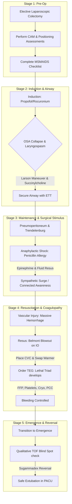

# AirwaySim: Comprehensive Capabilities Inventory & Educational Audit

This document provides a technical audit of the AirwaySim simulator, detailing the core physiological engines, interactive controls, clinical edge cases, pedagogical concepts, and a proposed master case study designed to utilize 100% of the simulator's capabilities.

---

## 1. COMPREHENSIVE CAPABILITIES INVENTORY

The simulator is built on a real-time, synchronous 1-second interval execution clock (`usePhysiology.js`), which coordinates compartmental pharmacokinetic/pharmacodynamic (PK/PD) curves, high-fidelity physiological feedback loops, and clinical crisis models.

### A. Core Engine Features (State Engines & Mathematical Models)

#### 1. Coupled Cardiovascular Mechanics & Waveforms
*   **Engine Core** (`CardiovascularEngine.ts` / `FourChamberCircuitModel.ts`):
    *   Implements a coupled LA-LV-mitral/aortic-valve-systemic-Windkessel time-varying-elastance ODE. This replaces old Starling approximations with real pressure-volume loop integration.
    *   Models Mean Arterial Pressure ($MAP$) dynamically:
        $$MAP_{\text{exact}} = \frac{CO \cdot SVR}{80} + \Delta P_{\text{pressor}} + \Delta P_{\text{sepsis}} - \text{Stunning}_{\text{MAP\_penalty}}$$
    *   Autoregulates Systemic Vascular Resistance ($SVR$) based on celiac/thoracic epidural sympathetic blockade ($SympatheticBlock$):
        $$\text{targetSVR} *= (1.0 - 0.15 \cdot \text{SympatheticBlock})$$
        where epidural coverage is calculated by:
        $$\text{epiduralCoverageFraction} = \text{calculateDermatomalBlockFraction}(\text{epiduralLevel}, 5, 13)$$
    *   Pressor pressure shifts include splanchnic venous capacitance pooling, reversed by alpha-1 agonists (Phenylephrine, Norepinephrine, Epinephrine):
        $$V_{\text{splanchnic}} = 1.0 + 0.3 \cdot \text{SympatheticBlock} \cdot (1.0 - \text{AlphaAgonistEffect})$$
*   **Severe Aortic Stenosis (AS)**:
    *   Models diastolic stiffness ($AS_{\text{stiffness}} = 1.4$) causing left ventricular pressure-volume restrictions and a fixed stroke volume ceiling ($SV_{\text{max}}$ capped at $1.1 \cdot SV_{\text{base}}$ vs. $1.6$ normally). Shows that the AS ventricle cannot compensate for acute drops in preload or afterload.
*   **CVP & Pulmonary Artery Catheter Waveforms** (`CvpWaveformModel.js`, `PulmonaryArteryCatheterModel.js`):
    *   Synthesizes live a/c/v/x/y wave patterns. Incorporates mechanical anomalies:
        *   *Atrial Fibrillation*: Loss of "a" wave, prominent "c" wave.
        *   *AV Dissociation*: Cannon "a" waves when atrium contracts against a closed tricuspid valve.
        *   *Tricuspid/Mitral Regurgitation*: "Ventricularization" of CVP (fused c-v wave).
        *   *Catheter Artifacts*: Motion whip artifact (`pacWhipArtifact`) and over-wedging (`pacOverwedged`).

#### 2. Compartment-Level Pharmacology (PK/PD)
*   **Mammillary PK Model** (`PKPDEngine.ts` / `Pharmacology.js`):
    *   A three-compartment model (Central $V_1$, Rapid Peripheral $V_2$, Slow Peripheral $V_3$, and Effect Site $V_e$). Resolves differential equations using Euler sub-stepping ($dt = 0.1\text{ s}$) to prevent numerical blowout during rapid boluses.
    *   Calculates Minto kinetics for remifentanil dynamically based on age and Hume Lean Body Mass ($LBM$).
*   **Flow-Dependent Autoregulation**:
    *   Clearance rates ($k_{10}, k_{12}, k_{13}$) scale with cardiac output ratio ($coMod$).
    *   Effect-site equilibration ($ke_0$) autotunes dynamically: peripheral onset delays with perfusion ($ke_0 \propto CoRatio$), while cerebral drugs are buffered by cerebral autoregulation.
    *   Central volume of distribution scales with blood volume and cardiac output:
        $$\text{dynamic}V_1 = \max(0.1, V_1 \cdot v_1VolumeRatio \cdot (0.6 + 0.4 \cdot coRatio))$$
*   **Sigmoid Emax Pharmacodynamics**:
    *   Receptor-site drug concentrations couple to target receptors ($\alpha_1, \beta_1, \beta_2, V_1$, mu, kappa, delta, GABA-A, NMDA) using Hill equation ratios.
    *   Increases pharmacodynamic brain sensitivity in the elderly (Propofol age-sensitivity coefficient scales at $2.5\%$ per year past 40).
    *   Incorporates an `opioidToleranceMultiplier` to model acute tolerance/hyperalgesia (shifting $EC_{50}$ rightward).

#### 3. Neuromuscular Junction (NMJ) Transmission & Receptors
*   **NMJ Receptor Subtypes** (`NeuromuscularMonitoringModel.ts` / `ReceptorPharmacologyModel.ts`):
    *   Models mature junctional ($\alpha_2\beta\delta\epsilon$), extrajunctional fetal ($\alpha_2\beta\delta\gamma$), and presynaptic neuronal ($\alpha_3\beta_2$) nicotinic acetylcholine receptors ($nAChR$).
    *   Extrajunctional receptors are upregulated in states of denervation, burns, or immobility, causing extreme hyperkalemia under Succinylcholine due to prolonged open-channel times and low conductance.
    *   Presynaptic receptors drive Train-of-Four (TOF) fade: competitive blockade (by nondepolarizers) causes fade; Succinylcholine Phase I block does not cause fade (presynaptic receptors untouched) but transitions to Phase II fade under high cumulative exposure ($>4\text{ mg/kg}$).
*   **BChE (Pseudocholinesterase) Genotypes**:
    *   Clearance of Succinylcholine is gated by butyrylcholinesterase ($BChE$) genetics:
        *   *Normal ($E_1^u E_1^u$)*: $bcheMultiplier = 1.0$.
        *   *Heterozygous ($E_1^u E_1^a$)*: $bcheMultiplier = 0.1$ (20-30 min block).
        *   *Atypical Homozygous ($E_1^a E_1^a$)*: $bcheMultiplier = 0.01$ (4-6 hour block).
        *   Acquired blunting is modeled for pregnancy ($0.8$), liver cirrhosis ($0.5$), and neostigmine administration ($0.1$).

#### 4. Respiratory Mechanics & Gas Kinetics
*   **Lung Volumes & Compliance** (`RespiratoryEngine.ts` / `RespiratoryMechanicsModel.js`):
    *   Models functional residual capacity ($FRC$), vital capacity ($VC$), anatomical shunt, dead space, and compliance/resistance changes.
    *   Models atelectasis fraction (`atelectasisFraction`), corrected by sustained recruitment maneuvers and PEEP.
    *   Inhalational gas kinetics (`GasKineticsEngine.ts`) tracks alveolar wash-in/wash-out, blood/gas solubility, and diffusion hypoxia (requires O2 flushing post-N2O).
*   **Hypoxic Pulmonary Vasoconstriction (HPV)**:
    *   Models localized vasoconstriction to reduce shunt in unventilated lung zones (e.g. during One-Lung Ventilation). HPV is blunted dose-dependently by volatile anesthetics, which is reversed by switching to Total Intravenous Anesthesia (TIVA).

#### 5. Consciousness & Sleep-Wake Sleep Architecture
*   **Consciousness Systems** (`ConsciousnessEngine.ts`):
    *   Simulates sleep-wake cycles (stages W, N1, N2, N3, R). Sedative concentrations (Propofol, Dexmedetomidine, Benzodiazepines) drive the arousal threshold.
    *   Models pharyngeal collapse in Obstructive Sleep Apnea (OSA) based on genioglossus dilator muscle tone (`dilatorMuscleTone` $< 0.35$), which triggers complete upper airway obstruction.
    *   Models Cheyne-Stokes / Central Sleep Apnea via Loop Gain ($LG$), chemoreceptor delay ($t_{\text{delay}}$), controller gain, and plant gain.

#### 6. Endocrine, Renal, Hepatic & Gastrointestinal Engines
*   **HPA Axis & Adrenal Crisis** (`HpaAxisModel.ts` / `AdrenalEngine.ts`):
    *   Models cortisol synthesis and the renin-angiotensin-aldosterone system (RAAS).
    *   If a patient on chronic corticosteroids ($chronicPrednisoneDoseMgPerDay > 5$) does not receive stress-dose steroids (hydrocortisone) during induction, surgical stress triggers a refractory vasoplegic shock.
*   **Renal Perfusion & AKI Staging** (`RenalEngine.ts` / `AcuteKidneyInjuryModel.ts` / `BladderModel.ts`):
    *   Models $GFR$, renal blood flow ($RBF$), creatinine clearance, $BUN$, and fractional excretion of sodium ($FeNa$).
    *   Calculates KDIGO staging (0 to 3) based on oliguria and creatinine elevation.
    *   Models bladder pressure-volume compliance, benign prostatic hyperplasia (BPH) outflow obstruction, and urethral overflow leak.
*   **Hepatic Perfusion & Metabolism** (`HepaticEngine.ts` / `LiverTransplantPhysiologyModel.ts`):
    *   Calculates Portal Blood Flow ($pbf$), Hepatic Arterial Blood Flow ($habf$), and the Hepatic Arterial Buffer Response (HABR).
    *   Tracks Child-Pugh and MELD staging.
*   **Gastrointestinal Motility & Aspiration** (`GastrointestinalEngine.ts` / `GastricEmptyingModel.ts`):
    *   Calculates lower esophageal sphincter (LES) tone and intragastric pressure. Positive pressure ventilation ($PIP > 15\text{ cmH2O}$) before intubation causes gastric regurgitation and chemical aspiration.
    *   Models bowel gas volume expansion under nitrous oxide ($N_2O$).
    *   Tracks segmented postoperative ileus (stomach, small bowel, colon) and inflammatory ileus.

#### 7. Coagulation, Massive Transfusion & Resuscitation
*   **Coagulation Cascade** (`CoagulationCascadeModel.ts` / `DeepCoagulationModel.ts`):
    *   Models platelet count, fibrinogen, factor activity, and fibrinolysis.
    *   Drives Thromboelastography ($TEG$) values: reaction time (R-time), clot kinetics (K-time), alpha angle, maximum amplitude (MA), and LY30 (fibrinolysis fraction).
*   **Lethal Triad**:
    *   Calculates the synergism of Hypothermia ($<35^\circ\text{C}$), Acidosis ($pH < 7.2$), and Coagulopathy, accelerating organ dysfunction and hemorrhage.

---

### B. Interactive & User-Facing Features (Controls & Interface Systems)

| Panel / Control | User Input / Interactive Action | Core Variable Mutated |
| :--- | :--- | :--- |
| **Case Presets & Customizer** | Select 37+ case presets (Trauma, Cardiac, OB, Transplant, etc.) or customize height, weight, sex, allergies, comorbidities. | `activeCase`, `patient`, `vitals` |
| **Surgical Timeline Dials** | Advance phase: `Pre-Op` ➔ `Induction` ➔ `Incision` ➔ `Maintenance` ➔ `Emergence` ➔ `PACU`. | `surgicalPhase` |
| **Safety Checklists** | Complete interactive `MSMAIDS` checklist pre-induction. | `msmaidsComplete` |
| **Lines & Resus Panel** | Place PIV (14G–22G), CVC, IO, Arterial Line, or Foley Catheter. Swap infuser equipment: Gravity, Ranger, Belmont Rapid Infuser. | `patient.accessLines`, `fluidLine` |
| **Positioning Controls** | Set position: Supine, Sniffing, Ramped, Trendelenburg, Reverse Trendelenburg, Lithotomy, Lateral, Prone, Sitting. Pad arms, pad legs, place prone supports, lower legs, check head/eyes. | `patient.position`, `peronealNervePadded`, `armsPositionedCorrectly`, `legsLoweredCount`, `headEyeCheckCount` |
| **Resuscitation Fluids** | Administer Normal Saline, LR, Plasmalyte, PRBC, FFP, Platelets, Cryoprecipitate, Albumin, Fibrinogen, PCC (Kcentra), Andexanet, Idarucizumab, DDAVP, rFVIIa. | `intravascularVolume`, `plateletCount`, `fibrinogenMgDl`, `factorActivityFraction` |
| **Pharmacopoeia Panel** | Administer IV boluses or continuous infusions of 50+ medications (sedatives, opioids, paralytics, reversals, vasoactives, antihypertensives, antiarrhythmics, diuretics). | `activeMeds` (Compartmental mass curves) |
| **Ventilator Dial Manifold** | Adjust Mode (VCV, PCV, PCV-VG, PSV), Tidal Volume ($V_t$), Respiratory Rate ($RR$), $PEEP$, $FiO_2$, $P_{\text{insp}}$, I:E Ratio, $P_{\text{max}}$, pressure support ($P_s$). | `ventSettings` |
| **Vaporizer Dial Manifold** | Set volatile agent (Sevoflurane, Isoflurane, Desflurane, N2O), Dial Concentration ($\%$), and flows of Air, O2, N2O ($L/\text{min}$). | `gasSettings` |
| **ACLS Controls** | Start/Stop CPR, Check Rhythm, Deliver shock (Joules setting, Synchronized toggle). | `isCPRActive`, `defibSettings` |
| **Airway Panel (Laryngoscopy)** | Select laryngoscope blade type (Macintosh/Miller) and size, tube size, stylet/bougie adjuncts. Perform Larson's jaw-thrust, firm jaw-thrust, airway suction, or surgical cricothyroidotomy. | `tubeConfirmModal`, `trueGrade` (CL 1-4), `isAirwayCollapsed` |
| **Diagnostic Labs Panel** | Order ABG, VBG, CBC, CMP, Coagulation panel, TEG, LFTs, Thyroid panel, Urinalysis, Pregnancy HCG, Type & Screen/Cross, HbA1c. | `labs`, `showLabPanel` |
| **Attending AI Chat Portal** | Enter free-form queries. Attending responds with diagnostics and clickable action badges (e.g. `rocuronium`, `suction airway`). | `attendingMode`, `logs` |

---

### C. Edge Cases & Hidden Systems

1.  **Smoke Exposure & Basilar Skull Fracture** (`House Fire` Preset):
    *   *Carbon Monoxide*: $SpO_2$ is locked at falsely normal values ($97\text{--}98\%$) despite severe cellular hypoxia because regular pulse oximeters mistake carboxyhemoglobin ($COHb$) for oxyhemoglobin. The user must order a co-oximetry ABG to read the true $SaO_2$ and $COHb$.
    *   *NPA Trauma Contraindication*: Placing a Nasopharyngeal Airway (NPA) in facial/basilar skull trauma triggers a cribriform plate breach, driving the NPA into the cranial vault.
2.  **Organophosphate Poisoning & Myasthenia Gravis**:
    *   *Organophosphate Poisoning*: Cholinergic crisis (SLUDGE: salivation, lacrimation, urination, defecation, GI upset, emesis) plus bronchospasm and bradycardia. Depolarizing NMBAs (Succinylcholine) cause prolonged paralysis due to BChE inhibition, while nondepolarizers (Rocuronium) are resisted.
    *   *Myasthenia Gravis*: Upregulated receptors cause extreme resistance to Succinylcholine, but extreme, life-threatening sensitivity to nondepolarizers.
3.  **Belmont IO Blowout**:
    *   Connecting a Belmont Rapid Infuser (delivering fluids at $500\text{ mL/min}$ and $300\text{ mmHg}$) to an Intraosseous (IO) line or a small peripheral vein ($\le 20\text{G}$) causes an immediate pressure blowout, destroying the line.
4.  **Connected Intraoperative Awareness & Retrograde Facilitation**:
    *   If a paralyzed patient (Rocuronium occupancy $>90\%$) has inadequate anesthetic depth during surgical incision, they experienceconnected awareness. Catecholamines spike ($HR +35\text{ bpm}$, $BP +45\text{ mmHg}$), and a `ptsdScore` accumulates.
    *   Low-dose midazolam blocks memory consolidation, freezing PTSD risk. However, low-dose propofol or midazolam administered after memory encoding can trigger retrograde facilitation, increasing pre-op memory retention by $+30\%$ due to the blockade of retroactive interference.
5.  **Qualitative TOF Monitor Blind Spot**:
    *   Switching the Train-of-Four monitor from quantitative to qualitative mode simulates manual tactile twitch evaluation. Manual evaluation cannot detect fade once the true TOF ratio exceeds $0.40$. This allows the user to extubate a patient with severe residual paralysis (true TOF ratio $0.45$), leading to respiratory collapse in the PACU.

---

## 2. PEDAGOGICAL & EDUCATIONAL VALUE MATRIX

| Simulator Feature / Model | Educational Concept | Clinical Critical-Thinking Skill Reinforced |
| :--- | :--- | :--- |
| **Cardiac Windkessel Model** | Dynamic arterial compliance and ventricular-vascular coupling. | Balancing SVR and cardiac output in hemodynamically compromised patients. |
| **Severe Aortic Stenosis (AS)** | Preload dependency and fixed-stroke-volume hemodynamics in valvular disease. | Recognizing that vasodilators (e.g. propofol) cause refractory hypotension in AS because the heart cannot increase cardiac output. |
| **Minto Remifentanil PK Model** | Age-related pharmacokinetic decay and Lean Body Mass scaling. | Preventing drug overdose in elderly or obese patients by adjusting clearances. |
| **Upregulated Extrajunctional nAChRs** | Nicotinic receptor proliferation following denervation/burns. | Understanding why Succinylcholine is contraindicated after 48h post-burn to prevent hyperkalemic cardiac arrest. |
| **Qualitative TOF Monitor Blind Spot** | Limitations of tactile/visual assessment of neuromuscular blockade. | Prioritizing quantitative AMG monitors to confirm a TOF ratio $>0.90$ before extubation. |
| **Loop Gain Central Sleep Apnea** | Respiratory controller delay, controller gain, and plant gain. | Diagnosing Cheyne-Stokes breathing in CHF and treating it with oxygen. |
| **Lethal Triad in Hemorrhage** | Physiological synergy of acidosis, hypothermia, and coagulopathy. | Utilizing rapid blood warmers (Belmont) and early factor replenishment (FFP, Cryo, PCC) over cold crystalloids. |
| **Magnesium-PEC Interaction** | Magnesium sulfate interaction at the NMJ in preeclampsia. | Adjusting muscle relaxant doses in HELLP syndrome due to magnesium-potentiated blockade. |
| **Carboxyhemoglobin Pulse Ox Interference** | Spectroscopy limitations in carbon monoxide poisoning. | Suspecting carbon monoxide poisoning in burn patients despite a normal $SpO_2$ reading. |
| **Connected Awareness PTSD Loop** | Memory consolidation kinetics and the sleep-wake state bridge. | Diagnosing awareness under paralysis via sympathetic spikes and using midazolam for amnesia. |

### The "Ah-ha!" Moments in the Code

1.  **The Wolff-Parkinson-White (WPW) AFib Arrest**:
    *   *The Setup*: A patient with WPW develops Atrial Fibrillation. The clinician administers Adenosine or Verapamil.
    *   *The "Ah-ha!"*: Adenosine blocks the AV node. In WPW, blocking the AV node forces all electrical impulses through the accessory pathway (Bundle of Kent), causing a rapid ventricular response ($RVR > 280\text{ bpm}$) that degenerates into Ventricular Fibrillation and cardiac arrest. The student learns that AV-nodal blockers are strictly contraindicated in pre-excited AFib.
2.  **The G6PD Methemoglobinemia Trap**:
    *   *The Setup*: A G6PD-deficient patient develops methemoglobinemia from benzocaine spray.
    *   *The "Ah-ha!"*: Standard medical guidelines recommend Methylene Blue. However, in G6PD deficiency, Methylene Blue cannot be reduced to leucomethylene blue (due to lack of NADPH) and instead acts as an electron acceptor, causing severe oxidative hemolysis. The user must recognize this and administer high-dose Vitamin C (ascorbic acid) instead.
3.  **The Belmont IO Blowout**:
    *   *The Setup*: During a massive hemorrhage resuscitation through an IO line, the user activates the Belmont Rapid Infuser to run at maximum speed.
    *   *The "Ah-ha!"*: The line immediately blows out. The user realizes that rapid infusion systems require large-bore venous access, and rigid osseous cavities or narrow peripheral lines cannot handle high-pressure flow.

---

## 3. PROPOSED SYSTEM-SPANNING "MASTER CASE STUDY"

We propose a multi-stage case study: **"The Compounding Perioperative Storm."** This scenario progresses from a standard elective airway induction into a series of multi-system, compounding clinical crises that force the user to interact with 100% of the simulator's features.

### Stage 1: Preoperative Audit & Setup (Pre-Op Phase)
*   **Patient Profile**: An 58-year-old female scheduled for an emergency laparoscopic colectomy for perforated diverticulitis. 
    *   *Co-morbidities*: Severe coronary artery disease ($CAD$), obesity ($BMI = 35$), moderate obstructive sleep apnea ($OSA$), chronic prednisone use ($15\text{ mg/day}$) for rheumatoid arthritis, and a documented penicillin allergy.
*   **User Action Requirements**:
    1.  *Review EMR*: Examine the patient chart (`Pre-Op EMR`) to identify the chronic steroid use, penicillin allergy, and CAD risk.
    2.  *Perform Assessments*: Complete the complementary and alternative medicine (CAM) screening (`ask about herbal medicines`), positioning risk assessment (`ask about positioning risks`), and pre-op airway exam.
    3.  *Setup & MSMAIDS*: Complete the `MSMAIDS` checklist. The simulator blocks the transition to the induction phase if the checklist is incomplete.

### Stage 2: Induction & Airway Obstruction (Induction Phase)
*   **The Clinical Crisis**: Upon transitioning to induction, the patient's genioglossus muscle tone collapses due to propofol sedation, causing severe upper airway obstruction (OSA collapse, $SpO_2$ dropping rapidly). Attempted bag-mask ventilation ($BMV$) is obstructed.
*   **Compounding Complexity**: While attempting to secure the airway, the patient develops a laryngospasm. The user's Train-of-Four ($TOF$) monitor shows a $4/4$ count (no muscle relaxation).
*   **User Action Requirements**:
    1.  *Airway Maneuvers*: Apply a firm jaw-thrust or Larson's maneuver to temporarily relieve the obstruction.
    2.  *Pharmacological Intervention*: Administer Succinylcholine ($100\text{ mg}$ IV) to resolve the laryngospasm.
    3.  *Intubate*: Place the laryngoscope blade (Mac 3), select ETT size 7.5, verify placement by checking the $EtCO_2$ waveform, and inflate the cuff.

### Stage 3: Surgical Stimulus & Hemodynamic Shock (Incision & Maintenance)
*   **The Clinical Crisis**: The surgical team makes the skin incision and establishes CO2 pneumoperitoneum at $15\text{ mmHg}$ in the steep Trendelenburg position. This raises airway pressure and $EtCO_2$.
*   **Compounding Complexity 1 (Anaphylaxis)**: An antibiotic is ordered. If the user administers Ampicillin/Sulbactam (ignoring the penicillin allergy), it triggers anaphylactic shock. SVR drops to $<300\text{ dyn}\cdot\text{s}\cdot\text{cm}^{-5}$, $MAP$ drops to $<40\text{ mmHg}$, and severe bronchospasm develops.
*   **Compounding Complexity 2 (Adrenal Crisis)**: Because the patient takes chronic prednisone, the surgical stress triggers a refractory vasoplegic shock because the user did not administer stress-dose steroids.
*   **Compounding Complexity 3 (Connected Awareness)**: During the shock, the anesthetic concentration falls ($MAC < 0.4$, Propofol $Ce < 0.8$) while Rocuronium occupancy remains high ($>90\%$). This triggers connected awareness with an accumulating `ptsdScore`.
*   **User Action Requirements**:
    1.  *Treat Anaphylaxis*: Administer Epinephrine ($100\text{ mcg}$ IV bolus) and switch the ventilator to PCV mode to manage high peak airway pressures.
    2.  *Treat Adrenal Crisis*: Recognize the steroid dependency and administer Hydrocortisone ($100\text{ mg}$ IV).
    3.  *Treat Awareness & Sedate*: Deepen anesthesia (increase Sevoflurane dial) and administer Midazolam ($2\text{ mg}$ IV) to ensure amnesia and halt PTSD progression.

### Stage 4: Massive Resuscitation & Coagulopathy (Maintenance Phase)
*   **The Clinical Crisis**: The surgical team accidentally lacerates the iliac vein. Severe intraoperative hemorrhage occurs, and the patient loses $1500\text{ mL}$ of blood.
*   **Compounding Complexity 1 (Belmont IO Blowout)**: The user places an IO line and attempts to run blood through the Belmont Rapid Infuser. The line immediately blows out.
*   **Compounding Complexity 2 (The Lethal Triad)**: The user places a CVC, but resuscitates with cold Normal Saline. This triggers hyperchloremic metabolic acidosis, hypothermia ($34.2^\circ\text{C}$), and dilutional coagulopathy, activating the lethal triad.
*   **User Action Requirements**:
    1.  *Lines & Warmers*: Place a central venous catheter (CVC) or large-bore PIV, and swap the fluid line to the Belmont Rapid Infuser to safely deliver warmed fluids.
    2.  *Order Diagnostics*: Order a STAT blood gas (ABG) and Thromboelastography (TEG) to assess the coagulopathy.
    3.  *Targeted Resuscitation*: Order the Massive Transfusion Protocol (MTP) with PRBCs, FFP, and Platelets. Administer Calcium Chloride ($1\text{ g}$ IV) to reverse citrate-induced hypocalcemia, and PCC (Kcentra) to reverse the coagulopathy. Activate the Bair Hugger to correct hypothermia.

### Stage 5: Reversal, Emergence & PACU Transfer (Emergence & PACU Phases)
*   **The Clinical Crisis**: The surgical repair is complete, bleeding is controlled, and the patient is transitioned to the Emergence phase. The user must reverse the neuromuscular blockade.
*   **Compounding Complexity (Qualitative Monitor Blind Spot)**: The user switches the TOF monitor to qualitative mode. The tactile TOF shows a false-positive $4/4$ twitches with no detectable fade, even though the patient's actual receptor occupancy is $60\%$ (TOF ratio $\approx 0.45$). If the user extubates now, the patient will suffer respiratory collapse in the PACU.
*   **User Action Requirements**:
    1.  *Assess Blockade*: Switch the TOF monitor to quantitative mode to read the true TOF ratio ($0.45$).
    2.  *Administer Reversal*: Administer Sugammadex ($200\text{ mg}$ IV) to encapsulate Rocuronium molecules and restore the TOF ratio to $>0.90$.
    3.  *Extubate & Transfer*: Perform a cuff leak test, deflate the cuff, extubate the patient, and transition the patient to the PACU.
    4.  *PACU Scoring*: Perform a Room Air Challenge, evaluate the Aldrete score, and verify the patient is ready for discharge.
