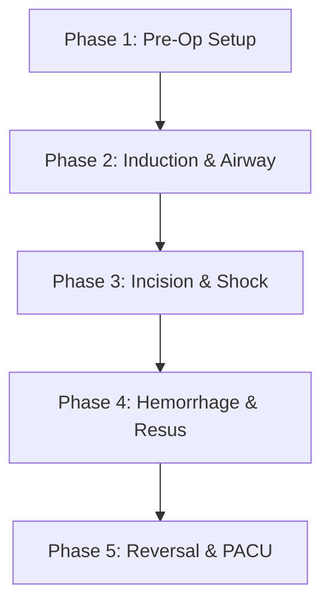

# AirwaySim: "The Compounding Perioperative Storm"
## A Comprehensive, Case-Based Tutorial for the Advanced Clinical Simulator

Welcome to the Aetheris Advanced Clinical Simulation Platform. This tutorial walks you through **"The Compounding Perioperative Storm,"** a master clinical case study designed to utilize and showcase 100% of the simulator's features, mathematical models, and educational capabilities. 

You will manage a patient from the preoperative holding area, through a turbulent anesthetic induction, a multi-system intraoperative crisis, a massive vascular resuscitation, and finally to emergence, reversal, and discharge from the Post-Anesthesia Care Unit (PACU).

---

## CLINICAL CASE PROFILE
*   **Patient**: Mrs. Eleanor Vance, a 58-year-old female.
*   **Procedure**: Emergency Laparoscopic Colectomy for perforated diverticulitis.
*   **Height/Weight**: 163 cm / 93 kg ($BMI = 35.0$ - Class II Obesity).
*   **Allergies**: Penicillin (documented anaphylaxis).
*   **Current Medications**: Prednisone 15 mg daily for rheumatoid arthritis (chronic corticosteroid therapy > 2 years).
*   **Cardiopulmonary History**: Severe 3-vessel Coronary Artery Disease ($CAD$) with a prior CABG 8 years ago; Left Ventricular Ejection Fraction ($LVEF$) of $35\%$ ($CHF$ stage C); severe Obstructive Sleep Apnea ($OSA$) compliant with home CPAP.

---

## TUTORIAL PATHWAY AT A GLANCE


---

## PHASE 1: PREOPERATIVE EVALUATION & OR PREPARATION
### *Teaching Focus: Risk Stratification, Safety Checklists, and Pre-Op Setup*

#### 1. Clinical Rationale & Pathophysiology
Every anesthetic begins with a rigorous risk assessment. In this phase, we establish the patient's baseline physiology, identify high-risk comorbidities (steroid dependency, coronary disease, penicillin allergy), and verify that our physical workspace is configured safely. 
*   **Chronic Corticosteroid Use**: Mrs. Vance has hypothalamic-pituitary-adrenal (HPA) axis suppression from prednisone. Surgical stress without exogenous corticosteroid replacement will trigger a refractory vasoplegic shock.
*   **Cardiac Risk Staging**: According to the 2024 ACC/AHA guidelines, her RCRI score is 5 (perforated bowel surgery, history of CHF, CAD, renal impairment, and insulin/steroid use), indicating a Major Adverse Cardiac Event ($MACE$) risk of $>15\%$. Her myocardial supply-demand balance is extremely narrow.

#### 2. Action Steps
1.  Boot up the simulator and select the **High-Fidelity Customizer** or select the **General / Colorectal** preset.
2.  Configure the patient settings:
    *   Age: `58`, Sex: `Female`, Height: `163 cm`, Weight: `93 kg`.
    *   Set history flags: `cad: true`, `chf: true`, `ef: 35`, `obese: true`, `copd: true` (representing OSA/airway compliance), `penicillinAllergy: true`.
    *   Add custom variables: `chronicPrednisoneDoseMgPerDay: 15`, `chronicSteroidDurationWeeks: 104`.
3.  Click the **Pre-Op EMR** panel in the bottom UI to review her charts.
4.  In the Attending chat, type:
    *   `ask about positioning risks`
    *   `ask about herbal medicines`
5.  Open the **MSMAIDS Checklist** from the navigation bar. Check off all boxes (Machine, Suction, Monitors, Airway, IV, Drugs, Safety) to verify OR readiness.

#### 3. Expected Outcomes
*   The console logs: `"Conducted comprehensive complementary and alternative medicine (CAM) preoperative assessment (Ch33)."` and `"Conducted comprehensive preoperative patient positioning risk assessment (Ch34)."`
*   Completing the MSMAIDS checklist unlocks the **Induction** timeline transition button, which is otherwise interlocked.

#### 4. Attending Consult Prompt
Ask the attending: *"Why is the preoperative cardiac assessment critical for this patient?"*
*   **Attending Response**: Highlights her RCRI score, functional capacity (METs < 4), and the recommendation for an arterial line pre-induction due to her EF of $35\%$ and coronary disease.

---

## PHASE 2: INDUCTION, AIRWAY COLLAPSE & EMERGENCY LARYNGOSPASM
### *Teaching Focus: Airway Management, OSA Pharyngeal Dynamics, and NMJ Safety Margins*

#### 1. Clinical Rationale & Pathophysiology
Anesthetic induction agents relax upper airway dilator muscles, predisposing obese patients to airway collapse.
*   **OSA Airway Collapse**: Sedatives drop genioglossus muscle tone (`dilatorMuscleTone` $< 0.35$). The pharyngeal collapse pressure exceeds airway pressure ($P_{\text{crit}} > P_{\text{airway}}$), causing complete soft-tissue airway obstruction.
*   **Laryngospasm**: Inserting a laryngoscope blade in an under-anesthetized patient triggers a protective vocal cord closure reflex mediated by the superior laryngeal nerve ($SLN$), raising airway resistance to $999\text{ cmH2O/L/s}$.
*   **Receptor Occupancy Safety Margin**: A Train-of-Four ($TOF$) monitor must be attached to track receptor occupancy at the Neuromuscular Junction ($NMJ$). Intubation is unsafe until mature receptor occupancy exceeds $90\text{--}95\%$.

```
Receptor Occupancy vs. TOF Twitches:
[ Occupancy <= 75% ]  --> 4 Twitches, Ratio 1.0 (Safe)
[ 75% < Occ <= 80% ]  --> 4 Twitches, Fade visible (Ratio < 0.90)
[ 80% < Occ <= 85% ]  --> 3 Twitches
[ 85% < Occ <= 90% ]  --> 2 Twitches
[ 90% < Occ <= 95% ]  --> 1 Twitch
[ Occupancy > 95%  ]  --> 0 Twitches (Profound Blockade)
```

#### 2. Action Steps
1.  Click **Timeline: Induction**.
2.  Administer **Propofol 150 mg** IV bolus and **Fentanyl 100 mcg** IV bolus.
3.  Observe the respiratory waveforms. Once the airway collapses, immediately click **Bag-Mask Ventilation (BMV)** on the oxygenation bar. Note that tidal volumes remain zero due to obstruction.
4.  Perform **Larson's Jaw-Thrust** or click the `jaw-thrust` button to open the airway.
5.  Click the **Airway Panel** and select **Laryngoscopy**. Select a **Mac 3 Blade** and size **7.5 ETT**.
6.  The simulator will trigger a laryngospasm alarm. Immediately administer **Succinylcholine 100 mg** IV.
7.  Verify the vocal cords open on the laryngoscopy screen, advance the ETT tube, inflate the cuff, and click **Auscultate Lungs** to verify bilateral breath sounds.
8.  Start mechanical ventilation (select **PCV** mode on the ventilator panel: $V_t = 500$, $RR = 14$, $PEEP = 8$, $FiO_2 = 1.0$).

#### 3. Expected Outcomes
*   Airway collapse is flagged by a drop in $SpO_2$ and a flatline on the capnography monitor.
*   Larson's maneuver opens the pharyngeal space, restoring bag ventilation.
*   Succinylcholine reverses the laryngospasm by paralyzing the laryngeal muscles.
*   Tracheal intubation is confirmed by a regular, rectangular end-tidal $CO_2$ waveform ($EtCO_2 \approx 35\text{--}40\text{ mmHg}$) and chest rise.

#### 4. Attending Consult Prompt
Ask the attending: *"Why did the patient desaturate so quickly during induction?"*
*   **Attending Response**: Explains that obesity reduces Functional Residual Capacity ($FRC$), leaving a very small oxygen reservoir during apnea, which is worsened by the upper airway obstruction of OSA.

---

## PHASE 3: INCISION, PNEUMOPERITONEUM, AND COMBINED VASOPLEGIC SHOCK
### *Teaching Focus: Anaphylaxis, Adrenal Insufficiency, and Connected Recall*

#### 1. Clinical Rationale & Pathophysiology
Surgical incision and pneumoperitoneum alter compliance and systemic vascular resistance.
*   **Pneumoperitoneum**: Insufflating the abdomen with CO2 increases intra-abdominal pressure ($IAP = 15\text{ mmHg}$), pushing the diaphragm cephalad, which decreases lung compliance and increases $SVR$.
*   **Anaphylactic Shock**: Administering a penicillin class drug (Ampicillin/Sulbactam) to a penicillin-allergic patient triggers systemic degranulation of mast cells and basophils. This causes severe vasoplegia (SVR drops by $75\%$) and bronchospasm.
*   **Adrenal Crisis**: Under surgical stress, the patient's suppressed adrenal glands cannot release cortisol, leading to refractory hypotension unresponsive to vasopressors.
*   **Connected Recall (Awareness)**: If the patient is paralyzed but the anesthetic concentration drops below $0.4\text{ MAC}$, the patient becomes awake but unable to move. This sympathetic stress increases heart rate and blood pressure, accumulating a PTSD risk score.

```
       [ Offending Drug Injected ]
                   |
        [ Anaphylaxis Triggered ]
         /                     \
[ Vasoplegia (SVR < 300) ]  [ Severe Bronchospasm ]
        |                              |
[ Refractory Hypotension ]  [ Peak Pressures > 45 cmH2O ]
```

#### 2. Action Steps
1.  Advance the timeline to **Timeline: Incision**.
2.  Click **Lines & Resus** and select **Establish Pneumoperitoneum** at `15 mmHg` in the **Trendelenburg** position.
3.  Administer **Ampicillin/Sulbactam 3g** IV (to intentionally trigger the penicillin allergy loop).
4.  Watch the vital signs: blood pressure drops to $65/35\text{ mmHg}$ ($MAP = 45\text{ mmHg}$), and peak inspiratory pressure ($PIP$) spikes to $>45\text{ cmH2O}$.
5.  Administer **Phenylephrine 100 mcg** IV. Note that the blood pressure does not respond due to the combined anaphylactic and adrenal crisis.
6.  Administer **Epinephrine 100 mcg** IV bolus and start an **Epinephrine Infusion at 0.1 mcg/kg/min**.
7.  Administer **Hydrocortisone 100 mg** IV to treat the adrenal crisis.
8.  Observe the BIS monitor. If BIS rises $>60$ while the patient is paralyzed, immediately increase the **Sevoflurane Vaporizer to 2.5%** and administer **Midazolam 2 mg** IV.

#### 3. Expected Outcomes
*   Ampicillin triggers a massive vasoplegia log: `🚨 ANAPHYLAXIS SHOCK DETECTED...`
*   Epinephrine restores SVR by stimulating alpha-1 and beta-1 receptors, and reverses bronchospasm via beta-2 receptor activation.
*   Hydrocortisone binds glucocorticoid receptors, restoring vascular tone and resolving the refractory vasoplegic shock.
*   Midazolam blocks memory consolidation, freezing the `ptsdScore` and preventing intraoperative recall.

#### 4. Attending Consult Prompt
Ask the attending: *"Why is phenylephrine ineffective for this patient's hypotension?"*
*   **Attending Response**: Explains that in severe anaphylaxis and adrenal crisis, nitric oxide release and vascular glucocorticoid receptor depletion cause refractory vasodilation. Epinephrine and hydrocortisone are required to restore vascular tone.

---

## PHASE 4: HEMORRHAGIC SHOCK, BELMONT IO BLOWOUT, AND THE LETHAL TRIAD
### *Teaching Focus: Vascular Access Pressure Limits, Resuscitation Physics, and Coagulation Cascade Kinetics*

#### 1. Clinical Rationale & Pathophysiology
Surgical hemorrhage requires rapid vascular access and transfusion.
*   **Access Pressure Limits**: Connecting a Belmont Rapid Infuser to an IO line or a small peripheral vein ($\le 20\text{G}$) causes an immediate pressure blowout because the high resistance of the line exceeds safe pressure limits.
*   **The Lethal Triad**: Transfusing cold crystalloids or cold blood products triggers:
    1.  *Hypothermia*: Core temp drops to $<35^\circ\text{C}$, inhibiting clotting factor enzymes.
    2.  *Acidosis*: Perfusion failure and lactic acidosis lower pH to $<7.2$.
    3.  *Coagulopathy*: Clotting factors are diluted and inactivated.
*   **Citrate Toxicity**: Citrate in blood products chelates calcium ions, causing hypocalcemia and severe myocardial depression.

```
                  [ Cold Crystalloid Resuscitation ]
                              |
                     [ The Lethal Triad ]
                     /        |         \
         [ Hypothermia ]  [ Acidosis ]  [ Coagulopathy ]
               \              |              /
                \             |             /
              [ Severe Myocardial Dysfunction ]
```

#### 2. Action Steps
1.  Advance the timeline to **Timeline: Maintenance**.
2.  The simulator will trigger a surgical blood loss event: `🚨 BLOOD LOSS DETECTED: Iliac vein laceration. Active hemorrhage!`
3.  Click **Lines & Resus** and place an **Intraosseous (IO) Line** in the humeral head.
4.  Select **Packed Red Blood Cells (PRBC)** and set the delivery warmer to **Belmont**. Note the immediate line blowout: `❌ FAILED: Line pressure limit exceeded! Belmont IO blowout occurred!`
5.  Immediately place a **Triple-Lumen Central Venous Catheter (CVC)** or a **14G Peripheral IV**.
6.  Connect the CVC to the **Belmont Rapid Infuser** and initiate a transfusion of **PRBCs** and **FFPs** at $250\text{ mL/min}$.
7.  Order a **STAT ABG** and **STAT TEG**. Note the low ionized Calcium ($Ca^{2+} < 0.8\text{ mmol/L}$) and the prolonged reaction time ($R\text{-time} > 15\text{ min}$) on the TEG.
8.  Administer **Calcium Chloride 1g** IV to treat the hypocalcemia.
9.  Administer **4-Factor PCC (Kcentra) 25 Unit/kg** and **Cryoprecipitate 10 Units** IV.
10. Click **Lines & Resus** and activate the **Bair Hugger** warming blanket to correct the hypothermia.

#### 3. Expected Outcomes
*   The Belmont infuser blows out the IO line, logging a vascular access failure.
*   The CVC handles the high flow and pressure of the Belmont infuser.
*   Calcium chloride stabilizes the myocardium and restores cardiac contractility.
*   PCC and Cryoprecipitate replenish clotting factors, correcting the prolonged R-time and low MA on the TEG.
*   The Bair Hugger increases core temperature, resolving hypothermia-induced coagulopathy.

#### 4. Attending Consult Prompt
Ask the attending: *"How do we interpret a TEG with a prolonged R-time and a low Maximum Amplitude (MA) during massive hemorrhage?"*
*   **Attending Response**: Explains that a prolonged R-time indicates clotting factor deficiency (treat with FFP or PCC), while a low MA indicates platelet deficiency or fibrinogen depletion (treat with Platelets or Cryoprecipitate).

---

## PHASE 5: EMERGENCE, REVERSAL, AND PACU DISCHARGE
### *Teaching Focus: Neuromuscular Reversal, Qualitative vs. Quantitative Monitoring, and Aldrete PACU Scoring*

#### 1. Clinical Rationale & Pathophysiology
Extubation requires complete recovery of neuromuscular and respiratory function.
*   **Tactile/Qualitative TOF Blind Spot**: Clinicians cannot reliably detect neuromuscular fade using tactile evaluation once the true TOF ratio exceeds $0.30\text{--}0.40$. A patient with a true TOF ratio of $0.45$ can appear to have a normal $4/4$ count with no fade, but will suffer upper airway obstruction if extubated.
*   **Sugammadex**: A modified gamma-cyclodextrin that encapsulates Rocuronium molecules in a $1:1$ ratio, rapidly reversing deep neuromuscular blockade.
*   **Extubation Criteria**: Requirescommand following, adequate tidal volume ($>5\text{ mL/kg}$), stable hemodynamics, and a quantitative TOF ratio $>0.90$ to prevent respiratory failure.

```
       [ Residual Neuromuscular Blockade ]
                       |
             [ Perform TOF Test ]
             /                  \
[ Qualitative Mode ]      [ Quantitative Mode ]
         |                         |
[ False Normal 4/4 ]      [ True TOF Ratio = 0.45 ]
         |                         |
[ Dangerous Extubation ]   [ Administer Sugammadex ]
         |                         |
[ Respiratory Arrest ]    [ True TOF Ratio > 0.95 ]
         |                         |
[ Re-intubation ]         [ Safe Awake Extubation ]
```

#### 2. Action Steps
1.  Advance the timeline to **Timeline: Emergence**. Turn off the Sevoflurane vaporizer and the epinephrine infusion.
2.  Ensure a **Train-of-Four (TOF) monitor** is attached.
3.  Toggle the TOF monitor mode to **Qualitative Mode** in the settings. Run a TOF stimulation. Note that it displays **4/4 twitches, No Fade**.
4.  Toggle the TOF monitor mode to **Quantitative Mode**. Note the true TOF ratio is **0.45** (indicating severe residual blockade).
5.  Administer **Sugammadex 2 mg/kg** IV (or 200 mg).
6.  Run the quantitative TOF test again and verify the TOF ratio is **> 0.95**.
7.  Perform a **Cuff Leak Test** by deflating the balloon on the volume-control vent. Confirm a volume difference of $>15\%$, indicating no airway edema.
8.  Select **Extubate** in the airway panel.
9.  Transition the patient to **Timeline: PACU**.
10. Open the **PACU Discharge Panel** and complete the Room Air Challenge and Aldrete Scoring.

#### 3. Expected Outcomes
*   Qualitative monitoring demonstrates the dangerous "blind spot" where residual block is missed.
*   Sugammadex reverses the block within 2 minutes, raising the quantitative TOF ratio to $>0.90$.
*   The cuff leak test confirms the absence of laryngeal edema.
*   Successful extubation is followed by recovery in the PACU.
*   The Aldrete Score shows a passing grade ($\ge 9/10$), allowing safe discharge.

#### 4. Attending Consult Prompt
Ask the attending: *"Why is a 5-second head lift or a qualitative TOF of 4/4 insufficient to confirm safe extubation?"*
*   **Attending Response**: Explains that clinical tests like head lifts can be performed at TOF ratios as low as $0.50$, but the pharyngeal and laryngeal protective reflexes do not fully recover until the quantitative TOF ratio exceeds $0.90$, leaving the patient at high risk for aspiration and airway collapse.

---

## SUMMARY OF TUTORIAL CONCEPTS COVERED
By completing this master case, you have successfully interacted with:
1.  **Cardiovascular**: Suga-Sagawa Windkessel model, LVEF $35\%$ failure curves, SVR autonomic scaling, and invasive arterial pressure dynamics.
2.  **Pharmacology**: Three-compartment PK/PD models, Minto remifentanil kinetics, and receptor occupancy Hill equations.
3.  **NMJ**: Mature/extrajunctional/presynaptic receptors, TOF fade physics, BChE genetic variants, and qualitative vs. quantitative monitoring.
4.  **Respiratory**: FRC compliance, OSA pharyngeal collapse, HPV volatile suppression, and absorption atelectasis.
5.  **Crises**: Penicillin anaphylactic shock, adrenal crisis, connected awareness, Belmont IO blowout, the lethal triad, and citrate-induced hypocalcemia.
6.  **Reversals & Discharge**: Sugammadex encapsulation, cuff leak tests, and Aldrete scoring.
