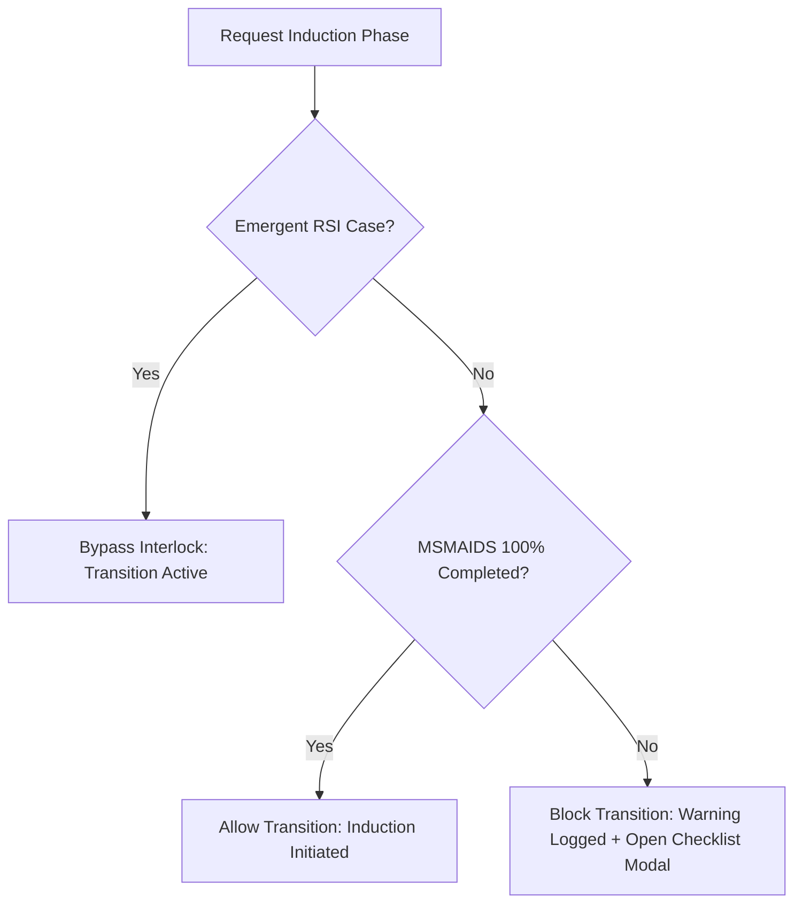

# Event Trigger, Clinical Scenarios & Workflow Engine Reference (§6)

> Part of the `goldenversion.md` ground-truth set. Relocated here so a chapter-integration
> session only loads this file when its content touches an intraoperative crisis trigger,
> safety interlock, or clinical scenario loop in `usePhysiology.js`. Section numbering
> (§6.x) is preserved exactly as it was in `goldenversion.md`. Being assembled in parts —
> see progress marker at end of file.

### 6. Event Trigger, Clinical Scenarios & Workflow Engine

#### 6.1 Pre-induction Workflow Interlock (MSMAIDS Checklist)
A strict, high-fidelity safety interlock prevents entry into the **Induction** phase unless all preparation criteria are met.

*   **Standard Elective Rule**: Transition to the "Induction" surgical phase is **locked** unless the MSMAIDS checklist is 100% complete.
*   **The MSMAIDS Checklist Structure**:
    *   **M**achine: Check anesthesia ventilator, circuit, and $O_2$ cylinders.
    *   **S**uction: Ensure working suction catheter is accessible at head of bed.
    *   **M**onitor: Apply ECG, NIBP, and Pulse Oximetry.
    *   **A**irway: Verify blade size, ETT cuff, stylet, and adjuncts are checked.
    *   **I**V: Ensure working large-bore intravenous access is flushed.
    *   **D**rugs: Confirm labeled induction agents, paralytics, and emergency vasopressors are drawn.
    *   **S**afety / Special: Confirm active case context, consent, and airway plan.
*   **Emergent RSI Exception Bypass**: If the case is flagged as an emergent **Rapid Sequence Intubation (RSI)** (e.g. trauma, emergent C-section presets), the safety interlock is automatically bypassed.

#### 6.2 Airway Assessment & Direct Laryngoscopy Glottic Visualization
*   **Airway Assessment Metrics**:
    *   *Mallampati Score*: Grade I to IV (Grade IV significantly reduces glottic exposure).
    *   *Neck Mobility*: Normal or Reduced (limits extension, worsening Cormack-Lehane visual grades).
    *   *Airway Blood*: Traumatic hemorrhage obscures visualization unless actively suctioned.
*   **Glottic Exposure (Cormack-Lehane Grade)**:
    *   **Grade 1**: Full view of vocal cords (easy intubation).
    *   **Grade 2**: Partial view of cords/arytenoids.
    *   **Grade 3**: Epiglottis only visible (requires airway adjunct like Bougie or Stylet).
    *   **Grade 4**: No airway structures visible (requires rescue ventilation or surgical cricothyroidotomy).
*   **Tracheal Intubation Verification**:
    1.  **End-Tidal Capnography ($EtCO_2$)**: Positive, sustained capnogram waveform over multiple breaths.
    2.  **Auscultation**: Bilateral breath sounds present, gastric sounds absent.
    3.  **Inspection**: Symmetrical chest rise, visible condensation misting in the tube.

#### 6.3 Laryngospasm & Bronchospasm Spasmodic Reflex Loops
*   **Trigger Conditions**: Airway manipulation under inadequate anesthesia ($BAR_{\text{suppression}} < 0.50$) without muscle relaxation ($isParalyzed = false$) has a $5\%$ chance per second to trigger laryngospasm or bronchospasm.
*   **Physiological Impact**:
    *   *Laryngospasm*: Vocal cords snap shut. Compliance falls to $2\text{ mL/cmH2O}$, and resistance rises to $999\text{ cmH2O/L/s}$ (complete airway obstruction).
    *   *Bronchospasm*: Airway smooth muscle constricts. Compliance is halved, and resistance increases by $40\text{ cmH2O/L/s}$.
*   **Resolution Criteria**:
    *   *Laryngospasm*: Resolves if paralyzed ($Occupancy > 0.90$), anesthetized deeply ($MAC > 1.2$), or Larson's jaw-thrust maneuver performed.
    *   *Bronchospasm*: Resolves if anesthetized deeply ($MAC > 1.2$) or Epinephrine administered ($Ce > 0.01$).

#### 6.4 IgE-Mediated Anaphylactic Shock Vasoplegia
*   **Trigger Condition**: Administering a penicillin-containing drug (Ampicillin/Sulbactam) to a patient with a documented penicillin allergy. Triggers probabilistically by default (2% baseline clinical incidence, increased 4x if asthmatic, COPD, atopic, or highly anxious). Can be forced deterministically via `forcePenicillinAnaphylaxis: true` in patient state.
*   **Physiological Impact**: Triggers immediate anaphylaxis, causing vasoplegia and bronchospasm:
    *   *Vasoplegia*: SVR is severely reduced:
        $$SVR_{\text{multiplier}} = 0.25 + 0.75 \cdot e^{-0.05 \cdot dt_{\text{anaphylaxis}}}$$
    *   *Bronchospasm & Tachycardia*: Compliance falls, resistance rises, and heart rate increases:
        $$\text{Compliance}_{\text{penalty}} = 45 \cdot (1 - e^{-0.08 \cdot dt_{\text{anaphylaxis}}})$$
        $$\text{Resistance}_{\text{penalty}} = 45 \cdot (1 - e^{-0.08 \cdot dt_{\text{anaphylaxis}}})$$
        $$HR_{\text{penalty}} = 40 \cdot (1 - e^{-0.08 \cdot dt_{\text{anaphylaxis}}})$$
*   **Treatment**: Epinephrine resolves the reaction ($Recovery = \min(1.0, Ce_{\text{Epi}} \cdot 12)$). Penalties are reduced by $(1 - Recovery)$. Once $Recovery > 0.80$, the reaction resolves.

#### 6.5 Gastric Aspiration Chemical Pneumonitis
*   **Trigger Condition**: Delivering positive pressure ventilation ($PIP > 15\text{ cmH2O}$) to a patient with a full stomach before the airway is secured.
*   **Physiological Impact**: Forces gas into the esophagus, causing gastric regurgitation and aspiration of acidic stomach contents:
    *   Triggers immediate chemical pneumonitis and bronchospasm.
    *   Compliance falls by $30\text{ mL/cmH2O}$, and resistance increases by $25\text{ cmH2O/L/s}$.
*   **Mitigation**: Suctioning the pharynx while the patient is in the Trendelenburg position (head-down) clears aspirated fluids, reducing compliance penalty to $10$ and resistance penalty to $8$.

#### 6.6 Active Metabolite Accumulation & Neurotoxicity (Seizures)
*   **Active Metabolite Kinetics**: Primary medications undergo hepatic metabolism to form active metabolites, which are cleared by the kidneys:
    $$\frac{d(\text{Metabolite})}{dt} = Ce_{\text{parent}} \cdot 0.01 - 0.002 \cdot \text{renalMult} \quad \text{where } \text{renalMult} = 0.1 \text{ in renal failure}$$
*   **Metabolite Pathways**:
    1.  *Vecuronium* metabolism yields **3-desacetylvecuronium (3-OH-vecuronium)**, which retains $80\%$ of the parent drug's paralytic potency. Accumulation prolongs paralysis.
    2.  *Morphine* metabolism yields **Morphine-6-glucuronide (M6G)**. If $M6G > 0.8\text{ mcg/mL}$, it triggers central respiratory depression, reducing respiratory rate: $RR_{\text{offset}} = -10$ bpm.
    3.  *Meperidine* metabolism yields **Normeperidine**. If $Normeperidine > 1.2\text{ mcg/mL}$, it causes central nervous system hyper-excitation, triggering tonic-clonic seizures (`isSeizure = true` / `seizureMetabolicMultiplier = 8.0`) probabilistically by default (15% baseline clinical incidence, increased 3x if patient has pre-existing epilepsy or seizure history). Can be forced deterministically via `forceNormepSeizure: true` in patient state.

#### 6.7 Local Anesthetic Systemic Toxicity (LAST) & Cyanide Toxicity
*   **LAST**: Lidocaine infusion at high doses blocks cardiac sodium channels, causing central nervous system excitation (seizures) followed by cardiac depression (bradycardia, conduction blocks, and asystole).
*   **Cyanide Toxicity**: Nitroprusside infusion at high rates ($Ce > 1.5$) causes cyanide ions to accumulate:
    $$\frac{d(\text{Cyanide})}{dt} = +Ce_{\text{Nip}} \cdot 0.002 \quad (\text{clears by } 0.005\text{ units/s if infusion stopped})$$
    Cyanide binds to cytochrome c oxidase, disabling aerobic metabolism. Oxygen consumption falls ($cyanideVO2Mod = \max(0.1, 1.0 - \text{Cyanide} \cdot 2.0)$), causing severe lactic acidosis. SpO2 remains locked at $100\%$ because oxygen cannot be extracted from hemoglobin.

#### 6.8 Serotonin Syndrome Hyperpyrexia
*   **Trigger Condition**: Co-administration of Meperidine (a weak serotonin reuptake inhibitor) and a Monoamine Oxidase Inhibitor (MAOI).
*   **Physiological Impact**: Triggers hyperpyrexic Serotonin Syndrome:
    *   Core body temperature rises rapidly: $\frac{d(\text{Temp})}{dt} = +0.05^{\circ}\text{C/s}$ ($3.0^{\circ}\text{C/min}$).
    *   Once core temperature exceeds $42.0^{\circ}\text{C}$, the myocardium fails, triggering cardiac arrest (Asystole).

#### 6.9 Belmont IO Blowout & Arterial Injection Safety Interlocks
*   **Belmont IO Blowout**: Connecting a Belmont Rapid Infuser to an Intraosseous (IO) line or narrow peripheral IV ($\le 20\text{G}$) causes a pressure blowout. The Belmont infuser generates high pressures ($300\text{ mmHg}$) and flows ($500\text{ mL/min}$). Pushing this volume into a rigid bone cavity or small vein causes immediate vascular blowout, extravasation, and loss of access.
*   **Arterial Injection Block**: Injecting resuscitation fluids or medications into an arterial line is blocked by safety loops. Arterial lines are used strictly for blood pressure monitoring and blood draws. Direct arterial injection triggers severe arterial vasospasm, endothelial damage, and distal limb ischemia/necrosis.

#### 6.10 Connected Intraoperative Awareness & Neuro-Cognitive Crises
*   **Connected Intraoperative Awareness**:
    *   *Trigger Conditions*: Patient is fully paralyzed ($\text{NMB Occupancy} > 90\%$), under-anesthetized ($\text{MAC} < 0.4$ and $\text{Propofol } C_e < 0.8$), and exposed to surgical incision/stimulus.
    *   *Physiological Impact*: Triggers a profound sympathetic storm (heart rate increases by $+35\text{ bpm}$, SBP/DBP increases by $+45\text{ mmHg}$). Catecholamines surge, and a PTSD risk score accumulates (`ptsdScore` increases by $1.2$ units/second).
    *   *Mitigation / Resolution*: Raising anesthetic depth (MAC $> 0.8$ or Propofol $C_e > 1.5$) deactivates awareness. Administering midazolam ($C_e > 0.08$) blocks memory consolidation ($\psi > 3.0$), stopping explicit memory formation and freezing PTSD risk score progression.
*   **Retrograde Facilitation**:
    *   *Trigger Conditions*: Episodic memory items encoded in pre-op, followed by low-dose sedatives (propofol $C_e < 0.5$ or midazolam $C_e < 0.05$).
    *   *Physiological Impact*: Blockade of new LTP prevents retroactive interference, freeing consolidation resources and increasing memory retention of pre-induction items by $+30\%$ (`retrogradeFacilitationRatio = 1.3`).
*   **Reconsolidation Window Memory Modulatory Erasure**:
    *   *Trigger Conditions*: Presentation of a fear memory retrieval cue opens a 10-minute (600s) reconsolidation window.
    *   *Physiological Impact*: Administration of low-dose sevoflurane or midazolam during this window disrupts protein synthesis required for restabilization, causing gradual decay of fear memory strength (`fearConditioning` decreases by $0.005$ units/second).
*   **Emergence Lag & Hysteresis**:
    *   *Trigger Conditions*: A sleep-promoting pressure (orexin deficiency/narcolepsy or high residual drug levels) induces a neural inertia emergence lag.
    *   *Resolution*: Emergence is accelerated by administering methylphenidate (dopaminergic stimulation of VTA) or by normal drug clearance.

---

#### 6.11 Obstructive Sleep Apnea Collapse Crisis
*   **Trigger Conditions**: Sleep stage is REM (Stage R) or N3, or sedative concentrations (Propofol $C_e > 1.2$) reduce genioglossus muscle tone (`dilatorMuscleTone` $< 0.35$), causing pharyngeal collapse pressure to exceed airway pressure ($P_{\text{crit}} > P_{\text{airway}}$).
*   **Physiological Impact**: Upper airway resistance ($R$) escalates to $999\text{ cmH2O/L/s}$ (complete physical obstruction). Alveolar ventilation ($V_A$) drops to $0.0\text{ L/min}$. Arterial $PaCO_2$ rises rapidly ($+6\text{ mmHg}$ in first minute, $+3\text{ mmHg/min}$ thereafter). Oxygen saturation ($SpO_2$) desaturates exponentially. Heart rate climbs (tachycardia) due to sympathetic distress, followed by bradycardia if severe hypoxia occurs.
*   **Mitigation / Resolution**:
    1. *EEG Arousal*: Severe hypoxia ($SpO_2 < 85\%$) or hypercapnia ($PaCO_2 > 50\text{ mmHg}$) triggers cortical arousal, setting `sleepStage` to `'W'`, restoring `dilatorMuscleTone` to $1.0$, and opening the airway.
    2. *Positive Pressure Support*: Application of CPAP or BiPAP ($P_{\text{airway}} > P_{\text{crit}}$) splints the pharynx open, restoring patency.
    3. *Intubation*: Tracheal intubation physically secures the airway.

#### 6.12 Cheyne-Stokes Respiration & Central Sleep Apnea
*   **Trigger Conditions**: Loop gain $LG > 1.0$, patient is in NREM sleep (N1/N2), and $PaCO_2$ drops below the apneic threshold ($PaCO_2 < \text{apneicThresholdPaCO2}$).
*   **Physiological Impact**: Cyclic crescendo-decrescendo breathing patterns. Tidal volume oscillates from $0\text{ mL}$ (central apnea) to $>700\text{ mL}$ (hyperpnea). Heart rate and arterial pressure fluctuate in phase with ventilation. Causes periodic drops in $SpO_2$ and increases myocardial stress (Rate Pressure Product $RPP > 14,000$).
*   **Mitigation / Resolution**:
    1. *Supplemental Oxygen*: Elevating $FiO_2 > 40\%$ increases $PaO_2$, reducing controller sensitivity ($G_{\text{controller}}$) and lowering loop gain ($LG < 1.0$), stabilizing respiration.
    2. *Anesthetic Washout / Emergence*: Transitioning to wakefulness removes NREM-associated chemoreceptor delays.
    3. *CHF Optimization*: Improving cardiac output (increasing preload, inotrope administration) reduces circulatory delay ($t_{\text{delay}}$) and mixing gain, lowering loop gain.

#### 6.13 Obesity Hypoventilation Syndrome Loop
*   **Trigger Conditions**: Patient is obese ($BMI > 30$) and has chronic hypoventilation ($PaCO_2 \ge 45\text{ mmHg}$).
*   **Physiological Impact**: Shifts the $CO_2$ chemosensitivity curve rightward (blunts carbon dioxide drive). Baseline chronic respiratory acidosis ($pH < 7.35$) is compensated by metabolic bicarbonate retention ($HCO_3^- \ge 28\text{ mEq/L}$). When anesthetics (Propofol, volatiles) are administered, the patient experiences profound, prolonged apnea and rapid hypoxemia due to low baseline FRC oxygen reserves.
*   **Mitigation / Resolution**: Mechanical ventilation in PCV or VCV mode. Setting PEEP $\ge 8\text{ cmH2O}$ and recruitment maneuvers are required to splint open micro-atelectasis and optimize compliance.

#### 6.14 Special SDB Anesthesia Bundle Checklist
To prevent airway collapse and respiratory failure in patients with sleep-disordered breathing, the clinician must execute the following checklist:
1.  *Pre-induction*: Sniffing position, ramped or Reverse Trendelenburg position (elevated by $25^{\circ}-45^{\circ}$).
2.  *Intubation*: Limit NMBAs; prefer short-acting Succinylcholine or intubate without NMBAs under deep anesthesia.
3.  *Ventilation*: Set pressure-controlled ventilation (PCV) with PEEP $\ge 8\text{ cmH2O}$ and perform recruitment maneuvers immediately after intubation.
4.  *Extubation*: Patient must be fully awake, cooperative, and reverse neuromuscular blockade to TOF ratio $>0.90$. Position the patient $45^{\circ}$ head-up or in the lateral position in the PACU.
5.  *Discharge*: Perform the Room Air Challenge test. Confirm Aldrete Score $\ge 8$, vital signs within $20\%$ of baseline, pain score $\le 40\%$.

#### 6.15 Intracranial Hypertension & Cushing's Reflex Loop
*   **Trigger Conditions**: Intracranial pressure is elevated ($ICP > 20\text{ mmHg}$) and cerebral perfusion pressure is severely compromised ($CPP < 50\text{ mmHg}$).
*   **Physiological Impact**: Sympathetic vasomotor center excitation triggers a massive vasoconstrictor surge, increasing systemic vascular resistance ($SVR \propto e^{\gamma \cdot (50 - CPP)}$, up to $+150\%$ SVR increase) to support MAP. The severe arterial hypertension ($SBP > 180\text{ mmHg}$) stimulates carotid sinus baroreceptors, producing reflex bradycardia (HR drops to $<40\text{ bpm}$). Brainstem compression triggers irregular, gasping respirations, progressing to central apnea.
*   **Mitigation / Resolution**:
    1. *Osmotic Therapy*: Administer Mannitol ($0.5 - 1.0\text{ g/kg}$) or Hypertonic Saline ($3\%$) to reduce brain tissue water and lower `intracranialVolumeOffset`.
    2. *Hyperventilation*: Briefly target mild hypocapnia ($PaCO_2 = 30-35\text{ mmHg}$) to induce vasoconstrictive reduction of CBV.
    3. *Surgical Decompression*: Perform decompressive craniectomy or CSF drainage.

#### 6.16 Cerebral Steal Syndrome vs. Robin Hood Effect
*   **Trigger Conditions**: Focal brain ischemia is present (local vascular bed is maximally dilated and pressure-passive) during administration of a cerebral vasodilator (high-dose volatile $>1.2\text{ MAC}$) [Steal] vs. a coupled vasoconstrictor (Propofol or Barbiturate) [Robin Hood].
*   **Physiological Impact**:
    - *Cerebral Steal*: Direct vasodilation of healthy vessels reduces local resistance in non-ischemic brain tissue, shunting blood flow *away* from the ischemic zone, worsening local hypoxia.
    - *Robin Hood (Inverse Steal)*: Constriction of healthy vessels increases resistance in normal brain tissue, shunting blood flow *toward* the passive, maximally dilated ischemic zone, improving local oxygenation.

*   **Mitigation / Resolution**: Discontinue volatile agents and vasodilators. Prefer Propofol or Barbiturates for neuroanesthesia, and maintain CPP in the normal range.

#### 6.17 Severe Traumatic Brain Injury (TBI) & Brain Herniation
*   **Trigger Conditions**: Traumatic brain swelling, contusion, or expanding hematoma increases `intracranialVolumeOffset` until $ICP > 25\text{ mmHg}$ and intracranial compliance is exhausted.
*   **Physiological Impact**: Cerebral herniation (uncal or tonsillar). Triggers compression of the ipsilateral oculomotor nerve (fixed dilated pupil), Cushing's triad, brainstem ischemia, and progresses rapidly to biological death.
*   **Mitigation / Resolution**: Urgent surgical evacuation of expanding hematoma, mannitol, hyperventilation, and vasopressor support to maintain CPP $>60\text{ mmHg}$.

#### 6.18 Succinylcholine Hyperkalemia & Cardiac Membrane Stabilization
*   **Trigger Conditions**: Succinylcholine administered in the presence of $nAChR$ upregulation (burns, denervation, hemiplegia, or prolonged immobility; `nAChR_state === 'upregulated'`).
*   **Physiological Impact**: Succinylcholine acts as a potent agonist on upregulated extrajunctional $\alpha_2\beta\delta\gamma$ and $\alpha_7$ receptors. Due to their long open channel times, a massive intracellular potassium efflux occurs, elevating serum Potassium ($K^+$) by $+5.2\text{ mEq/L}$ (compared to $+0.5\text{ mEq/L}$ in normal patients).
    - *Cardio-electrophysiologic Arrest Loop*: Unless stabilized, the sudden hyperkalemia ($K^+ > 7.0\text{ mEq/L}$) alters cardiac resting membrane potentials, triggering peaked T-waves, PR prolongation, QRS widening, sinusoidal waves, and rapid progression to ventricular fibrillation (VFib) or asystole when $K^+ \ge 8.5\text{ mEq/L}$.
*   **Mitigation / Resolution**:
    1.  *Calcium Chloride / Gluconate*: Administer Calcium Chloride ($10-15\text{ mg/kg}$ or $1\text{ g}$ IV) to stabilize cardiac cell membranes. Calcium shifts the electrical excitation threshold upward, restoring normal conduction and raising the arrest threshold to $K^+ \ge 9.0\text{ mEq/L}$ without reducing serum potassium.
    2.  *Potassium Shifts*: Administer Insulin (10 units IV) + Dextrose (50 mL D50W), Sodium Bicarbonate ($50\text{ mEq}$ IV), or induce hyperventilation ($PaCO_2 = 30-35\text{ mmHg}$) to drive potassium intracellularly via $Na^+/K^+\text{-ATPase}$ stimulation.
    3.  *Resuscitation*: Standard CPR and defibrillation if VFib occurs.

#### 6.19 Anticholinesterase Ceiling Effect & Overdose Weakness
*   **Trigger Conditions**: Anticholinesterase reversal (neostigmine, pyridostigmine, or edrophonium) administered in overdose ($>0.08\text{ mg/kg}$ neostigmine, $>0.35\text{ mg/kg}$ pyridostigmine, or $>1.0\text{ mg/kg}$ edrophonium) or in the absence of active neuromuscular blockade (recovering normally with TOF count $4/4$ and TOF ratio $1.0$).
*   **Physiological Impact**: Excessive acetylcholinesterase inhibition allows high concentrations of acetylcholine to accumulate at the motor endplate, triggering depolarizing channel block and nicotinic receptor desensitization. This manifests as muscle weakness (`neostigmineWeakness = true`), which paradoxically caps the TOF ratio at $\le 0.89$ and decreases genioglossus tone to $\le 0.79$, predisposing the patient to upper airway collapse and post-extubation hypoxemia.
*   **Mitigation / Resolution**: Avoid AChE inhibitors when TOF ratio is already $>0.90$. Support ventilation, administer oxygen, or wait for metabolic clearance of the inhibitor.

#### 6.20 Absorption Atelectasis & Shunt Hypoxemia
*   **Trigger Conditions**: Preoxygenation with $FiO_2 = 1.0$ (or prolonged exposure to high $FiO_2 > 0.8$) combined with loss of diaphragmatic tone (general anesthesia induction with muscle relaxation) and a lack of positive end-expiratory pressure (PEEP $= 0$).
*   **Physiological Impact**: Oxygen is rapidly absorbed from alveolar units, leading to gas volume depletion and collapse (atelectasis). This decreases Functional Residual Capacity ($FRC$) by up to $35\%$ and reduces lung compliance by up to $40\%$ (worsening airway pressure: $PIP$ surges by $+50\%$).
    - *Right-to-Left Shunt*: Atelectasis creates non-ventilated but perfused lung segments. The shunt fraction ($Q_s/Q_t$) rises to $>35\%$, causing rapid arterial oxygen desaturation ($SpO_2 < 85\%$) within $60-90\text{ seconds}$ of apnea.
    - *Volatile-Induced HPV Inhibition*: Volatile anesthetic exposure inhibits the protective Hypoxic Pulmonary Vasoconstriction (HPV) reflex dose-dependently ($hpvInhibition = \min(0.90, MAC \cdot 0.50)$; 1.0 MAC reduces response by 50%, Fig 13.22, Miller\'s 9th Ed). This expands perfusion to collapsed regions, exacerbating shunt.
    - *Airway Closure (FRC vs CC)*: Aging (>45 years in supine) and obesity (BMI >30) elevate closing capacity ($CC$) relative to FRC. When $FRC < CC$, dependent airways close and add up to $12\%$ additional shunt ($shunt_{\text{airway\_closure}} = 0.12 \cdot airwayClosureFraction$, Fig 13.9/Table 13.2).
*   **Mitigation / Resolution**:
    1.  *Reduce FiO2*: Keep $FiO_2$ at $0.8$ or lower during induction if possible.
    2.  *PEEP*: Apply positive end-expiratory pressure (\ge 5-10\text{ cmH2O}) to resist collapse and gradually recruit alveoli.
    3.  *Recruitment Maneuver*: Deliver sustained positive airway pressure ($30-40\text{ cmH2O}$) for \ge 7\text{ seconds}$.

#### 6.21 Alveolar Recruitment Maneuver
*   **Trigger Conditions**: Active absorption atelectasis is present (`atelectasis > 0.0`), and the clinician applies sustained airway pressure (PIP or PEEP) of \ge 30\text{ cmH2O} for initial opening, or \ge 40\text{ cmH2O} for \ge 7\text{ seconds} (manually squeezing the reservoir bag or using ventilator recruitment mode).
*   **Physiological Impact**: The high transpulmonary pressure overcomes the critical opening pressure of collapsed alveoli, splinting them open. This resets `atelectasis = 0.0`, restoring baseline compliance and FRC, reducing $PIP$, and correcting the right-to-left shunt ($Q_s/Q_t$ returns to baseline).
*   **Hemodynamic Safety Interlock**: Squeezing the reservoir bag to maintain airway pressure at \ge 30\text{ cmH2O} restricts venous return to the right atrium (decreases cardiac preload and stroke volume). This triggers a transient drop in cardiac output and MAP during the maneuver, scaling stroke volume by up to $30\%$ at $40\text{ cmH2O}$:
    $$\text{StrokeVolume}_{\text{recruitment\_preload\_factor}} = \max\left(0.70, 1.0 - 0.015 \cdot (PIP - 20)\right)$$
    Clinicians must verify adequate intravascular volume before execution and limit duration to \le 15\text{ seconds}$ to prevent circulatory shock.

#### 6.22 Bezold-Jarisch Reflex
*   **Trigger Conditions**: Active when `myocardialStunning > 25.0` or `bloodLossRatio > 0.35` (low ventricular volume), stimulating ventricular mechanoreceptors and unmyelinated vagal C-fibers.
*   **Physiological Impact**: Induces a classic triad of bradycardia, vasodilation, and hypotension:
    - Reduces heart rate: `totalHrDelta -= 20` bpm.
    - Induces vasodilation: reduces systemic vascular resistance: `targetSVR *= 0.75`.
*   **Resolution Criteria**: Resolves when underlying ischemia/stunning falls below $25.0$ and intravascular volume is restored (bloodLossRatio $< 0.35$).

#### 6.23 Bainbridge Reflex
*   **Trigger Conditions**: Active when venous return increases significantly, elevating right atrial pressure (modeled via LVEDP: `LVEDP > 18.0`), provided the Bezold-Jarisch reflex is inactive.
*   **Physiological Impact**: Overrides baroreceptor bradycardia to prevent pulmonary venous congestion:
    - Triggers compensatory tachycardia:
      $$\Delta HR_{\text{Bainbridge}} = \max\left(0, \min\left(20, 1.5 \cdot (LVEDP - 18.0)\right)\right)$$
*   **Resolution Criteria**: Resolves as right atrial pressure and LVEDP normalize to $\le 18.0\text{ mmHg}$.

#### 6.24 Oculocardiac Reflex
*   **Trigger Conditions**: Traction on the extraocular muscles (especially medial rectus), pressure on the globe, or orbital pathology triggers sensory afferents through the ciliary nerves to the ophthalmic division of the trigeminal nerve (CN V1), synapsing in the gasserian ganglion, and terminating in the sensory nucleus of CN V. The efferent pathway is mediated by the vagal CN X fibers.
*   **Physiological Impact**: Triggers profound bradycardia or cardiac arrest (Asystole):
    - Reduces heart rate: `totalHrDelta -= 35` bpm.
*   **Mitigation / Resolution**: Stopped immediately by releasing traction/pressure. Prevented or treated by antimuscarinic medications (Atropine or Glycopyrrolate) which occupy cardiac muscarinic acetylcholine receptors, preventing acetylcholine-mediated vagal slowing.

#### 6.25 Postoperative Ileus (POI) & Gut Motility Dysregulation
Postoperative ileus is a multifactorial bowel motility dysfunction governed by surgical bowel manipulation, opioid-induced mu-receptor activation, and sympathetic inhibitory drive.

*   **Gut Motility Index ($motility_{\text{gut}}$)**:
    $$motility_{\text{gut}} = (1.0 - \text{Opioid}_{\text{block}}) \cdot (1.0 - \text{Sympathetic}_{\text{inhibition}}) \cdot (1.0 - \text{Inflammatory}_{\text{ileus}}) \cdot (1.0 - \text{Volatile}_{\text{motility\_depression}})$$
    - *Opioid-Induced Mu Blockade (\text{Opioid}_{\text{block}})*:
      $$\text{Opioid}_{\text{block}} = \frac{Ce_{\text{opioid}}}{Ce_{\text{opioid}} + EC50_{\text{opioid}}}$$
      Opioids bind to enteric $\mu$-receptors, suppressing acetylcholine release and inhibiting peristalsis. This blockade can be reversed by Naloxone or peripheral $\mu$-antagonists (e.g. Alvimopan, Methylnaltrexone).
    - *Sympathetic Inhibitory Drive (\text{Sympathetic}_{\text{inhibition}})*:
      $$\text{Sympathetic}_{\text{inhibition}} = \min\left(0.9, 0.4 \cdot \frac{C_{\text{cat}}}{40} \cdot (1.0 - \text{SympatheticBlock})\right)$$
      Catecholamine stress increases sympathetic outflow, stimulating $\alpha$-receptors on cholinergic nerves to inhibit motility — "Inhibition of GI tract activity is directly proportional to the amount of norepinephrine secreted from sympathetic stimulation" (Ch15, Miller's 9th Ed). A celiac plexus block fully blocks this inhibitory pathway (`SympatheticBlock = 1.0`); a thoracic epidural blocks it in proportion to its dermatomal coverage of the gut's T9-L1 sympathetic supply (`SympatheticBlock = epiduralCoverageFraction`, see §4.1/TABLE 15.2), preserving motility.
    - *Direct Volatile Depression (\text{Volatile}_{\text{motility\_depression}})*: Mechanistically distinct from the opioid and sympathetic-stress pathways above — volatile anesthetics directly depress spontaneous electrical/contractile bowel activity via the enteric nervous system and GI smooth muscle (Ch15, Miller's 9th Ed). Comparative human studies cited in the chapter found propofol-remifentanil TIVA produced greater intestinal motility than sevoflurane-remifentanil at equivalent depth. No specific percentage is given in the source text, so this reuses the same $0.3/\text{MAC}$ dose-coefficient already established for volatile depression of LES tone in this engine (rather than inventing an unsourced new constant):
      $$\text{Volatile}_{\text{motility\_depression}} = \min\left(0.6, 0.3 \cdot \text{Volatile}_{\text{MAC}}\right)$$
    - *Inflammatory Ileus (\text{Inflammatory}_{\text{ileus}})*:
      $$\frac{d(\text{Inflammatory}_{\text{ileus}})}{dt} = +0.00015 \cdot \text{manipulationIndex} \cdot (1.0 - \text{epiduralAnalgesiaBonus})$$
      Surgical bowel manipulation recruits inflammatory cells (macrophages/mast cells) to the muscularis, releasing nitric oxide and prostaglandins that paralyze smooth muscle. This accumulation is mitigated by thoracic epidural analgesia, scaled by dermatomal coverage rather than all-or-nothing: $\text{epiduralAnalgesiaBonus} = 0.36 \cdot \text{SympatheticBlock}$ (Cochrane review: ~36h ileus-duration reduction with adequately-positioned thoracic epidural analgesia for abdominal surgery).
*   **Postoperative Ileus Duration ($POI_{\text{hours}}$)**:
    $$POI_{\text{hours}} = 72.0 \cdot \text{manipulationIndex} \cdot (1.0 - \text{SympatheticBlock} \cdot 0.36) \cdot \left(1.0 + 0.5 \cdot \max(0, \text{bowelGasVolume} - 1.0)\right)$$
    POI duration represents the clinical recovery time (in hours) before return of bowel function, prolonged by bowel gas distension and shortened by dermatomally-adequate epidural analgesia or a celiac plexus block.

#### 6.26 Swallowing Apnea Reflex & Pharyngeal Protection
*   **Trigger Conditions**: Swallowing is a complex reflex coordinated by the brainstem swallowing center. Afferent signals from CN V, VII, IX, and X initiate a motor sequence that pulls the larynx anteriorly and superiorly, closing the epiglottis.
*   **Physiological Impact**: Temporarily arrests breathing to prevent aspiration of food, liquid, or saliva:
    - Inhibits all spontaneous respiratory drive: target respiratory rate ($RR = 0$), tidal volume ($V_T = 0$), and alveolar ventilation ($V_A = 0$).
    - Overrides and halts active mechanical ventilation breath delivery.
*   **Resolution Criteria**: Resolves within $1 - 2\text{ seconds}$ once the swallow phase is complete, restoring baseline ventilatory drive and parameters.

#### 6.27 Acute Variceal Bleeding Emergency
*   **Trigger Conditions**: Sudden arterial/portal hypertensive pressure surge ($SBP \ge 160\text{ mmHg}$ or $HVPG \ge 12\text{ mmHg}$) in a patient with severe cirrhosis and pre-existing gastroesophageal varices. Triggers probabilistically by default (10% baseline clinical incidence per pressure surge). Can be forced deterministically via `forceVaricealBleed: true` in patient state.
*   **Physiological Impact**: Initiates active massive upper gastrointestinal hemorrhage ($BleedRate = 2.0 - 5.0\text{ mL/s}$). Rapid blood loss causes hypovolemia, falling CVP, drop in cardiac output, systemic hypotension, and subsequent profound tissue ischemia.
*   **Resolution Criteria**: Requires splanchnic vasoconstrictor therapy (Terlipressin infusion or high-dose Octreotide, reducing portal pressure) maintained for $\ge 60\text{ seconds}$ combined with aggressive volume resuscitation to terminate the hemorrhage.

#### 6.28 Hepatorenal Syndrome (HRS) Loop
*   **Trigger Conditions**: Severe portal hypertension ($HVPG \ge 10\text{ mmHg}$) causing splanchnic arterial vasodilation and relative arterial underfilling, which triggers intense renal afferent arteriolar vasoconstriction.
*   **Physiological Impact**: Renomedullary hypoperfusion elevates renal artery resistance:
    $$R_{\text{renal}} = 1.0 + 3.0 \cdot \text{cirrhosisFactor} \cdot (1.0 - \text{Terlipressin}_{\text{Ce}})$$
    This drops renal perfusion pressure, blunts GFR, and initiates progressive accumulation of serum creatinine and BUN, leading to functional AKI in the absence of primary kidney pathology.
*   **Resolution Criteria**: Managed via portal decompression (TIPS placement) or splanchnic vasoconstrictor therapy (Terlipressin) to restore effective arterial blood volume and normalize renal artery resistance.

#### 6.29 Portopulmonary Hypertension (PoPH) Right Ventricular PEA Collapse
*   **Trigger Conditions**: Severe liver cirrhosis ($cirrhosisFactor \ge 0.8$) elevates baseline mean pulmonary artery pressure ($mPAP > 25\text{ mmHg}$). Under acute physiologic stressors like hypoxia ($SpO_2 < 85\%$), hypercapnia ($PaCO_2 > 50\text{ mmHg}$), or severe acidosis ($pH < 7.15$), pulmonary vascular resistance spikes. Triggers probabilistically by default (10% baseline clinical incidence under stress, increased 3x if multiple stressors are present, and 2x if hypothermia Temp < 35°C is present). Can be forced deterministically via `forcePoPHCollapse: true` in patient state.
*   **Physiological Impact**: The right ventricle, unaccustomed to high afterload, undergoes acute dilatation and failure. Cardiac output drops to near-zero, inducing pulseless electrical activity (PEA) cardiac arrest.
*   **Resolution Criteria**: Emergency resuscitation requires immediate relief of pulmonary vasoconstriction (high $FiO_2$, hyperventilation to induce hypocapnic alkalosis) coupled with CPR chest compressions and epinephrine to restore coronary perfusion.

#### 6.30 Hepatopulmonary Syndrome (HPS) Right-to-Left Shunt
*   **Trigger Conditions**: Severe cirrhosis causes pulmonary capillary vasodilatation (loss of capillary tone), leading to functional right-to-left shunting of blood due to poor oxygen diffusion across dilated vessels.
*   **Physiological Impact**: Increases the alveolar-arterial oxygen gradient ($A-a$ gradient) and creates a significant right-to-left shunt:
    $$Shunt_{\text{HPS}} = 0.25 \cdot \text{cirrhosisFactor} \cdot (1.0 - 0.2 \cdot FiO_2)$$
    This induces progressive arterial hypoxemia ($SpO_2 < 90\%$) which is only partially responsive to oxygen therapy.
*   **Resolution Criteria**: Requires liver transplantation for long-term resolution; acute management relies on high inspired oxygen fractions ($FiO_2 \ge 0.60$) and optimization of ventilation-perfusion matching.

#### 6.31 Low Central Venous Pressure (CVP) Surgical Resection Bleeding Guidelines
*   **Trigger Conditions**: Active parenchymal transection phase during major hepatic resection surgery.
*   **Physiological Impact**: Surgical bleeding from the hepatic veins is directly proportional to the venous pressure gradient. High CVP ($CVP \ge 8\text{ mmHg}$) drives severe retrograde back-bleeding:
    $$BleedRate_{\text{resection}} = 2.5 + 1.5 \cdot (CVP - 5.0) \quad \text{[mL/s]}$$
    Maintaining a low CVP ($CVP < 5\text{ mmHg}$) restricts the bleeding rate to a baseline of $0.5\text{ mL/s}$.
*   **Resolution Criteria**: Controlled by anesthetic fluid restriction, head-down tilt (Trendelenburg), or vasodilator therapy to target CVP $< 5\text{ mmHg}$ during parenchymal transection.

#### 6.32 Prerenal Oliguria Loop
*   **Trigger Conditions**: Reduced renal perfusion pressure ($RPP < 65\text{ mmHg}$) driven by systemic arterial hypotension ($MAP < 70\text{ mmHg}$), elevated systemic venous backpressure ($CVP$), or high mechanical ventilator positive end-expiratory pressure ($PEEP$).
*   **Physiological Impact**: Drops GFR and urine flow rate ($UOP < 0.5\text{ mL/kg/h}$). Hypovolemia and hyperosmolality stimulate maximal vasopressin (ADH) release, resulting in concentrated urine ($U_{\text{osm}} > 500\text{ mOsm/kg}$) and avid tubular sodium reabsorption ($FENa < 1\%$).
*   **Resolution Criteria**: Restoration of systemic perfusion pressure ($MAP \ge 75\text{ mmHg}$ or $RPP \ge 70\text{ mmHg}$) via fluid resuscitation or vasopressor support.

#### 6.33 Intrinsic Acute Kidney Injury (AKI) & Acute Tubular Necrosis (ATN)
*   **Trigger Conditions**: Prolonged severe renal ischemia ($MAP < 55\text{ mmHg}$ for $>10\text{ minutes}$) or exposure to direct nephrotoxins (myoglobin from rhabdomyolysis, mismatched blood transfusion hemolysis, iodinated contrast agents, or fluoride metabolites from prolonged Sevoflurane).
*   **Physiological Impact**: Accumulates direct tubular cell damage ($akiDamage > 0.35$). Normal tubular concentration and reabsorption mechanisms fail:
    - Urine osmolality is fixed close to plasma ($U_{\text{osm}} \approx 300\text{ mOsm/kg}$, isosthenuria).
    - Fractional excretion of sodium rises ($FENa > 2\%$) due to impaired tubular sodium transport.
    - Serum creatinine and BUN accumulate progressively.
*   **Resolution Criteria**: Avoidance of further nephrotoxic insults, fluid optimization, and supportive renal replacement therapy if severe uremia or volume overload develops.

#### 6.34 Fluid Overload Pulmonary Edema Crisis
*   **Trigger Conditions**: Aggressive intravenous fluid resuscitation ($netFluidBalance > 2000\text{ mL}$) administered in the presence of severe oliguria/AKI ($UOP < 15\text{ mL/h}$). Triggers probabilistically by default (10% baseline clinical incidence, increased 4x in presence of heart failure [CHF] or coronary artery disease [CAD], and 3x if patient is elderly >65 or has renal insufficiency). Can be forced deterministically via `forceFluidOverloadEdema: true` in patient state.
*   **Physiological Impact**: Hydrostatic pressure drives fluid extravasation into the pulmonary interstitium and alveoli. This causes a severe drop in lung compliance:
    $$Compliance_{\text{overload}} = Compliance_{\text{baseline}} - 25.0 \quad \text{[mL/cmH2O]}$$
    In volume-controlled ventilation, this spikes peak inspiratory pressure ($PIP$) and impairs blood-gas exchange, resulting in progressive hypoxemia ($SpO_2 < 90\%$).
*   **Resolution Criteria**: Requires urgent loop diuretic therapy (Furosemide) or renal replacement therapy to remove excess volume, combined with positive airway pressure (PEEP/CPAP) to recruit flooded alveoli.

#### 6.35 Amnestic Nonimmobilizer (F6) Disassociation Scenario
*   **Trigger Conditions**: Administration of F6 (nonimmobilizer cyclobutane).
*   **Physiological Impact**: F6 selectively blocks memory encoding without causing immobility or sedation:
    - Inhibits episodic memory formation (`explicitEncoding = 0` and `fearConditioning = 0`).
    - Does NOT affect MAC (displayed MAC is unaffected by F6).
    - Does NOT cause sedation or loss of consciousness (BIS remains at wake baseline $\ge 95$).
*   **Resolution Criteria**: Discontinuation and clearance of F6.

#### 6.36 K2P (TASK/TREK) Channel Knockout Anesthetic Resistance
*   **Trigger Conditions**: Setting `isTASK1Knockout`, `isTASK3Knockout`, or `isTREK1Knockout` to true.
*   **Physiological Impact**: Mutated animals lack leak potassium currents that mediate anesthetic hyperpolarization:
    - Reduces sensitivity to the immobilizing action of volatiles, requiring $1.3-2.5\text{x}$ higher concentrations to prevent movement (increases MAC).
    - In `isTASK3Knockout === true`, halothane-induced atropine-sensitive slow-wave $\theta$-oscillatory rhythms disappear.

*   **Resolution Criteria**: Maintain higher anesthetic concentrations (dialed volatile agent) to overcome receptor-level resistance.

#### 6.37 Xenon & Sevoflurane TREK-1 Mediated Neuroprotection
*   **Trigger Conditions**: Active administration of Xenon or Sevoflurane ($\ge 0.05$ MAC) in a patient with focal cerebral ischemia (`hasCerebralIschemia === true`, $CBF < 20\text{ mL/100 g/min}$) and `isTREK1Knockout === false`. Implemented in `CerebralEngine.ts` (§4.10), not the cardiac stunning loop — TREK-1's neuroprotective role is specific to neurons (Ch19, Miller's 9th Ed, p.1537: "The K+ channel TREK-1 also contributes to the neuroprotective effects of xenon and sevoflurane"), distinct from the KATP-channel-mediated *cardiac* preconditioning described in §6.71-adjacent §4.3.
*   **Physiological Impact**: Selective activation of TREK-1 leak channels hyperpolarizes neurons, preventing calcium overload and glutamate excitotoxicity, blunting cumulative cerebral neuronal injury accumulation (`patient.neuronalInjury`, 0-100 index):
    $$\frac{d(\text{NeuronalInjury})}{dt} = \max(0, 20.0 - CBF) \cdot 0.05 \cdot TREK1_{\text{factor}}$$
    where $TREK1_{\text{factor}} = 0.5$ if xenon or sevoflurane is active and TREK-1 is intact, else $1.0$. Isoflurane, desflurane, halothane, and nitrous oxide do **not** trigger this protection (the source ties the effect specifically to xenon/sevoflurane). The source gives no specific magnitude for the protective effect, so the $0.5$ factor is a conservative illustrative class-average assumption, not a textbook-derived constant.
*   **Resolution Criteria**: Ischemic event resolves ($CBF \ge 20$), halting further injury accumulation (the index does not spontaneously decay, consistent with the irreversible nature of ischemic neuronal injury).

#### 6.38 Halothane-Induced Hepatitis Crisis Loop
*   **Trigger Conditions**: Cumulative metabolism of halothane (generating TFA-adducts $> 15.0$ arbitrary units) in a patient with a history of prior volatile anesthetic exposure (`priorAnestheticExposure === true`). Triggers probabilistically by default (0.5% baseline clinical incidence when threshold is crossed, increased 10x if prior volatile exposure is documented, 2x if obese BMI > 30, 2x if female sex, and 2x if middle-aged between 30 and 60). Can be forced deterministically via `forceHalothaneHepatitis: true` in patient state.
*   **Physiological Impact**: Triggers severe immune-mediated hepatocellular necrosis:
    - Liver transaminases spike: `AST` and `ALT` increase to $>1000$ U/L, and `bilirubin` increases to $>10.0$ mg/dL.
    - Core body temperature rises due to systemic inflammatory response: $\frac{d(\text{Temp})}{dt} = +0.02^{\circ}\text{C/s}$ ($1.2^{\circ}\text{C/min}$).
    - Liver synthetic function fails: INR rises $>3.0$, and albumin drops, causing acute coagulopathy and bleeding risk.
*   **Mitigation / Resolution**: Immediately discontinue all volatile anesthetics. Support hemodynamics, administer intravenous corticosteroids, and monitor liver function panels.

#### 6.39 Methoxyflurane Fluoride-Induced High-Output Renal Failure
*   **Trigger Conditions**: Serum fluoride levels exceeding the nephrotoxic threshold ($50\text{ }\mu\text{M}$) for a sustained duration (cumulative fluoride AUC: `accumulatedFluorideTime > 150` $\mu$M-hours). By default, this triggers with a baseline probability of $15\%$ (`0.15`), unless forced by setting `forceMethoxyfluraneNephrotoxicity: true`.
*   **Risk Modifiers**: $2.0\times$ multiplier for elderly patients (`age > 65`), and $3.0\times$ multiplier for patients with pre-existing renal disease (`isRenal || renalFailure || hasAki`), up to a maximum probability of $100\%$ ($1.0$).
*   **Physiological Impact**: Causes acute proximal tubular necrosis, leading to nephrogenic diabetes insipidus:
    - Renal concentrating ability is lost, triggering polyuria: urine output rises to $>4.0$ mL/kg/h.
    - Urine osmolality is fixed close to plasma ($U_{\text{osm}} \approx 300$ mOsm/kg), and fractional excretion of sodium increases ($FENa > 2\%$).
    - Serum creatinine and BUN accumulate progressively. Severe dehydration and hypernatremia occur unless fluid losses are aggressively replaced.
*   **Mitigation / Resolution**: Discontinue methoxyflurane. Administer intravenous fluids to match urine output, support renal perfusion, and avoid other nephrotoxic drugs.

#### 6.40 Desiccated CO2 Absorbent Fire & Carbon Monoxide Poisoning
*   **Trigger Conditions**: Exposure to difluoromethyl-ethyl ether volatile agents (Desflurane > Isoflurane) on desiccated CO2 absorbent canister (`absorbent.waterContent < 1.4%` for soda lime, or $<5\%$ for Baralyme). Exothermic fire Sevoflurane degradation on dry soda lime generates extreme heat, spiking canister temperature: `absorbent.temperature` rises to $>80^{\circ}\text{C}$. Once the canister temperature exceeds $80^{\circ}\text{C}$, there is a baseline probability of $2\%$ (`0.02`) of a runaway exothermic ignition leading to active fire, unless forced by setting `forceAirwayFire: true`.
*   **Physiological Impact**:
    - *Carbon Monoxide Poisoning*: CO accumulates in the circuit, elevating carboxyhemoglobin (`carboxyhemoglobin > 15\%`). COHb reduces oxygen delivery, causing tissue hypoxia. The pulse oximeter falsely reads normal saturation ($SpO_{2,\text{measured}} \approx 98\%$), masking the hypoxemia.
    - *Exothermic Fire*: Runaway reaction melts circuit plastics, triggering an airway fire (`isAirwayFire = true`) and airway burns.
*   **Mitigation / Resolution**: Immediately replace the CO2 absorbent canister with a fresh, hydrated canister. Flush the breathing circuit with $100\%$ oxygen at high flows, discontinue the volatile agent, and treat airway fire according to fire protocol.

#### 6.41 Nitrous Oxide-Induced Vitamin B12 & Methionine Synthase Shutdown
*   **Trigger Conditions**: Exposure to Nitrous Oxide ($Fa_{N2O} > 0.3$) in a patient with baseline B12 deficiency (`b12Baseline < 200` pg/mL) or homozygous MTHFR mutations.
*   **Physiological Impact**: Irreversible oxidation of Vitamin B12 inactivates methionine synthase (`methionineSynthaseActivity` drops to $0.0$).
    - Homocysteine accumulates: $\frac{d(\text{Homocysteine})}{dt} = +1.5 \text{ }\mu\text{M/s}$, triggering vascular endothelial inflammation and microvascular thrombosis.
    - DNA and myelin synthesis cease. Megaloblastic changes occur in bone marrow within $2-6$ hours.
    - If exposure is prolonged ($>12$ hours or repeated recreational inhalation), subacute combined degeneration (demyelination of spinal cord posterior/lateral columns) is triggered, presenting as sensory ataxia, neuropathies, and spasticity.
*   **Mitigation / Resolution**: Discontinue Nitrous Oxide. Administer high-dose intramuscular cobalamin (Vitamin B12) and folate.

#### 6.42 Pediatric Anesthesia Neurodevelopmental Risk & Postoperative Cognitive Decline (POCD)
*   **Trigger Conditions**: Lengthy anesthetic exposure ($>4$ hours) of volatile or gaseous agents (GABA-A agonists and NMDA antagonists) in pediatric patients under $2$ years old (`patient.age < 2` years), or in elderly patients ($>65$ years).
*   **Physiological Impact**:
    - *Pediatric Neurotoxicity*: Accelerates neuronal apoptosis and synaptic alterations in the developing cortex and hippocampus. Long-term neurocognitive risk score accumulates: `pediatricNeuroRisk += 0.05` units/minute.
    - *Postoperative Cognitive Decline (POCD)*: Surgical trauma and anesthetic exposure trigger neuroinflammation and blood-brain barrier disruption in the elderly, causing cognitive decline and memory deficits.
*   **Mitigation / Resolution**: Limit anesthetic exposure time to the minimum necessary for the procedure. Consider regional/spinal anesthesia techniques (GAS trial protocols) for brief procedures.

#### 6.43 Ciliary Clearance Inhibition, Mucus Plug, and Bronchial Suctioning
*   **Trigger Conditions**: Sustained depression of cilia beat frequency (`ciliaBeatFrequency < 45%`), leading to `ciliaryAtelectasisAccumulation > 3.0`. By default, triggers with a baseline probability of $5\%$ (`0.05`) of forming a focal mucus plug (`isMucusPlugged = true`), unless forced by setting `forceMucusPlug: true`.
*   **Risk Modifiers**: $2.0\times$ multiplier for tobacco smokers (`tobaccoSmoker`), $2.0\times$ multiplier for COPD (`copd`), and $2.0\times$ multiplier for asthma (`asthma`), up to a maximum probability of $100\%$ ($1.0$).
*   **Physiological Impact**:
    - *Airway Resistance Penalty*: Airway resistance increases by $+20\text{ cmH2O/L/s}$, driving up peak airway pressures under volume control ventilation.
    - *Alveolar Shunt*: Atelectasis is promoted, increasing the shunt fraction.
*   **Mitigation / Resolution**: Perform deep bronchial suctioning (airway toilet) in the checklists panel, which resets `isMucusPlugged` to `false` and `ciliaryAtelectasisAccumulation` to `0.0`.

#### 6.44 Xenon-Induced Viscous Airway Resistance Surge
*   **Trigger Conditions**: Active administration of Xenon ($etAgent > 40\%$) on the vaporizer dial.
*   **Physiological Impact**: Xenon's high density and viscosity cause a dynamic surge in airway resistance:
    $$\text{Resistance}_{\text{final}} *= 1.0 + 0.4 \cdot \left(\frac{etAgent}{70.0}\right) \cdot (1.0 + (\text{bronchospasm} ? 1.5 : 0.0))$$
    This surge is aggravated if the patient has active bronchospasm.
*   **Mitigation / Resolution**: Discontinue or reduce Xenon concentration. Administer bronchodilators to relax bronchial smooth muscle if bronchospasm is co-active.

#### 6.45 Pipeline Crossover and Oxygen Supply Pressure Failure
*   **Trigger Conditions**: Pipeline crossover active (`isO2PipelineCrossover === true`) or oxygen pipeline disconnected (`isO2PipelineDisconnected === true`) while backup cylinder is closed (`isO2CylinderOpen === false`).
*   **Physiological Impact**:
    - *Hypoxic Gas Mixture*: Crossover forces the oxygen pipeline to deliver $100\%$ nitrous oxide ($N_2O$) instead of oxygen ($O_2$), dropping inspired oxygen ($FiO_2$) precipitously and causing hypoxic arrest.
    - *Oxygen Supply Pressure Loss*: Loss of pipeline pressure without an open cylinder drops oxygen gas flow to 0, raising a critical alarm and triggering severe arterial hypoxemia.
*   **Mitigation / Resolution**: Open the backup oxygen cylinder (`isO2CylinderOpen = true`) and disconnect the pipeline from the wall outlet (`isO2PipelineDisconnected = true`).

#### 6.46 Link-25 Proportioning System and Hypoxic Mixture Protection
*   **Trigger Conditions**: User attempts to adjust nitrous oxide flow rate relative to oxygen flow rate. Implemented in the shared, unit-tested `calculateLink25GasMixture()` (`Pharmacology.js`), called from both `usePhysiology.js` (the physiology tick) and `BottomBar.jsx` (the live FGF/FiO2 dial preview, so the displayed delivered FiO2 reflects Link-25/fail-safe-valve protection rather than the raw unprotected dial ratio).
*   **Physiological Impact**: A 15-tooth N2O sprocket and 29-tooth O2 sprocket joined by a chain mechanically enforce a maximum $3:1$ $N_2O:O_2$ flow ratio (Ch22, Miller's 9th Ed, p.583), modeled as a floor on O2 flow: $o2Flow \ge n2oFlow / 3.0$ — a simplified stateless equivalent of the source's bidirectional description (it can also lower N2O flow when O2 is reduced) that guarantees the same minimum inspired oxygen concentration ($FiO_2 \ge 25\%$) regardless of which dial the user is conceptually turning.
*   **Mitigation / Resolution**: Enforced automatically by the anesthesia machine flow control system. **Not protective during pipeline crossover/contamination** — Link-25 constrains dialed flow *rates*, not gas *identity*, so a contaminated "O2" channel still satisfies the ratio while delivering the wrong gas (see §6.45/§6.74 below).

#### 6.47 APL Valve Mechanical Model and Low-Pressure Leak Kinetics
*   **Trigger Conditions**: Attempting manual/assisted ventilation with the APL (adjustable pressure limiting) valve set to low pressures (`aplValveSetting < 15.0`).
*   **Physiological Impact**: Squeezing the manual breathing bag is ineffective because gas leaks past the open APL valve, dropping effective minute ventilation (`effectiveMV_L_min`) to $0.0$ (if `aplValveSetting < 5.0`) or scaling it down proportionally (if `aplValveSetting < 15.0`). This stops pre-oxygenation and drives progressive hypercapnia.
*   **Mitigation / Resolution**: Close the APL valve to $\ge 15\text{ cmH2O}$ when performing manual bag ventilation.

#### 6.48 Mapleson Breathing Circuit Rebreathing and Fresh Gas Flow Limits
*   **Trigger Conditions**: Fresh gas flow ($FGF$) set below the circuit-specific rebreathing requirements.
*   **Physiological Impact**:
    - *Mapleson A (Spontaneous)*: $FGF_{\text{req}} = MV$. If $FGF < MV$, expired alveolar gas accumulates, causing rebreathing.
    - *Mapleson A (Controlled)*: $FGF_{\text{req}} = \max(20.0, 3.0 \cdot MV)$ (very inefficient under mechanical ventilation).
    - *Mapleson D (Spontaneous)*: $FGF_{\text{req}} = 2.5 \cdot MV$.
    - *Mapleson D (Controlled)*: $FGF_{\text{req}} = 2.0 \cdot MV$.
    - *Rebreathing fraction*: $R_f = 1.0 - FGF / FGF_{\text{req}}$, driving inspired CO2 ($FiCO_2 = R_f \cdot EtCO_2$) and elevating PaCO2.
*   **Mitigation / Resolution**: Increase fresh gas flow ($FGF$) above circuit-specific limits or switch to a circle system.

#### 6.49 Stuck Unidirectional Valves and Rebreathing Fraction
*   **Trigger Conditions**: Circle system inspiratory or expiratory unidirectional valves stuck open (`stuckInspiratoryValve === true` or `stuckExpiratoryValve === true`).
*   **Physiological Impact**: A stuck unidirectional valve allows expired gas containing CO2 to backflow into the inspiratory limb, bypassing the CO2 absorbent canister and triggering a flat-rate $40\%$ rebreathing fraction ($R_f = 0.40$), causing severe hypercapnia ($FiCO_2 \approx 16\text{ mmHg}$).
*   **Mitigation / Resolution**: Unstick the breathing circuit valves in the UI.

#### 6.50 Oxygen Flush Valve dilution and Tension Pneumothorax Barotrauma
*   **Trigger Conditions**: Momentary activation of the oxygen flush valve (`isOxygenFlushPressed === true`).
*   **Physiological Impact**:
    - *Gaseous Dilution*: Delivers $35-75\text{ L/min}$ of $100\%$ oxygen, immediately diluting circuit anesthetic agents by $50\%$.
    - *Alveolar Pre-oxygenation*: Rapidly pre-oxygenates the FRC buffer.
    - *Barotrauma / Tension Pneumothorax*: If the flush is pressed during inspiration (ventilator cycle active) or when the APL valve is closed ($\ge 30\text{ cmH2O}$), the high pressure ($50\text{ psi}$) triggers barotrauma and a tension pneumothorax (`hasPneumothorax = true`), causing lung compliance to drop to $25\%$, stroke volume to drop by $70\%$ (vena cava compression), and blood pressure (MAP) to collapse.
*   **Mitigation / Resolution**: Perform needle decompression (`hasPneumothorax = false`) to release pleural air.

#### 6.51 Propofol Infusion Syndrome (PRIS) Crisis Loop
*   **Trigger Conditions**: Propofol infusion rate exceeds $67\text{ mcg/kg/min}$ ($4\text{ mg/kg/hr}$) for a cumulative duration of $>120$ seconds. Triggers probabilistically by default (5% baseline clinical incidence, increased 4x in presence of sepsis, trauma, or pediatric age <12). Can be forced deterministically via `forcePris: true` in patient state.
*   **Physiological Impact**:
    - *Mitochondrial Failure*: Accumulation of propofol inhibits the mitochondrial respiratory chain, blocking fatty acid oxidation.
    - *Rhabdomyolysis & Hyperkalemia*: Skeletal muscle necrosis drives serum potassium ($K^+$) upwards at a rate of $+0.03\text{ mEq/L/s}$.
    - *Acidosis*: Uncoupling of oxidative phosphorylation shifts metabolism to anaerobic pathways, raising lactate at $+0.08\text{ mmol/L/s}$ and causing severe metabolic acidosis (drop in pH).
    - *Myocardial Stunning*: Direct myocardial mitochondrial dysfunction leads to progressive heart failure (stunning accumulation $+0.5\%/\text{s}$), reducing MAP and SV.
    - *Lipemic Warning*: Serum turns milky/lipemic due to lipid vehicle accumulation.
*   **Mitigation / Resolution**: Immediately discontinue the propofol infusion, support hemodynamics, administer Calcium to stabilize cardiac membranes, administer Sodium Bicarbonate to treat acidosis, and hyperventilate to clear CO2.

#### 6.52 Etomidate-Induced Adrenocortical Suppression Crisis
*   **Trigger Conditions**: Effect-site concentration of Etomidate exceeds $0.05\text{ mcg/mL}$ (`etomidateCe > 0.05`). Triggers probabilistically by default (10% baseline clinical incidence, increased 5x in presence of sepsis, trauma, or elderly age >65). Can be forced deterministically via `forceAdrenalSuppression: true` in patient state.
*   **Physiological Impact**:
    - *11-Beta-Hydroxylase Inhibition*: Etomidate binds and reversibly inhibits the mitochondrial enzyme 11-$\beta$-hydroxylase, blocking conversion of 11-deoxycortisol to cortisol.
    - *Steroid Depletion*: Serum cortisol levels rapidly decay from normal ($15\text{ mcg/dL}$) to exhausted levels ($<3.0\text{ mcg/dL}$).
    - *Vasopressor Resistance*: Cortisol depletion blunts vascular responsiveness to catecholamines. Sympathetic vasoconstrictive surges and vasopressor SVR/CO multipliers are blunted by $40\%$, leading to refractory hypotension during surgical incision.
*   **Mitigation / Resolution**: Administer **Dexamethasone** or Hydrocortisone to restore glucocorticoid activity and reverse vasopressor blunting.

#### 6.53 Ketamine Washout Emergence Delirium Loop
*   **Trigger Conditions**: Ketamine wash-out phase when effect-site concentration decays into the psychotomimetic window ($0.05 < ketamineCe < 0.3$) while sedative coverage is inadequate (`sedativeEff < 0.2`). Triggers probabilistically by default (15% baseline clinical incidence, increased 3x in presence of high anxiety, trauma, or age extremes <18 or >65). Can be forced deterministically via `forceEmergenceDelirium: true` in patient state.
*   **Physiological Impact**:
    - *Dissociative Agitation*: Hyper-excitation of limbic structures causes severe emergence delirium and psychotomimetic agitation.
    - *Sympathetic Surge*: Triggers intense endogenous catecholamine release, raising heart rate (+20 bpm) and blood pressure (+25 mmHg targets).
    - *Sialorrhea*: Excitation of salivary glands causes profound hypersalivation (sialorrhea), adding a severe laryngospasm risk.
*   **Mitigation / Resolution**: Administer Midazolam or Propofol to restore sedative coverage. Administer Glycopyrrolate or Atropine to treat sialorrhea.

#### 6.54 Intra-Arterial Barbiturate Precipitation and Vasospasm Injury
*   **Trigger Conditions**: Injection of Thiopental or Methohexital into an active arterial line (`targetLine.category === 'Arterial'`). Triggers probabilistically by default (50% baseline clinical incidence). Can be forced deterministically via `forceBarbituratePrecipitation: true` in patient state.
*   **Physiological Impact**:
    - *Chemical Endarteritis*: Highly alkaline barbiturate (pH 10.5) mixes with blood (pH 7.4), causing instant crystallization and drug precipitation.
    - *Microvascular Occlusion*: Solid micro-crystals occlude distal arterioles, causing severe pain (hemodynamic surge: HR +30, MAP +40) and immediate cyanosis/loss of pulse waveform in the distal limb.
    - *Severe Vasospasm*: Endothelial irritation triggers intense reflex arterial vasospasm, worsening distal limb ischemia.
*   **Mitigation / Resolution**: Administer **Papaverine** (direct vasodilator) or **Lidocaine** into the same arterial line to relieve spasm and dissolve crystals.

#### 6.55 Benzodiazepine Withdrawal Seizures and Flumazenil Antagonism
*   **Trigger Conditions**: Flumazenil administration (`flumazenilCe > 0.02`) in a patient with chronic benzodiazepine use (`chronicBenzoUse === true`). Triggers probabilistically by default (10% baseline clinical incidence, increased 3x in presence of sepsis, trauma, or high anxiety). Can be forced deterministically via `forceBenzoWithdrawalSeizure: true` in patient state.
*   **Physiological Impact**:
    - *Acute GABA-A Antagonism*: Flumazenil displaces benzodiazepines from the receptor, removing inhibitory tone.
    - *Tonic-Clonic Seizures*: Sudden disinhibition triggers generalized tonic-clonic seizures (`isSeizure = true`, `seizureMetabolicMultiplier = 8.0`).
    - *Metabolic Surge*: Seizure activity causes a $300\%$ spike in metabolic oxygen demand ($VO_2$), driving rapid oxygen desaturation ($SpO_2$ collapse) if the airway is unprotected.
*   **Mitigation / Resolution**: Administer **Propofol** ($Ce > 1.2\text{ mcg/mL}$) or restart Benzodiazepines (e.g. Midazolam $Ce > 0.08$) to restore GABA-A mediated inhibition.

#### 6.56 Opioid-Induced Chest Wall Rigidity (Wooden Chest Syndrome)
*   **Trigger Conditions**: Effect-site concentration of Fentanyl, Remifentanil, or Sufentanil exceeds the high threshold (`fentanylCe > 0.0015` or `remifentanilCe > 0.003` or `sufentanilCe > 0.00015`) and no muscle relaxant is active (`maxNMJOccupancy < 0.8`). Triggers probabilistically by default (3% baseline clinical incidence, increased 4x if age is extreme [<12 or >65] or concurrent `sedativeEff < 0.1`). Can be forced deterministically via `forceOpioidRigidity: true` in patient state.
*   **Physiological Impact**: Patient becomes apneic, chest wall compliance drops to $3\text{ mL/cmH2O}$, and airway resistance surges to $999\text{ cmH2O/L/s}$, completely preventing bag-mask or mechanical ventilation.

*   **Mitigation / Resolution**: Administer a neuromuscular blocking agent (`maxNMJOccupancy >= 0.8`) or Naloxone (`naloxoneCe > 0.001`).

#### 6.57 Remifentanil-Induced Hyperalgesia (OIH)
*   **Trigger Conditions**: Discontinuation of high-dose Remifentanil infusion after prolonged exposure (`remifentanilInfusionDuration > 180` seconds at rate $>0.15\text{ mcg/kg/min}$). Triggers probabilistically by default (15% baseline clinical incidence, increased 3x if female or highly anxious). Can be forced deterministically via `forceRemifentanilHyperalgesia: true` in patient state.
*   **Physiological Impact**: Central glutamate and substance P sensitization causes a $2.5\text{x}$ amplification of sympathetic pain spikes and nociceptive response, and sets the `opioidToleranceMultiplier` to $2.0$ (effectively doubling the $EC_{50}$ threshold for all opioids).
*   **Mitigation / Resolution**: Prevented or resolved by NMDA antagonists such as Ketamine (`ketamineCe > 0.05`) or Magnesium Sulfate (`magnesiumCe > 1.0`), or by sodium channel blockade via Lidocaine (`lidocaineCe > 1.0`). If resolved, or when recovering naturally, `remifentanilInfusionDuration` decays at $4.5\%$/tick (half-life of 15 ticks/minutes), restoring the `opioidToleranceMultiplier` back to $1.0$ as hyperalgesia resolves.

#### 6.58 Sphincter of Oddi Spasm & Biliary Colic
*   **Trigger Conditions**: Combined sphincter stimulation index exceeds $0.8$. The index is calculated as:
    $$\text{OddiStim} = 20 \cdot C_{e,\text{morphine}} + 500 \cdot C_{e,\text{fentanyl}} + 3000 \cdot C_{e,\text{sufentanil}} + 80 \cdot C_{e,\text{hydromorphone}} + 800 \cdot C_{e,\text{remifentanil}} - 5 \cdot C_{e,\text{meperidine}}$$
    Meperidine acts as a protective inhibitor/antagonist on Oddi spasm. Triggers probabilistically by default (2% baseline clinical incidence, increased 4x if elderly [age >50] or 10x if prior biliary disease/cholecystectomy). Can be forced deterministically via `forceSphincterOfOddiSpasm: true` in patient state.
*   **Physiological Impact**: Spasm of the choledochoduodenal sphincter induces severe biliary colic pain, causing autonomic surges (+15 bpm HR and +20 mmHg MAP offsets).
*   **Mitigation / Resolution**: Reversible by Naloxone (`naloxoneCe > 0.001`), Atropine (`atropineCe > 0.01`), or Nitroglycerin rescue (`nitroglycerinCe > 0.01`) (Ch24, Miller's 9th Ed, p.730).

#### 6.59 Opioid-Induced Pruritus
*   **Trigger Conditions**: Histamine/central mu-receptor activation (`morphineCe > 0.03`). Triggers probabilistically by default (10% baseline clinical incidence, increased 3x if female). Can be forced deterministically via `forceOpioidPruritus: true` in patient state.
*   **Physiological Impact**: Central co-activation of Mu-opioid and gastrin-releasing peptide receptors triggers severe facial itching.
*   **Mitigation / Resolution**: Administer Ondansetron (`ondansetronCe > 0.02`) or titrate low-dose Naloxone (`0.0002 < naloxoneCe < 0.002`).

#### 6.60 Naloxone-Induced Autonomic Sympathetic Surge & Renarcotization
*   **Trigger Conditions**:
    - *Sympathetic Surge*: Rapid Naloxone reversal (`naloxoneCe > 0.002`) in the presence of high opioid concentrations (`opioidEff > 0.4`). Triggers probabilistically by default (5% baseline clinical incidence, increased 5x if patient has coronary artery disease [CAD], heart failure [CHF], or high anxiety). Can be forced deterministically via `forceNaloxoneSurge: true` in patient state.
    - *Renarcotization*: Naloxone levels decay (`naloxoneCe < 0.0005`) while longer-acting agonist levels remain elevated.
*   **Physiological Impact**:
    - *Sympathetic Surge*: Hypertensive crisis and tachycardia (HR +30 bpm, MAP +35 mmHg offsets) decaying over 120 seconds.
    - *Renarcotization*: Recurrence of central respiratory depression and apnea.
*   **Mitigation / Resolution**: Repeat dose of Naloxone (`naloxoneCe >= 0.001`).

#### 6.61 Postoperative Ileus Sparing & Multimodal Analgesia
*   **Trigger Conditions**: Multimodal non-opioid pain medications (Acetaminophen or Ketorolac) are administered in the presence of active opioid infusions or concentrations (Fentanyl, Morphine, Remifentanil).
*   **Physiological Impact**: The non-opioid sparing effect reduces the Mu-opioid receptor-mediated gut blockade fraction on motility by up to $40\%$ ($\text{sparingFactor} = 1.0 - 0.40 \cdot \max(\text{acetEff}, \text{ketoEff})$), preserving gastrointestinal motility and accelerating the resolution of postoperative or inflammatory ileus.
*   **Mitigation / Resolution**: Optimization of perioperative non-opioid dosing regimens ($1000\text{ mg}$ Acetaminophen IV/PO, $30\text{ mg}$ Ketorolac IV/IM) combined with regional/epidural sympathetic blockade.

#### 6.62 Connected Awareness under TCI Closed-Loop Failure & Adaptive Overdrive
*   **Trigger Conditions**: Disconnection or failure of TCI closed-loop feed (e.g. processed EEG electrode artifact or pump communication loss) while surgical stimulus remains active. Can also trigger during underdosing or incorrect PK model selections in obese patients (e.g. using Marsh/Schnider without body weight adjustments).
*   **Physiological Impact**:
    - *AAGA Initiation*: Rapid drop in hypnosis levels ($Ce < C_{50}$) under surgical stimulation triggers connected intraoperative awareness (AAGA).
    - *Autonomic Activation*: Leading to hypertensive and tachycardic surges (HR +25 bpm, MAP +30 mmHg offsets) and active sympathetic drive.
*   **Mitigation / Resolution**: Rapid restoration of TCI target concentration or transition to manual override. Under Ce-mode, the adaptive overdrive algorithm automatically boosts the plasma concentration target to load the effect site and suppress awareness.

#### 6.63 Atypical Pseudocholinesterase Succinylcholine Prolongation Crisis
*   **Trigger Conditions**: Administration of standard Succinylcholine dose ($1.0 - 1.5\text{ mg/kg}$) to a patient with an atypical butyrylcholinesterase genotype (heterozygous $E_1^u E_1^a$ or homozygous atypical $E_1^a E_1^a$), pregnancy, severe liver failure, or after neostigmine administration.
*   **Physiological Impact**:
    - *Severe Prolongation*: In homozygous atypical ($E_1^a E_1^a$, Dibucaine Number $\approx 20$), Succinylcholine clearance is reduced to 1%, causing the block to persist for 4 to 6 hours instead of the normal 5 to 10 minutes.
    - *Phase II Transition*: Persistent receptor occupancy transitions the block from a non-fade depolarizing Phase I block to a fade-exhibiting Phase II block.
    - *Apnea*: Persistent diaphragmatic paralysis prevents spontaneous ventilation.
*   **Mitigation / Resolution**: Maintain mechanical ventilation and sedation until the block spontaneously resolves (verified by TOF count 4/4 and TOF ratio $> 0.90$).

#### 6.64 Laudanosine Accumulation & Epileptogenic Seizure Loop
*   **Trigger Conditions**: Administration of high-dose or continuous infusions of Atracurium or Cisatracurium, especially in the presence of severe renal and/or hepatic failure, allowing the active metabolite laudanosine to accumulate in plasma.
*   **Physiological Impact**:
    - *Metabolite Accumulation*: Atracurium (30% yield) and Cisatracurium (10% yield) clearance generates laudanosine. Normal clearance ($0.005$ per second) is blunted in organ failure.
    - *Seizure Threshold Reduction*: If plasma laudanosine level exceeds $2.0\text{ mcg/mL}$, it lowers the seizure threshold and triggers generalized epileptogenic seizures.
    - *Metabolic Surge*: Seizure activity triggers a massive metabolic surge: carbon dioxide production and oxygen demand increase by a factor of 8.0 ($seizureMetabolicMultiplier = 8.0$).
*   **Mitigation / Resolution**: Immediate administration of anticonvulsant GABA-A agonists (Propofol Ce $> 1.2\text{ mcg/mL}$ or Midazolam Ce $> 0.08\text{ mcg/mL}$) to abort seizure activity. Optimize ventilation to manage the severe metabolic acidosis and hypercapnia.

#### 6.65 Edrophonium & Pyridostigmine Reversal Dynamics
*   **Trigger Conditions**: Reversal of nondepolarizing neuromuscular blockade using Edrophonium or Pyridostigmine.
*   **Physiological Impact**:
    - *Competitive NMJ Displacement*: Acetylcholinesterase inhibitors prevent the hydrolysis of acetylcholine, raising the local synaptic concentration of ACh. Synaptic ACh outcompetes and displaces active NDMRs from nicotinic receptors:
      $$\text{occupancy}_{\text{effective}} = \text{occupancy}_{\text{base}} \cdot \left(1.0 - 0.85 \cdot E_{\text{AChE}} \cdot (1.0 - \text{ceilingPenalty})\right)$$
      where $E_{\text{AChE}} = \min(1.0, E_{\text{neostigmine}} + E_{\text{pyridostigmine}} + E_{\text{edrophonium}})$, and $E_i = Ce_i^2 / (Ce_i^2 + c50_i^2)$.
    - *Ceiling Penalty*: At profound block levels (occupancy $\ge 0.95$), the ceiling penalty is $1.0$, preventing any displacement and rendering AChE inhibitors ineffective.
    - *Butyrylcholinesterase Inhibition*: Pyridostigmine, like neostigmine, inhibits plasma butyrylcholinesterase (BChE) by 90% ($bcheMultiplier *= 0.1$), prolonging succinylcholine block. Edrophonium has negligible BChE inhibition.

#### 6.66 Muscarinic Chronotropic Surge and Anticholinergic Pairing Mismatches
*   **Trigger Conditions**: Administration of an acetylcholinesterase inhibitor (Neostigmine, Pyridostigmine, or Edrophonium) with incorrect or omitted anticholinergic pairing.
*   **Physiological Impact**:
    - *Unopposed Muscarinic Activation (Omission)*: Administration of an AChE inhibitor without any anticholinergic (both Atropine and Glycopyrrolate $Ce < 0.05\text{ mg/L}$) leads to massive acetylcholine accumulation at peripheral muscarinic receptors. Vagal stimulation triggers severe bradycardia (HR to 20 or asystole) and salivary hyper-secretions (`bradycardiaTriggered = true`).
    - *Edrophonium + Glycopyrrolate Mismatch*: Edrophonium has a rapid onset ($0.8-2$ min) while Glycopyrrolate is slower ($2-3$ min). This onset mismatch allows edrophonium's muscarinic surge to occur before glycopyrrolate takes effect, causing a transient, self-resolving bradycardia (`transientBradycardia = true`, resolving after $120$ seconds).
    - *Neostigmine/Pyridostigmine + Atropine Mismatch*: Atropine has a rapid onset (~1 min) while Neostigmine/Pyridostigmine are slower. This causes transient tachycardia initially as Atropine blocks muscarinic receptors before the AChE inhibitor can raise acetylcholine levels.
*   **Mitigation / Resolution**: Pair Edrophonium with Atropine ($5-7\text{ mcg/kg}$) and Neostigmine/Pyridostigmine with Glycopyrrolate ($1\text{ mg}$ glyco per $4\text{ mg}$ neostigmine). Administer Atropine or Glycopyrrolate boluses as rescue therapy to resolve bradycardia.

#### 6.67 Local Anesthetics Chemistry & Potency Ratios
*   **Trigger Conditions**: Systemic or local administration of local anesthetics (Lidocaine, Bupivacaine, Ropivacaine, Levobupivacaine, Cocaine, Tetracaine, Chloroprocaine, Benzocaine, Prilocaine, or Mepivacaine).
*   **Physiological Impact**:
    - *Mechanism of Action*: Local anesthetics bind specifically to the inner vestibule of voltage-gated sodium ($Na^+$) channels, preventing channel activation and blocking the generation and conduction of action potentials in nerve fibers.
    - *Potency and Toxicity Rankings*: Determined by lipid solubility (hydrophobicity) and chemical structure:
      - *Bupivacaine* (and *Levobupivacaine*): highly lipophilic, very high potency ($EC_{50} = 0.3-0.33\text{ mcg/mL}$), but highly cardiotoxic.
      - *Ropivacaine*: moderately lipophilic, high potency ($EC_{50} = 0.4\text{ mcg/mL}$), reduced cardiotoxicity compared to bupivacaine.
      - *Chloroprocaine*: extremely hydrophilic, low potency ($EC_{50} = 2.0\text{ mcg/mL}$), rapidly metabolized in plasma, virtually zero cardiotoxicity.
      - *Tetracaine*: highly potent and long-acting ester ($EC_{50} = 0.24-0.5\text{ mcg/mL}$), high systemic risk.
      - *Lidocaine*: intermediate potency ($EC_{50} = 1.5\text{ mcg/mL}$ / $5.0\text{ mcg/mL}$ toxic).
      - *Mepivacaine* (Ch29, Table 29.2): intermediate-potency amide, 1.5x Procaine's relative conduction-blocking potency (between Procaine's 1x and Prilocaine's 1.8x) and pKa $7.7$. CNS toxicity threshold ($1.8\text{ mcg/mL}$) and CC/CNS ratio ($7.0$, by analogy to Lidocaine's same intermediate-potency class) interpolated from the existing amide LA roster, since this chapter does not tabulate exact compartment PK or a cardiotoxicity ratio for it directly.

#### 6.68 Protein Binding Shifts in Acidosis & Infancy
*   **Trigger Conditions**: Local anesthetic administration in patients with metabolic/respiratory acidosis (low blood pH) or infants (age $< 1$ year).
*   **Physiological Impact**:
    - *Acidosis Effect*: Local anesthetics are weak bases ($pK_a = 7.7 - 9.1$). Acidosis decreases local anesthetic protein binding capacity to alpha-1 acid glycoprotein (AAG) and albumin:
      $$\text{freeFraction} = 1.0 - pb \cdot \text{acidosisFactor} \cdot \text{ageFactor}$$
      where $\text{acidosisFactor} = \max(0.5, 1.0 - \max(0, 7.4 - pH) * 0.5)$. Lower pH increases the free unbound fraction of local anesthetic in blood ($ceFree$), amplifying both CNS and cardiotoxicity risks.
    - *Infancy Effect*: Infants have immature hepatic protein synthesis and low baseline AAG levels. This is modeled by $\text{ageFactor} = 0.5$ if age $<1$ year, doubling the unbound drug concentration ($ceFree$) and severely lowering the toxic dose threshold.

#### 6.69 Cocaine Sympathomimetic Net Blockade
*   **Trigger Conditions**: Systemic absorption or IV injection of Cocaine.
*   **Physiological Impact**:
    - *NET Blockade*: Cocaine blocks the norepinephrine transporter (NET) in sympathetic nerve terminals, preventing norepinephrine reuptake and causing catecholamine accumulation in the synaptic cleft.
    - *Hemodynamic Surge*: Induces a profound sympathomimetic state, causing heart rate and blood pressure spikes:
      $$\text{hrMultiplier} += \left(\frac{Ce_{\text{Cocaine}}}{0.5}\right) \cdot 0.25$$
      $$\text{mapOffset} += \left(\frac{Ce_{\text{Cocaine}}}{0.5}\right) \cdot 15.0\text{ mmHg}$$
    - *Cardiovascular Strain*: Raises myocardial oxygen demand ($MVO_2$) while causing coronary vasoconstriction/vasospasm, posing a high risk of acute myocardial ischemia.

#### 6.70 Methemoglobinemia Induction & Methylene Blue Rescue
*   **Trigger Conditions**: Administration of Benzocaine or Prilocaine.
*   **Physiological Impact**:
    - *Methemoglobinemia*: Benzocaine and Prilocaine are metabolized to **ortho-toluidine**, which oxidizes the ferrous iron ($Fe^{2+}$) of heme to the ferric state ($Fe^{3+}$), forming methemoglobin. Methemoglobin cannot bind oxygen, shifting the oxygen-hemoglobin dissociation curve to the left and locking remaining heme sites in a high-affinity state.
    - *Oximetry Drop*: Under methemoglobinemia, light absorption at $660\text{ nm}$ and $940\text{ nm}$ becomes equal, causing the pulse oximeter ($SpO_2$) reading to drop and lock at approximately $85\%$.
    - *Methylene Blue Rescue*: Administration of Methylene Blue ($1 - 2\text{ mg/kg}$) resolves methemoglobinemia. It acts as an electron donor to the Methemoglobin Reductase enzyme system, accelerating the reduction of ferric $Fe^{3+}$ back to active ferrous $Fe^{2+}$ hemoglobin.

#### 6.71 Local Anesthetic Systemic Toxicity (LAST) & Lipid Sink Rescue
*   **Trigger Conditions**: Systemic toxicity resulting from local anesthetic overdose or accidental intravascular injection, followed by rescue with Intralipid 20% (IV lipid emulsion).
*   **Physiological Impact**:
    - *CNS & CV Toxicity (LAST)*: High systemic levels of free local anesthetic ($ceFree$) block central and cardiac sodium channels:
      $$T_{\text{CNS}} = \sum \frac{ceFree_i}{\text{thresholdCns}_i} \ge 1.3 \implies \text{tonic-clonic seizures}$$
      $$T_{\text{CV}} = \sum \frac{ceFree_i}{\text{thresholdCns}_i \cdot \text{ccCnsRatio}_i} \ge 1.0 \implies \text{cardiotoxic cardiac arrest (Asystole/VFib)}$$
      - *Cardiovascular Depression*: Severe negative inotropy, myocardial stunning, conduction blocks (PR and QRS prolongation), and resistance to standard defibrillation and CPR.
    - *Lipid Sink Rescue*: Intravenous lipid emulsion (Intralipid 20%) creates a lipid phase in the intravascular compartment. Highly lipophilic local anesthetics partition into this lipid phase, decreasing the active unbound free drug concentration ($ceFree$):
      $$f_{\text{LipidBound}} = \frac{k_{\text{lipid}} \cdot V_{\text{lipid}}}{1.0 + k_{\text{lipid}} \cdot V_{\text{lipid}}}$$
      where $V_{\text{lipid}} = \text{lipidSinkVol} / EBV$. Intralipid partitions local anesthetics based on their octanol/buffer partition coefficients: Bupivacaine/Levobupivacaine ($k_{\text{lipid}} = 120$), Tetracaine ($80$), Ropivacaine ($60$), Cocaine ($30$), Lidocaine ($15$), Chloroprocaine ($0.5$).

#### 6.72 Anesthetic-Induced Cardiac Ischemic Preconditioning (KATP Channels)
*   **Trigger Conditions**: Any active volatile anesthetic (`currentMac > 0`) during myocardial ischemia (`isCurrentlyIschemic === true`, §4.3). Implemented in `CardiovascularEngine.ts`.
*   **Physiological Impact**: "Anesthetic-induced and ischemic cardiac preconditioning share critical signaling mechanisms...particularly sarcolemmal and/or mitochondrial KATP channels" (Ch19, Miller's 9th Ed, p.1709). Volatile anesthetics blunt myocardial stunning accumulation dose-dependently, capped at 1 MAC:
    $$\text{StunningRate} = \max\left(0, \frac{MVO_2 - Supply_{\text{myo}}}{10000} \cdot 0.381\right) \cdot (1.0 - \min(0.3, 0.3 \cdot \text{Volatile}_{\text{MAC}}))$$
    Grounds the existing isoflurane "Cardioprotective (ischemic preconditioning)" description in `Pharmacology.js`, previously flavor text with no backing physiology. The source gives no specific magnitude, so the $30\%$ maximum reduction is a conservative illustrative class-average assumption, not a textbook-derived constant.
*   **Resolution Criteria**: Ischemic event resolves (coronary supply meets demand), or the volatile anesthetic is washed out.

#### 6.73 Desflurane High-Density Paradoxical Airway Resistance Increase
*   **Trigger Conditions**: Active administration of Desflurane with own end-tidal-concentration-equivalent $> 1.0$ MAC ($etAgent / 6.0 > 1.0$, i.e. $etAgent > 6.0\%$). Implemented in `RespiratoryEngine.ts`.
*   **Physiological Impact**: Unlike other volatiles, which bronchodilate via reduced airway smooth muscle calcium sensitivity (§4.6), desflurane's increased inspired gas density paradoxically raises total respiratory system resistance — measured at up to $+26\%$ R(rs) at 1.5 MAC, with no significant effect at 1.0 MAC (Ch21, Miller's 9th Ed, p.543, citing a randomized clinical trial using the end-inspiratory occlusion technique):
    $$\text{desfluraneResistanceMultiplier} = 1.0 + 0.26 \cdot \min\left(1.0, \frac{(etAgent/6.0) - 1.0}{0.5}\right)$$
    Gated on desflurane's own end-tidal concentration rather than cumulative anesthetic-depth MAC, since this is a gas-density property specific to desflurane's own partial pressure and unaffected by co-administered agents (e.g. N2O).
*   **Resolution Criteria**: Reduce desflurane concentration below 1.0 MAC-equivalent, or switch to an alternative volatile agent.

#### 6.74 Oxygen Supply Failure Protection Device ("Fail-Safe Valve")
*   **Trigger Conditions**: O2 supply pressure is lost (`!hasO2Supply` — pipeline disconnected with backup cylinder closed, or empty cylinder). Implemented in `calculateLink25GasMixture()` (`Pharmacology.js`), distinct from the Link-25 dialed-flow-ratio system (§6.46).
*   **Physiological Impact**: Responds to low O2 *supply pressure* (an ISO-standard safeguard) by shutting off N2O flow entirely — modeled as a binary valve (Ch22, Miller's 9th Ed, p.901-909): $effectiveN2OFlow = 0$ if `!hasO2Supply`, else dialed `n2oFlow`. Previously undocumented and unimplemented — a user could dial 100% N2O with zero O2 supply and the simulator would deliver it unimpeded.
*   **Resolution Criteria**: Restoring O2 supply pressure (reconnecting pipeline or opening the backup cylinder) re-enables N2O flow. **The source explicitly notes this valve is a misnomer** — it provides no protection during pipeline crossover/contamination, since it only senses pressure, not gas identity: "If a gas other than oxygen pressurizes the oxygen circuit as a result of hospital pipeline contamination or crossover, the fail-safe valves will remain open... only the inspired oxygen concentration monitor and clinical acumen would protect the patient."

#### 6.75 Opioid-Induced Urinary Retention
*   **Trigger Conditions**: Opioid effect-site concentration (analgesia effect) exceeds $0.30$. Triggers probabilistically by default (15% baseline clinical incidence, increased $1.8	imes$ if male, $1.5	imes$ if age $>60$, and $3.0	imes$ if both). Can be forced deterministically via `forceUrinaryRetention: true` in the patient state.
*   **Physiological Impact**: Urinary retention sets the active voiding rate to zero. Bladder volume continues to accumulate dynamically based on GFR:
    $$\frac{d(V_{\text{bladder}})}{dt} = UOP_{\text{mL/min}} \cdot \Delta t \quad [\text{mL}]$$
    When bladder volume exceeds $400\text{ mL}$, the distension causes significant discomfort and autonomic sympathetic response, causing $+5\text{ bpm}$ HR and $+5\text{ mmHg}$ MAP offsets.
*   **Resolution Criteria**: Placement of a Foley catheter (`hasFoley === true`) drains the bladder immediately ($50\text{ mL/s}$ drainage rate) and resolves the retention. Alternatively, Naloxone administration (`naloxoneCe > 0.001`) reverses the mu-opioid receptor blockade on the detrusor muscle/urethral sphincter, restoring spontaneous voiding (Ch24, Miller's 9th Ed, p.729).

#### 6.76 Gabapentinoid-Opioid Synergistic Respiratory Depression (GOSRD)
*   **Trigger Conditions**: Co-administration of Gabapentin ($Ce > 2.0\text{ mcg/mL}$) or Pregabalin ($Ce > 1.5\text{ mcg/mL}$) with any active opioid ($opioidEff > 0.15$).
*   **Physiological Impact**: Gabapentinoids synergistically aggravate opioid-induced central respiratory drive depression (Ch25, Miller's 9th Ed, p.748). This scales the opioid respiratory rate drop factor:
    $$\text{SynergisticRrDelta} = \min\left(18.0, \text{OpioidRrDelta} \cdot (1.0 + 2.0 \cdot \text{GabapentinoidEff})\right)$$

    The synergistic RR drop is capped at 18 bpm (inducing secondary clinical apnea). Flags the active crisis state (`hasGOSRD = true`) and triggers high-priority clinical alarms.
*   **Resolution Criteria**: Resolves when gabapentinoid or opioid concentration decays below the trigger thresholds, or when competitive opioid antagonism is achieved via Naloxone administration (`naloxoneCe > 0.001`).

#### 6.77 Ziconotide Postural Hypotension
*   **Trigger Conditions**: Ziconotide effect-site concentration $Ce > 0.002\text{ mcg/mL}$.
*   **Physiological Impact**: Ziconotide is a selective N-type calcium channel blocker that prevents neurotransmitter release in sympathetic terminals, blunting vascular tone (Ch25, Miller's 9th Ed, p.752):
    - *Vaso-inhibition*: Reduces SVR by 20% in the supine position.
    - *Position-induced Collapse*: If the patient's position is changed to Sitting, Beach Chair, or Reverse Trendelenburg, blood pools in the lower extremities, dropping SVR by 35% total, and MAP drops by an additional 15 mmHg.
    - *Baroreflex Blunting*: Suppresses baroreceptor reflex tachycardia response, reducing `baroreflexGain` by 85%.
*   **Resolution Criteria**: Return patient to Supine or Trendelenburg position to restore venous return, support hemodynamics with direct alpha-agonists (Phenylephrine), or wait for Ziconotide clearance.

#### 6.78 Carbamazepine Agranulocytosis & Sepsis
*   **Trigger Conditions**: Carbamazepine effect-site concentration $Ce > 6.0\text{ mcg/mL}$ or forced via `forceCarbamazepineDyscrasia: true` in the patient state.
*   **Physiological Impact**: Triggers severe bone marrow suppression, dropping WBC count to $0.5 \times 10^3/\text{mcL}$ and activating acute neutropenic sepsis (Ch25, Miller's 9th Ed, p.749):
    - *Pyrexia*: Core temperature rises gradually to a target of 39.5°C.
    - *Hypermetabolism*: The metabolic rate multiplier (`seizureMetabolicMultiplier`) escalates to 2.0x.
    - *Vasoplegia & Tachycardia*: SVR drops by 30% and heart rate increases by $+30\text{ bpm}$ as a compensatory high-output state.
*   **Resolution Criteria**: Discontinue Carbamazepine. Agranulocytic sepsis resolves once effect-site concentration clears below $4.0\text{ mcg/mL}$ and the force override is deactivated.

#### 6.79 Oxcarbazepine Hyponatremia
*   **Trigger Conditions**: Oxcarbazepine effect-site concentration $Ce > 4.0\text{ mcg/mL}$.
*   **Physiological Impact**: Causes renal free water retention (similar to SIADH). Serum sodium level decays progressively at a rate of $0.1\text{ mEq/L}$ per physical tick down to a floor of $122\text{ mEq/L}$ (Ch25, Miller's 9th Ed, p.750). Once sodium falls below $125\text{ mEq/L}$, flags clinical hyponatremia (`isHyponatremic = true`) and triggers laboratory panels alert.
*   **Resolution Criteria**: Discontinue Oxcarbazepine. Once effect-site concentration clears below $4.0\text{ mcg/mL}$, serum sodium slowly recovers at $0.1\text{ mEq/L}$ per tick back to a baseline of $140.0\text{ mEq/L}$.

#### 6.80 Preoperative Risk Stratification: Revised Cardiac Risk Index (RCRI)
*   **Trigger Conditions**: Evaluated once per staged case in [PreOpEMR.jsx](file:///Users/jsriverab/.gemini/antigravity/scratch/airway-sim/src/components/modals/PreOpEMR.jsx)'s pre-operative evaluation wizard, as part of the interactive ground-truth assessment the learner is quizzed against.
*   **Physiological/Clinical Impact**: Implements the six independent risk factors of Lee and colleagues' Revised Cardiac Risk Index (Ch30, Miller's 9th Ed, "Risk of Anesthesia"), now extracted into a standalone, exported, unit-tested pure function `calculateRcriFactors(patient, caseId)`:
    1.  High-risk surgical procedure (intraperitoneal, intrathoracic, or suprainguinal vascular).
    2.  History of ischemic heart disease (CAD, prior myocardial infarction, or angina).
    3.  History of congestive heart failure (including reduced ejection fraction $< 40\%$).
    4.  History of cerebrovascular disease (stroke or transient ischemic attack).
    5.  Preoperative treatment with insulin.
    6.  Preoperative serum creatinine $> 2.0\text{ mg/dL}$.
    "The rate of major cardiac complications increased with the number of risk factors" (Ch30) — the function returns a `factorCount` alongside the six individual booleans, reflecting RCRI's point-additive design.
*   **Audit Finding & Correction**: The ischemic-heart-disease criterion's free-text history matcher previously checked only for `'cad'`, `'coronary'`, `'ischemic'`, and `'angina'` substrings — a documented history reading simply "Prior MI" (the single most common real-world shorthand for myocardial infarction, the textbook example of ischemic heart disease) was not recognized. Fixed by adding a word-boundary-safe `/\bmi\b/` regex match (avoiding false positives on substrings like "admit" or "vomiting") plus the literal phrase "myocardial infarction".
*   **Resolution/Verification**: `ASA Physical Status` classification (also computed in `PreOpEMR.jsx`) and the related closed-claims finding that postanesthetic respiratory depression from unreversed opioid+neuromuscular-blocker combinations was historically "the leading principal cause among cases of death and coma... solely attributable to anesthesia" (Ch30) were cross-checked against this audit — both are already correctly implemented elsewhere (ASA-PS heuristic in `PreOpEMR.jsx`; opioid/NMBA residual-paralysis respiratory depression via the GOSRD mechanic, §6.76, and the qualitative/quantitative TOF monitoring blind spot, §5.7) and required no further change.

#### 6.81 Malignant Hyperthermia (MH) Crisis Loop
*   **Trigger Conditions**: Active exposure to volatile anesthetics (e.g., Sevoflurane, Isoflurane, Desflurane, Halothane where end-tidal concentration $Fa > 0.01$) or depolarizing muscle relaxants (Succinylcholine effect-site concentration $Ce > 0.01$) in a patient flagged as `mhSusceptible: true`.
*   **Physiological Impact**: Runaway hypermetabolic state:
    - Core temperature rises progressively by $+0.05^{\circ}\text{C/s}$ ($+3.0^{\circ}\text{C/min}$) up to a maximum ceiling of $43.0^{\circ}\text{C}$.
    - Carbon dioxide production spikes: metabolic multiplier increases to $5.0\text{x}$, causing severe hypercapnia and respiratory acidosis.
    - Cellular destruction and muscle lysis trigger severe lactic acidosis ($\frac{d(\text{Lactate})}{dt} = +0.1\text{ mmol/L/s}$) and progressive, life-threatening hyperkalemia ($\frac{d([K^+])}{dt} = +0.08\text{ mEq/L/s}$).
    - Autonomic sympathetic hyperactivity causes extreme tachycardia (heart rate increases by $+35\text{ bpm}$).
*   **Quality-of-Care Event Hooks**:
    - Fires a critical quality event (`CrisisManagement`, `critical`) if an MH susceptible patient is exposed to volatile agents or succinylcholine.
    - Fires a major quality event (`CrisisManagement`, `major`) if Dantrolene is not administered within 3 minutes of MH crisis onset.
    - Fires a critical quality event (`PharmacologicChoice`, `critical`) and triggers immediate PEA cardiac arrest if calcium channel blockers (Verapamil or Nicardipine) are co-administered with Dantrolene during MH, representing a lethal drug interaction.
*   **Mitigation / Resolution**: Requires immediate discontinuation of triggering agents and placement of breathing circuit charcoal filters (which rapidly scrub volatile agents, decaying concentrations by $75\%$ per tick and locking vapor dials to $0$). Active cooling measures (ice packs, cold saline lavage) blunt temperature rise, reducing temperature by $-0.15^{\circ}\text{C/s}$ down to a floor of $38.0^{\circ}\text{C}$. Ultimate resolution requires Dantrolene administration (achieving effect-site concentration $>0.5\text{ mcg/mL}$, or $>0.25\text{ mcg/mL}$ when potentiated by magnesium $>0.1$), which aborts the hypermetabolic cascade.

#### 6.82 Neuromuscular Disease Sensitivity Rules
*   **Trigger Conditions**: Patient has a history of Charcot-Marie-Tooth (CMT), Eaton-Lambert Myasthenic Syndrome (ELMS), Critical Illness Polyneuropathy (CIP), or Mitochondrial Myopathy.
*   **Physiological Impact**:
    - *Myasthenia Gravis / Pediatric MG*: NDMR receptor sensitivity is increased 4-fold ($pdSens = 4.0$), causing extreme susceptibility to non-depolarizing agents.
    - *Charcot-Marie-Tooth (CMT)*: Undergoes 2-fold NDMR sensitivity increase ($pdSens = 2.0$) and 2-fold thiopental sensitivity increase, but is resistant to Succinylcholine ($pdSens = 0.5$). Succinylcholine administration triggers a severe hyperkalemic potassium leak ($+4.2\text{ mEq/L}$).
    - *Eaton-Lambert (ELMS)*: Exquisite sensitivity to both depolarizing and non-depolarizing agents (NDMR sensitivity $4.0\text{x}$, Sux sensitivity $2.0\text{x}$).
    - *Critical Illness Polyneuropathy (CIP)*: Resistant to NDMR ($pdSens = 0.5$), but sensitive to Succinylcholine ($pdSens = 1.5$). Succinylcholine triggers a severe potassium leak ($+4.8\text{ mEq/L}$).
    - *Mitochondrial Myopathy*: Increased sensitivity to all sedatives (Propofol, Thiopental, Midazolam, Etomidate, Methohexital concentration effect scaled 2x). MAC requirement is reduced by 20%, and anesthetic-induced hypothermic temp drop rate is doubled. Infusion of Lactated Ringer's (LR) triggers lactate accumulation ($\frac{d(\text{Lactate})}{dt} = +0.1\text{ mmol/L/s}$).
    - *Duchenne/Becker Muscular Dystrophy (DMD/BMD)*: Succinylcholine administration triggers acute rhabdomyolysis and a massive potassium leak ($[K^+] \ge 9.0\text{ mEq/L}$), resulting in immediate PEA cardiac arrest. Logs a critical quality event.

#### 6.83 Myasthenia Gravis Postoperative Ventilation Risk Scorecard
*   **Trigger Conditions**: Patient has Myasthenia Gravis, evaluated during pre-operative chart screening.
*   **Physiological/Clinical Impact**: Implements the postoperative ventilation risk scoring system (Lee and colleagues / Miller Box 35.8):
    - Identifies 9 risk factors: vital capacity $<2.9\text{ L}$, disease duration $>6\text{ years}$, pyridostigmine dose $>750\text{ mg/day}$, pre-existing pulmonary disease (COPD/asthma), bulbar symptoms, history of myasthenic crisis, expected surgical blood loss $>1000\text{ mL}$, anti-AChR antibody titer $>100\text{ nmol/L}$, and decremental EMG response.
    - Calculates an additive score. Classifies patient risk as Low (score 0), Intermediate (score 1-2, Caution with extubation), or High (score $\ge 3$, Plan for delayed extubation or ICU admission).
*   **Mitigation / Resolution**: Surfaced dynamically in the PreOp EMR `risk` tab to guide airway management and PACU extubation planning.

#### 6.84 Periodic Paralysis (HyperPP / HypoPP) Channelopathy Interactions
*   **Source**: Miller's Anesthesia, 9th Edition, Chapter 35, pp. 1138–1140.
*   **Trigger Conditions**: Patient flags `hyperPP` (SCN4A NaV1.4 gain-of-function) or `hypoPP` (CACNA1S/SCN4A loss-of-function). Mutually exclusive in case builder.
*   **HyperPP — Pharmacologic Interactions**:
    - Succinylcholine **CONTRAINDICATED**: Aggravates NaV1.4 myotonia → masseter spasm, prolonged flaccid weakness, +2.5 mEq/L K⁺ leak. Quality event logged (`PharmacologicChoice`, `critical`). Sets `hyperPPAttackActive` flag.
    - Neostigmine/Pyridostigmine/Edrophonium **CONTRAINDICATED**: Cholinesterase inhibitors aggravate myotonia → quality event (`PharmacologicChoice`, `major`). Sugammadex recommended for reversal.
    - NDMRs: Safe to use (no pdSens modification).
    - Succinylcholine pdSens: $\times 3.0$ (prolonged duration from contracture-like response).
*   **HyperPP — Electrolyte Dynamics**:
    - Baseline K⁺ drift: +0.02 mEq/L per tick (NaV1.4 Na⁺ leak → secondary K⁺ efflux), capped at 7.0 mEq/L.
    - During active attack (`hyperPPAttackActive`): Additional +0.05 mEq/L per tick, capped at 8.5 mEq/L.
    - Treatment: Glucose + insulin, epinephrine, calcium supplements, glucagon (standard hyperkalemia protocol).
*   **HypoPP — Pharmacologic Interactions**:
    - Long-acting NDMRs (Pancuronium, dTubocurarine): pdSens $\times 3.0$ (postoperative paralytic events documented). Intermediate-acting NDMRs (atracurium, mivacurium) safe.
    - Succinylcholine: pdSens $\times 2.0$ (contracture-like responses reported).
*   **HypoPP — Electrolyte Dynamics**:
    - Glucose-containing IVF (D5W, D5NS, D5LR): Triggers insulin-mediated intracellular K⁺ shift → progressive hypokalemia (−0.04 mEq/L/tick, floor 1.5 mEq/L). Quality event logged (`FluidManagement`, `major`).
    - Epinephrine: Beta-adrenergic K⁺ shift → additional −0.02 mEq/L/tick.
    - **MH Association**: Cannot be categorically ruled out; safest approach is nontriggering anesthetic technique.
*   **UI**: Yellow-themed badges in PreOpEMR and Modals. CaseManager checkboxes with tooltips summarizing contraindications. HyperPP and HypoPP are mutually exclusive (selecting one deselects the other).
