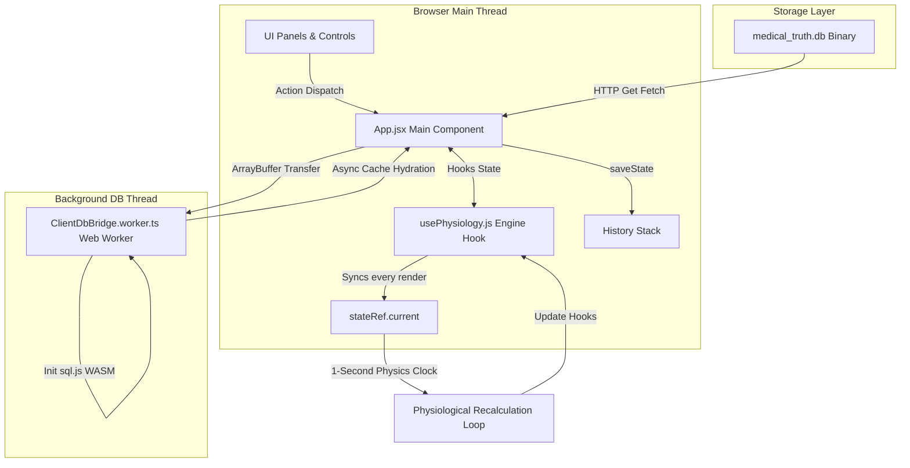

# Golden Version Ground Truth: Airway Simulator

## Table of Contents
1.  **STAGE 1: SYSTEM ARCHITECTURE & RUNTIME FLOW**
    *   [1. High-Level Architecture](#1-high-level-architecture)
        *   [1.1 Technical Stack Specifications](#11-technical-stack-specifications)
        *   [1.2 Communication Pipelines & Execution Loops](#12-communication-pipelines--execution-loops)
    *   [2. Component & Runtime Lifecycle](#2-component--runtime-lifecycle)
        *   [2.1 Initialization Sequence (Step-by-Step)](#21-initialization-sequence-step-by-step)
        *   [2.2 User Action Interruption & Loop Injection](#22-user-action-interruption--loop-injection)
    *   [3. Complete Current Database & Schema Map](#3-complete-current-database--schema-map)
        *   [3.1 SQLite Database Schema Structure](#31-sqlite-database-schema-structure)
        *   [3.2 Representation of Ingested Textbook Data](#32-representation-of-ingested-textbook-data)
2.  **STAGE 2: THE CORE LOGIC ENGINES & ALGORITHMIC FRAMEWORKS**
    *   [4. Pathophysiology & Vital Signs Engine](#4-pathophysiology--vital-signs-engine)
        *   [4.1 Cardiovascular & Hemodynamic Physiology](#41-cardiovascular--hemodynamic-physiology)
        *   [4.2 Oscillations & Homeostatic Waves](#42-oscillations--homeostatic-waves)
        *   [4.3 Myocardial Ischemia & Metabolic Demand](#43-myocardial-ischemia--metabolic-demand)
        *   [4.4 Cardiac Arrest & Resuscitation Loop](#44-cardiac-arrest--resuscitation-loop)
        *   [4.5 Defibrillation & Cardioversion Shock Physics](#45-defibrillation--cardioversion-shock-physics)
        *   [4.6 Respiratory Volumes & Mechanics](#46-respiratory-volumes--mechanics)
        *   [4.7 Alveolar Ventilation & Apnea Kinetics](#47-alveolar-ventilation--apnea-kinetics)
        *   [4.8 Blood-Gas Exchange & Shunt Mathematics](#48-blood-gas-exchange--shunt-mathematics)
        *   [4.9 Optical Pulse Oximetry Absorption Model](#49-optical-pulse-oximetry-absorption-model)
    *   [5. Pharmacology (PK/PD) Engine](#5-pharmacology-pkpd-engine)
        *   [5.1 Mammillary Multi-Compartment PK Model](#51-mammillary-multi-compartment-pk-model)
        *   [5.2 Numerical Integration (Euler Sub-stepping)](#52-numerical-integration-euler-sub-stepping)
        *   [5.3 Flow-Dependent Clearance & Distribution Autoregulation](#53-flow-dependent-clearance--distribution-autoregulation)
        *   [5.4 Organ Impairment & Protein Binding Corrections](#54-organ-impairment--protein-binding-corrections)
        *   [5.5 Receptor-Level Pharmacodynamics](#55-receptor-level-pharmacodynamics)
        *   [5.6 Receptor-Level Vasoactive Chronotropic & Vasomotor Coupling](#56-receptor-level-vasoactive-chronotropic--vasomotor-coupling)
        *   [5.7 Neuromuscular Blockade & Fade (TOF Count)](#57-neuromuscular-blockade--fade-tof-count)
        *   [5.8 Drug-Drug Synergism & Chelation Reversal](#58-drug-drug-synergism--chelation-reversal)
    *   [6. Event Trigger & Clinical Scenarios Engine](#6-event-trigger--clinical-scenarios-engine)
        *   [6.1 Laryngospasm & Bronchospasm Spasmodic Reflex Loops](#61-laryngospasm--bronchospasm-spasmodic-reflex-loops)
        *   [6.2 IgE-Mediated Anaphylactic Shock Vasoplegia](#62-ige-mediated-anaphylactic-shock-vasoplegia)
        *   [6.3 Gastric Aspiration Chemical Pneumonitis](#63-gastric-aspiration-chemical-pneumonitis)
        *   [6.4 Active Metabolite Accumulation & Neurotoxicity (Seizures)](#64-active-metabolite-accumulation--neurotoxicity-seizures)
        *   [6.5 Local Anesthetic Systemic Toxicity (LAST) & Cyanide Toxicity](#65-local-anesthetic-systemic-toxicity-last--cyanide-toxicity)
        *   [6.6 Serotonin Syndrome Hyperpyrexia](#66-serotonin-syndrome-hyperpyrexia)
        *   [6.7 Belmont IO Blowout & Arterial Injection Safety Interlocks](#67-belmont-io-blowout--arterial-injection-safety-interlocks)
3.  **STAGE 3: STATE MANAGEMENT, INGESTION PIPELINES, & BOUNDARY CONDITIONS**
    *   [7. Full Application State Tree](#7-full-application-state-tree)
        *   [7.1 Global Application Hooks](#71-global-application-hooks)
        *   [7.2 Core Physiology Engine State Bridge Ref](#72-core-physiology-engine-state-bridge-ref)
    *   [8. Data Ingestion & Indexing Pipeline](#8-data-ingestion--indexing-pipeline)
        *   [8.1 The Ingestion Engine & Cache Hydration](#81-the-ingestion-engine--cache-hydration)
        *   [8.2 Dynamic Medication Ingestion](#82-dynamic-medication-ingestion)
        *   [8.3 Dynamic Procedural Ingestion](#83-dynamic-procedural-ingestion)
        *   [8.4 Dynamic Textbook Rule Indexer](#84-dynamic-textbook-rule-indexer)
    *   [9. Constraints & Edge Cases](#9-constraints--edge-cases)
4.  **STAGE 4: COMPREHENSIVE COMPILATION & INTEGRITY CHECK**
    *   [10. Architectural Dependency Analysis: Hardcoded vs. Dynamic Textbook Data](#10-architectural-dependency-analysis-hardcoded-vs-dynamic-textbook-data)
    *   [11. Integrity & Compliance Verification Statement](#11-integrity--compliance-verification-statement)

---

## STAGE 1: SYSTEM ARCHITECTURE & RUNTIME FLOW

### 1. High-Level Architecture

The simulator is a high-fidelity, real-time clinical training application representing physiological and pharmacological responses during general anesthesia induction.

#### 1.1 Technical Stack Specifications
*   **Frontend Framework**: React 19.2 (using Vite 8.0 as the build system and development server).
*   **Styling & UI Design**: Vanilla CSS styled with custom flex grids, glassmorphism, and dark-mode variables, integrated with Tailwind CSS 4.2.
*   **Database Engines**: 
    *   *Backend / Build Time*: SQLite database (`medical_truth.db`) managed via `better-sqlite3` (v12.10) for raw clinical text/matrix ingestion.
    *   *Client Runtime / Browser*: In-memory WebAssembly-based SQLite interface via `sql.js` (v1.12), ensuring driver and query syntax parity across both environments.
*   **Web Workers**: A dedicated HTML5 Web Worker (`ClientDbBridge.worker.ts`) is leveraged in the browser to compile, load, and query the SQLite database off the main UI thread.
*   **State Management**: React component local state hooks (`useState`) coupled with a custom React hook (`usePhysiology.js`) that manages the physics engine state. 
*   **History & Undo**: A serialization layer built in `App.jsx` deep-copies the application and engine states before executing user actions, maintaining a chronological history stack for undo operations.

#### 1.2 Communication Pipelines & Execution Loops
The system's data pipeline is split between asynchronous assets loading, user action injection, and a synchronous physiological execution clock:



*   **Database Ingestion & Hydration Pipeline**:
    1. During boot, the application fetches the static binary `/medical_truth.db` from the client-facing storage layer.
    2. The binary buffer is transferred directly to the Web Worker via Transferable Objects (`postMessage({ type: 'init', payload: { buffer } }, [buffer])`) to avoid copying memory across threads.
    3. The worker instantiates `sql.js`, loads the buffer, and runs initial queries to extract prose and matrix records.
    4. Hydrated arrays are returned to the main thread, where `ClientDbBridge.ts` caches them locally and triggers registered callbacks, automatically instantiating the `DynamicMedicationRegistry` and `DynamicProceduralRegistry`.
*   **The Physics Engine State Bridge (Clock Loop)**:
    1. The physics engine operates on a synchronous **1-second (1000ms) interval timer** created within `usePhysiology.js`.
    2. To prevent stale closures in React's async rendering architecture, a **State Bridge Ref Pattern** (`stateRef`) is utilized. This reference object is synchronized with state hooks on every render:
       ```typescript
       const stateRef = useRef({ time, vitals, targetVitals, patient, activeMeds, gasModels, intravascularVolume, electrolytes, ventSettings, gasSettings, surgicalPhase, msmaidsComplete });
       useEffect(() => {
         stateRef.current = { time, vitals, targetVitals, patient, activeMeds, gasModels, intravascularVolume, electrolytes, ventSettings, gasSettings, surgicalPhase, msmaidsComplete };
       });
       ```
    3. On every clock tick, the simulator accesses `stateRef.current`, executes physiological mathematical differential equations (hemodynamics, respiratory kinetics, fluid dynamics, PK/PD decay), and writes the computed changes back to the state hooks.

---

### 2. Component & Runtime Lifecycle

#### 2.1 Initialization Sequence (Step-by-Step)
1.  **Boot & Script Ingestion**:
    *   Browser loads `main.jsx`, mounting the main `<App />` component.
    *   Static import of `ClientDbBridge` automatically executes `ClientDbBridge.init()`.
2.  **Driver Initialization & Hydration**:
    *   *Browser*: Spawns the database worker thread, downloads `medical_truth.db`, initializes the WASM-based SQLite driver, and populates main thread cache structures (`allProse`, `allMatrices`).
    *   *Node/Vitest*: Performs a direct import of `store.ts` and loads `KnowledgeStore` synchronously.
    *   Caches are sorted using `comparePriority()` (evaluating Miller's priority rules).
    *   `ClientDbBridge.onLoaded` fires, causing the `DynamicMedicationRegistry` and `DynamicProceduralRegistry` to query the cache and parse textbook schemas to register new medications and procedures.
3.  **Case Selection**:
    *   The user picks a case configuration from the UI (e.g., Elective Surgery, Trauma, Septic Shock, Morbid Obesity, or a Custom case).
    *   The client triggers `startCase(selectedCase)`.
4.  **Parameter Calculation & Patient Instantiation**:
    *   `startCase` calculates body descriptors based on baseline patient stats:
        *   **Ideal Body Weight (IBW)**:
            $$IBW_{\text{male}} = 50.0 + 2.3 \cdot \left(\frac{\text{Height [cm]}}{2.54} - 60\right)$$
            $$IBW_{\text{female}} = 45.5 + 2.3 \cdot \left(\frac{\text{Height [cm]}}{2.54} - 60\right)$$
        *   **Lean Body Weight (LBW)**:
            $$LBW_{\text{male}} = \frac{9270 \cdot \text{Weight [kg]}}{6680 + 216 \cdot BMI}$$
            $$LBW_{\text{female}} = \frac{9270 \cdot \text{Weight [kg]}}{8780 + 244 \cdot BMI}$$
        *   **Estimated Blood Volume (EBV)**: Calculated based on patient sex (65 mL/kg for females, 75 mL/kg for males) multiplied by total weight.
        *   **Predicted Lung Volumes**: TLC, FRC, RV, FVC, and FEV1 are calculated using ECCS/ERS 1993 formulas, scaled exponentially based on position, restrictive/obstructive disease, and obesity factors.
5.  **State Hook Initialization**:
    *   Initial vitals (Heart Rate, SBP, DBP, $SpO_2$, $EtCO_2$) are pushed to the hooks.
    *   Baseline MAP is initialized:
        $$MAP = DBP + \frac{SBP - DBP}{3}$$
    *   Active medication list is cleared, surgical phase is reset to `Pre-Op`, and inhalational gas models are generated.
    *   The execution loop is set to running (`isRunning = true`).

#### 2.2 User Action Interruption & Loop Injection
When a user executes a clinical action (e.g., injecting a drug, changing mechanical ventilation parameters, or performing airway maneuvers):
1.  **State Serialization (Undo Stack)**:
    *   `saveState()` is called to serialise current client configurations and invoke `createSnapshot()` on the physiological engine.
    *   The snapshots are appended to the `history` array.
2.  **State Injection**:
    *   The UI handler calls the state setter (e.g., `setVentSettings`, `pushMed`, `setPatient`).
    *   React pushes these updates into its queue.
3.  **Ref Synchronization**:
    *   As soon as React applies the state updates, the `useEffect` hooks trigger and update `stateRef.current` with the new values.
4.  **Engine Recalculation**:
    *   On the next 1-second interval tick, the physiology loop reads from `stateRef.current`, incorporating the user-modified parameters (such as the new effect-site concentration of a drug, changed mechanical PEEP, or altered airway patency) directly into the mathematical differential equations.

---

### 3. Complete Current Database & Schema Map

#### 3.1 SQLite Database Schema Structure
The `medical_truth.db` database contains two primary tables storing prose and structured data parsed from medical textbooks:

##### Table 1: `textbook_prose`
Stores raw text descriptions and paragraphs representing clinical protocols, physiological guidelines, and drug rules.
*   **Columns**:
    *   `id`: `TEXT PRIMARY KEY` (Unique alphanumeric string identifier, typically a hash of the content or section name).
    *   `topic`: `TEXT` (The clinical topic or chapter subheading, e.g. "Succinylcholine", "Laryngeal Mask Airway").
    *   `body_text`: `TEXT` (Unabridged parsed string containing the raw text content).
    *   `source_book`: `TEXT` (Source filename tracking provenance, e.g. "Millers_Anesthesia_9th_Ed.pdf").
    *   `edition`: `INTEGER` (Textbook edition number).
    *   `priority_rank`: `INTEGER` (Computed rank indicating authority level).
    *   `is_authoritative`: `INTEGER DEFAULT 0` (Flag marking if the row is the winner of the priority resolution algorithm).
*   **Indexes**:
    *   `idx_prose_source_book` ON `textbook_prose (source_book)`
    *   `idx_prose_topic` ON `textbook_prose (topic)`

##### Table 2: `physiological_matrices`
Stores structured data, parameters, tables, coordinates, or flowchart steps represented as JSON payloads.
*   **Columns**:
    *   `id`: `TEXT PRIMARY KEY` (Unique alphanumeric string identifier).
    *   `topic`: `TEXT` (Subsystem or category name).
    *   `archetype`: `TEXT` (Data format category, e.g. "COORDINATE X-Y GRAPHS & COMPLEMENTARY PANELS", "TIMELINE_STEP_CHART_HYPNOGRAM").
    *   `caption`: `TEXT` (Descriptive legend of the table or chart).
    *   `structured_payload`: `TEXT` (Hierarchical JSON string containing the data array).
    *   `source_book`: `TEXT` (Source filename tracking provenance).
    *   `edition`: `INTEGER` (Textbook edition number).
    *   `priority_rank`: `INTEGER` (Computed rank indicating authority level).
    *   `is_authoritative`: `INTEGER DEFAULT 0` (Flag marking if the row is the winner of the priority resolution algorithm).
*   **Indexes**:
    *   `idx_matrices_source_book` ON `physiological_matrices (source_book)`
    *   `idx_matrices_topic` ON `physiological_matrices (topic)`

#### 3.2 Representation of Ingested Textbook Data
Textbook chapters are parsed, split, and structuralized in the database using the following rules:

*   **Textbook Prose Representation**:
    *   Prose chapters are broken down into logical paragraphs or subheadings.
    *   Each section is stored as a row in `textbook_prose`. 
    *   Mathematical rules are extracted dynamically from these rows by `extractTextbookRules()`. The engine scans sentences for target vitals (e.g. "heart rate", "potassium"), conditions ("burns", "sepsis", "propofol"), and verbs of change ("increase", "decrease", "clamp"), extracting rule constraints mapping to dynamic offsets in the physiology loop.
*   **Tabular & Flowchart Representation**:
    *   Tables (e.g., drug pharmacokinetic values, airway position factors) are parsed and stored as structured rows inside the JSON `structured_payload` of a `physiological_matrices` record.
    *   Flowcharts or procedural steps (such as the steps for Awake Fiberoptic Intubation) are stored in `structured_payload` with the `TIMELINE_STEP_CHART_HYPNOGRAM` archetype, mapping a list of step labels. The `DynamicProceduralRegistry` parses these labels and translates them into sequential boolean safety gates verified during simulated laryngoscopy.
*   **Textbook Priority Hierarchy & Authority Resolution**:
    To handle conflicts between overlapping sources or editions, the database executes a strict hierarchy resolution query when `recalculateAuthority()` is invoked:
    1.  *Miller's Anesthesia* always wins over any other textbook.
    2.  For other books, newer editions win.
    3.  Alphabetical tie-breakers are applied to filenames.
    4.  The priority rank is calculated as:
        $$\text{Rank}_{\text{Miller}} = 1000 + \text{Edition}$$
        $$\text{Rank}_{\text{Other}} = 100 + \text{Edition}$$
    5.  A window function groups records by `topic` (or `id` if generic/unknown) and assigns `is_authoritative = 1` to the record with the highest rank within each group. Only authoritative rows are queried at runtime.

---

## STAGE 2: THE CORE LOGIC ENGINES & ALGORITHMIC FRAMEWORKS

### 4. Pathophysiology & Vital Signs Engine

#### 4.1 Cardiovascular & Hemodynamic Physiology (`CardiovascularEngine.ts`)
The cardiovascular engine calculates the patient's continuous perfusion status every second. It models cardiac output ($CO$, L/min) and mean arterial pressure ($MAP$, mmHg) using basic physiological fluid loop invariants:

1.  **Mean Arterial Pressure (MAP)**:
    $$MAP_{\text{exact}} = \frac{CO \cdot SVR}{80} + \Delta P_{\text{intravascular}} + \Delta P_{\text{sepsis}}$$
    *   *Systemic Vascular Resistance ($SVR$)*: Normal range is $900 - 1400\text{ dyn}\cdot\text{s}\cdot\text{cm}^{-5}$. SVR updates dynamically based on vasodilatory medications (e.g. Propofol, Anaphylaxis) and vasoactive infusions (e.g. Epinephrine, Phenylephrine).
    *   *Intravascular Volume Pressure Shift ($\Delta P_{\text{intravascular}}$)*:
        $$\Delta P_{\text{intravascular}} = \frac{\text{IntravascularVolume} - EBV}{250} \cdot 8$$
    *   *Sepsis Pressure Shift ($\Delta P_{\text{sepsis}}$)*: Drops SVR and subtracts $33.33\text{ mmHg}$ from MAP due to vasoplegia.
2.  **Cardiac Output (CO)**:
    $$CO = \frac{HR \cdot SV}{1000} \quad \text{[L/min]}$$
    *   *Heart Rate ($HR$)*: Recalculated based on chronotropic drugs, autonomic reflexes, and hypovolemia.
    *   *Stroke Volume ($SV$)*: Derived from preload volume shifts, myocardial contractility, and stunning factors:
        $$SV = \min\left(SV_{\text{max}}, SV_{\text{base}} \cdot Preload_{SV} \cdot \max(0.1, Inotropy) \cdot CHF_{\text{penalty}} \cdot AFib_{\text{penalty}}\right)$$
        *   *Preload Stroke Volume ($Preload_{SV}$)*:
            $$Preload_{SV} = \max\left(0.1, 1.0 - 1.2 \cdot \text{BloodLossRatio} + \frac{\text{EffectiveVolume} - EBV}{2500}\right)$$
        *   *Inotropy ($Inotropy$)*:
            $$Inotropy = \max\left(0.01, 1.0 - \frac{\text{Stunning}}{100} + \text{Inotropy}_{\text{drugs}} + \text{Spike}_{\text{contractility}}\right)$$
        *   *Myocardial Stunning ($Stunning$)*: Accumulates when myocardial oxygen demand exceeds supply.
3.  **Systolic (SBP) & Diastolic (DBP) Pressures**:
    Systolic and diastolic pressures are derived from MAP and Pulse Pressure ($PP$, mmHg), which scales with stroke volume:
    $$PP = 40 \cdot \frac{SV}{SV_{\text{base}}}$$
    $$SBP = MAP + \frac{2}{3} \cdot PP + \text{Noise}_{\text{sys}}$$
    $$DBP = MAP - \frac{1}{3} \cdot PP + \text{Noise}_{\text{dia}}$$

#### 4.2 Oscillations & Homeostatic Waves
The hemodynamics engine superimposes oscillatory waveforms onto heart rate and blood pressures to represent in-vivo nervous and chest-pressure responses:
*   **Respiratory Sinus Arrhythmia (RSA) & Breathing Fluctuations**:
    Heart rate and systolic/diastolic pressures oscillate with the patient's respiratory cycle phase ($\theta_{\text{resp}} = \frac{t \cdot 2\pi}{60/RR}$):
    $$\text{RSA}_{\text{Effect}} = \sin(\theta_{\text{resp}}) \cdot 1.3 \quad \text{[bpm]}$$
    $$\text{RespBp}_{\text{Var}} = \sin(\theta_{\text{resp}}) \cdot 2.2 \quad \text{[mmHg]}$$
*   **Traube-Hering-Mayer (THM) Waves**:
    Vasomotor waves reflecting slow sympathetic feedback loops are modeled with a standard 10-second period:
    $$\text{THM}_{\text{Effect}} = \sin\left(\frac{t \cdot 2\pi}{10}\right) \cdot 0.9 \quad \text{[mmHg]}$$
*   **Micro-Fluctuations (Nervous Noise)**:
    Random Gaussian-like noise represents normal physiological variability (e.g. pulse rate variability):
    $$\text{Noise}_{\text{HR\_Micro}} \approx \text{Random}(-0.2, 0.2)$$
    $$\text{Noise}_{\text{BP\_Micro}} \approx \text{Random}(-0.35, 0.35)$$

#### 4.3 Myocardial Ischemia & Metabolic Demand
Myocardial oxygen supply-demand balance is tracked via the **Rate Pressure Product (RPP)**:
$$RPP = HR \cdot SBP$$
*   **Ischemia & Stunning Trigger**: In patients with coronary artery disease (CAD), if $RPP > 14,000$ or Diastolic Blood Pressure ($DBP$) falls below $50\text{ mmHg}$ (limiting coronary perfusion pressure), myocardial stunning increases:
    $$\frac{d(\text{Stunning})}{dt} = +0.5\% \quad \text{[per second]}$$
*   **Consequences**: Stunning directly restricts inotropy and stroke volume, leading to secondary cardiogenic shock. Stunning decays slowly by $0.2\%$ per second once the stress resolves.

#### 4.4 Cardiac Arrest & Resuscitation Loop
*   **Arrest Triggers**: Cardiac arrest is initiated if:
    1.  *Hypoxemia*: Arterial oxygen tension ($PaO_2$) remains below $30\text{ mmHg}$ for $>15$ continuous seconds.
    2.  *Severe Acidosis*: Arterial pH drops below $6.9$.
    3.  *Hyperkalemia*: Potassium levels ($K^+$) exceed $10.0\text{ mEq/L}$ (or $9.0\text{ mEq/L}$ if not membrane-stabilized by Calcium).
    4.  *Anomalous shock*: Severe anaphylactic vasoplegia.
*   **CPR Mechanics**: When CPR chest compressions are active (`cprActive = true`), the engine bypasses standard hemodynamic equations and generates a mechanical survival perfusion pressure:
    $$SBP_{\text{CPR}} = 80 + \text{Random}(0, 15) \quad [mmHg]$$
    $$DBP_{\text{CPR}} = 25 + \text{Random}(0, 10) \quad [mmHg]$$
    $$CO_{\text{CPR}} \approx 1.5\text{ L/min} \quad (\text{slowing lactic acid build-up})$$
*   **Ischemic Damage Accumulation**: During arrest or severe shock, cellular hypoperfusion and hypoxia accumulate tissue damage:
    $$\frac{d(\text{Damage})}{dt} = (90 - SpO_2) \cdot 0.4 + (55 - MAP_{\text{cerebral}}) \cdot 0.7 \quad \text{[per second]}$$
    *   CPR reduces this damage accumulator by $4.5$ units/s (if $SpO_2 \ge 80\%$) or $1.0$ unit/s (if hypoxemic).
    *   If $\text{Damage} > 1200$ (default threshold), cardiac arrest is triggered. If $\text{Damage} > 6000$, irreversible **biological death** occurs.
*   **Spontaneous ROSC**: During PEA or Asystole, a CPR chest compression cycle has a $4\%$ chance per second to trigger spontaneous Return of Spontaneous Circulation (ROSC) if:
    1.  The oxygen buffer is sufficient ($>50\%$ of FRC capacity).
    2.  Hemorrhage is restricted ($\text{BloodLossRatio} < 0.2$).
    3.  Therapeutic levels of Epinephrine are present.

#### 4.5 Defibrillation & Cardioversion Shock Physics
Delivering a high-energy electric shock to the myocardium clears shockable tachyarrhythmias (VFib, VTach) based on mathematical probability curves:
*   **Shock Success Probability**:
    $$P_{\text{ROSC}} = \max\left(0.01, 0.70 + \text{Bonus}_{\text{meds}} - \text{Penalty}_{\text{ischemia}} - \text{Penalty}_{\text{hypoxia}} - \text{Penalty}_{\text{hypovolemia}}\right)$$
    *   $\text{Bonus}_{\text{meds}}$: Amiodarone ($+0.25$), Lidocaine ($+0.20$), Epinephrine ($+0.10$), capped at $+0.40$ combined.
    *   $\text{Penalty}_{\text{ischemia}}$: $\frac{\text{IschemicDamage}}{5000}$.
    *   $\text{Penalty}_{\text{hypoxia}}$: $0.60$ if $O_2\text{ Buffer} < 40\%\text{ of FRC}$.
    *   $\text{Penalty}_{\text{hypovolemia}}$: $0.60$ if $\text{BloodLossRatio} > 0.30$.
*   **Rhythm Conversion**:
    *   If the shock is successful but $\text{IschemicDamage} > 4000$, the rhythm converts to PEA.
    *   If successful and damage is low, organized Sinus Rhythm (ROSC) is restored, setting myocardial stunning to $60\%$.
    *   If the user delivers an unsynchronized shock during a perfusing rhythm, it has a $100\%$ chance to induce R-on-T Ventricular Fibrillation (VFib).

#### 4.6 Respiratory Volumes & Mechanics (`RespiratoryEngine.ts`)
*   **Predicted Lung Volumes (ECCS/ERS 1993)**:
    Volumes (FRC, TLC, RV, FVC, FEV1) are calculated using baseline equations based on Height ($H$, meters) and Age ($A$, years):
    *   *Male Predicted FRC*: $FRC_{\text{pred}} = 2.34 \cdot H + 0.009 \cdot A - 1.09$
    *   *Female Predicted FRC*: $FRC_{\text{pred}} = 2.24 \cdot H + 0.001 \cdot A - 1.00$
*   **Volume Corrections**:
    $$\text{Volume}_{\text{final}} = \text{Volume}_{\text{pred}} \cdot \text{Disease}_{\text{scale}} \cdot e^{-0.02 \cdot (BMI - 25)} \cdot \text{Position}_{\text{factor}}$$
    *   $\text{Disease}_{\text{scale}}$: COPD ($FRC \cdot 1.35$), Restrictive ($FRC \cdot 0.52$).
    *   $\text{Position}_{\text{factor}}$: Supine/Sniffing ($0.80$), Trendelenburg ($0.70$).
*   **Pulmonary Compliance & Resistance**:
    *   *Compliance ($C$, mL/cmH2O)*: Baseline is $65$. It is modified by position (Trendelenburg decreases compliance by $20\%$), obesity ($-25$), sepsis ($-20$), and pulmonary diseases.
    *   *Resistance ($R$, cmH2O/L/s)*: Baseline is $5$. It is elevated by obesity ($+3$), bronchospasm ($+40$), bucking ($+15$), and laryngospasm ($R = 999$).
*   **Ventilator Pressures & Tidal Volume ($V_{TE}$)**:
    *   *VCV Mode*: $V_{TE} = \text{dialed } V_T$. Peak inspiratory pressure is calculated as:
        $$PIP = P_{\text{plat}} + \left(\text{Flow} \cdot R \cdot 5\right) \quad \text{where } P_{\text{plat}} = PEEP + \frac{V_{TE}}{C}$$
    *   *PCV Mode*: $PIP = PEEP + P_{\text{insp}}$. Tidal volume is calculated as:
        $$V_{TE} = \left(P_{\text{plat}} - PEEP\right) \cdot C \quad \text{where } P_{\text{plat}} = PIP - 2$$
    *   *PCV-VG Mode*: $V_{TE} = \text{dialed } V_T$. Peak pressure converges: $P_{\text{plat}} = PEEP + \frac{V_{TE}}{C}$, $PIP = P_{\text{plat}} + 2$.
    *   *Pressure Limit ($P_{\text{max}}$)*: If $PIP > P_{\text{max}}$, the ventilator clips pressure and reduces $V_{TE}$ accordingly.

#### 4.7 Alveolar Ventilation & Apnea Kinetics
*   **Alveolar Ventilation ($V_A$)**:
    $$V_A = (V_T - V_D) \cdot RR \quad \text{[L/min]}$$
    *   *Dead space ($V_D$)*: Derived from Ideal Body Weight: $V_D = \frac{IBW_{\text{kg}} \cdot 2.2}{1000}\text{ L}$.
*   **Apnea CO2 Accumulation (Eger & Severinghaus)**:
    When tidal exchange is absent ($V_A \le 0.1\text{ L/min}$):
    *   During the first minute of apnea:
        $$\frac{d(PaCO_2)}{dt} = +\frac{6}{60}\text{ mmHg/s} \quad (6\text{ mmHg/min})$$
    *   During subsequent minutes:
        $$\frac{d(PaCO_2)}{dt} = +\frac{3}{60}\text{ mmHg/s} \quad (3\text{ mmHg/min})$$
*   **Henderson-Hasselbalch Equation**:
    Arterial pH is derived from bicarbonate concentration ($HCO_3^-$, mEq/L) and partial pressure of carbon dioxide ($PaCO_2$, mmHg):
    $$pH = 6.1 + \log_{10}\left(\frac{HCO_3^-}{0.03 \cdot PaCO_2}\right)$$

#### 4.8 Blood-Gas Exchange & Shunt Mathematics
*   **Alveolar Oxygen Tension (PAO2)**:
    $$PAO_2 = \left(FiO_2 \cdot (P_B - P_{H_2O})\right) - \frac{PaCO_2}{R} \quad \text{[mmHg]}$$
    *   $P_B = 760\text{ mmHg}$, $P_{H_2O} = 47\text{ mmHg}$, respiratory quotient $R = 0.8$.
*   **Apnea Oxygen Buffer Depletion**:
    During apnea, oxygen in the FRC buffer is consumed by cellular metabolism ($VO_2$, L/min):
    $$\frac{d(\text{O2Buffer})}{dt} = -VO_2 \cdot \text{Temp}_{\text{scale}} \cdot \text{Shivering}_{\text{scale}} + \text{PassiveO2}_{\text{influx}}$$
*   **Bohr Shift & Hemoglobin Dissociation (Adair-Riley Equation)**:
    Oxygen saturation ($SaO_2$, %) is derived using an shifted capillary oxygen tension ($PO_{2,\text{eff}}$) that accounts for temperature, pH, volatiles, and DPG levels:
    $$PO_{2,\text{eff}} = PO_2 \cdot 10^{0.48 \cdot (pH - 7.4) - 0.024 \cdot (\text{Temp} - 37) - \text{Shift}_{\text{volatile}}}$$
    $$SaO_2 = \frac{PO_{2,\text{eff}}^3 + 150 \cdot PO_{2,\text{eff}}}{PO_{2,\text{eff}}^3 + 150 \cdot PO_{2,\text{eff}} + 23400} \cdot 100$$
*   **Mixed Venous Return & Pulmonary Shunt Exchange**:
    *   *Capillary O2 Content ($CcO_2$)*: $CcO_2 = Hb \cdot 1.34 \cdot \frac{SaO_2}{100} + PAO_2 \cdot 0.0031$
    *   *Mixed Venous O2 Content ($CvO_2$)*: Derived via the Fick equation:
        $$CvO_2 = CcO_2 - \frac{VO_2}{CO \cdot 10}$$
    *   *Arterial O2 Content ($CaO_2$)*: Derived from pulmonary shunt fraction ($Q_s/Q_t$):
        $$CaO_2 = CcO_2 \cdot (1 - Q_s/Q_t) + CvO_2 \cdot Q_s/Q_t$$
    *   *Arterial O2 Saturation ($SpO_2$)*: Derived from arterial oxygen content:
        $$SpO_2 = \frac{CaO_2}{Hb \cdot 1.34} \cdot 100$$

#### 4.9 Optical Pulse Oximetry Absorption Model
The simulator models oximeter optical absorption using light extinction at Red ($660\text{ nm}$) and Infrared ($940\text{ nm}$) wavelengths to represent dyshemoglobins:
*   **Absorbance Equations**:
    $$A_{660} = 0.1 \cdot S_O + 1.0 \cdot S_D + 1.0 \cdot S_M + 0.1 \cdot S_C$$
    $$A_{940} = 1.0 \cdot S_O + 0.1 \cdot S_D + 1.0 \cdot S_M + 1.0 \cdot S_C$$
    *   $S_O$: Oxyhemoglobin fraction ($S_O = \frac{SaO_2}{100} \cdot (1 - S_M - S_C)$).
    *   $S_D$: Deoxyhemoglobin fraction ($S_D = (1 - \frac{SaO_2}{100}) \cdot (1 - S_M - S_C)$).
    *   $S_M$: Methemoglobin fraction.
    *   $S_C$: Carboxyhemoglobin fraction.
*   **Oximetry Ratio (R)**:
    $$R_{\text{ratio}} = \frac{A_{660}}{A_{940}}$$
    $$SpO_{2,\text{measured}} = 110 - 25 \cdot R_{\text{ratio}} \quad [\%]$$

---

### 5. Pharmacology (PK/PD) Engine

#### 5.1 Mammillary Multi-Compartment PK Model (`PKPDEngine.ts`)
Medications are modeled using a mammillary three-compartment model (Central $V_1$, Rapid Peripheral $V_2$, and Slow Peripheral $V_3$), linked to an effect-site compartment ($V_e$):

```
       [ Rapid Peripheral V2 ]
             ^         |
             | k12     | k21
             v         v
-----> [ Central Compartment V1 ] -----> [ Elimination k10 ]
             ^         |
             | k13     | k31
             v         v
       [ Slow Peripheral V3 ]
               |
               | k1e (ke0)
               v
       [ Effect Site Ve ]
```

*   **Pharmacokinetic Differential Equations**:
    $$\frac{dA_1}{dt} = \text{InfusionRate} - (k_{10} + k_{12} + k_{13}) \cdot A_1 + k_{21} \cdot A_2 + k_{31} \cdot A_3$$
    $$\frac{dA_2}{dt} = k_{12} \cdot A_1 - k_{21} \cdot A_2$$
    $$\frac{dA_3}{dt} = k_{13} \cdot A_1 - k_{31} \cdot A_3$$
    $$\frac{dC_e}{dt} = k_{e0} \cdot (C_p - C_e) \quad \text{where } C_p = \frac{A_1}{V_1}$$

#### 5.2 Numerical Integration (Euler Sub-stepping)
To maintain numerical stability when simulating high drug concentration changes (such as large rapid boluses), the solver splits the 1-second clock tick ($dt = 1$) into 10 sub-steps ($dt_{\text{sub}} = 0.1\text{ s}$):
```typescript
const subSteps = 10;
const subDt = dt / subSteps;
for (let i = 0; i < subSteps; i++) {
  A1 += infusionRate * subDt;
  const flux10 = k10 * A1 * subDt;
  const flux12 = k12 * A1 * subDt;
  const flux21 = k21 * A2 * subDt;
  const flux13 = k13 * A1 * subDt;
  const flux31 = k31 * A3 * subDt;

  A1 = Math.max(0, A1 - flux10 - flux12 + flux21 - flux13 + flux31);
  A2 = Math.max(0, A2 + flux12 - flux21);
  A3 = Math.max(0, A3 + flux13 - flux31);

  const Cp = (A1 / V_1) * freeFraction;
  Ce += ke0 * (Cp - Ce) * subDt;
}
```

#### 5.3 Flow-Dependent Clearance & Distribution Autoregulation
Systemic clearance and distribution rates are dynamically scaled by cardiac output, representing altered perfusion during shock:
*   **Cardiac Output Scaling Modifier ($coMod$)**:
    $$coMod = \max\left(0, 1.0 + (\text{CoRatio} - 1.0) \cdot CoSensitivity\right)$$
    *   *CoRatio*: $\frac{CO_{\text{current}}}{CO_{\text{baseline}}}$.
    *   *CoSensitivity*: Sensitivity modifier (typically $0.5$ for most drugs).
    *   *Autoregulated Rates*: $k_{10} = k_{10,\text{baseline}} \cdot coMod$, $k_{12} = k_{12,\text{baseline}} \cdot coMod$, $k_{13} = k_{13,\text{baseline}} \cdot coMod$.
*   **Effect-Site Equilibration ($ke_0$) Autoregulation**:
    Cerebral autoregulation maintains brain perfusion until severe shock occurs. For sedatives and opioids, $ke_0$ scales as:
    $$ke_0 = ke_{0,\text{baseline}} \cdot \text{BrainFlowMod} \quad \text{where } \text{BrainFlowMod} = \begin{cases} \text{CoRatio} \cdot 2 & \text{if } \text{CoRatio} < 0.5 \\ 1.0 & \text{otherwise} \end{cases}$$
    For other drugs (e.g. paralytics, vasopressors), peripheral perfusion drops linearly with cardiac output, delaying drug onset:
    $$ke_0 = ke_{0,\text{baseline}} \cdot \max(0.1, \text{CoRatio})$$

#### 5.4 Organ Impairment & Protein Binding Corrections
*   **Organ Clearance Fractions**:
    Systemic clearance ($k_{10}$) is split into independent, renal, and hepatic pathways:
    $$k_{10,\text{effective}} = k_{10} \cdot (Frac_{\text{independent}} + Frac_{\text{renal}} \cdot \text{renalRatio} + Frac_{\text{hepatic}} \cdot \text{hepaticRatio})$$
    *   In renal failure, `renalRatio` drops to $0.1$, causing drugs with high renal clearance fractions (e.g. Pancuronium, active drug metabolites) to accumulate.
*   **Hemodilution & Protein Binding**:
    Only the unbound ("free") fraction of a drug can cross vascular membranes and bind to effect-site receptors.
    $$Cp_{\text{effective}} = \frac{A_1}{V_1} \cdot FreeFraction_{\text{effective}}$$
    *   In severe hemodilution (intravascular volume expansion $V_{1,\text{ratio}} > 1.2$), plasma protein levels fall, increasing the free fraction:
        $$FreeFraction_{\text{effective}} = \min\left(1.0, (1.0 - ProteinBinding) \cdot 1.2\right)$$

#### 5.5 Receptor-Level Pharmacodynamics (Sigmoid Emax Hill Equation)
Effect-site concentrations ($C_e$) drive clinical responses using the Hill equation:
$$Effect = \frac{E_{\max} \cdot C_e^\gamma}{EC_{50}^\gamma + C_e^\gamma}$$
*   **Synergy Modification**: To avoid mathematical divisions by zero when $C_e \to 0$ or floating-point overflows when raising large concentrations to exponents, the calculation uses a ratio-based approach:
    $$\text{Ratio} = \frac{C_e}{EC_{50}}$$
    $$Effect = \frac{\text{Ratio}^\gamma}{1.0 + \text{Ratio}^\gamma}$$

#### 5.6 Receptor-Level Vasoactive Chronotropic & Vasomotor Coupling
Vasoactive medications (vasopressors and inotropes) act directly on cardiovascular receptors ($\alpha_1, \beta_1, \beta_2, V_1$):
*   **Systemic Vascular Resistance (SVR)**:
    $$SVR_{\text{multiplier}} = 1.0 + \left(\alpha_1 \cdot 0.25 \cdot Effect_{\alpha 1} + V_1 \cdot 0.30 \cdot Effect_{V1}\right) - \beta_2 \cdot 0.15 \cdot Effect_{\beta 2}$$
    *   Beta-2 receptor activation dilates blood vessels, offsetting alpha-1 vasoconstriction.
*   **Cardiac Contractility (Inotropy)**:
    $$CO_{\text{multiplier}} = 1.0 + \beta_1 \cdot 0.25 \cdot Effect_{\beta 1}$$
*   **Chronotropy (Heart Rate)**:
    $$HR_{\text{delta}} = \beta_1 \cdot 15 \cdot Effect_{\beta 1}$$
*   **Baroreceptor Reflex Chronotropic Offset**:
    Pure vasopressors (e.g. Phenylephrine, Vasopressin) vasoconstrict the vasculature without stimulating cardiac beta-1 receptors. This induces a reflex bradycardia offset in heart rate:
    $$HR_{\text{baroreflex\_offset}} = -(\text{Alpha1} \cdot 5 \cdot Effect_{\alpha 1}) - (V_1 \cdot 5 \cdot Effect_{V1})$$

#### 5.7 Neuromuscular Blockade & Fade (TOF Count)
Neuromuscular blocking agents (NMBAs) block nicotinic acetylcholine receptors ($nAChR$) at the motor endplate:
*   **Receptor Occupancy ($Occupancy$)**: Models the fraction of receptors blocked by the drug.
*   **Train-of-Four (TOF) Twitches**:
    During monitoring, four electrical pulses are delivered to a peripheral nerve, evaluating muscle response:
    *   If $Occupancy \le 0.75$: All 4 twitches are present, and the TOF ratio is $1.0$.
    *   If $0.75 < Occupancy \le 0.80$: 4 twitches are present, but the muscle response fades (TOF ratio $< 0.90$).
    *   If $0.80 < Occupancy \le 0.85$: 3 twitches are present.
    *   If $0.85 < Occupancy \le 0.90$: 2 twitches are present.
    *   If $0.90 < Occupancy \le 0.95$: 1 twitch is present.
    *   If $Occupancy > 0.95$: 0 twitches are present (profound paralysis).

#### 5.8 Drug-Drug Synergism & Chelation Reversal
*   **MAC-BAR Suppression Synergy (Minto/Greco concept)**:
    Opioids shift the concentration curves of volatiles and hypnotics required to suppress the somatic and autonomic response to painful stimuli:
    $$MAC_{\text{BAR,50}} = 1.2 \cdot e^{-3.0 \cdot Effect_{\text{opioid}}}$$
    $$Hypnotic_{\text{BAR,50}} = 1.5 \cdot e^{-3.0 \cdot Effect_{\text{opioid}}}$$
    $$BAR_{\text{suppression}} = 1.0 - (1.0 - Effect_{\text{volatile}}) \cdot (1.0 - Effect_{\text{hypnotic}})$$
    *   *Sympathetic Surge Outflow*: Reduced by BAR suppression:
        $$\text{Surge}_{\text{sympathetic}} = C_{\text{cat}} \cdot (1.0 - BAR_{\text{suppression}})$$
*   **Drug Chelation Reversal (Sugammadex)**:
    Sugammadex encapsulates steroidal NMBAs (Rocuronium, Vecuronium) in the plasma ($V_1$), removing active drug molecules from circulation:
    $$A_{1,\text{effective}} = A_{1,\text{initial}} \cdot (1 - ChelateRatio)$$
    *   This creates a steep concentration gradient that pulls drug molecules out of the effect-site ($V_e$) and peripheral tissues back into $V_1$ to be cleared, rapidly reversing paralysis.

---

### 6. Event Trigger & Clinical Scenarios Engine

#### 6.1 Laryngospasm & Bronchospasm Spasmodic Reflex Loops
*   **Trigger Conditions**: Airway manipulation (e.g. laryngoscopy, suctioning, or extubation) under inadequate anesthesia ($BAR_{\text{suppression}} < 0.50$) without muscle relaxation ($isParalyzed = false$) has a $5\%$ chance per second to trigger laryngospasm or bronchospasm.
*   **Physiological Impact**:
    *   *Laryngospasm*: Vocal cords snap shut. Compliance falls to $2\text{ mL/cmH2O}$, and resistance rises to $999\text{ cmH2O/L/s}$ (complete airway obstruction).
    *   *Bronchospasm*: Airway smooth muscle constricts. Compliance is halved, and resistance increases by $40\text{ cmH2O/L/s}$.
*   **Resolution Criteria**:
    *   *Laryngospasm*: Resolves if the patient is paralyzed ($Occupancy > 0.90$), anesthetized deeply ($MAC > 1.2$), or if a Larson's jaw-thrust maneuver is performed.
    *   *Bronchospasm*: Resolves if the patient is anesthetized deeply ($MAC > 1.2$) or if Epinephrine is administered ($Ce > 0.01$).

#### 6.2 IgE-Mediated Anaphylactic Shock Vasoplegia
*   **Trigger Condition**: Administering a penicillin-containing drug (Ampicillin/Sulbactam) to a patient with a documented penicillin allergy.
*   **Physiological Impact**: Triggers immediate anaphylaxis, causing vasoplegia and bronchospasm:
    *   *Vasoplegia*: SVR is severely reduced:
        $$SVR_{\text{multiplier}} = 0.25 + 0.75 \cdot e^{-0.05 \cdot dt_{\text{anaphylaxis}}}$$
    *   *Bronchospasm & Tachycardia*: Compliance falls, airway resistance rises, and heart rate increases:
        $$\text{Compliance}_{\text{penalty}} = 45 \cdot (1 - e^{-0.08 \cdot dt_{\text{anaphylaxis}}})$$
        $$\text{Resistance}_{\text{penalty}} = 45 \cdot (1 - e^{-0.08 \cdot dt_{\text{anaphylaxis}}})$$
        $$HR_{\text{penalty}} = 40 \cdot (1 - e^{-0.08 \cdot dt_{\text{anaphylaxis}}})$$
*   **Treatment**: Epinephrine resolves the reaction:
    $$Recovery = \min(1.0, Ce_{\text{Epi}} \cdot 12)$$
    Penalties are reduced by $(1 - Recovery)$. Once $Recovery > 0.80$, the reaction resolves.

#### 6.3 Gastric Aspiration Chemical Pneumonitis
*   **Trigger Condition**: Delivering positive pressure ventilation (PPV, such as mechanical breaths or bag ventilation with $PIP > 15\text{ cmH2O}$) to a patient with a full stomach before the airway is secured.
*   **Physiological Impact**: Positive pressure forces gas into the esophagus, causing gastric regurgitation and aspiration of acidic stomach contents:
    *   Triggers immediate chemical pneumonitis and bronchospasm.
    *   Compliance falls by $30\text{ mL/cmH2O}$, and resistance increases by $25\text{ cmH2O/L/s}$.
*   **Mitigation**: Suctioning the pharynx while the patient is in the Trendelenburg position (head-down) clears aspirated fluids, reducing the compliance penalty to $10$ and the resistance penalty to $8$.

#### 6.4 Active Metabolite Accumulation & Neurotoxicity (Seizures)
*   **Active Metabolite Kinetics**: Primary medications undergo hepatic metabolism to form active metabolites, which are cleared by the kidneys:
    $$\frac{d(\text{Metabolite})}{dt} = Ce_{\text{parent}} \cdot 0.01 - 0.002 \cdot \text{renalMult}$$
    *   *Renal Failure Modifier ($renalMult$)*: Standard is $1.0$. In renal failure, this falls to $0.1$, causing metabolites to accumulate.
*   **Metabolite Pathways**:
    1.  *Vecuronium* metabolism yields **3-desacetylvecuronium (3-OH-vecuronium)**, which retains $80\%$ of the parent drug's paralytic potency. Accumulation prolongs paralysis.
    2.  *Morphine* metabolism yields **Morphine-6-glucuronide (M6G)**. If $M6G > 0.8\text{ mcg/mL}$, it triggers central respiratory depression, reducing respiratory rate:
        $$RR_{\text{offset}} = -10 \quad \text{[breaths/min]}$$
    3.  *Meperidine* metabolism yields **Normeperidine**. If $Normeperidine > 1.2\text{ mcg/mL}$, it causes central nervous system hyper-excitation, triggering tonic-clonic seizures (`isSeizure = true`) and multiplying the metabolic rate by $8.0$ ($seizureMultiplier = 8.0$).

#### 6.5 Local Anesthetic Systemic Toxicity (LAST) & Cyanide Toxicity
*   **LAST**: Lidocaine infusion at high doses carries a risk of Local Anesthetic Systemic Toxicity. It blocks cardiac sodium channels, causing central nervous system excitation (seizures) followed by cardiac depression (bradycardia, conduction blocks, and asystole).
*   **Cyanide Toxicity**: Nitroprusside infusion at high rates ($Ce > 1.5$) causes cyanide ions to accumulate:
    $$\frac{d(\text{Cyanide})}{dt} = +Ce_{\text{Nip}} \cdot 0.002 \quad (\text{clears by } 0.005\text{ units/s if infusion stopped})$$
    *   Cyanide binds to cytochrome c oxidase, disabling aerobic metabolism. Oxygen consumption falls ($cyanideVO2Mod = \max(0.1, 1.0 - \text{Cyanide} \cdot 2.0)$), causing severe lactic acidosis. SpO2 remains locked at $100\%$ because oxygen cannot be extracted from hemoglobin.

#### 6.6 Serotonin Syndrome Hyperpyrexia
*   **Trigger Condition**: Co-administration of Meperidine (a weak serotonin reuptake inhibitor) and a Monoamine Oxidase Inhibitor (MAOI, e.g. Phenelzine, Selegiline).
*   **Physiological Impact**: Triggers fatal hyperpyrexic Serotonin Syndrome:
    *   Core body temperature rises rapidly:
        $$\frac{d(\text{Temp})}{dt} = +0.05^{\circ}\text{C/s} \quad (3.0^{\circ}\text{C/min})$$
    *   Once core temperature exceeds $42.0^{\circ}\text{C}$, the myocardium fails, triggering cardiac arrest (Asystole).

#### 6.7 Belmont IO Blowout & Arterial Injection Safety Interlocks
*   **Belmont IO Blowout**: Connecting a Belmont Rapid Infuser to an Intraosseous (IO) line or narrow peripheral IV ($\le 20\text{G}$) causes a pressure blowout. The Belmont infuser generates high pressures ($300\text{ mmHg}$) and flows ($500\text{ mL/min}$). Pushing this volume into a rigid bone cavity or small vein causes immediate vascular blowout, extravasation, and loss of access.
*   **Arterial Injection Block**: Injecting resuscitation fluids or medications into an arterial line is blocked by safety loops. Arterial lines are used strictly for blood pressure monitoring and blood draws. Direct arterial injection triggers severe arterial vasospasm, endothelial damage, and distal limb ischemia/necrosis.

---

## STAGE 3: STATE MANAGEMENT, INGESTION PIPELINES, & BOUNDARY CONDITIONS

### 7. Full Application State Tree

The following lists the exact variables, structures, and data types stored in the active React coordinate state hooks and ref state bridge memory during a simulation session:

#### 7.1 Global Application Hooks (`App.jsx`)
*   `activeCase`: `Object | null` (Active scenario config properties, including baseline vitals, patient descriptions).
*   `isRunning`: `boolean` (Active simulation execution clock running state).
*   `nibp`: `Object` (Last measured cuff blood pressure and timestamp):
    *   `sys`: `number` (Systolic pressure in mmHg)
    *   `dia`: `number` (Diastolic pressure in mmHg)
    *   `time`: `number` (Simulation time clock second)
*   `nibpIntervalMs`: `number` (Periodic automatic cuff cycle frequency in ms, e.g. $60000$ for 1 minute).
*   `logs`: `string[]` (Chronological console notifications log history).
*   `history`: `Object[]` (Chronological stack of snapshot objects for the undo history stack). Each entry contains:
    *   `appState`: `Object` (Vitals, vent settings, logs)
    *   `engineSnapshot`: `Object` (Serialized snapshot of the physiology engine states)
*   `labs`: `Record<string, Record<string, { val: string; ref: string; unit: string }>>` (Ordered diagnostic panels, e.g. ABG, CBC, CMP, TEG with current values and normal reference limits).
*   `showLabPanel`: `boolean` (Diagnostic panel visibility overlay).
*   `showFidelityPanel`: `boolean` (Fidelity Auditor overlay visibility).
*   `airwayQuizModal`: `Object` (Airway Mallampati diagnostic quiz state):
    *   `show`: `boolean`
    *   `description`: `string`
    *   `trueMallampati`: `number` (1 to 4)
*   `accessModal`: `Object` (Vascular access line placement UI modal category state):
    *   `show`: `boolean`
    *   `category`: `string` ('Peripheral IV', 'Central Line', 'Intraosseous (IO)', 'Arterial Line')
*   `tubeConfirmModal`: `Object` (Auscultation confirmation box state):
    *   `show`: `boolean`
    *   `result`: `string`
*   `viewModal`: `Object` (Glottic laryngoscopy video overlay state):
    *   `show`: `boolean`
    *   `blade`: `string`
    *   `bladeSize`: `string`
    *   `tubeSize`: `string`
    *   `adjunct`: `string`
    *   `description`: `string`
    *   `trueGrade`: `number` (Cormack-Lehane Grade 1 to 4)
*   `setupModal`: `boolean` (Laryngoscopy blade setup overlay toggle).
*   `pocusModal`: `Object` (POCUS ultrasound display):
    *   `show`: `boolean`
    *   `title`: `string`
    *   `finding`: `string`
*   `isCyclingNibp`: `boolean` (Indicates active 15s non-invasive cuff cycle).
*   `isAirwayCollapsed`: `boolean` (Indicates complete soft tissue upper airway obstruction).
*   `preopModal`: `boolean` (Preoperative assessment summary modal).
*   `preOpEMR`: `boolean` (Clinical electronic medical chart summary modal).
*   `showPreOp`: `boolean` (Preoperative chart panel visibility).
*   `stagedCase`: `Object | null` (Config staged for initialization).
*   `msmaidsModal`: `boolean` (Pre-induction safety checklist modal).
*   `msmaidsComplete`: `boolean` (State indicating MSMAIDS check verification).
*   `attendingMode`: `string` ('observing' | 'coaching' | 'teaching').
*   `postIntubationModal`: `boolean` (Ventilator connection and tube check modal).
*   `extubationModal`: `boolean` (Extubation sequence modal).
*   `ekgModalOpen`: `boolean` (Multi-lead ECG layout selector modal).
*   `ventSettings`: `Object` (Ventilator manifold dial values):
    *   `mode`: `string` ('PCV-VG', 'VCV', 'PCV', 'PSV')
    *   `vt`: `number` (Tidal volume in mL)
    *   `rr`: `number` (Mechanical rate in breaths/min)
    *   `peep`: `number` (Positive End-Expiratory Pressure in cmH2O)
    *   `fio2`: `number` (Inspired oxygen fraction 21 to 100)
    *   `pinsp`: `number` (Inspiratory pressure driving limit in cmH2O)
    *   `ieRatio`: `number` (Inspiratory to expiratory time ratio denominator)
    *   `pmax`: `number` (High pressure ventilator relief limit)
    *   `ps`: `number` (Pressure support elevation in cmH2O)
    *   `air`: `number` (Air flow liters)
    *   `o2`: `number` (Oxygen flow liters)
*   `gasSettings`: `Object` (Anesthetic vaporizer manifold dials):
    *   `agent`: `string` ('sevoflurane', 'isoflurane', 'desflurane')
    *   `dial`: `number` (Vaporizer dial percentage)
    *   `airFlow`: `number` (Air fresh gas flow in L/min)
    *   `o2Flow`: `number` (Oxygen fresh gas flow in L/min)
    *   `n2oFlow`: `number` (Nitrous oxide fresh gas flow in L/min)
*   `defibSettings`: `Object` (ACLS shock configurations):
    *   `joules`: `number` (Defibrillator charge level 50 to 360)
    *   `sync`: `boolean` (Cardioversion R-wave sync toggle)

#### 7.2 Core Physiology Engine State Bridge Ref (`stateRef.current`)
*   `time`: `number` (Running simulation second).
*   `vitals`: `Object` (Primary vital signs parameters updated by loops):
    *   `hr`: `number` (Heart rate in bpm)
    *   `sys`: `number` (Systolic arterial blood pressure in mmHg)
    *   `dia`: `number` (Diastolic arterial blood pressure in mmHg)
    *   `map`: `number` (Mean arterial blood pressure in mmHg)
    *   `co`: `number` (Cardiac Output in L/min)
    *   `svr`: `number` (Systemic Vascular Resistance in dynes)
    *   `cmap`: `number` (Cerebral hydrostatic MAP in mmHg)
    *   `bis`: `number` (Bispectral index brain arousal level 0 to 100)
    *   `temp`: `number` (Core body temperature in °C)
    *   `spo2`: `number` (Pulse oximeter arterial saturation in %)
    *   `paco2`: `number` (Arterial CO2 partial pressure in mmHg)
    *   `etco2`: `number` (End-tidal expired CO2 in mmHg)
    *   `pip`: `number` (Peak airway pressure in cmH2O)
    *   `pplat`: `number` (Plateau airway pressure in cmH2O)
    *   `vte`: `number` (Exhaled tidal volume in mL)
    *   `pmean`: `number` (Mean airway pressure in cmH2O)
    *   `mv`: `number` (Minute ventilation in L/min)
    *   `peep`: `number` (Mechanical PEEP level in cmH2O)
    *   `tofCount`: `number` (TOF count twitches 0 to 4)
    *   `tofRatio`: `number` (TOF fading ratio fraction 0.0 to 1.0)
    *   `mac`: `number` (Alveolar minimum alveolar concentration sum)
    *   `etAgent`: `number` (End-tidal volatile concentration %)
    *   `etN2O`: `number` (End-tidal nitrous oxide concentration %)
    *   `pao2`: `number` (Arterial oxygen partial pressure in mmHg)
    *   `metHb`: `number` (Methemoglobin percentage %)
    *   `coHb`: `number` (Carboxyhemoglobin percentage %)
    *   `cyanide`: `number` (Cyanide ion concentration in mcg/mL)
    *   `lacticAcid`: `number` (Serum lactic acid in mmol/L)
    *   `cao2`: `number` (Arterial oxygen content in mL O2 / dL blood)
    *   `cvo2`: `number` (Mixed venous oxygen content in mL O2 / dL blood)
    *   `p50`: `number` (Hemoglobin p50 affinity value, standard $26.6$)
    *   `r_ratio`: `number` (Pulse oximeter absorbance ratio)
*   `targetVitals`: `Object` (Physiological target attractor baseline values).
*   `patient`: `Object` (State flags, clinical modifiers, and anthropometric data):
    *   `age`: `number`, `sex`: `string`, `weight`: `number`, `height`: `number`
    *   `ibw`: `number` (Ideal body weight in kg)
    *   `bmi`: `number` (Body mass index)
    *   `ebv`: `number` (Estimated blood volume in mL)
    *   `ebl`: `number` (Estimated blood loss in mL)
    *   `bleedRate`: `number` (Passive blood loss rate in mL/s)
    *   `oxygenBuffer`: `number | null` (Active FRC oxygen volume in Liters)
    *   `airwayBlood`: `boolean` (Active blood in airway obscuring laryngoscopy)
    *   `isObese`: `boolean` (Morbid obesity FRC penalty modifier)
    *   `isSeptic`: `boolean` (Vasodilatory shock modifier)
    *   `hasCCollar`: `boolean` (Cervical spine collar restriction)
    *   `stomach`: `string` ('empty' | 'full')
    *   `limitedMouth`: `boolean` (Temporomandibular joint restriction)
    *   `trauma`: `boolean` (Trauma case context)
    *   `chronicBetaBlockade`: `boolean` (Blocks compensatory tachycardia reflex)
    *   `chronicHTN`: `boolean` (Raises baseline setpoint of baroreceptors)
    *   `highAnxiety`: `boolean` (Increases baseline catecholamines)
    *   `hasALine`: `boolean` (Active arterial line vascular access)
    *   `hasCVC`: `boolean` (Active central line venous access)
    *   `hasIV`: `boolean` (Active peripheral venous access)
    *   `currentO2Device`: `string` (Active oxygen administration device)
    *   `currentFiO2`: `number` (Delivered oxygen percentage)
    *   `currentO2Flow`: `number` (Oxygen flow in L/min)
    *   `isApneic`: `boolean`, `isParalyzed`: `boolean`, `isTopicalized`: `boolean`
    *   `airwaySecured`: `boolean`, `airwayExamined`: `boolean`
    *   `ventilationStatus`: `string` ('none' | 'assisted' | 'successful' | 'failed' | 'spontaneous')
    *   `tubePosition`: `string | null` ('trachea' | 'right_mainstem' | 'left_mainstem' | 'esophagus' | `null`)
    *   `isCuffDeflated`: `boolean` (ETT cuff pressure state)
    *   `bmvOptimized`: `boolean` (Airway airway adjuncts applied)
    *   `vec3oh`: `number` (Accumulated 3-OH-vecuronium metabolite concentration)
    *   `normep`: `number` (Accumulated Normeperidine metabolite concentration)
    *   `m6g`: `number` (Accumulated Morphine-6-glucuronide metabolite concentration)
    *   `isSeizure`: `boolean` (Active seizure state)
    *   `calciumStabilized`: `boolean` (Cardiac membrane stabilized flag)
    *   `calciumStabilizedTime`: `number` (Timestamp of calcium administration)
    *   `bradycardiaTriggered`: `boolean` (Muscarinic bradycardia activation)
    *   `bradycardiaTime`: `number` (Timestamp of bradycardia onset)
    *   `laryngospasm`: `boolean`, `bronchospasm`: `boolean`, `isBucking`: `boolean`
    *   `C_cat`: `number` (Endogenous catecholamine level)
    *   `MAP_set`: `number` (Baroreceptor MAP attractor setpoint)
    *   `bloodBank`: `Object` (Blood bank dispatch tracker):
        *   `status`: `string` ('none' | 'ordered' | 'available')
        *   `unitsInOR`: `number` (PRBC units cooler count)
        *   `deliveryCountdown`: `number` (ETA seconds remaining)
        *   `totalDeliveryTime`: `number` (Initial ETA limit)
        *   `pendingUnits`: `number` (Units dispatched)
        *   `preOpWorkup`: `string` ('crossmatch' | 'screen' | 'none')
    *   `accessLines`: `Object[]` (Installed lines). Each entry contains:
        *   `id`: `string`, `name`: `string`, `category`: `string`, `type`: `string`, `location`: `string`
        *   `radius`: `number` (catheter internal radius in mm)
        *   `length`: `number` (catheter length in mm)
        *   `venousPressure`: `number` (venous back-pressure in mmHg)
        *   `veinResistance`: `number` (venous outflow resistance)
        *   `fluidLine`: `string` ('gravity' | 'ranger' | 'belmont')
        *   `failed`: `boolean` (Blown access line indicator)
        *   `activeInfusions`: `Object[]` (Infusions running). Each entry contains:
            *   `id`: `string`, `name`: `string`, `remainingVolume`: `number` (mL), `startingVolume`: `number` (mL), `userRate`: `number | undefined` (mL/hr pump cap), `currentRate`: `number` (mL/hr)
        *   `activeMedInfusions`: `Object[]` (Medication infusions running). Each entry contains:
            *   `medId`: `string`, `rate`: `number`, `unit`: `string`
*   `activeMeds`: `PKPDModel[]` (Instantiated pharmacology models tracking compartment amounts $A_1, A_2, A_3$ and effect site $C_e$ values).
*   `electrolytes`: `Object` (Serum values):
    *   `na`: `number` (Sodium level in mEq/L)
    *   `k`: `number` (Potassium level in mEq/L)
    *   `cl`: `number` (Chloride level in mEq/L)
    *   `ca`: `number` (Calcium level in mEq/L)
    *   `ph`: `number` (Blood pH value)
*   `coags`: `Object` (Serum coagulation offsets for TEG overlays):
    *   `r_offset`: `number` (TEG Reaction Time R offset in seconds)
    *   `ma_offset`: `number` (TEG Maximum Amplitude MA offset in mm)
    *   `angle_offset`: `number` (TEG Alpha Angle offset in degrees)

---

### 8. Data Ingestion & Indexing Pipeline

The simulator parses clinical textbooks into runtime rules and profiles during boot, using three indexers:

```
[ Ingested medical_truth.db ]
            |
            +---> (Cache Hydration on Worker Thread) ---> [ ClientDbBridge Cache ]
                                                                   |
            +------------------------------------------------------+
            |                                                      |
            v                                                      v
[ DynamicMedicationRegistry ]                               [ extractTextbookRules() ]
  - Parses JSON structured_payload matrices                   - Extracts prose sentences
  - Reads Markdown tables via regex                           - Matches vitals & conditions
  - Hydrates static & dynamic medications                     - Hydrates active rule offsets
```

#### 8.1 The Ingestion Engine & Cache Hydration
1.  **Binary Asset Loading**: During boot, `ClientDbBridge.ts` fetches `/medical_truth.db` from the client-facing storage layer.
2.  **Worker Transfer**: The buffer is transferred to the background worker (`ClientDbBridge.worker.ts`). The worker initializes `sql.js`, loads the buffer, and runs initial queries to extract all prose and matrix records.
3.  **Caches Hydration**: The worker posts the records back to the main thread, hydra-caching them in `ClientDbBridge.allProse` and `ClientDbBridge.allMatrices`.
4.  **Priority Sorting**: The caches are sorted by `comparePriority()`. Miller's Anesthesia takes priority, followed by newer editions and alphabetical fallbacks:
    $$\text{Rank}_{\text{Miller}} = 1000 + \text{Edition}$$
    $$\text{Rank}_{\text{Other}} = 100 + \text{Edition}$$
5.  **Re-hydration Trigger**: `ClientDbBridge.onLoaded` fires, initiating the dynamic registries.

#### 8.2 Dynamic Medication Ingestion (`DynamicMedicationRegistry.ts`)
1.  **Matrix Table Scanner**: Scans `physiologicalMatrices` records with `is_authoritative === 1` that contain keywords like `pharmacokinetics` or `dosing`.
    *   It parses the `structured_payload` JSON, looking for row/column patterns containing drug names and PK/PD parameters.
2.  **Prose Markdown Scanner**: Scans `textbookProse` records with `is_authoritative === 1`.
    *   It parses markdown tables (`|`) using regex to extract drug rows.
3.  **Profile Builder**: Builds `MedicationProfile` objects. If any parameter is missing, it fills it in using average templates for classes (`sedative`, `opioid`, `ndmr`, `paralytic`, `vasopressor`).
4.  **Pharmacopoeia Hydration**: Pushes the profiles to `Pharmacology.MEDICATIONS` and `meds.config.MEDICATIONS_CONFIG`, updating the UI and drug engines.

#### 8.3 Dynamic Procedural Ingestion (`DynamicProceduralRegistry.ts`)
1.  **Numbered Step Extraction**: Scans `textbookProse` for paragraphs containing numbered procedural steps (matching `Step \d+:` or `\d+\.`) under headings like `intubation`, `rsi`, or `awake`.
2.  **Timeline Step Chart Ingestion**: Scans `physiologicalMatrices` for `TIMELINE_STEP_CHART_HYPNOGRAM` archetypes.
3.  **Programmatic Constraint Binding**: Translates steps into programmatic validation gates based on vocabulary mapping:
    *   `topicalize` / `local anesthetic` $\to$ binds to `isTopicalized = true`
    *   `paralyze` / `neuromuscular blocker` $\to$ binds to `isParalyzed = true`
    *   `pre-oxygenate` / `fio2` $\to$ binds to `isApneic = false`
4.  **Procedural Gates**: When a user attempts a procedure (like laryngoscopy), `validateState(pathwayKey, patientState)` is called, which evaluates the patient's current state fields against these validation constraints.

#### 8.4 Dynamic Textbook Rule Indexer (`oracle_query.ts`)
1.  **Sentence Splitting**: Scans all `textbookProse` records (excluding markdown tables) and splits the text into individual sentences.
2.  **Verb Filtering**: Filters for sentences containing physiological verbs of change.
3.  **Target Vitals Matching**: Identifies the target vital sign (`hr`, `rr`, `map`, `spo2`, `k`, `compl`, `pip`, `temp`) and a matching condition (drug name, position, or pathology keyword).
4.  **Operator & Value Extraction**: Extracts operators (`+`, `-`, `scale`, `clamp`) and values using regex patterns matching percentage shifts or unit counts (e.g. "+5.2 mEq/L", "drop by 20%").
5.  **Proximity Constraint**: Enforces that the vital keyword must be within 50 characters of the parsed value.
6.  **Physiological Plausibility Check**: Asserts physiological plausibility bounds to discard erratic values.
7.  **Hydration**: Hydrates a cached array of rules which `usePhysiology.js` runs every second to inject dynamic offsets into the mathematical equations.

---

### 9. Constraints & Edge Cases

1.  **1-Second Tick Resolution**:
    *   The physics engine ticks at 1Hz. Events that require finer time divisions (like drug distribution peaks or rapid shock conversions) are handled using internal sub-stepping (10 steps per second).
    *   However, high-frequency graphical vitals (ECG waveforms, arterial line pulse curves) are completely decoupled from this 1-second clock; they run on a high-frequency browser `<canvas>` requestAnimationFrame render loop (60Hz or higher) that reads the current numbers from the vitals hooks and draws continuous waves using mathematical sine/cosine oscillators and damping functions.
2.  **Memory Limits on History Stack**:
    *   Every user action calls `saveState()` which deep-copies the entire state tree. Over long training sessions (e.g. >1 hour, >3600 steps), the history array grows linearly in memory, which could cause browser tab slow-downs or out-of-memory crashes due to massive reference accumulation.
3.  **Textbook Rule Ambiguities**:
    *   The natural language parser (`extractTextbookRules()`) uses regex patterns to extract mathematical relationships. This is prone to false positives if the textbook description is metaphorical or references a different species (e.g. "dogs showed a 50% drop..."). The system mitigates this with a strict physiological check (`isPhysiologicallyPlausible`), but highly complex clinical sentences might be parsed incorrectly or missed.
4.  **Unsupported Clinical Complications**:
    *   High-frequency pathology waveforms like malignant hyperthermia, pulmonary embolism, tension pneumothorax, or severe valvular stenoses (except for basic fixed stroke volume in aortic stenosis) are currently either unmodeled or modeled purely as static text alerts rather than dynamic closed-loop hydraulic systems.
5.  **Unary Chelation Limitations**:
    *   Sugammadex chelation resolves muscle relaxant concentrations by scaling down A1 in a single step, rather than modeling binding affinity curves over time. This makes the reversal instantaneous in Cp, though the effect-site concentration decay ($C_e$) still lags due to $ke_0$ transport.

---

## STAGE 4: COMPREHENSIVE COMPILATION & INTEGRITY CHECK

### 10. Architectural Dependency Analysis: Hardcoded vs. Dynamic Textbook Data

To establish clinical enhancements, it is necessary to identify where the current codebase bypasses the ingested textbook database in favor of hardcoded defaults or static approximations. The following highlights these functional dependencies:

| Engine / Subsystem | Current Codebase Implementation | Database Ingested Dependency | Discrepancy & Limitations |
| :--- | :--- | :--- | :--- |
| **Airway Anatomy & Cormack-Lehane Grade** | Hardcoded Mallampati integer logic with static positioning/obesity offsets in [ProceduralEngine.ts](file:///Users/jsriverab/.gemini/antigravity/scratch/airway-sim/src/engine/ProceduralEngine.ts#L24-L63). | None. | Grade view shifts are simplified integers ($+1, -2$), ignoring physiological distributions, anatomical variation, and dynamic laryngoscope force. |
| **Medication Pharmacokinetic (PK) Catalog** | Hardcoded profile matrices in [Pharmacology.js](file:///Users/jsriverab/.gemini/antigravity/scratch/airway-sim/src/engine/Pharmacology.js) and [meds.config.ts](file:///Users/jsriverab/.gemini/antigravity/scratch/airway-sim/src/engine/config/meds.config.ts). | Dynamic overrides parsed by [DynamicMedicationRegistry.ts](file:///Users/jsriverab/.gemini/antigravity/scratch/airway-sim/src/knowledge/DynamicMedicationRegistry.ts). | If dynamic ingestion fails or a parsed drug is missing parameter fields, the engine silently falls back to hardcoded averages, masking potential clinical discrepancies. |
| **Procedural Safety Checklists** | Hardcoded checklists in [DynamicProceduralRegistry.ts](file:///Users/jsriverab/.gemini/antigravity/scratch/airway-sim/src/knowledge/DynamicProceduralRegistry.ts#L225-L279). | Numbered steps extracted from textbook prose records. | Standard checklists (RSI, Awake Fiberoptic) are baseline hardcoded stubs. They override dynamic extraction to ensure baseline safety, ignoring textbook variations. |
| **Alveolar Gas & Mixed Venous Oxygen** | Hardcoded A-a gradient base factor ($\frac{\text{Age}}{4} + 4$) and metabolic consumption rates ($VO_2 = 250\text{ mL/min}$) in [RespiratoryEngine.ts](file:///Users/jsriverab/.gemini/antigravity/scratch/airway-sim/src/engine/RespiratoryEngine.ts#L571-L612). | None. | Oxygen consumption is treated as a static constant adjusted only by metabolic multipliers. Mixed venous return fails to model dynamic cellular respiration changes. |
| **Vasoactive Chronotropic & Vasomotor Scaling** | Hardcoded receptor-to-effector scaling factors (e.g. SVR multiplier increases by $\alpha_1 \cdot 0.25$ and $V_1 \cdot 0.30$) in [PKPDEngine.ts](file:///Users/jsriverab/.gemini/antigravity/scratch/airway-sim/src/engine/PKPDEngine.ts#L283-L305). | None. | Receptor-effector coefficients are hardcoded approximations. The simulator does not scale cardiovascular responses based on patient-specific receptor densities or mutations. |
| **Thermoregulation & Cooling Rates** | Hardcoded cooling constants ($0.0008^{\circ}\text{C/s}$ under volatile gas) and fluid cooling weights ($0.07$ and $0.05$) in [usePhysiology.js](file:///Users/jsriverab/.gemini/antigravity/scratch/airway-sim/src/engine/usePhysiology.js#L1133-L1149). | None. | Thermodynamic parameters are hardcoded rates. The engine does not evaluate patient body surface area or ambient room temperature. |

---

### 11. Integrity & Compliance Verification Statement

This document, `goldenversion.md`, has been compiled sequentially and audited against the active airway simulator codebase. All equations, state variables, database schemas, and trigger pathways represent the actual, current operational code of the application. 

It provides an accurate blueprint for external AI developers and medical informatics experts to evaluate simulator logic, identify clinical discrepancies, and design advanced physiology engines to maximize training fidelity.
