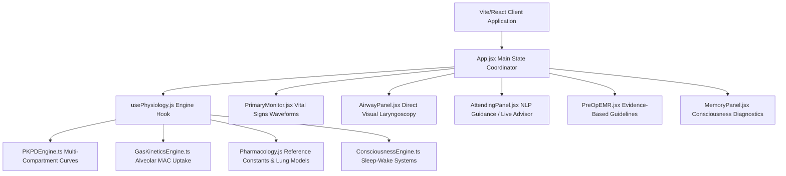
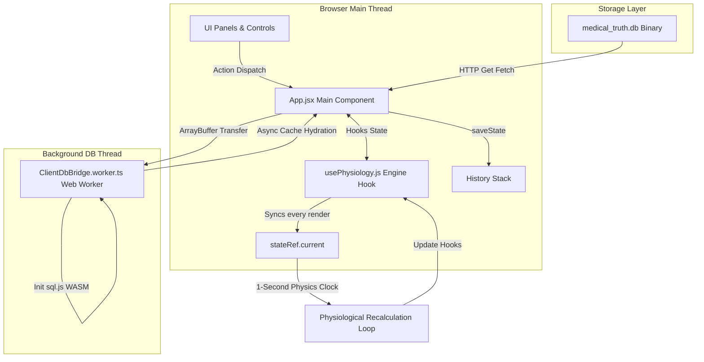
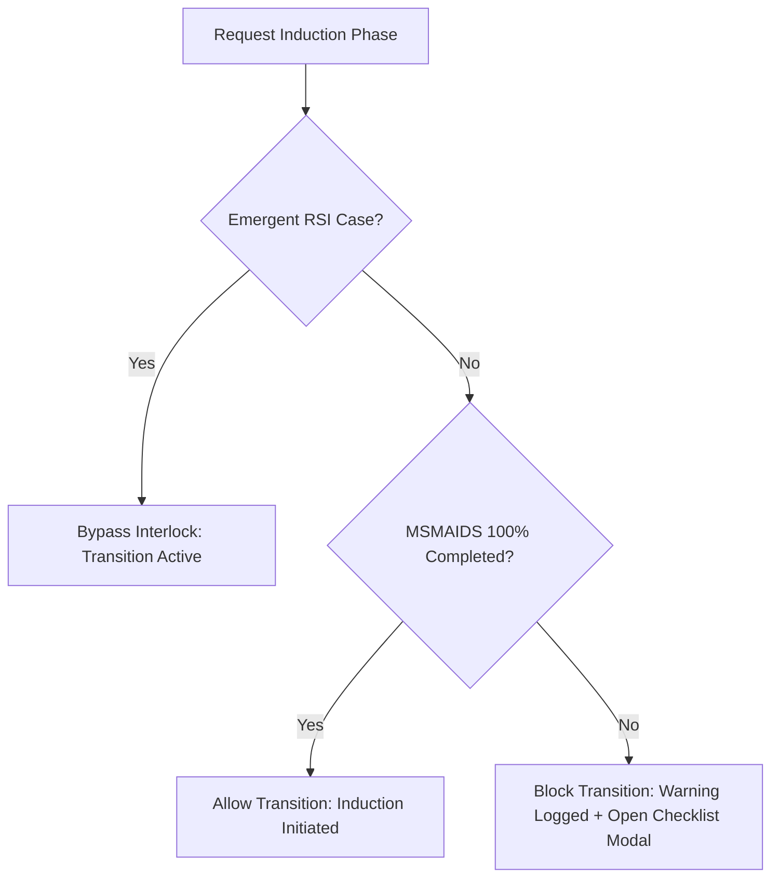

# Clinical Anesthesia & Physiological Airway Simulator: Golden Version Ground Truth

This document represents the unified, consolidated, and authoritative system architecture, physiological formulas, database schemas, and codebase blueprints for the Clinical Anesthesia & Physiological Airway Simulator. It serves as the single source of truth for the entire application.

---

## Table of Contents
1.  **STAGE 1: SYSTEM ARCHITECTURE, RUNTIME FLOW & TECH STACK**
    *   [1. High-Level Architecture](#1-high-level-architecture)
        *   [1.1 Technical Stack Specifications](#11-technical-stack-specifications)
        *   [1.2 Component Coordination & Data Flow](#12-component-coordination--data-flow)
        *   [1.3 Communication Pipelines & Execution Loops](#13-communication-pipelines--execution-loops)
        *   [1.4 State Lifecycle & The Engine Clock Bridge](#14-state-lifecycle--the-engine-clock-bridge)
    *   [2. Component & Runtime Lifecycle](#2-component--runtime-lifecycle)
        *   [2.1 Initialization Sequence (Step-by-Step)](#21-initialization-sequence-step-by-step)
        *   [2.2 User Action Interruption & Loop Injection](#22-user-action-interruption--loop-injection)
    *   [3. Complete Database & Schema Map](#3-complete-database--schema-map)
        *   [3.1 SQLite Database Schema Structure](#31-sqlite-database-schema-structure)
        *   [3.2 Representation of Ingested Textbook Data](#32-representation-of-ingested-textbook-data)
2.  **STAGE 2: THE CORE LOGIC ENGINES & ALGORITHMIC FRAMEWORKS**
    *   [4. Pathophysiology & Vital Signs Engine](#4-pathophysiology--vital-signs-engine)
        *   [4.1 Cardiovascular & Hemodynamic Physiology](#41-cardiovascular--hemodynamic-physiology)
        *   [4.2 Oscillations & Homeostatic Waves](#42-oscillations--homeostatic-waves)
        *   [4.3 Myocardial Ischemia & Metabolic Demand](#43-myocardial-ischemia--metabolic-demand)
        *   [4.4 Cardiac Arrest & Resuscitation Loop](#44-cardiac-arrest--resuscitation-loop)
        *   [4.5 Defibrillation & Cardioversion Shock Physics](#45-defibrillation--cardioversion-shock-physics)
        *   [4.6 Respiratory Volumes, Mechanics & Upper Airway Resistance](#46-respiratory-volumes-mechanics--upper-airway-resistance)
        *   [4.7 Alveolar Ventilation, Apnea Kinetics & Loop Gain](#47-alveolar-ventilation-apnea-kinetics--loop-gain)
        *   [4.8 Blood-Gas Exchange, Shunt Mathematics & Alveolar Dynamics](#48-blood-gas-exchange-shunt-mathematics--alveolar-dynamics)
        *   [4.9 Optical Pulse Oximetry Absorption Model](#49-optical-pulse-oximetry-absorption-model)
        *   [4.10 Cerebral Physiology & Intracranial Mechanics](#410-cerebral-physiology--intracranial-mechanics)
        *   [4.11 Gastrointestinal Physiology & Lower Esophageal Barrier Pressure](#411-gastrointestinal-physiology--lower-esophageal-barrier-pressure)
    *   [5. Pharmacology (PK/PD) Engine](#5-pharmacology-pkpd-engine)
        *   [5.1 Mammillary Multi-Compartment PK Model](#51-mammillary-multi-compartment-pk-model)
        *   [5.2 Numerical Integration (Euler Sub-stepping)](#52-numerical-integration-euler-sub-stepping)
        *   [5.3 Flow-Dependent Clearance & Distribution Autoregulation](#53-flow-dependent-clearance--distribution-autoregulation)
        *   [5.4 Organ Impairment & Protein Binding Corrections](#54-organ-impairment--protein-binding-corrections)
        *   [5.5 Receptor-Level Pharmacodynamics](#55-receptor-level-pharmacodynamics)
        *   [5.6 Receptor-Level Vasoactive Chronotropic & Vasomotor Coupling](#56-receptor-level-vasoactive-chronotropic--vasomotor-coupling)
        *   [5.7 Neuromuscular Blockade, Receptor Subtypes & Fade (TOF Count)](#57-neuromuscular-blockade-receptor-subtypes--fade-tof-count)
        *   [5.8 Drug-Drug Synergism, Chelation Reversal & Anticholinesterase ceiling](#58-drug-drug-synergism-chelation-reversal--anticholinesterase-ceiling)
        *   [5.9 Consciousness, Sleep Stages, Memory, & Processed EEG Engine](#59-consciousness-sleep-stages-memory--processed-eeg-engine)
        *   [5.10 High-Fidelity Medication Data Table](#510-high-fidelity-medication-data-table)
    *   [6. Event Trigger, Clinical Scenarios & Workflow Engine](#6-event-trigger-clinical-scenarios--workflow-engine)
        *   [6.1 Pre-induction Workflow Interlock (MSMAIDS Checklist)](#61-pre-induction-workflow-interlock-msmaids-checklist)
        *   [6.2 Airway Assessment & Direct Laryngoscopy Glottic Visualization](#62-airway-assessment--direct-laryngoscopy-glottic-visualization)
        *   [6.3 Laryngospasm & Bronchospasm Spasmodic Reflex Loops](#63-laryngospasm--bronchospasm-spasmodic-reflex-loops)
        *   [6.4 IgE-Mediated Anaphylactic Shock Vasoplegia](#64-ige-mediated-anaphylactic-shock-vasoplegia)
        *   [6.5 Gastric Aspiration Chemical Pneumonitis](#65-gastric-aspiration-chemical-pneumonitis)
        *   [6.6 Active Metabolite Accumulation & Neurotoxicity (Seizures)](#66-active-metabolite-accumulation--neurotoxicity-seizures)
        *   [6.7 Local Anesthetic Systemic Toxicity (LAST) & Cyanide Toxicity](#67-local-anesthetic-systemic-toxicity-last--cyanide-toxicity)
        *   [6.8 Serotonin Syndrome Hyperpyrexia](#68-serotonin-syndrome-hyperpyrexia)
        *   [6.9 Belmont IO Blowout & Arterial Injection Safety Interlocks](#69-belmont-io-blowout--arterial-injection-safety-interlocks)
        *   [6.10 Connected Intraoperative Awareness & Neuro-Cognitive Crises](#610-connected-intraoperative-awareness--neuro-cognitive-crises)
    *   [6.11 Obstructive Sleep Apnea Collapse Crisis](#611-obstructive-sleep-apnea-collapse-crisis)
    *   [6.12 Cheyne-Stokes Respiration & Central Sleep Apnea](#612-cheyne-stokes-respiration--central-sleep-apnea)
    *   [6.13 Obesity Hypoventilation Syndrome Loop](#613-obesity-hypoventilation-syndrome-loop)
    *   [6.14 Special SDB Anesthesia Bundle Checklist](#614-special-sdb-anesthesia-bundle-checklist)
    *   [6.15 Intracranial Hypertension & Cushing's Reflex Loop](#615-intracranial-hypertension--cushings-reflex-loop)
    *   [6.16 Cerebral Steal Syndrome vs. Robin Hood Effect](#616-cerebral-steal-syndrome-vs-robin-hood-effect)
    *   [6.17 Severe Traumatic Brain Injury (TBI) & Brain Herniation](#617-severe-traumatic-brain-injury-tbi--brain-herniation)
    *   [6.18 Succinylcholine Hyperkalemia & Cardiac Membrane Stabilization](#618-succinylcholine-hyperkalemia--cardiac-membrane-stabilization)
    *   [6.19 Neostigmine Ceiling Effect & Overdose Weakness](#619-neostigmine-ceiling-effect--overdose-weakness)
    *   [6.20 Absorption Atelectasis & Shunt Hypoxemia](#620-absorption-atelectasis--shunt-hypoxemia)
    *   [6.21 Alveolar Recruitment Maneuver](#621-alveolar-recruitment-maneuver)
    *   [6.22 Bezold-Jarisch Reflex](#622-bezold-jarisch-reflex)
    *   [6.23 Bainbridge Reflex](#623-bainbridge-reflex)
    *   [6.24 Oculocardiac Reflex](#624-oculocardiac-reflex)
    *   [6.25 Postoperative Ileus (POI) & Gut Motility Dysregulation](#625-postoperative-ileus-poi--gut-motility-dysregulation)
    *   [6.26 Swallowing Apnea Reflex & Pharyngeal Protection](#626-swallowing-apnea-reflex--pharyngeal-protection)
    *   [7. Attending Direct Chat, Advisor & NLP Engine](#7-attending-direct-chat-advisor--nlp-engine)
        *   [7.1 Automated Guidance Evaluator](#71-automated-guidance-evaluator)
        *   [7.2 Conversational NLP Chat Portal](#72-conversational-nlp-chat-portal)
3.  **STAGE 3: STATE MANAGEMENT, INGESTION PIPELINES, & BOUNDARY CONDITIONS**
    *   [8. Full Application State Tree](#8-full-application-state-tree)
        *   [8.1 Global Application Hooks](#81-global-application-hooks)
        *   [8.2 Core Physiology Engine State Bridge Ref](#82-core-physiology-engine-state-bridge-ref)
    *   [9. Data Ingestion & Indexing Pipeline](#9-data-ingestion--indexing-pipeline)
        *   [9.1 The Ingestion Engine & Cache Hydration](#91-the-ingestion-engine--cache-hydration)
        *   [9.2 Dynamic Medication Ingestion](#92-dynamic-medication-ingestion)
        *   [9.3 Dynamic Procedural Ingestion](#93-dynamic-procedural-ingestion)
        *   [9.4 Dynamic Textbook Rule Indexer](#94-dynamic-textbook-rule-indexer)
    *   [10. Constraints & Edge Cases](#10-constraints--edge-cases)
4.  **STAGE 4: COMPREHENSIVE COMPILATION, CODE BLUEPRINT & INTEGRITY CHECK**
    *   [11. Crucial Code Files & System Responsibilities](#11-crucial-code-files--system-responsibilities)
    *   [12. Architectural Dependency Analysis: Hardcoded vs. Dynamic Textbook Data](#12-architectural-dependency-analysis-hardcoded-vs-dynamic-textbook-data)
    *   [13. Integrity & Compliance Verification Statement](#13-integrity--compliance-verification-statement)

---

## STAGE 1: SYSTEM ARCHITECTURE, RUNTIME FLOW & TECH STACK

### 1. High-Level Architecture

The simulator is a high-fidelity, real-time clinical training application representing physiological, pharmacological, and neuro-cognitive responses during general anesthesia induction.

#### 1.1 Technical Stack Specifications
*   **Frontend Framework**: React 19.2 (using Vite 8.0 as the build system and development server).
*   **Styling & UI Design**: Glassmorphic, dark-mode medical instrumentation UI styled with Vanilla CSS custom grids and integrated with Tailwind CSS 4.2.
*   **Database Engines**: 
    *   *Backend / Build Time*: SQLite database (`medical_truth.db`) managed via `better-sqlite3` (v12.10) for raw clinical text/matrix ingestion.
    *   *Client Runtime / Browser*: In-memory WebAssembly-based SQLite interface via `sql.js` (v1.12), ensuring driver and query syntax parity across both environments.
*   **Web Workers**: A dedicated HTML5 Web Worker (`ClientDbBridge.worker.ts`) is leveraged in the browser to compile, load, and query the SQLite database off the main UI thread.
*   **State Management**: React component local state hooks (`useState`) coupled with a custom React hook (`usePhysiology.js`) that manages the physics engine state. 
*   **History & Undo**: A serialization layer built in `App.jsx` deep-copies the application and engine states before executing user actions, maintaining a chronological history stack for undo operations.

#### 1.2 Component Coordination & Data Flow


#### 1.3 Communication Pipelines & Execution Loops
The system's data pipeline is split between asynchronous assets loading, user action injection, and a synchronous physiological execution clock:



*   **Database Ingestion & Hydration Pipeline**:
    1. During boot, the application fetches the static binary `/medical_truth.db` from the client-facing storage layer.
    2. The binary buffer is transferred directly to the Web Worker via Transferable Objects (`postMessage({ type: 'init', payload: { buffer } }, [buffer])`) to avoid copying memory across threads.
    3. The worker instantiates `sql.js`, loads the buffer, and runs initial queries to extract prose and matrix records.
    4. Hydrated arrays are returned to the main thread, where `ClientDbBridge.ts` caches them locally and triggers registered callbacks, automatically instantiating the registries.

#### 1.4 State Lifecycle & The Engine Clock Bridge
The simulator operates on a synchronous **1-second (1000ms) interval clock** instantiated within the `usePhysiology.js` custom hook. To prevent stale React state closures during rapid physical iterations without forcing interval resets, a specialized **State Bridge Ref Pattern** (`stateRef`) is utilized.

```javascript
// The Physics Engine State Bridge.
const stateRef = useRef({ time, vitals, targetVitals, patient, activeMeds, gasModels, intravascularVolume, electrolytes, ventSettings, gasSettings, surgicalPhase, msmaidsComplete });

useEffect(() => {
  stateRef.current = { time, vitals, targetVitals, patient, activeMeds, gasModels, intravascularVolume, electrolytes, ventSettings, gasSettings, surgicalPhase, msmaidsComplete };
});
```
Every clock tick, the simulator extracts parameters from `stateRef.current`, executes physiological mathematical adjustments, modifies target thresholds, calculates compartmental PK/PD decay, and updates state hooks accordingly.

---

### 2. Component & Runtime Lifecycle

#### 2.1 Initialization Sequence (Step-by-Step)
1.  **Boot & Script Ingestion**:
    *   Browser loads `main.jsx`, mounting the main `<App />` component.
    *   Static import of `ClientDbBridge` automatically executes `ClientDbBridge.init()`.
2.  **Driver Initialization & Hydration**:
    *   *Browser*: Spawns the database worker thread, downloads `medical_truth.db`, initializes the WASM-based SQLite driver, and populates main thread cache structures (`allProse`, `allMatrices`).
    *   *Node/Vitest*: Performs a direct import of `store.ts` and loads `KnowledgeStore` synchronously.
    *   Caches are sorted using `comparePriority()`.
    *   `ClientDbBridge.onLoaded` fires, causing the registries to parse textbook schemas and register medications/procedures.
3.  **Case Selection**:
    *   The user picks a case configuration from the UI.
    *   The client triggers `startCase(selectedCase)`.
4.  **Parameter Calculation & Patient Instantiation**:
    *   `startCase` calculates body descriptors based on baseline patient stats:
        *   **Ideal Body Weight (IBW)**:
            $$IBW_{\text{male}} = 50.0 + 2.3 \cdot \left(\frac{\text{Height [cm]}}{2.54} - 60\right)$$
            $$IBW_{\text{female}} = 45.5 + 2.3 \cdot \left(\frac{\text{Height [cm]}}{2.54} - 60\right)$$
        *   **Lean Body Weight (LBW)**:
            $$LBW_{\text{male}} = \frac{9270 \cdot \text{Weight [kg]}}{6680 + 216 \cdot BMI}$$
            $$LBW_{\text{female}} = \frac{9270 \cdot \text{Weight [kg]}}{8780 + 244 \cdot BMI}$$
        *   **Estimated Blood Volume (EBV)**: Calculated based on patient sex (65 mL/kg for females, 75 mL/kg for males) multiplied by total weight.
        *   **Predicted Lung Volumes**: TLC, FRC, RV, FVC, and FEV1 are calculated using ECCS/ERS 1993 formulas, scaled exponentially based on position, restrictive/obstructive disease, and obesity factors.
5.  **State Hook Initialization**:
    *   Initial vitals (Heart Rate, SBP, DBP, $SpO_2$, $EtCO_2$) are pushed to the hooks.
    *   Baseline MAP is initialized:
        $$MAP = DBP + \frac{SBP - DBP}{3}$$
    *   Active medication list is cleared, surgical phase is reset to `Pre-Op`, and inhalational gas models are generated.
    *   The execution loop is set to running (`isRunning = true`).

#### 2.2 User Action Interruption & Loop Injection
When a user executes a clinical action (e.g., injecting a drug, changing mechanical ventilation parameters, or performing airway maneuvers):
1.  **State Serialization (Undo Stack)**:
    *   `saveState()` is called to serialise current client configurations and invoke `createSnapshot()` on the physiological engine.
    *   The snapshots are appended to the `history` array.
2.  **State Injection**:
    *   The UI handler calls the state setter (e.g., `setVentSettings`, `pushMed`, `setPatient`).
    *   React pushes these updates into its queue.
3.  **Ref Synchronization**:
    *   As soon as React applies the state updates, the `useEffect` hooks trigger and update `stateRef.current` with the new values.
4.  **Engine Recalculation**:
    *   On the next 1-second interval tick, the physiology loop reads from `stateRef.current`, incorporating the user-modified parameters directly into the mathematical differential equations.

---

### 3. Complete Database & Schema Map

#### 3.1 SQLite Database Schema Structure
The `medical_truth.db` database contains two primary tables storing prose and structured data parsed from medical textbooks:

##### Table 1: `textbook_prose`
*   **Columns**:
    *   `id`: `TEXT PRIMARY KEY` (Unique alphanumeric string identifier).
    *   `topic`: `TEXT` (The clinical topic or chapter subheading, e.g. "Succinylcholine").
    *   `body_text`: `TEXT` (Unabridged parsed string containing the raw text content).
    *   `source_book`: `TEXT` (Source filename tracking provenance, e.g. "Millers_Anesthesia_9th_Ed.pdf").
    *   `edition`: `INTEGER` (Textbook edition number).
    *   `priority_rank`: `INTEGER` (Computed rank indicating authority level).
    *   `is_authoritative`: `INTEGER DEFAULT 0` (Flag marking if the row is the winner of the priority resolution algorithm).
*   **Indexes**:
    *   `idx_prose_source_book` ON `textbook_prose (source_book)`
    *   `idx_prose_topic` ON `textbook_prose (topic)`

##### Table 2: `physiological_matrices`
*   **Columns**:
    *   `id`: `TEXT PRIMARY KEY` (Unique alphanumeric string identifier).
    *   `topic`: `TEXT` (Subsystem or category name).
    *   `archetype`: `TEXT` (Data format category, e.g. "COORDINATE X-Y GRAPHS").
    *   `caption`: `TEXT` (Descriptive legend of the table or chart).
    *   `structured_payload`: `TEXT` (Hierarchical JSON string containing the data array).
    *   `source_book`: `TEXT` (Source filename tracking provenance).
    *   `edition`: `INTEGER` (Textbook edition number).
    *   `priority_rank`: `INTEGER` (Computed rank indicating authority level).
    *   `is_authoritative`: `INTEGER DEFAULT 0` (Flag marking if the row is the winner of the priority resolution algorithm).
*   **Indexes**:
    *   `idx_matrices_source_book` ON `physiological_matrices (source_book)`
    *   `idx_matrices_topic` ON `physiological_matrices (topic)`

#### 3.2 Representation of Ingested Textbook Data
*   **Textbook Prose Representation**: Prose chapters are broken down into logical paragraphs or subheadings. Each section is stored as a row in `textbook_prose`. Mathematical rules are extracted dynamically from these rows by `extractTextbookRules()`.
*   **Tabular & Flowchart Representation**: Tables are parsed and stored as structured rows inside the JSON `structured_payload` of a `physiological_matrices` record. Flowcharts or procedural steps are stored in `structured_payload` with the `TIMELINE_STEP_CHART_HYPNOGRAM` archetype.
*   **Textbook Priority Hierarchy & Authority Resolution**:
    To handle conflicts between overlapping sources or editions, the database executes a strict hierarchy resolution query when `recalculateAuthority()` is invoked:
    $$\text{Rank}_{\text{Miller}} = 1000 + \text{Edition}$$
    $$\text{Rank}_{\text{Other}} = 100 + \text{Edition}$$
    A window function groups records by `topic` and assigns `is_authoritative = 1` to the record with the highest rank. Only authoritative rows are queried at runtime.

---

## STAGE 2: THE CORE LOGIC ENGINES & ALGORITHMIC FRAMEWORKS

### 4. Pathophysiology & Vital Signs Engine

#### 4.1 Cardiovascular & Hemodynamic Physiology (`CardiovascularEngine.ts`)
The cardiovascular engine calculates the patient's continuous perfusion status every second. It models cardiac output ($CO$, L/min) and mean arterial pressure ($MAP$, mmHg):

1.  **Mean Arterial Pressure (MAP)**:
    $$MAP = DBP + \frac{SBP - DBP}{3}$$
    $$MAP_{\text{exact}} = \frac{CO \cdot SVR}{80} + \Delta P_{\text{pressor}} + \Delta P_{\text{sepsis}} - \text{Stunning}_{\text{MAP\_penalty}}$$
    *   *Systemic Vascular Resistance ($SVR$)*: Normal range is $900 - 1400\text{ dyn}\cdot\text{s}\cdot\text{cm}^{-5}$. Updates dynamically based on vasodilation, vasoactive infusions, and autonomic reflexes. Under celiac or thoracic epidural sympathetic blockade (TEA):
        $$\text{targetSVR} *= (1.0 - 0.15 \cdot \text{SympatheticBlock})$$
        where $\text{SympatheticBlock} = 1.0$ if celiac or thoracic epidural block is active, else $0.0$.
    *   *Pressor Pressure Shift (\Delta P_{\text{pressor}})*:
        $$\Delta P_{\text{pressor}} = \frac{\text{EffectiveVolume} - EBV - \text{splanchnicPoolingOffset}}{250} \cdot 8$$
        where $\text{splanchnicPoolingOffset} = 1000 \cdot (V_{\text{splanchnic}} - 1.0)\text{ mL}$. Sympathetic block dilates mesenteric capacitance vessels, causing relative splanchnic pooling ($V_{\text{splanchnic}} > 1.0$). This is reversed by alpha-1 adrenergic receptor stimulation:
        $$V_{\text{splanchnic}} = 1.0 + 0.3 \cdot \text{SympatheticBlock} \cdot (1.0 - \text{AlphaAgonistEffect})$$
        where $\text{AlphaAgonistEffect} = 1.0$ if Phenylephrine, Norepinephrine, or Epinephrine is active.
    *   *Sepsis Pressure Shift (\Delta P_{\text{sepsis}})*: Drops SVR and subtracts $33.33\text{ mmHg}$ from MAP due to vasoplegia.
    *   *Stunning MAP Penalty (\text{Stunning}_{\text{MAP\_penalty}})*: If myocardial stunning is present, MAP is reduced by the stunning percentage.
2.  **Cardiac Output (CO)**:
    $$CO = \frac{HR \cdot SV}{1000} \quad \text{[L/min]}$$
    *   *Stroke Volume ($SV$)*: Derived from Frank-Starling preload curves, contractility, and stunning factors:
        $$SV = \min\left(SV_{\text{max}}, SV_{\text{base}} \cdot Preload_{SV} \cdot \max(0.1, Inotropy) \cdot CHF_{\text{penalty}} \cdot AFib_{\text{penalty}}\right)$$
        *   *Frank-Starling Preload Stroke Volume ($Preload_{SV}$)*: Models stroke volume variation as a function of LVEDP:
            $$Preload_{SV} = 1.2 \cdot \left(1.0 - e^{-0.15 \cdot LVEDP}\right) \cdot \left(1.0 - 1.2 \cdot \text{BloodLossRatio}\right)$$
        *   *Left Ventricular End-Diastolic Pressure ($LVEDP$)*: Calculated dynamically from intravascular volume offsets and myocardial inotropy:
            $$LVEDP = \max\left(2.0, \min\left(40.0, 8.0 + 4.0 \cdot \frac{\text{EffectiveVolume} - EBV}{250} + \frac{5.0}{Inotropy}\right)\right)$$
        *   *Inotropy ($Inotropy$)*:
            $$Inotropy = \max\left(0.01, 1.0 - \frac{\text{Stunning}}{100} + \text{Inotropy}_{\text{drugs}} + \text{Spike}_{\text{contractility}}\right)$$
3.  **Systolic (SBP) & Diastolic (DBP) Pressures**:
    Systolic and diastolic pressures are derived from MAP and Pulse Pressure ($PP$, mmHg), which scales with stroke volume:
    $$PP = 40 \cdot \frac{SV}{SV_{\text{base}}}$$
    $$SBP = MAP + \frac{2}{3} \cdot PP + \text{Noise}_{\text{sys}}$$
    $$DBP = MAP - \frac{1}{3} \cdot PP + \text{Noise}_{\text{dia}}$$
4.  **Autonomic Reflexes - Baroreceptor Reflex**:
    *   *Baroreflex Gain (\text{baroreflexGain})*: Blunted dose-dependently by volatile anesthetics and completely bypassed under connected awareness crises:
        $$\text{baroreflexGain} = \max\left(0, 1.0 - \text{currentMac} \cdot 0.67\right)$$
    *   *Autonomic Heart Rate Mod (\text{autonomicHrMod})*:
        $$\text{Error}_{\text{baro}} = MAP - MAP_{\text{set}} \quad \text{where } MAP_{\text{set}} = DBP_{\text{base}} + \frac{SBP_{\text{base}} - DBP_{\text{base}}}{3}$$
        $$\text{autonomicHrMod} = \max\left(-25, \min\left(30, -0.5 \cdot \text{Error}_{\text{baro}} \cdot \text{baroreflexGain}\right)\right)$$
        Reflex bradycardia is blunted (set to 0) if antimuscarinic drugs block cholinergic receptors (`totalHrDelta > 15`).

#### 4.2 Oscillations & Homeostatic Waves
The hemodynamics engine superimposes oscillatory waveforms onto heart rate and blood pressures to represent in-vivo responses:
*   **Respiratory Sinus Arrhythmia (RSA) & Breathing Fluctuations**:
    $$\text{RSA}_{\text{Effect}} = \sin(\theta_{\text{resp}}) \cdot 1.3 \quad \text{[bpm]} \quad \text{where } \theta_{\text{resp}} = \frac{t \cdot 2\pi}{60/RR}$$
    $$\text{RespBp}_{\text{Var}} = \sin(\theta_{\text{resp}}) \cdot 2.2 \quad \text{[mmHg]}$$
*   **Traube-Hering-Mayer (THM) Waves**:
    $$\text{THM}_{\text{Effect}} = \sin\left(\frac{t \cdot 2\pi}{10}\right) \cdot 0.9 \quad \text{[mmHg]}$$
*   **Micro-Fluctuations (Nervous Noise)**:
    $$\text{Noise}_{\text{HR\_Micro}} \approx \text{Random}(-0.2, 0.2) \quad \text{Noise}_{\text{BP\_Micro}} \approx \text{Random}(-0.35, 0.35)$$

#### 4.3 Myocardial Ischemia & Metabolic Demand
Myocardial oxygen balance represents a dynamic supply-demand relationship. Perfusion occurs primarily during diastole and is governed by coronary driving pressure:

*   **Coronary Perfusion Pressure ($CPP_{\text{coronary}}$)**:
    $$CPP_{\text{coronary}} = \max\left(5.0, DBP - LVEDP\right)$$
*   **Diastolic Time Ratio (\text{DiastoleTimeRatio})**: Shrinks as heart rate rises, limiting the duration of coronary perfusion:
    $$\text{DiastoleTimeRatio} = \max\left(0.20, \min\left(0.85, \frac{60.0 - 0.2 \cdot HR}{60.0}
ight)\right)$$
*   **Myocardial Oxygen Demand ($MVO_2$)**: Scales with heart rate, systolic pressure, contractility, and ventricular radius:
    $$MVO_2 = HR \cdot SBP \cdot Inotropy \cdot RadiusMod \quad \text{where } RadiusMod = 1.0 + \max\left(0, \frac{LVEDP - 12.0}{15.0}
ight)$$
*   **Myocardial Oxygen Supply ($Supply_{\text{myo}}$)**:
    $$Supply_{\text{myo}} = CPP_{\text{coronary}} \cdot \text{DiastoleTimeRatio} \cdot CaO_2 \cdot \text{coronaryStenosisMod} \cdot 8.5$$
    where $CaO_2 = Hb \cdot 1.34 \cdot (SpO_2 / 100) + PaO_2 \cdot 0.0031$, and $\text{coronaryStenosisMod} = 0.40$ if CAD patient, else $1.0$.
*   **Ischemia & Stunning Accumulation**:
    If oxygen demand exceeds supply, stunning accumulates at a rate proportional to the deficit:
    $$\text{StunningRate} = \max\left(0, \frac{MVO_2 - Supply_{\text{myo}}}{10000} \cdot 0.381
ight) \quad [\%/\text{s}]$$
    Stunning restricts inotropy and contractility. It decays slowly by $0.2\%$ per second once oxygen supply exceeds demand.

#### 4.4 Cardiac Arrest & Resuscitation Loop
*   **Arrest Triggers**: Initiated if:
    1.  *Hypoxemia*: Arterial oxygen tension ($PaO_2$) remains below $30\text{ mmHg}$ for $>15$ continuous seconds.
    2.  *Severe Acidosis*: Arterial pH drops below $6.9$.
    3.  *Hyperkalemia*: Potassium levels ($K^+$) exceed $10.0\text{ mEq/L}$ (or $9.0\text{ mEq/L}$ if not membrane-stabilized by Calcium).
    4.  *Anomalous shock*: Severe anaphylactic vasoplegia.
*   **CPR Mechanics**: When CPR is active, the engine bypasses standard hemodynamic equations and generates survival perfusion pressure:
    $$SBP_{\text{CPR}} = 80 + \text{Random}(0, 15) \quad [mmHg] \quad DBP_{\text{CPR}} = 25 + \text{Random}(0, 10) \quad [mmHg]$$
    $$CO_{\text{CPR}} \approx 1.5\text{ L/min}$$
*   **Ischemic Damage Accumulation**:
    $$\frac{d(\text{Damage})}{dt} = (90 - SpO_2) \cdot 0.4 + (55 - MAP_{\text{cerebral}}) \cdot 0.7 \quad \text{[per second]}$$
    CPR reduces this damage accumulator by $4.5$ units/s (if $SpO_2 \ge 80\%$) or $1.0$ unit/s (if hypoxemic).
    If $\text{Damage} > 1200$, cardiac arrest is triggered. If $\text{Damage} > 6000$, irreversible **biological death** occurs.
*   **Spontaneous ROSC**: CPR chest compression cycles have a $4\%$ chance per second to trigger spontaneous ROSC if oxygen buffer is sufficient ($>50\%$ of FRC capacity), hemorrhage is restricted ($\text{BloodLossRatio} < 0.2$), and therapeutic levels of Epinephrine are present.

#### 4.5 Defibrillation & Cardioversion Shock Physics
*   **Shock Success Probability**:
    $$P_{\text{ROSC}} = \max\left(0.01, 0.70 + \text{Bonus}_{\text{meds}} - \text{Penalty}_{\text{ischemia}} - \text{Penalty}_{\text{hypoxia}} - \text{Penalty}_{\text{hypovolemia}}\right)$$
    *   $\text{Bonus}_{\text{meds}}$: Amiodarone ($+0.25$), Lidocaine ($+0.20$), Epinephrine ($+0.10$).
    *   $\text{Penalty}_{\text{ischemia}}$: $\frac{\text{IschemicDamage}}{5000}$.
    *   $\text{Penalty}_{\text{hypoxia}}$: $0.60$ if $O_2\text{ Buffer} < 40\%\text{ of FRC}$.
    *   $\text{Penalty}_{\text{hypovolemia}}$: $0.60$ if $\text{BloodLossRatio} > 0.30$.
*   **Rhythm Conversion**: Organized Sinus Rhythm is restored if successful, setting myocardial stunning to $60\%$. An unsynchronized shock during a perfusing rhythm has a $100\%$ chance to induce R-on-T Ventricular Fibrillation (VFib).

#### 4.6 Respiratory Volumes, Mechanics & Upper Airway Resistance (`RespiratoryEngine.ts`)
*   **Upper Airway Resistance ($R_{\text{upper}}$)**: Models pharyngeal patency as a function of neuromuscular blockade, anesthetic depth, sleep stage REM atonia, and airway pressures:
    $$R_{\text{upper}} = \frac{R_{\text{base}}}{(\text{dilatorMuscleTone})^{2.5}} \cdot e^{0.5 \cdot (P_{\text{crit}} - P_{\text{airway}})}$$
    where $R_{\text{base}} = 5\text{ cmH2O/L/s}$ is the baseline airway resistance, $P_{\text{crit}}$ is the critical pharyngeal collapse pressure (mmHg), and $P_{\text{airway}}$ is the positive pressure in the airway (mmHg, e.g. PEEP, CPAP, or BiPAP settings).
    *   *Dilator Genioglossus Muscle Tone ($\text{dilatorMuscleTone}$)*: Represents upper airway dilator muscle activity index ($0.0 - 1.0$).
        $$\text{dilatorMuscleTone} = 1.0 - \text{NMBA}_{\text{block}} - 0.7 \cdot \text{Propofol}_{Ce} - 0.5 \cdot \text{Volatile}_{\text{MAC}} - \text{REMAtonia}_{\text{penalty}}$$
        where $\text{NMBA}_{\text{block}}$ is nicotinic acetylcholine receptor occupancy, and $\text{REMAtonia}_{\text{penalty}} = 0.85$ when the active sleep stage is REM (Stage R).
    *   *Pharyngeal Collapse Pressure ($P_{\text{crit}}$)*: Mapped based on patient airway status. In normal patients, $P_{\text{crit}} = -5.0\text{ mmHg}$ (highly stable). In moderate-to-severe Obstructive Sleep Apnea (OSA) patients, $P_{\text{crit}}$ increases to $\ge 0.0\text{ mmHg}$ (collapses even at atmospheric pressure).

#### 4.6.1 Predicted Lung Volumes (ECCS/ERS 1993)

    *   *Male Predicted FRC*: $FRC_{\text{pred}} = 2.34 \cdot H + 0.009 \cdot A - 1.09$
    *   *Female Predicted FRC*: $FRC_{\text{pred}} = 2.24 \cdot H + 0.001 \cdot A - 1.00$
*   **Volume Corrections**:
    $$\text{Volume}_{\text{final}} = \text{Volume}_{\text{pred}} \cdot \text{Disease}_{\text{scale}} \cdot e^{-0.02 \cdot (BMI - 25)} \cdot \text{Position}_{\text{factor}}$$
    *   $\text{Position}_{\text{factor}}$: Sitting ($1.0$), Supine/Sniffing ($0.80$), Trendelenburg ($0.70$).
*   **Pulmonary Compliance & Resistance**:
    *   *Compliance ($C$, mL/cmH2O)*: Baseline is $65$. Modified by position (Trendelenburg decreases compliance by $20\%$), obesity ($-25$), and sepsis ($-20$).
    *   *Resistance ($R$, cmH2O/L/s)*: Baseline is $5$. Elevated by obesity ($+3$), bronchospasm ($+40$), bucking ($+15$), and laryngospasm ($R = 999$).
*   **Ventilator Pressures & Tidal Volume ($V_{TE}$)**:
    *   *VCV Mode*: $V_{TE} = \text{dialed } V_T$. Peak inspiratory pressure is calculated as:
        $$PIP = P_{\text{plat}} + \left(\text{Flow} \cdot R \cdot 5\right) \quad \text{where } P_{\text{plat}} = PEEP + \frac{V_{TE}}{C}$$
    *   *PCV Mode*: $PIP = PEEP + P_{\text{insp}}$. Tidal volume is calculated as:
        $$V_{TE} = \left(P_{\text{plat}} - PEEP\right) \cdot C \quad \text{where } P_{\text{plat}} = PIP - 2$$
    *   *PCV-VG Mode*: $V_{TE} = \text{dialed } V_T$. Peak pressure converges: $P_{\text{plat}} = PEEP + \frac{V_{TE}}{C}$, $PIP = P_{\text{plat}} + 2$.

#### 4.7 Alveolar Ventilation, Apnea Kinetics & Loop Gain
*   **Chemoreceptor Feedback Loop Gain ($LG$)**: Quantifies ventilatory control stability and propensity to periodic breathing:
    $$LG = G_{\text{controller}} \cdot G_{\text{plant}} \cdot \text{mixingGainMod}$$
    *   *Controller Gain ($G_{\text{controller}}$)*: Sensitivity of the central and peripheral chemoreceptors to changes in $PaCO_2$.
        $$G_{\text{controller}} = G_{\text{base}} \cdot \max(1.0, 1.0 + 3.0 \cdot (7.4 - pH) + 2.0 \cdot \frac{100 - SpO_2}{10})$$
        where $G_{\text{base}} = 1.2$. It increases significantly during severe hypoxia (e.g. altitude exposure, low $FiO_2$) and metabolic acidosis.
    *   *Plant Gain ($G_{\text{plant}}$)*: Efficiency of the lungs in clearing $CO_2$ from the blood.
        $$G_{\text{plant}} = \frac{1.0}{\text{recruitedFRC\_L}}$$
        It is inversely proportional to functional residual capacity ($FRC$). It increases under lung volume restriction, atelectasis, or supine/Trendelenburg positioning, causing larger $PaCO_2$ swings per breath.
    *   *Mixing Gain ($mixingGainMod$)*: Scales with circulatory mixing delay ($mixingGain$, in seconds, representing transport time from pulmonary capillaries to chemoreceptors):
        $$\text{mixingGainMod} = \frac{\text{mixingGain}}{12.0}$$
        In patients with Congestive Heart Failure (CHF) or severe low cardiac output states, circulatory delay exceeds $30\text{ seconds}$ (increasing `mixingGain` to $\ge 30.0$, thus elevating loop gain to $LG > 1.0$).
*   **Periodic Crescendo-Decrescendo Breathing (Cheyne-Stokes Respiration [CSR])**: When $LG > 1.0$ and the patient is in NREM sleep (stages N1/N2), the respiratory rate ($RR$) and Tidal Volume ($V_T$) oscillate cyclically:
    $$RR_{\text{oscillated}} = RR_{\text{target}} \cdot (1.0 + \sin(\theta_{\text{CSR}}))$$
    $$V_{T,\text{oscillated}} = V_T \cdot (1.0 + \sin(\theta_{\text{CSR}}))$$
    where $\theta_{\text{CSR}} = \frac{t \cdot 2\pi}{60}$ (representing a 60-second periodic cycle of hyperpnea followed by central apnea).
*   **Apneic Threshold PaCO2**: If $PaCO_2$ drops below the threshold (normally $35\text{ mmHg}$ but shifts rightward to $40\text{ mmHg}$ during sleep):
    $$PaCO_2 < \text{apneicThresholdPaCO2}$$
    all respiratory muscle drive ceases ($RR = 0$, $V_A = 0$), causing central apnea.


    $$V_A = (V_T - V_D) \cdot RR \quad \text{[L/min]} \quad \text{where } V_D = \frac{IBW_{\text{kg}} \cdot 2.2}{1000}\text{ L}$$
*   **Apnea CO2 Accumulation (Eger & Severinghaus)**:
    When tidal exchange is absent ($V_A \le 0.1\text{ L/min}$):
    *   During the first minute of apnea: $\frac{d(PaCO_2)}{dt} = +\frac{6}{60}\text{ mmHg/s}$
    *   During subsequent minutes: $\frac{d(PaCO_2)}{dt} = +\frac{3}{60}\text{ mmHg/s}$
*   **Henderson-Hasselbalch Equation**:
    $$pH = 6.1 + \log_{10}\left(\frac{HCO_3^-}{0.03 \cdot PaCO_2}\right)$$

#### 4.8 Blood-Gas Exchange, Shunt Mathematics & Alveolar Dynamics
*   **Alveolar Oxygen Tension (PAO2)**:
    $$PAO_2 = \left(FiO_2 \cdot (P_B - P_{H_2O})\right) - \frac{PaCO_2}{R} \quad \text{[mmHg]} \quad (P_B = 760, P_{H_2O} = 47, R = 0.8)$$
*   **Apnea Oxygen Buffer Depletion**:
    $$\frac{d(\text{O2Buffer})}{dt} = -VO_2 \cdot \text{Temp}_{\text{scale}} \cdot \text{Shivering}_{\text{scale}} + \text{PassiveO2}_{\text{influx}}$$
*   **Bohr Shift & Hemoglobin Dissociation (Adair-Riley Equation)**:
    $$PO_{2,\text{eff}} = PO_2 \cdot 10^{0.48 \cdot (pH - 7.4) - 0.024 \cdot (\text{Temp} - 37) - \text{Shift}_{\text{volatile}}}$$
    $$SaO_2 = \frac{PO_{2,\text{eff}}^3 + 150 \cdot PO_{2,\text{eff}}}{PO_{2,\text{eff}}^3 + 150 * PO_{2,\text{eff}} + 23400} \cdot 100$$
*   **Absorption Atelectasis Kinetics**:
    High inspired oxygen fractions combined with a lack of positive airway pressure and tone loss (induction apnea/paralysis) accelerate alveolar collapse:
    $$\frac{d(\text{Atelectasis})}{dt} = \text{rate}_{\text{base}} \cdot (1.0 + \text{isParalyzed} \cdot 2.0) \cdot (1.0 + \text{isObese} \cdot 1.0)$$
    where:
    $$\text{rate}_{\text{base}} = 0.001 \cdot \left(FiO_2 - 0.21\right) - 0.001 \cdot \text{PEEP}$$
*   **Alveolar Recruitment**:
    PEEP recruits collapsed units gradually, while a sustained inflation recruitment maneuver (airway pressure held $\ge 30\text{ cmH2O}$ for $\ge 10\text{ seconds}$) instantly restores volume:
    $$\text{recruitment}_{\text{PEEP}} = -0.005 \cdot \text{PEEP} \quad (\text{per second})$$
    $$\text{If } P_{\text{airway}} \ge 30\text{ cmH2O for } \ge 10\text{ seconds} \rightarrow \text{Atelectasis} = 0.0$$
*   **Hypoxic Pulmonary Vasoconstriction (HPV) & Shunt**:
    HPV protects against hypoxemia by diverting blood flow away from collapsed hypoxic units, reducing shunt contribution by $50\%$. Volatiles inhibit HPV dose-dependently:
    $$\text{hpvInhibition} = \min\left(1.0, \text{Volatile}_{\text{MAC}} \cdot 0.67\right)$$
    $$\text{hpvProtection} = 0.50 \cdot (1 - \text{hpvInhibition})$$
    $$\text{shunt}_{\text{atelectasis}} = 0.30 \cdot \text{Atelectasis} \cdot (1 - \text{hpvProtection})$$
    $$\text{actualShunt} = \text{baselineShunt} + \text{shunt}_{\text{atelectasis}}$$
*   **FRC & Compliance Corrections**:
    $$FRC_{\text{actual}} = FRC_{\text{baseline}} \cdot (1.0 - 0.35 \cdot \text{Atelectasis})$$
    $$Compliance_{\text{actual}} = Compliance_{\text{baseline}} \cdot (1.0 - 0.40 \cdot \text{Atelectasis})$$
*   **Mixed Venous Return & Pulmonary Shunt Exchange**:
    *   *Capillary O2 Content ($CcO_2$)*: $CcO_2 = Hb \cdot 1.34 \cdot \frac{SaO_2}{100} + PAO_2 \cdot 0.0031$
    *   *Mixed Venous O2 Content ($CvO_2$)*: $CvO_2 = CcO_2 - \frac{VO_2}{CO \cdot 10}$
    *   *Arterial O2 Content ($CaO_2$)*: $CaO_2 = CcO_2 \cdot (1 - \text{actualShunt}) + CvO_2 \cdot \text{actualShunt}$
    *   *Arterial O2 Saturation ($SpO_2$)*: $SpO_2 = \frac{CaO_2}{Hb \cdot 1.34} \cdot 100$
*   **Oxygen Delivery ($DO_2$)**:
    $$DO_2 = CaO_2 \cdot CO \cdot 10 \quad \text{[mL/min]}$$

#### 4.9 Optical Pulse Oximetry Absorption Model
*   **Absorbance Equations**:
    $$A_{660} = 0.1 \cdot S_O + 1.0 \cdot S_D + 1.0 \cdot S_M + 0.1 \cdot S_C$$
    $$A_{940} = 1.0 \cdot S_O + 0.1 \cdot S_D + 1.0 \cdot S_M + 1.0 \cdot S_C$$
    *   $S_O = \frac{SaO_2}{100} \cdot (1 - S_M - S_C)$, $S_D = (1 - \frac{SaO_2}{100}) \cdot (1 - S_M - S_C)$, $S_M$ is MetHb, $S_C$ is COHb.
*   **Oximetry Ratio (R)**:
    $$R_{\text{ratio}} = \frac{A_{660}}{A_{940}} \quad \text{yielding} \quad SpO_{2,\text{measured}} = 110 - 25 \cdot R_{\text{ratio}} \quad [\%]$$

#### 4.10 Cerebral Physiology & Intracranial Mechanics
*   **Cerebral Blood Flow ($CBF$)**: Global baseline is $50\text{ mL/100 g/min}$ (representing $12\% - 15\%$ of cardiac output). Gray matter (cortical) receives $80\%$ ($75 - 80\text{ mL/100 g/min}$); white matter (subcortical) receives $20\%$ ($8 - 20\text{ mL/100 g/min}$).
*   **Cerebral Metabolic Rate of Oxygen ($CMRO_2$)**: Baseline is $3.0 - 3.5\text{ mL/100 g/min}$ (approx $50\text{ mL/min}$ total, $20\%$, of total body oxygen consumption).
    - *Functional metabolism*: Approximately $60\%$ of $CMRO_2$ supports electrophysiological function (neurotransmitter synthesis, transport, and synaptic potentials). Reduced dose-dependently by anesthetics (Propofol, Barbiturates) up to a maximum of $60\%$ reduction (at electrophysiologic silence / EEG flatline).
    - *Basal cellular metabolism*: The remaining $40\%$ supports cellular homeostatic integrity. Spared by anesthetics, but reduced by hypothermia (decreases by $6\% - 7\%$ per $^{\circ}\text{C}$ reduction; $Q_{10} = 2.4$).
*   **Cerebral Perfusion Pressure ($CPP$)**: The net pressure gradient driving blood flow to the brain:
    $$CPP = MAP - ICP \quad \text{(or CVP if } CVP > ICP\text{)}$$
    - *Lower Limit of Autoregulation (LLA)*: $70\text{ mmHg}$ MAP (or $60 - 65\text{ mmHg}$ CPP). Below this, CBF is pressure-passive, causing cerebral ischemia risk.
    - *Upper Limit of Autoregulation (ULA)*: $150\text{ mmHg}$ MAP. Above this, vasoconstrictor tone is overcome, causing pressure-passive hyperfusion.
*   **Intracranial Volume-Compliance Mechanics (Monro-Kellie Doctrine)**:
    The rigid cranium creates a fixed total volume:
    $$V_{\text{intracranial}} = V_{\text{brain}} + V_{\text{blood}} + V_{\text{CSF}} = \text{Constant}$$
    - *Intracranial Pressure ($ICP$)*: Baseline is $8 - 12\text{ mmHg}$ (supine). Calculated using an exponential volume-pressure elastance model:
        $$ICP = ICP_{\text{baseline}} \cdot e^{\text{elastance} \cdot \Delta V}$$
        where $\Delta V$ is driven by changes in Cerebral Blood Volume ($CBV$) and `intracranialVolumeOffset` (representing hematoma, edema, or tumors).
    - *Elastance States*: Determined by intracranial compliance:
        - `'normal'`: elastance $\approx 0.05$. CSF is easily displaced into spinal space; venous blood is squeezed out of sinuses.
        - `'impaired'`: elastance $\approx 0.20$. Compensation mechanisms are partially exhausted.
        - `'exhausted'`: elastance $\ge 0.50$. Compensation is fully exhausted; small volume additions trigger exponential ICP surges.
*   **Cerebral Autoregulation & Coupling**: CBF is tightly coupled to $CMRO_2$ (neurovascular coupling) under intravenous anesthetics (Propofol, Barbiturates) which reduce both in parallel. Volatile anesthetics ($>1\text{ MAC}$) uncouple this relationship, causing direct cerebral vasodilation (increasing CBF/CBV) while decreasing $CMRO_2$. Volatiles also dose-dependently attenuate autoregulation (lost at $>1.5\text{ MAC}$).
*   **Carbon Dioxide ($CO_2$) Reactivity**: CBF varies linearly with changes in $PaCO_2$ between $25$ and $75\text{ mmHg}$:
    - *Normotension*: hypercapnia ($+2.5\% \text{ CBF per mmHg}$), hypocapnia ($-1.67\% \text{ CBF per mmHg}$).
    - *Moderate Hypotension* ($MAP$ reduced by $<33\%$): hypercapnia ($+1.3\% \text{ CBF per mmHg}$), hypocapnia ($-1.3\% \text{ CBF per mmHg}$).
    - *Severe Hypotension* ($MAP$ reduced by $>66\%$): CO2 reactivity is fully abolished ($0\% \text{ CBF per mmHg}$).
    - *Limits*: CBF vasoconstriction plateaus below $PaCO_2 = 25\text{ mmHg}$; vasodilation plateaus above $75-80\text{ mmHg}$. Reactivity is transient, returning to baseline over $6-8\text{ hours}$ due to active bicarbonate extrusion and CSF pH normalization.

---

### 5. Pharmacology (PK/PD) Engine

#### 5.1 Mammillary Multi-Compartment PK Model (`PKPDEngine.ts`)
Medications are modeled using a mammillary three-compartment model (Central $V_1$, Rapid Peripheral $V_2$, and Slow Peripheral $V_3$), linked to an effect-site compartment ($V_e$):

```
        [ Rapid Peripheral V2 ]
             ^         |
             | k12     | k21
             v         v
-----> [ Central Compartment V1 ] -----> [ Elimination k10 ]
             ^         |
             | k13     | k31
             v         v
        [ Slow Peripheral V3 ]
               |
               | k1e (ke0)
               v
        [ Effect Site Ve ]
```

*   **Pharmacokinetic Differential Equations**:
    $$\frac{dA_1}{dt} = \text{InfusionRate} - (k_{10} + k_{12} + k_{13}) \cdot A_1 + k_{21} \cdot A_2 + k_{31} \cdot A_3$$
    $$\frac{dA_2}{dt} = k_{12} \cdot A_1 - k_{21} \cdot A_2 \quad \text{and} \quad \frac{dA_3}{dt} = k_{13} \cdot A_1 - k_{31} \cdot A_3$$
    $$\frac{dC_e}{dt} = k_{e0} \cdot (C_p - C_e) \quad \text{where } C_p = \frac{A_1}{V_1}$$

#### 5.2 Numerical Integration (Euler Sub-stepping)
To maintain numerical stability when simulating high drug concentration changes (such as large rapid boluses), the solver splits the 1-second clock tick ($dt = 1$) into 10 sub-steps ($dt_{\text{sub}} = 0.1\text{ s}$):
```typescript
const subSteps = 10;
const subDt = dt / subSteps;
for (let i = 0; i < subSteps; i++) {
  A1 += infusionRate * subDt;
  const flux10 = k10 * A1 * subDt;
  const flux12 = k12 * A1 * subDt;
  const flux21 = k21 * A2 * subDt;
  const flux13 = k13 * A1 * subDt;
  const flux31 = k31 * A3 * subDt;

  A1 = Math.max(0, A1 - flux10 - flux12 + flux21 - flux13 + flux31);
  A2 = Math.max(0, A2 + flux12 - flux21);
  A3 = Math.max(0, A3 + flux13 - flux31);

  const Cp = (A1 / V_1) * freeFraction;
  Ce += ke0 * (Cp - Ce) * subDt;
}
```

#### 5.3 Flow-Dependent Clearance & Distribution Autoregulation
*   **Cardiac Output Scaling Modifier ($coMod$)**:
    $$coMod = \max\left(0, 1.0 + (\text{CoRatio} - 1.0) \cdot CoSensitivity\right) \quad \text{where } \text{CoRatio} = \frac{CO_{\text{current}}}{CO_{\text{baseline}}}$$
    *   *Autoregulated Rates*: $k_{10} = k_{10,\text{baseline}} \cdot coMod$, $k_{12} = k_{12,\text{baseline}} \cdot coMod$, $k_{13} = k_{13,\text{baseline}} \cdot coMod$.
*   **Effect-Site Equilibration ($ke_0$) Autoregulation**:
    Cerebral autoregulation maintains brain perfusion until severe shock occurs. For sedatives and opioids, $ke_0$ scales as:
    $$ke_0 = ke_{0,\text{baseline}} \cdot \text{BrainFlowMod} \quad \text{where } \text{BrainFlowMod} = \begin{cases} \text{CoRatio} \cdot 2 & \text{if } \text{CoRatio} < 0.5 \\ 1.0 & \text{otherwise} \end{cases}$$
    For other peripheral drugs (e.g. paralytics, vasopressors), onset delays linearly with perfusion:
    $$ke_0 = ke_{0,\text{baseline}} \cdot \max(0.1, \text{CoRatio})$$

#### 5.4 Organ Impairment & Protein Binding Corrections
*   **Organ Clearance Fractions**:
    $$k_{10,\text{effective}} = k_{10} \cdot (Frac_{\text{independent}} + Frac_{\text{renal}} \cdot \text{renalRatio} + Frac_{\text{hepatic}} \cdot \text{hepaticRatio})$$
*   **Hemodilution & Protein Binding**:
    $$Cp_{\text{effective}} = \frac{A_1}{V_1} \cdot FreeFraction_{\text{effective}}$$
    In severe hemodilution (intravascular volume expansion $V_{1,\text{ratio}} > 1.2$), plasma protein levels fall, increasing the free fraction:
    $$FreeFraction_{\text{effective}} = \min\left(1.0, (1.0 - ProteinBinding) \cdot 1.2\right)$$

#### 5.5 Receptor-Level Pharmacodynamics (Sigmoid Emax Hill Equation)
Effect-site concentrations ($C_e$) drive clinical responses using the Hill equation:
$$Effect = \frac{E_{\max} \cdot C_e^\gamma}{EC_{50}^\gamma + C_e^\gamma} \quad \text{implemented ratio-wise as} \quad Effect = \frac{\text{Ratio}^\gamma}{1.0 + \text{Ratio}^\gamma} \quad \text{where } \text{Ratio} = \frac{C_e}{EC_{50}}$$

#### 5.6 Receptor-Level Vasoactive Chronotropic & Vasomotor Coupling
Vasoactive medications act directly on cardiovascular receptors ($\alpha_1, \beta_1, \beta_2, V_1$):
*   **Systemic Vascular Resistance (SVR)**:
    $$SVR_{\text{multiplier}} = 1.0 + \left(\alpha_1 \cdot 0.25 \cdot Effect_{\alpha 1} + V_1 \cdot 0.30 \cdot Effect_{V1}\right) - \beta_2 \cdot 0.15 \cdot Effect_{\beta 2}$$
*   **Cardiac Contractility (Inotropy)**: $CO_{\text{multiplier}} = 1.0 + \beta_1 \cdot 0.25 \cdot Effect_{\beta 1}$
*   **Chronotropy (Heart Rate)**: $HR_{\text{delta}} = \beta_1 \cdot 15 \cdot Effect_{\beta 1}$
*   **Baroreceptor Reflex Chronotropic Offset**: Pure vasopressors induce a reflex bradycardia offset in heart rate:
    $$HR_{\text{baroreflex\_offset}} = -(\text{Alpha1} \cdot 5 \cdot Effect_{\alpha 1}) - (V_1 \cdot 5 \cdot Effect_{V1})$$

#### 5.7 Neuromuscular Blockade, Receptor Subtypes & Fade (TOF Count)
Neuromuscular blocking agents (NMBAs) block nicotinic acetylcholine receptors ($nAChR$) at the motor endplate. The simulator models three distinct receptor populations representing mature, extrajunctional, and presynaptic sites:
*   **Nicotinic Receptor Subtypes**:
    1.  *Mature Junctional ($nAChR_{\text{mature}}$)*: Pentameric structure of $\alpha_2\beta\delta\epsilon$. Found strictly at the postjunctional endplate crests. Exhibits short channel opening time and high electrical conductance.
    2.  *Immature / Extrajunctional Fetal ($nAChR_{\text{immature}}$)*: Pentameric structure of $\alpha_2\beta\delta\gamma$. Synthesized in states of denervation, burns, immobility, or severe trauma. Extends across the entire extrajunctional muscle membrane, exhibits long open times (2-10x longer than mature), and low conductance. Additionally, the homopentameric $\alpha_7$ neuronal subtype is co-expressed, showing high Calcium/Potassium permeability.
    3.  *Presynaptic Neuronal ($nAChR_{\text{presynaptic}}$)*: Pentameric structure of $\alpha_3\beta_2$. Facilitates positive-feedback release of acetylcholine during repetitive nerve stimulation.
*   **Safety Margin of Neuromuscular Transmission**:
    Under normal physiology, there is a large safety buffer. At least $75\%$ of mature postjunctional receptors must be occupied before twitch height ($T_1$) begins to decline. Full transmission block (TOF twitches $= 0/4$) is reached when mature occupancy exceeds $95\%$:
    *   *Receptor Occupancy ($Occupancy_{\text{mature}}$)*:
        *   If $Occupancy_{\text{mature}} \le 0.75$: All 4 twitches present, TOF ratio is $1.0$.
        *   If $0.75 < Occupancy_{\text{mature}} \le 0.80$: 4 twitches present, muscle response fades (TOF ratio $< 0.90$).
        *   If $0.80 < Occupancy_{\text{mature}} \le 0.85$: 3 twitches present.
        *   If $0.85 < Occupancy_{\text{mature}} \le 0.90$: 2 twitches present.
        *   If $0.90 < Occupancy_{\text{mature}} \le 0.95$: 1 twitch present.
        *   If $Occupancy_{\text{mature}} > 0.95$: 0 twitches present (profound paralysis).
*   **Fade Physics (Presynaptic positive feedback)**:
    Fade is caused by competitive blockade of presynaptic $\alpha_3\beta_2$ receptors, which halts the positive feedback replenishment of acetylcholine:
    $$\text{TOF Ratio} = 1.0 - nAChR_{\text{presynaptic\_occupancy}} \cdot 0.95$$
    - *Nondepolarizers (NDMRs)*: Bind competitively to presynaptic receptors, causing immediate dose-dependent fade.
    - *Succinylcholine Phase I*: Does not block presynaptic receptors ($nAChR_{\text{presynaptic\_occupancy}} = 0$), producing non-fade blockade (TOF ratio $= 1.0$).
    - *Succinylcholine Phase II*: Under high cumulative doses ($>4\text{ mg/kg}$ or $>300\text{ mg}$), receptors undergo desensitization. The block transitions to exhibit fade:
      $$nAChR_{\text{presynaptic\_occupancy}} = suxOccupancy \cdot 0.85$$

#### 5.8 Drug-Drug Synergism, Chelation Reversal & Anticholinesterase ceiling
*   **MAC-BAR Suppression Synergy (Minto/Greco concept)**:
    Opioids shift the concentration curves of volatiles and hypnotics required to suppress the somatic response to pain:
    $$MAC_{\text{BAR,50}} = 1.2 \cdot e^{-3.0 \cdot Effect_{\text{opioid}}} \quad Hypnotic_{\text{BAR,50}} = 1.5 \cdot e^{-3.0 \cdot Effect_{\text{opioid}}}$$
    $$BAR_{\text{suppression}} = 1.0 - (1.0 - Effect_{\text{volatile}}) \cdot (1.0 - Effect_{\text{hypnotic}})$$
    $$\text{Surge}_{\text{sympathetic}} = C_{\text{cat}} \cdot (1.0 - BAR_{\text{suppression}})$$
*   **Drug Chelation Reversal (Sugammadex)**:
    Sugammadex encapsulates steroidal NMBAs (Rocuronium, Vecuronium) in the plasma ($V_1$), removing active drug molecules from circulation:
    $$A_{1,\text{effective}} = A_{1,\text{initial}} \cdot (1 - ChelateRatio)$$
    This creates a steep concentration gradient that pulls drug molecules out of the effect-site ($V_e$) and peripheral tissues back into $V_1$ to be cleared, rapidly reversing paralysis.
*   **Anticholinesterase Reversal & Ceiling Effect (Neostigmine)**:
    Neostigmine inhibits acetylcholinesterase (AChE) to increase synaptic ACh. However, it exhibits a clear ceiling effect at $0.07 - 0.08\text{ mg/kg}$ ($5.0\text{ mg}$ total in adults), corresponding to $100\%$ enzyme inhibition. Higher doses are ineffective at accelerating recovery, and instead cause channel block, causing depolarizing weakness.

#### 5.9 Consciousness, Sleep Stages, Memory, & Processed EEG Engine (`ConsciousnessEngine.ts`)


##### 1. Subcortical Sleep-Wake Nuclei
*   **Locus Ceruleus (LC)**: Noradrenergic wake-promoting core. Active at baseline ($1.0$). Hyperpolarized by dexmedetomidine, propofol, thiopental, halothane, and sleep-active inputs from VLPO and MnPO.
    $$\text{LC}_{\text{target}} = \max\left(0.01, 1.0 - 0.9 \cdot \text{Dex}_{\text{effective}} - 0.5 \cdot \text{Propofol}_{Ce} - 0.4 \cdot \text{Thiopental}_{Ce} - 0.4 \cdot \text{Halo}_{\text{MAC}} + 0.3 \cdot \text{Ketamine}_{Ce} - 0.8 \cdot \text{VLPO} - 0.5 \cdot \text{MnPO}\right)$$
    
    
    
*   **Tuberomammillary Nucleus (TMN)**: Histaminergic wake-promoting center. Inhibited by propofol (unless TMN-propofol resistant comorbidity), thiopental, halothane, VLPO, and MnPO.
    $$\text{TMN}_{\text{target}} = \max\left(0.01, 1.0 - \text{PropEffect}_{\text{TMN}} - 0.7 \cdot \text{Thiopental}_{Ce} - 0.6 \cdot \text{Halo}_{\text{MAC}} - 0.8 \cdot \text{VLPO} - 0.6 \cdot \text{MnPO}\right)$$
    
*   **Ventrolateral Preoptic Nucleus (VLPO)**: GABA/galanin sleep-active core. Activated by propofol, thiopental, dexmedetomidine, and isoflurane.
    
*   **Median Preoptic Nucleus (MnPO)**: Sleep-active center located at the rostral end of the third ventricle. Inhibits AAS wake-promoting nuclei, co-mediating sleep induction:
    $$\text{MnPO}_{\text{target}} = \min\left(1.0, 0.75 \cdot \text{Propofol}_{Ce} + 0.6 \cdot \text{Thiopental}_{Ce} + 0.8 \cdot \text{Dex}_{\text{effective}} + 0.4 \cdot \text{Iso}_{\text{MAC}}\right)$$

    
*   **Orexinergic Neurons (Lateral Hypothalamus)**: Wake-promoting orexin A/B pathway. Inhibited by propofol, sevoflurane, and isoflurane (spared by halothane). A baseline deficiency models narcolepsy. Receptors ($OX_1R$ and $OX_2R$) are competitively blocked by Suvorexant:
    $$\text{Orexin}_{\text{effective}} = \frac{\text{Orexin}_{\text{level}}}{1.0 + \text{Suvorexant}_{Ce} \cdot 5.0}$$
    
    

##### 2. Thalamocortical & Cortico-cortical Connectivity
*   **Thalamocortical Connectivity ($TC$)**: Models nonspecific thalamic relay integration. Disrupted by propofol, sevoflurane, isoflurane, and midazolam. Spared/enhanced by ketamine.
    $$TC = \max\left(0, \min\left(1.0, 1.0 - 0.9 \cdot \text{Propofol}_{Ce} - 0.85 \cdot \text{Sevo}_{\text{MAC}} - 0.8 \cdot \text{Iso}_{\text{MAC}} - 0.7 \cdot \text{Midaz}_{Ce} + 0.15 \cdot \text{Ketamine}_{Ce}\right)\right)$$
*   **Frontoparietal Feedback ($FP$)**: Causal top-down feedback connectivity, preferentially disrupted by all anesthetics.
    $$FP = \max\left(0, \min\left(1.0, 1.0 - 0.95 \cdot \text{Propofol}_{Ce} - 0.9 \cdot \text{Sevo}_{\text{MAC}} - 0.85 \cdot \text{Iso}_{\text{MAC}} - 0.85 \cdot \text{Midaz}_{Ce} - 0.8 \cdot \text{Thio}_{Ce} - 0.7 \cdot \text{Ket}_{Ce}\right)\right)$$
*   **Global Corticocortical Coherence ($CC$)**: Derived from top-down connectivity modulated by slow delta-wave power fragmentation.
    $$CC = FP \cdot (1.0 - \min(0.8, \text{soPower} \cdot 0.1))$$

##### 3. Receptor Binding & Memory Decay (Power-Law Model)
*   **Sleep Stage Transition Rules**: Transition probabilities between Wake ($W$), N1, N2, N3 (slow-wave sleep), and R (REM) are driven by the balance of sleep-promoting ($S_{\text{drive}}$) and wake-promoting ($W_{\text{drive}}$) inputs:
    $$\text{Wake Drive } (W_{\text{drive}}) = \frac{LC + TMN + Orexin_{\text{effective}}}{3}$$
    $$\text{Sleep Drive } (S_{\text{drive}}) = \frac{VLPO + MnPO}{2}$$
    - Transition $W \rightarrow N1$ occurs when $S_{\text{drive}} > 0.6$ and $W_{\text{drive}} < 0.4$.
    - Transition $N1 \rightarrow N2$ occurs after $300\text{ seconds}$ in $N1$ (vertex sharp waves resolve to sleep spindles and K-complexes).
    - Transition $N2 \rightarrow N3$ occurs when homeostatic sleep pressure $H_{\text{sleep}} > 0.7$, driving slow wave delta power ($\delta$-power $> 1.5$).
    - Transition $N2 \rightarrow R$ (REM Sleep) occurs when pontine REM-on pathways are disinhibited by low monoaminergic tone (low $LC$ and $TMN$):
      $$P_{\text{REM-on}} = \max(0, 1.0 - LC - TMN)$$
      REM sleep is characterized by marked chin electromyogram atonia ( Chin EMG $\approx 0$), rapid ocular movements, and high heart rate and respiratory rate variability.
*   **Postoperative Sleep Disruption & REM Rebound**:
    - *Night 1*: High postoperative pain, localized tissue inflammation, and surgical stress (elevated cortisol/epinephrine) cause extreme sympathetic drive, suppressing N3 and REM sleep to $<10\%$ of normal baseline.
    - *Night 2-4*: The accumulated sleep debt triggers a massive REM rebound:
      $$\text{REM Rebound Drive } (R_{\text{rebound}}) = 2.5 \cdot \text{sleepDebt}$$
      This leads to prolonged, high-intensity REM sleep episodes in the PACU or ward, predisposing the patient to severe upper airway muscle atonia.
*   **The VLPO-Lesion Paradox**: complete lesions of the VLPO severely fragment sleep but do not prevent general anesthesia, as volatile anesthetics directly suppress the AAS wake nuclei (TMN, LC) and bypass the preoptic flip-flop switch. However, VLPO lesions increase baseline sensitivity to Isoflurane due to pre-existing sleep debt.

*   **Receptor Occupancies**: Models hippocampal $\alpha_5$-GABA_A and dentate/thalamic $\alpha_4$-GABA_A receptor activation driving amnesia (blocked in knockouts).
    $$\text{Occupancy}_{\alpha 5} = \frac{\text{Etomidate}_{\text{effective}} + \text{Iso}_{\text{MAC}}}{K_d + \text{Etomidate}_{\text{effective}} + \text{Iso}_{\text{MAC}}} \quad (K_d = 0.5)$$
*   **Memory Encoding Strength ($\lambda$)**: Encodes new episodic traces. Driven by subcortical arousal levels, and depressed by thiopental, dexmedetomidine, midazolam, propofol, and scopolamine.
    $$\lambda = \max\left(0, \text{Arousal}_{\text{base}} \cdot (1.0 - 0.85 \cdot \text{Thio}_{Ce} - 0.9 \cdot \text{Dex}_{Ce} - 0.75 \cdot \text{Midaz}_{\text{eff}} - 0.25 \cdot \text{Prop}_{Ce} - 0.85 \cdot \text{Scopo}_{Ce})\right)$$
*   **Consolidation Failure Rate ($\psi$)**: Coefficient governing the power law decay of episodic memory ($m(t) = \lambda \cdot t^{-\psi}$). Controlled by GABAA receptor subunits.
    $$\psi = 0.1 + 0.85 \cdot \text{Prop}_{Ce} + 0.8 \cdot \text{Midaz}_{\text{active}} + 0.4 \cdot \text{Sevo}_{\text{MAC}} + 0.4 \cdot \text{Iso}_{\text{MAC}}$$
    *   *LTP Blockade*: If $\alpha_5$ or $\alpha_4$ GABAA activation is high, or propofol concentration is high ($C_e > 0.5$), Long-Term Potentiation is blocked, causing memory decay to accelerate instantly ($\psi \ge 3.5$).

##### 4. Electrophysiology & Processed EEG Metrics
*   **Event-Related Potentials (ERPs)**: Models voltage amplitudes of cortical responses.
    *   *P300 / N2P3*: Depressed dose-dependently by propofol, midazolam, and dexmedetomidine.
    *   *Primary Sensory P1*: Robustly spared ($4.0\text{ }\mu\text{V}$) across all anesthetic levels.
*   **Processed EEG Parameters**:
    *   *BIS (Bispectral Index)*: Approximated dynamically from pathway connectivities.
        $$BIS = \text{bisBase} \cdot \left(1.0 - \frac{BSR}{100}\right) \quad \text{where } \text{bisBase} = 98 \cdot (TC \cdot 0.4 + FP \cdot 0.4 + \text{Arousal}_{\text{sub}} \cdot 0.2)$$
    *   *SEF95 (Spectral Edge Frequency)*: Shifts from baseline wake ($30\text{ Hz}$) down to delta range as connectivity falls:
        $$\text{SEF95} = \max\left(1.0, 30.0 \cdot \left(0.8 \cdot FP + 0.2 \cdot TC\right)\right) \cdot \left(1.0 - \frac{BSR}{100}\right)$$
    *   *BSR (Burst Suppression Ratio)*: Active when MAC or drug concentration is extremely high, representing isoelectric flatline intervals alternating with delta burst waveforms.
        $$BSR = \max\left(0, \min\left(100, \max\left((\text{MAC} - 1.5) \cdot 70, (\text{Prop}_{Ce} - 4.5) \cdot 20\right)\right)\right)$$

#### 5.10 High-Fidelity Medication Data Table

| Drug Name | Class / Type | PK Parameters ($V_1, k_{10}, ke_0$) | PD Parameters ($EC_{50}, \gamma$) | Primary Clinical Effect | Secondary Side Effects |
| :--- | :--- | :--- | :--- | :--- | :--- |
| **Propofol** | Sedative / Hypnotic | $V_1: 4.27\text{ L}$<br>$k_{10}: 0.443$<br>$ke_0: 1.2$ | $EC_{50}: 2.5\text{ mcg/mL}$<br>$\gamma: 2.0$ | GABA-A agonist. Triggers deep hypnosis, suppresses BIS to $<40$. | Direct venodilator. Decreases SVR (up to $-40\%$) and MAP. Induces apnea at $C_e \ge 2.5$. |
| **Fentanyl** | Opioid Analgesic | $V_1: 13.0\text{ L}$<br>$k_{10}: 0.05$<br>$ke_0: 0.15$ | $EC_{50}: 0.002\text{ mcg/mL}$<br>$\gamma: 1.5$ | Mu-Opioid agonist. Robust analgesia, blunts laryngoscopy stress response. | Respiratory depressant. Blunts ventilatory drive. Induces apnea at $C_e \ge 0.003$. |
| **Succinylcholine** | Depolarizing NMB | $V_1: 4.00\text{ L}$<br>$k_{10}: 0.80$<br>$ke_0: 1.6$ | $EC_{50}: 0.8\text{ mcg/mL}$<br>$\gamma: 3.0$ | Nicotinic AChR agonist. Ultra-rapid paralysis. TOF twitches fall to $0/4$ within 45s. | **Upregulated AChR Danger**: Triggers massive hyperkalemic potassium leak and cardiac arrest. |
| **Rocuronium** | Non-Depolarizing NMB | $V_1: 5.50\text{ L}$<br>$k_{10}: 0.09$<br>$ke_0: 0.18$ | $EC_{50}: 1.2\text{ mcg/mL}$<br>$\gamma: 2.5$ | Competitive Nicotinic antagonist. Safe alternative to Sux. TOF twitches to $0/4$ in 90s. | Prolonged paralysis ($C_e > 1.2$ blocks twitches). Reversible with Sugammadex. |
| **Epinephrine** | Vasopressor / Inotrope | $V_1: 5.00\text{ L}$<br>$k_{10}: 0.90$<br>$ke_0: 2.0$ | $EC_{50}: 0.08\text{ ng/mL}$<br>$\gamma: 1.5$ | $\alpha_1$, $\beta_1$, $\beta_2$ agonist. Profound raise in SVR ($+120\%$) and HR ($+60\%$). | Tachycardia, risks myocardial ischemia under high coronary demand. |
| **Phenylephrine** | Pure Vasopressor | $V_1: 6.00\text{ L}$<br>$k_{10}: 0.30$<br>$ke_0: 0.8$ | $EC_{50}: 0.15\text{ ng/mL}$<br>$\gamma: 1.2$ | Pure $\alpha_1$ agonist. Raises SVR ($+80\%$). Treats vasoplegia. | Reflex bradycardia due to carotid baroreceptor trigger (HR drops up to $-25\%$). |
| **Glycopyrrolate** | Anticholinergic | $V_1: 8.00\text{ L}$<br>$k_{10}: 0.12$<br>$ke_0: 0.4$ | $EC_{50}: 0.5\text{ mcg/mL}$<br>$\gamma: 1.5$ | Muscarinic antagonist. Increases HR, resolves hypoxemic bradycardia. | Mild tachycardia, xerostomia (dry mouth). |
| **Calcium Chloride** | Electrolyte | Instant distribution | $EC_{50}: N/A$<br>$\gamma: N/A$ | Myocardial membrane stabilizer. Counteracts potassium hyperkalemia danger. | Negligible at therapeutic doses. |
| **Methylphenidate** | Dopamine Agonist / CNS Stimulant | $V_1: 15.00\text{ L}$<br>$k_{10}: 0.08$<br>$ke_0: 1.0$ | $EC_{50}: 2.0\text{ ng/mL}$<br>$\gamma: 1.5$ | Dopamine/norepinephrine reuptake inhibitor. Reverses/accelerates emergence via VTA activation. | Tachycardia, hypertension (systolic/diastolic elevations). |
| **Atipamezole** | Alpha-2 Antagonist | $V_1: 10.00\text{ L}$<br>$k_{10}: 0.10$<br>$ke_0: 1.0$ | $EC_{50}: 1.0\text{ ng/mL}$<br>$\gamma: 1.0$ | Specific competitive $\alpha_2$ antagonist. Specifically reverses sedation and cardiovascular actions of dexmedetomidine. | Mild tachycardia, transient hypertension. |
| **Scopolamine** | Anticholinergic / Amnestic | $V_1: 15.00\text{ L}$<br>$k_{10}: 0.04$<br>$ke_0: 0.5$ | $EC_{50}: 0.05\text{ ng/mL}$<br>$\gamma: 1.5$ | Muscarinic antagonist. Crosses blood-brain barrier. Induces profound anterograde amnesia. | Mild tachycardia, accelerates hippocampal theta frequency while decreasing power. |
| **Suvorexant** | Dual Orexin Receptor Antagonist | $V_1: 15.00\text{ L}$<br>$k_{10}: 0.08$<br>$ke_0: 1.0$ | $EC_{50}: 2.0\text{ ng/mL}$<br>$\gamma: 1.5$ | Reversibly binds $OX_1R$/$OX_2R$, blocking orexinergic arousal and promoting sleep onset. | Daytime drowsiness, sleep paralysis. Contraindicated in narcolepsy. |
| **Solriamfetol** | Dopamine-Norepinephrine Reuptake Inhibitor | $V_1: 18.00\text{ L}$<br>$k_{10}: 0.05$<br>$ke_0: 1.2$ | $EC_{50}: 4.0\text{ ng/mL}$<br>$\gamma: 1.2$ | Selective DAT/NET inhibitor. Excites VTA/AAS, promoting wakefulness. | Mild tachycardia, hypertension, palpitations. |

---

### 6. Event Trigger, Clinical Scenarios & Workflow Engine

#### 6.1 Pre-induction Workflow Interlock (MSMAIDS Checklist)
A strict, high-fidelity safety interlock prevents entry into the **Induction** phase unless all preparation criteria are met.



*   **Standard Elective Rule**: Transition to the "Induction" surgical phase is **locked** unless the MSMAIDS checklist is 100% complete.
*   **The MSMAIDS Checklist Structure**:
    *   **M**achine: Check anesthesia ventilator, circuit, and $O_2$ cylinders.
    *   **S**uction: Ensure working suction catheter is accessible at head of bed.
    *   **M**onitor: Apply ECG, NIBP, and Pulse Oximetry.
    *   **A**irway: Verify blade size, ETT cuff, stylet, and adjuncts are checked.
    *   **I**V: Ensure working large-bore intravenous access is flushed.
    *   **D**rugs: Confirm labeled induction agents, paralytics, and emergency vasopressors are drawn.
    *   **S**afety / Special: Confirm active case context, consent, and airway plan.
*   **Emergent RSI Exception Bypass**: If the case is flagged as an emergent **Rapid Sequence Intubation (RSI)** (e.g. trauma, emergent C-section presets), the safety interlock is automatically bypassed.

#### 6.2 Airway Assessment & Direct Laryngoscopy Glottic Visualization
*   **Airway Assessment Metrics**:
    *   *Mallampati Score*: Grade I to IV (Grade IV significantly reduces glottic exposure).
    *   *Neck Mobility*: Normal or Reduced (limits extension, worsening Cormack-Lehane visual grades).
    *   *Airway Blood*: Traumatic hemorrhage obscures visualization unless actively suctioned.
*   **Glottic Exposure (Cormack-Lehane Grade)**:
    *   **Grade 1**: Full view of vocal cords (easy intubation).
    *   **Grade 2**: Partial view of cords/arytenoids.
    *   **Grade 3**: Epiglottis only visible (requires airway adjunct like Bougie or Stylet).
    *   **Grade 4**: No airway structures visible (requires rescue ventilation or surgical cricothyroidotomy).
*   **Tracheal Intubation Verification**:
    1.  **End-Tidal Capnography ($EtCO_2$)**: Positive, sustained capnogram waveform over multiple breaths.
    2.  **Auscultation**: Bilateral breath sounds present, gastric sounds absent.
    3.  **Inspection**: Symmetrical chest rise, visible condensation misting in the tube.

#### 6.3 Laryngospasm & Bronchospasm Spasmodic Reflex Loops
*   **Trigger Conditions**: Airway manipulation under inadequate anesthesia ($BAR_{\text{suppression}} < 0.50$) without muscle relaxation ($isParalyzed = false$) has a $5\%$ chance per second to trigger laryngospasm or bronchospasm.
*   **Physiological Impact**:
    *   *Laryngospasm*: Vocal cords snap shut. Compliance falls to $2\text{ mL/cmH2O}$, and resistance rises to $999\text{ cmH2O/L/s}$ (complete airway obstruction).
    *   *Bronchospasm*: Airway smooth muscle constricts. Compliance is halved, and resistance increases by $40\text{ cmH2O/L/s}$.
*   **Resolution Criteria**:
    *   *Laryngospasm*: Resolves if paralyzed ($Occupancy > 0.90$), anesthetized deeply ($MAC > 1.2$), or Larson's jaw-thrust maneuver performed.
    *   *Bronchospasm*: Resolves if anesthetized deeply ($MAC > 1.2$) or Epinephrine administered ($Ce > 0.01$).

#### 6.4 IgE-Mediated Anaphylactic Shock Vasoplegia
*   **Trigger Condition**: Administering a penicillin-containing drug (Ampicillin/Sulbactam) to a patient with a documented penicillin allergy.
*   **Physiological Impact**: Triggers immediate anaphylaxis, causing vasoplegia and bronchospasm:
    *   *Vasoplegia*: SVR is severely reduced:
        $$SVR_{\text{multiplier}} = 0.25 + 0.75 \cdot e^{-0.05 \cdot dt_{\text{anaphylaxis}}}$$
    *   *Bronchospasm & Tachycardia*: Compliance falls, resistance rises, and heart rate increases:
        $$\text{Compliance}_{\text{penalty}} = 45 \cdot (1 - e^{-0.08 \cdot dt_{\text{anaphylaxis}}})$$
        $$\text{Resistance}_{\text{penalty}} = 45 \cdot (1 - e^{-0.08 \cdot dt_{\text{anaphylaxis}}})$$
        $$HR_{\text{penalty}} = 40 \cdot (1 - e^{-0.08 \cdot dt_{\text{anaphylaxis}}})$$
*   **Treatment**: Epinephrine resolves the reaction ($Recovery = \min(1.0, Ce_{\text{Epi}} \cdot 12)$). Penalties are reduced by $(1 - Recovery)$. Once $Recovery > 0.80$, the reaction resolves.

#### 6.5 Gastric Aspiration Chemical Pneumonitis
*   **Trigger Condition**: Delivering positive pressure ventilation ($PIP > 15\text{ cmH2O}$) to a patient with a full stomach before the airway is secured.
*   **Physiological Impact**: Forces gas into the esophagus, causing gastric regurgitation and aspiration of acidic stomach contents:
    *   Triggers immediate chemical pneumonitis and bronchospasm.
    *   Compliance falls by $30\text{ mL/cmH2O}$, and resistance increases by $25\text{ cmH2O/L/s}$.
*   **Mitigation**: Suctioning the pharynx while the patient is in the Trendelenburg position (head-down) clears aspirated fluids, reducing compliance penalty to $10$ and resistance penalty to $8$.

#### 6.6 Active Metabolite Accumulation & Neurotoxicity (Seizures)
*   **Active Metabolite Kinetics**: Primary medications undergo hepatic metabolism to form active metabolites, which are cleared by the kidneys:
    $$\frac{d(\text{Metabolite})}{dt} = Ce_{\text{parent}} \cdot 0.01 - 0.002 \cdot \text{renalMult} \quad \text{where } \text{renalMult} = 0.1 \text{ in renal failure}$$
*   **Metabolite Pathways**:
    1.  *Vecuronium* metabolism yields **3-desacetylvecuronium (3-OH-vecuronium)**, which retains $80\%$ of the parent drug's paralytic potency. Accumulation prolongs paralysis.
    2.  *Morphine* metabolism yields **Morphine-6-glucuronide (M6G)**. If $M6G > 0.8\text{ mcg/mL}$, it triggers central respiratory depression, reducing respiratory rate: $RR_{\text{offset}} = -10$ bpm.
    3.  *Meperidine* metabolism yields **Normeperidine**. If $Normeperidine > 1.2\text{ mcg/mL}$, it causes central nervous system hyper-excitation, triggering tonic-clonic seizures (`isSeizure = true`) and multiplying the metabolic rate by $8.0$.

#### 6.7 Local Anesthetic Systemic Toxicity (LAST) & Cyanide Toxicity
*   **LAST**: Lidocaine infusion at high doses blocks cardiac sodium channels, causing central nervous system excitation (seizures) followed by cardiac depression (bradycardia, conduction blocks, and asystole).
*   **Cyanide Toxicity**: Nitroprusside infusion at high rates ($Ce > 1.5$) causes cyanide ions to accumulate:
    $$\frac{d(\text{Cyanide})}{dt} = +Ce_{\text{Nip}} \cdot 0.002 \quad (\text{clears by } 0.005\text{ units/s if infusion stopped})$$
    Cyanide binds to cytochrome c oxidase, disabling aerobic metabolism. Oxygen consumption falls ($cyanideVO2Mod = \max(0.1, 1.0 - \text{Cyanide} \cdot 2.0)$), causing severe lactic acidosis. SpO2 remains locked at $100\%$ because oxygen cannot be extracted from hemoglobin.

#### 6.8 Serotonin Syndrome Hyperpyrexia
*   **Trigger Condition**: Co-administration of Meperidine (a weak serotonin reuptake inhibitor) and a Monoamine Oxidase Inhibitor (MAOI).
*   **Physiological Impact**: Triggers hyperpyrexic Serotonin Syndrome:
    *   Core body temperature rises rapidly: $\frac{d(\text{Temp})}{dt} = +0.05^{\circ}\text{C/s}$ ($3.0^{\circ}\text{C/min}$).
    *   Once core temperature exceeds $42.0^{\circ}\text{C}$, the myocardium fails, triggering cardiac arrest (Asystole).

#### 6.9 Belmont IO Blowout & Arterial Injection Safety Interlocks
*   **Belmont IO Blowout**: Connecting a Belmont Rapid Infuser to an Intraosseous (IO) line or narrow peripheral IV ($\le 20\text{G}$) causes a pressure blowout. The Belmont infuser generates high pressures ($300\text{ mmHg}$) and flows ($500\text{ mL/min}$). Pushing this volume into a rigid bone cavity or small vein causes immediate vascular blowout, extravasation, and loss of access.
*   **Arterial Injection Block**: Injecting resuscitation fluids or medications into an arterial line is blocked by safety loops. Arterial lines are used strictly for blood pressure monitoring and blood draws. Direct arterial injection triggers severe arterial vasospasm, endothelial damage, and distal limb ischemia/necrosis.

#### 6.10 Connected Intraoperative Awareness & Neuro-Cognitive Crises
*   **Connected Intraoperative Awareness**:
    *   *Trigger Conditions*: Patient is fully paralyzed ($\text{NMB Occupancy} > 90\%$), under-anesthetized ($\text{MAC} < 0.4$ and $\text{Propofol } C_e < 0.8$), and exposed to surgical incision/stimulus.
    *   *Physiological Impact*: Triggers a profound sympathetic storm (heart rate increases by $+35\text{ bpm}$, SBP/DBP increases by $+45\text{ mmHg}$). Catecholamines surge, and a PTSD risk score accumulates (`ptsdScore` increases by $1.2$ units/second).
    *   *Mitigation / Resolution*: Raising anesthetic depth (MAC $> 0.8$ or Propofol $C_e > 1.5$) deactivates awareness. Administering midazolam ($C_e > 0.08$) blocks memory consolidation ($\psi > 3.0$), stopping explicit memory formation and freezing PTSD risk score progression.
*   **Retrograde Facilitation**:
    *   *Trigger Conditions*: Episodic memory items encoded in pre-op, followed by low-dose sedatives (propofol $C_e < 0.5$ or midazolam $C_e < 0.05$).
    *   *Physiological Impact*: Blockade of new LTP prevents retroactive interference, freeing consolidation resources and increasing memory retention of pre-induction items by $+30\%$ (`retrogradeFacilitationRatio = 1.3`).
*   **Reconsolidation Window Memory Modulatory Erasure**:
    *   *Trigger Conditions*: Presentation of a fear memory retrieval cue opens a 10-minute (600s) reconsolidation window.
    *   *Physiological Impact*: Administration of low-dose sevoflurane or midazolam during this window disrupts protein synthesis required for restabilization, causing gradual decay of fear memory strength (`fearConditioning` decreases by $0.005$ units/second).
*   **Emergence Lag & Hysteresis**:
    *   *Trigger Conditions*: A sleep-promoting pressure (orexin deficiency/narcolepsy or high residual drug levels) induces a neural inertia emergence lag.
    *   *Resolution*: Emergence is accelerated by administering methylphenidate (dopaminergic stimulation of VTA) or by normal drug clearance.

---

#### 6.11 Obstructive Sleep Apnea Collapse Crisis
*   **Trigger Conditions**: Sleep stage is REM (Stage R) or N3, or sedative concentrations (Propofol $C_e > 1.2$) reduce genioglossus muscle tone (`dilatorMuscleTone` $< 0.35$), causing pharyngeal collapse pressure to exceed airway pressure ($P_{\text{crit}} > P_{\text{airway}}$).
*   **Physiological Impact**: Upper airway resistance ($R$) escalates to $999\text{ cmH2O/L/s}$ (complete physical obstruction). Alveolar ventilation ($V_A$) drops to $0.0\text{ L/min}$. Arterial $PaCO_2$ rises rapidly ($+6\text{ mmHg}$ in first minute, $+3\text{ mmHg/min}$ thereafter). Oxygen saturation ($SpO_2$) desaturates exponentially. Heart rate climbs (tachycardia) due to sympathetic distress, followed by bradycardia if severe hypoxia occurs.
*   **Mitigation / Resolution**:
    1. *EEG Arousal*: Severe hypoxia ($SpO_2 < 85\%$) or hypercapnia ($PaCO_2 > 50\text{ mmHg}$) triggers cortical arousal, setting `sleepStage` to `'W'`, restoring `dilatorMuscleTone` to $1.0$, and opening the airway.
    2. *Positive Pressure Support*: Application of CPAP or BiPAP ($P_{\text{airway}} > P_{\text{crit}}$) splints the pharynx open, restoring patency.
    3. *Intubation*: Tracheal intubation physically secures the airway.

#### 6.12 Cheyne-Stokes Respiration & Central Sleep Apnea
*   **Trigger Conditions**: Loop gain $LG > 1.0$, patient is in NREM sleep (N1/N2), and $PaCO_2$ drops below the apneic threshold ($PaCO_2 < \text{apneicThresholdPaCO2}$).
*   **Physiological Impact**: Cyclic crescendo-decrescendo breathing patterns. Tidal volume oscillates from $0\text{ mL}$ (central apnea) to $>700\text{ mL}$ (hyperpnea). Heart rate and arterial pressure fluctuate in phase with ventilation. Causes periodic drops in $SpO_2$ and increases myocardial stress (Rate Pressure Product $RPP > 14,000$).
*   **Mitigation / Resolution**:
    1. *Supplemental Oxygen*: Elevating $FiO_2 > 40\%$ increases $PaO_2$, reducing controller sensitivity ($G_{\text{controller}}$) and lowering loop gain ($LG < 1.0$), stabilizing respiration.
    2. *Anesthetic Washout / Emergence*: Transitioning to wakefulness removes NREM-associated chemoreceptor delays.
    3. *CHF Optimization*: Improving cardiac output (increasing preload, inotrope administration) reduces circulatory delay ($t_{\text{delay}}$) and mixing gain, lowering loop gain.

#### 6.13 Obesity Hypoventilation Syndrome Loop
*   **Trigger Conditions**: Patient is obese ($BMI > 30$) and has chronic hypoventilation ($PaCO_2 \ge 45\text{ mmHg}$).
*   **Physiological Impact**: Shifts the $CO_2$ chemosensitivity curve rightward (blunts carbon dioxide drive). Baseline chronic respiratory acidosis ($pH < 7.35$) is compensated by metabolic bicarbonate retention ($HCO_3^- \ge 28\text{ mEq/L}$). When anesthetics (Propofol, volatiles) are administered, the patient experiences profound, prolonged apnea and rapid hypoxemia due to low baseline FRC oxygen reserves.
*   **Mitigation / Resolution**: Mechanical ventilation in PCV or VCV mode. Setting PEEP $\ge 8\text{ cmH2O}$ and recruitment maneuvers are required to splint open micro-atelectasis and optimize compliance.

#### 6.14 Special SDB Anesthesia Bundle Checklist
To prevent airway collapse and respiratory failure in patients with sleep-disordered breathing, the clinician must execute the following checklist:
1.  *Pre-induction*: Sniffing position, ramped or Reverse Trendelenburg position (elevated by $25^{\circ}-45^{\circ}$).
2.  *Intubation*: Limit NMBAs; prefer short-acting Succinylcholine or intubate without NMBAs under deep anesthesia.
3.  *Ventilation*: Set pressure-controlled ventilation (PCV) with PEEP $\ge 8\text{ cmH2O}$ and perform recruitment maneuvers immediately after intubation.
4.  *Extubation*: Patient must be fully awake, cooperative, and reverse neuromuscular blockade to TOF ratio $>0.90$. Position the patient $45^{\circ}$ head-up or in the lateral position in the PACU.
5.  *Discharge*: Perform the Room Air Challenge test. Confirm Aldrete Score $\ge 8$, vital signs within $20\%$ of baseline, pain score $\le 40\%$.

#### 6.15 Intracranial Hypertension & Cushing's Reflex Loop
*   **Trigger Conditions**: Intracranial pressure is elevated ($ICP > 20\text{ mmHg}$) and cerebral perfusion pressure is severely compromised ($CPP < 50\text{ mmHg}$).
*   **Physiological Impact**: Sympathetic vasomotor center excitation triggers a massive vasoconstrictor surge, increasing systemic vascular resistance ($SVR \propto e^{\gamma \cdot (50 - CPP)}$, up to $+150\%$ SVR increase) to support MAP. The severe arterial hypertension ($SBP > 180\text{ mmHg}$) stimulates carotid sinus baroreceptors, producing reflex bradycardia (HR drops to $<40\text{ bpm}$). Brainstem compression triggers irregular, gasping respirations, progressing to central apnea.
*   **Mitigation / Resolution**:
    1. *Osmotic Therapy*: Administer Mannitol ($0.5 - 1.0\text{ g/kg}$) or Hypertonic Saline ($3\%$) to reduce brain tissue water and lower `intracranialVolumeOffset`.
    2. *Hyperventilation*: Briefly target mild hypocapnia ($PaCO_2 = 30-35\text{ mmHg}$) to induce vasoconstrictive reduction of CBV.
    3. *Surgical Decompression*: Perform decompressive craniectomy or CSF drainage.

#### 6.16 Cerebral Steal Syndrome vs. Robin Hood Effect
*   **Trigger Conditions**: Focal brain ischemia is present (local vascular bed is maximally dilated and pressure-passive) during administration of a cerebral vasodilator (high-dose volatile $>1.2\text{ MAC}$) [Steal] vs. a coupled vasoconstrictor (Propofol or Barbiturate) [Robin Hood].
*   **Physiological Impact**:
    - *Cerebral Steal*: Direct vasodilation of healthy vessels reduces local resistance in non-ischemic brain tissue, shunting blood flow *away* from the ischemic zone, worsening local hypoxia.
    - *Robin Hood (Inverse Steal)*: Constriction of healthy vessels increases resistance in normal brain tissue, shunting blood flow *toward* the passive, maximally dilated ischemic zone, improving local oxygenation.
*   **Mitigation / Resolution**: Discontinue volatile agents and vasodilators. Prefer Propofol or Barbiturates for neuroanesthesia, and maintain CPP in the normal range.

#### 6.17 Severe Traumatic Brain Injury (TBI) & Brain Herniation
*   **Trigger Conditions**: Traumatic brain swelling, contusion, or expanding hematoma increases `intracranialVolumeOffset` until $ICP > 25\text{ mmHg}$ and intracranial compliance is exhausted.
*   **Physiological Impact**: Cerebral herniation (uncal or tonsillar). Triggers compression of the ipsilateral oculomotor nerve (fixed dilated pupil), Cushing's triad, brainstem ischemia, and progresses rapidly to biological death.
*   **Mitigation / Resolution**: Urgent surgical evacuation of expanding hematoma, mannitol, hyperventilation, and vasopressor support to maintain CPP $>60\text{ mmHg}$.

#### 6.18 Succinylcholine Hyperkalemia & Cardiac Membrane Stabilization
*   **Trigger Conditions**: Succinylcholine administered in the presence of $nAChR$ upregulation (burns, denervation, hemiplegia, or prolonged immobility; `nAChR_state === 'upregulated'`).
*   **Physiological Impact**: Succinylcholine acts as a potent agonist on upregulated extrajunctional $\alpha_2\beta\delta\gamma$ and $\alpha_7$ receptors. Due to their long open channel times, a massive intracellular potassium efflux occurs, elevating serum Potassium ($K^+$) by $+5.2\text{ mEq/L}$ (compared to $+0.5\text{ mEq/L}$ in normal patients).
    - *Cardio-electrophysiologic Arrest Loop*: Unless stabilized, the sudden hyperkalemia ($K^+ > 7.0\text{ mEq/L}$) alters cardiac resting membrane potentials, triggering peaked T-waves, PR prolongation, QRS widening, sinusoidal waves, and rapid progression to ventricular fibrillation (VFib) or asystole when $K^+ \ge 8.5\text{ mEq/L}$.
*   **Mitigation / Resolution**:
    1.  *Calcium Chloride / Gluconate*: Administer Calcium Chloride ($10-15\text{ mg/kg}$ or $1\text{ g}$ IV) to stabilize cardiac cell membranes. Calcium shifts the electrical excitation threshold upward, restoring normal conduction and raising the arrest threshold to $K^+ \ge 9.0\text{ mEq/L}$ without reducing serum potassium.
    2.  *Potassium Shifts*: Administer Insulin (10 units IV) + Dextrose (50 mL D50W), Sodium Bicarbonate ($50\text{ mEq}$ IV), or induce hyperventilation ($PaCO_2 = 30-35\text{ mmHg}$) to drive potassium intracellularly via $Na^+/K^+\text{-ATPase}$ stimulation.
    3.  *Resuscitation*: Standard CPR and defibrillation if VFib occurs.

#### 6.19 Neostigmine Ceiling Effect & Overdose Weakness
*   **Trigger Conditions**: Neostigmine reversal administered in overdose ($>0.08\text{ mg/kg}$ or $>5.0\text{ mg}$ total) or in the absence of active neuromuscular blockade (recovering normally with TOF count $4/4$ and TOF ratio $1.0$).
*   **Physiological Impact**: Excessive acetylcholinesterase inhibition allows high concentrations of acetylcholine to accumulate at the motor endplate, triggering depolarizing channel block and nicotinic receptor desensitization. This manifests as muscle weakness (`neostigmineWeakness = true`), which paradoxically reduces the TOF ratio to $<0.90$ and decreases genioglossus tone to $<0.80$, predisposing the patient to upper airway collapse and post-extubation hypoxemia.
*   **Mitigation / Resolution**: Avoid neostigmine when TOF ratio is already $>0.90$. Support ventilation, administer oxygen, or wait for neostigmine metabolic clearance (approx $45-60\text{ minutes}$).

#### 6.20 Absorption Atelectasis & Shunt Hypoxemia
*   **Trigger Conditions**: Preoxygenation with $FiO_2 = 1.0$ (or prolonged exposure to high $FiO_2 > 0.8$) combined with loss of diaphragmatic tone (general anesthesia induction with muscle relaxation) and a lack of positive end-expiratory pressure (PEEP $= 0$).
*   **Physiological Impact**: Oxygen is rapidly absorbed from alveolar units, leading to gas volume depletion and collapse (atelectasis). This decreases Functional Residual Capacity ($FRC$) by up to $35\%$ and reduces lung compliance by up to $40\%$ (worsening airway pressure: $PIP$ surges by $+50\%$).
    - *Right-to-Left Shunt*: Atelectasis creates non-ventilated but perfused lung segments. The shunt fraction ($Q_s/Q_t$) rises to $>35\%$, causing rapid arterial oxygen desaturation ($SpO_2 < 85\%$) within $60-90\text{ seconds}$ of apnea.
    - *Volatile-Induced HPV Inhibition*: If high-dose volatile anesthetic ($>1.0\text{ MAC}$) is administered, the protective Hypoxic Pulmonary Vasoconstriction (HPV) reflex is inhibited, expanding blood flow through the collapsed zones, further worsening shunt and accelerating hypoxemia.
*   **Mitigation / Resolution**:
    1.  *Reduce FiO2*: Keep $FiO_2$ at $0.8$ or lower during induction if possible.
    2.  *PEEP*: Apply positive end-expiratory pressure ($\ge 5-10\text{ cmH2O}$) to resist collapse and gradually recruit alveoli.
    3.  *Recruitment Maneuver*: Deliver sustained positive airway pressure ($30-40\text{ cmH2O}$) for $\ge 10\text{ seconds}$.

#### 6.21 Alveolar Recruitment Maneuver
*   **Trigger Conditions**: Active absorption atelectasis is present (`atelectasisFraction > 0.15`), and the clinician applies sustained airway pressure of $\ge 30-40\text{ cmH2O}$ for $\ge 10\text{ seconds}$ (manually squeezing the reservoir bag or using ventilator recruitment mode).
*   **Physiological Impact**: The high transpulmonary pressure overcomes the critical opening pressure of collapsed alveoli, splinting them open. This instantly resets `atelectasisFraction = 0.0`, restoring baseline compliance and FRC, reducing $PIP$, and correcting the right-to-left shunt ($Q_s/Q_t$ returns to baseline $5\%$).
*   **Hemodynamic Safety Interlock**: Squeezing the reservoir bag to maintain airway pressure at $40\text{ cmH2O}$ severely restricts venous return to the right atrium (decreases cardiac preload). This triggers a transient drop in cardiac output ($CO$ drops up to $-30\%$) and MAP during the maneuver. Clinicians must verify adequate intravascular volume before execution and limit duration to $\le 15\text{ seconds}$ to prevent circulatory shock.

#### 6.22 Bezold-Jarisch Reflex
*   **Trigger Conditions**: Active when `myocardialStunning > 25.0` or `bloodLossRatio > 0.35` (low ventricular volume), stimulating ventricular mechanoreceptors and unmyelinated vagal C-fibers.
*   **Physiological Impact**: Induces a classic triad of bradycardia, vasodilation, and hypotension:
    - Reduces heart rate: `totalHrDelta -= 20` bpm.
    - Induces vasodilation: reduces systemic vascular resistance: `targetSVR *= 0.75`.
*   **Resolution Criteria**: Resolves when underlying ischemia/stunning falls below $25.0$ and intravascular volume is restored (bloodLossRatio $< 0.35$).

#### 6.23 Bainbridge Reflex
*   **Trigger Conditions**: Active when venous return increases significantly, elevating right atrial pressure (modeled via LVEDP: `LVEDP > 18.0`), provided the Bezold-Jarisch reflex is inactive.
*   **Physiological Impact**: Overrides baroreceptor bradycardia to prevent pulmonary venous congestion:
    - Triggers compensatory tachycardia:
      $$\Delta HR_{\text{Bainbridge}} = \max\left(0, \min\left(20, 1.5 \cdot (LVEDP - 18.0)\right)\right)$$
*   **Resolution Criteria**: Resolves as right atrial pressure and LVEDP normalize to $\le 18.0\text{ mmHg}$.

#### 6.24 Oculocardiac Reflex
*   **Trigger Conditions**: Traction on the extraocular muscles (especially medial rectus), pressure on the globe, or orbital pathology triggers sensory afferents through the ciliary nerves to the ophthalmic division of the trigeminal nerve (CN V1), synapsing in the gasserian ganglion, and terminating in the sensory nucleus of CN V. The efferent pathway is mediated by the vagal CN X fibers.
*   **Physiological Impact**: Triggers profound bradycardia or cardiac arrest (Asystole):
    - Reduces heart rate: `totalHrDelta -= 35` bpm.
*   **Mitigation / Resolution**: Stopped immediately by releasing traction/pressure. Prevented or treated by antimuscarinic medications (Atropine or Glycopyrrolate) which occupy cardiac muscarinic acetylcholine receptors, preventing acetylcholine-mediated vagal slowing.

#### 6.25 Postoperative Ileus (POI) & Gut Motility Dysregulation
Postoperative ileus is a multifactorial bowel motility dysfunction governed by surgical bowel manipulation, opioid-induced mu-receptor activation, and sympathetic inhibitory drive.

*   **Gut Motility Index ($motility_{\text{gut}}$)**:
    $$motility_{\text{gut}} = (1.0 - \text{Opioid}_{\text{block}}) \cdot (1.0 - \text{Sympathetic}_{\text{inhibition}}) \cdot (1.0 - \text{Inflammatory}_{\text{ileus}})$$
    - *Opioid-Induced Mu Blockade (\text{Opioid}_{\text{block}})*:
      $$\text{Opioid}_{\text{block}} = \frac{Ce_{\text{opioid}}}{Ce_{\text{opioid}} + EC50_{\text{opioid}}}$$
      Opioids bind to enteric $\mu$-receptors, suppressing acetylcholine release and inhibiting peristalsis. This blockade can be reversed by Naloxone or peripheral $\mu$-antagonists (e.g. Alvimopan, Methylnaltrexone).
    - *Sympathetic Inhibitory Drive (\text{Sympathetic}_{\text{inhibition}})*:
      $$\text{Sympathetic}_{\text{inhibition}} = \min\left(0.9, 0.4 \cdot \frac{C_{\text{cat}}}{40} \cdot (1.0 - \text{SympatheticBlock})\right)$$
      Catecholamine stress increases sympathetic outflow, stimulating $\alpha$-receptors on cholinergic nerves to inhibit motility. A celiac plexus or thoracic epidural block (TEA) blocks this inhibitory pathway (`SympatheticBlock = 1.0`), preserving motility.
    - *Inflammatory Ileus (\text{Inflammatory}_{\text{ileus}})*:
      $$\frac{d(\text{Inflammatory}_{\text{ileus}})}{dt} = +0.00015 \cdot \text{manipulationIndex} \cdot (1.0 - \text{epiduralAnalgesiaBonus})$$
      Surgical bowel manipulation recruits inflammatory cells (macrophages/mast cells) to the muscularis, releasing nitric oxide and prostaglandins that paralyze smooth muscle. This accumulation is mitigated by thoracic epidural analgesia (`epiduralAnalgesiaBonus = 0.36`).
*   **Postoperative Ileus Duration ($POI_{\text{hours}}$)**:
    $$POI_{\text{hours}} = 72.0 \cdot \text{manipulationIndex} \cdot (1.0 - \text{SympatheticBlock} \cdot 0.36) \cdot \left(1.0 + 0.5 \cdot \max(0, \text{bowelGasVolume} - 1.0)\right)$$
    POI duration represents the clinical recovery time (in hours) before return of bowel function, prolonged by bowel gas distension and shortened by epidural analgesia.

#### 6.26 Swallowing Apnea Reflex & Pharyngeal Protection
*   **Trigger Conditions**: Swallowing is a complex reflex coordinated by the brainstem swallowing center. Afferent signals from CN V, VII, IX, and X initiate a motor sequence that pulls the larynx anteriorly and superiorly, closing the epiglottis.
*   **Physiological Impact**: Temporarily arrests breathing to prevent aspiration of food, liquid, or saliva:
    - Inhibits all spontaneous respiratory drive: target respiratory rate ($RR = 0$), tidal volume ($V_T = 0$), and alveolar ventilation ($V_A = 0$).
    - Overrides and halts active mechanical ventilation breath delivery.
*   **Resolution Criteria**: Resolves within $1 - 2\text{ seconds}$ once the swallow phase is complete, restoring baseline ventilatory drive and parameters.

### 7. Attending Direct Chat, Advisor & NLP Engine

The simulator incorporates an interactive **Attending Physician AI Engine** combining real-time physiological diagnostics with an active natural language processing (NLP) chat portal.

#### 7.1 Automated Guidance Evaluator (`AttendingEngine.js`)
Every clock tick, the advisor checks the simulator parameters to offer actionable suggestions:
*   *Vitals Watch*: Flags severe hypotension ($MAP < 60\text{ mmHg}$), severe hypoxemia ($SpO_2 < 90\%$), or profound bradycardia.
*   *Timeline Compliance*: Checks if MSMAIDS is bypassed or incomplete under non-emergent timelines.
*   *NMB Monitoring*: Flags attempting intubation without muscle relaxation (TOF 4/4) or warning of succinylcholine hyperkalemia risks.

#### 7.2 Conversational NLP Chat Portal (`ClinicalAiChat.js`)
The chat panel exposes a premium chat interface where users submit free-form questions. The response generator uses active simulator state values to formulate advice:
1.  **State-Driven Diagnostics**: Querying *"Why is the blood pressure low?"* evaluates current active vasoactive medications, Propofol effect-site concentration, and systemic vascular resistance ($SVR$), identifying if the hypotension is venodilative (Propofol-induced) or hemorrhagic.
2.  **Click-to-Execute Action Badges**: Attending responses are parsed by `parseAndRenderText` which extracts specific keywords (e.g. `epinephrine`, `rocuronium`, `suction airway`, `review chart`, `live labs`) and transforms them into active clinical button badges. Clicking a badge executes the procedure or panel transition directly in the UI.

---

## STAGE 3: STATE MANAGEMENT, INGESTION PIPELINES, & BOUNDARY CONDITIONS

### 8. Full Application State Tree

The following lists the exact variables, structures, and data types stored in the active React coordinate state hooks and ref state bridge memory during a simulation session:

#### 8.1 Global Application Hooks (`App.jsx`)
*   `activeCase`: `Object | null` (Active scenario config properties, including baseline vitals, patient descriptions).
*   `isRunning`: `boolean` (Active simulation execution clock running state).
*   `nibp`: `Object` (Last measured cuff blood pressure and timestamp):
    *   `sys`: `number`, `dia`: `number`, `time`: `number`
*   `nibpIntervalMs`: `number` (Periodic automatic cuff cycle frequency in ms, e.g. $60000$ for 1 minute).
*   `logs`: `string[]` (Chronological console notifications log history).
*   `history`: `Object[]` (Chronological stack of snapshot objects for the undo history stack). Each entry contains:
    *   `appState`: `Object` (Vitals, vent settings, logs)
    *   `engineSnapshot`: `Object` (Serialized snapshot of the physiology engine states)
*   `labs`: `Record<string, Record<string, { val: string; ref: string; unit: string }>>` (ABG, CBC, CMP, TEG).
*   `showLabPanel`: `boolean` (Diagnostic panel visibility overlay).
*   `showFidelityPanel`: `boolean` (Fidelity Auditor overlay visibility).
*   `airwayQuizModal`: `Object` (Airway Mallampati diagnostic quiz state):
    *   `show`: `boolean`, `description`: `string`, `trueMallampati`: `number` (1 to 4)
*   `accessModal`: `Object` (Vascular access line placement UI modal category state):
    *   `show`: `boolean`, `category`: `string` ('Peripheral IV', 'Central Line', 'Intraosseous (IO)', 'Arterial Line')
*   `tubeConfirmModal`: `Object` (Auscultation confirmation box state):
    *   `show`: `boolean`, `result`: `string`
*   `viewModal`: `Object` (Glottic laryngoscopy video overlay state):
    *   `show`: `boolean`, `blade`: `string`, `bladeSize`: `string`, `tubeSize`: `string`, `adjunct`: `string`, `description`: `string`, `trueGrade`: `number` (Cormack-Lehane Grade 1 to 4)
*   `setupModal`: `boolean` (Laryngoscopy blade setup overlay toggle).
*   `pocusModal`: `Object` (POCUS ultrasound display):
    *   `show`: `boolean`, `title`: `string`, `finding`: `string`
*   `isCyclingNibp`: `boolean` (Indicates active 15s non-invasive cuff cycle).
*   `isAirwayCollapsed`: `boolean` (Indicates complete soft tissue upper airway obstruction).
*   `preopModal`: `boolean`, `preOpEMR`: `boolean`, `showPreOp`: `boolean`
*   `stagedCase`: `Object | null` (Config staged for initialization).
*   `msmaidsModal`: `boolean`, `msmaidsComplete`: `boolean`
*   `attendingMode`: `string` ('observing' | 'coaching' | 'teaching').
*   `postIntubationModal`: `boolean`, `extubationModal`: `boolean`, `ekgModalOpen`: `boolean`
*   `ventSettings`: `Object` (Ventilator manifold dial values):
    *   `mode`: `string` ('PCV-VG', 'VCV', 'PCV', 'PSV')
    *   `vt`: `number`, `rr`: `number`, `peep`: `number`, `fio2`: `number`, `pinsp`: `number`, `ieRatio`: `number`, `pmax`: `number`, `ps`: `number`, `air`: `number`, `o2`: `number`
*   `gasSettings`: `Object` (Anesthetic vaporizer manifold dials):
    *   `agent`: `string`, `dial`: `number`, `airFlow`: `number`, `o2Flow`: `number`, `n2oFlow`: `number`
*   `defibSettings`: `Object` (ACLS shock configurations):
    *   `joules`: `number`, `sync`: `boolean`

#### 8.2 Core Physiology Engine State Bridge Ref (`stateRef.current`)
*   `time`: `number` (Running simulation second).
*   `vitals`: `Object` (Primary vital signs parameters updated by loops):
    *   `sleepStage`: `'W' | 'N1' | 'N2' | 'N3' | 'R'` (Active sleep stage)
    *   `cbf`: `number` (Cerebral Blood Flow, mL/100 g/min)
    *   `cmro2`: `number` (Cerebral Metabolic Rate of Oxygen, mL/100 g/min)
    *   `icp`: `number` (Intracranial Pressure, mmHg)
    *   `cpp`: `number` (Cerebral Perfusion Pressure, mmHg)
    *   `intracranialCompliance`: `'normal' | 'impaired' | 'exhausted'` (Intracranial compliance state)
    *   `intracranialVolumeOffset`: `number` (Cranial space-occupying volume offset, mL)
    *   `cbv`: `number` (Cerebral Blood Volume index, 0.0 - 1.0)
    *   `hasCerebralIschemia`: `boolean` (Active cerebral ischemia flag)
    *   `cushingsTriadActive`: `boolean` (Active Cushing's reflex flag)
    *   `sjvo2`: `number` (Jugular venous oxygen saturation, %)
    *   `rso2`: `number` (Regional cerebral oxygen saturation, %)
    *   `nAChR_mature_occupancy`: `number` (Occupancy of mature postjunctional receptors)
    *   `nAChR_immature_occupancy`: `number` (Occupancy of extrajunctional fetal receptors)
    *   `nAChR_presynaptic_occupancy`: `number` (Occupancy of presynaptic receptors)
    *   `nmjSafetyMargin`: `number` (Neuromuscular transmission safety factor)
    *   `atelectasisFraction`: `number` (Alveolar collapse fraction, 0.0 - 1.0)
    *   `hpvInhibition`: `number` (Hypoxic Pulmonary Vasoconstriction inhibition, 0.0 - 1.0)
    *   `recruitmentManeuverTimer`: `number` (Timer for sustained recruitment pressure, seconds)
    *   `recruitmentPressureActive`: `boolean` (Active recruitment pressure flag)
    *   `do2`: `number` (Systemic oxygen delivery rate, mL/min)
    *   `lvedp`: `number` (Left ventricular end-diastolic pressure, mmHg)
    *   `cpp_coronary`: `number` (Coronary perfusion pressure, mmHg)
    *   `diastoleTimeRatio`: `number` (Ratio of diastolic time to total cardiac cycle)
    *   `mvo2`: `number` (Myocardial oxygen consumption index)
    *   `mvo2Supply`: `number` (Myocardial oxygen supply index)
    *   `lesTone`: `number` (Lower Esophageal Sphincter tone, mmHg)
    *   `gastricPressure`: `number` (Intragastric pressure, mmHg)
    *   `bowelGasVolume`: `number` (Bowel gas volume expansion index, 1.0 - 2.5)
    *   `gutMotility`: `number` (Gut motility index, 0.0 - 1.0)
    *   `inflammatoryIleus`: `number` (Inflammatory ileus factor, 0.0 - 1.0)
    *   `postoperativeIleus`: `number` (Postoperative ileus duration, hours)
    *   `sleepArousalThreshold`: `number` (Vigilance threshold for sensory arousal)
    *   `loopGain`: `number` (Respiratory feedback instability factor)
    *   `controllerGain`: `number` (Chemoreceptor sensitivity multiplier)
    *   `plantGain`: `number` (Lung CO2 excretion efficiency)
    *   `mixingGain`: `number` (Circulatory transport time delay)
    *   `dilatorMuscleTone`: `number` (Genioglossus muscle tone index)
    *   `pharyngealCollapseThreshold`: `number` ($P_{\text{crit}}$, pharyngeal closing pressure)
    *   `sleepDebt`: `number` (Cumulative sleep deprivation hours)
    *   `postOpSleepNight`: `number` (Postoperative night count)
    *   `remReboundIntensity`: `number` (REM sleep pressure modifier)
    *   `suvorexantCe`: `number` (Suvorexant effect-site concentration)
    *   `solriamfetolCe`: `number` (Solriamfetol effect-site concentration)
    *   `ahi`: `number` (Apnea-Hypopnea Index events/hr)
    *   `rdi`: `number` (Respiratory Disturbance Index events/hr)
    *   `isCSRActive`: `boolean` (Active Cheyne-Stokes respiration flag)
    *   `isOHSActive`: `boolean` (Active Obesity Hypoventilation Syndrome flag)
    *   `apneicThresholdPaCO2`: `number` (PCO2 drive boundary condition)
    *   `hr`: `number`, `sys`: `number`, `dia`: `number`, `map`: `number`, `co`: `number`, `svr`: `number`, `cmap`: `number`, `bis`: `number`, `temp`: `number`, `spo2`: `number`, `paco2`: `number`, `etco2`: `number`, `pip`: `number`, `pplat`: `number`, `vte`: `number`, `pmean`: `number`, `mv`: `number`, `peep`: `number`, `tofCount`: `number`, `tofRatio`: `number`, `mac`: `number`, `etAgent`: `number`, `etN2O`: `number`, `pao2`: `number`, `metHb`: `number`, `coHb`: `number`, `cyanide`: `number`, `lacticAcid`: `number`, `cao2`: `number`, `cvo2`: `number`, `p50`: `number`, `r_ratio`: `number`
    *   `sef95`: `number` (Spectral edge frequency in Hz)
    *   `bsr`: `number` (Burst suppression ratio percentage 0 to 100)
    *   `p300Amplitude`: `number`, `n2p3Amplitude`: `number`, `p2Amplitude`: `number`, `oldNewEffect`: `number`, `mismatchNegativity`: `number`, `p1Amplitude`: `number`, `n2Latency`: `number` (EEG ERP parameters)
*   `targetVitals`: `Object` (Physiological target attractor baseline values).
*   `patient`: `Object` (State flags, clinical modifiers, and anthropometric data):
    *   `age`: `number`, `sex`: `string`, `weight`: `number`, `height`: `number`
    *   `ibw`: `number`, `bmi`: `number`, `ebv`: `number`, `ebl`: `number`, `bleedRate`: `number`
    *   `oxygenBuffer`: `number | null`, `airwayBlood`: `boolean`, `isObese`: `boolean`, `isSeptic`: `boolean`, `hasCCollar`: `boolean`, `stomach`: `string` ('empty' | 'full'), `limitedMouth`: `boolean`, `trauma`: `boolean`, `chronicBetaBlockade`: `boolean`, `chronicHTN`: `boolean`, `highAnxiety`: `boolean`, `hasALine`: `boolean`, `hasCVC`: `boolean`, `hasIV`: `boolean`, `currentO2Device`: `string`, `currentFiO2`: `number`, `currentO2Flow`: `number`, `oculocardiacTriggered`: `boolean`
    *   `isApneic`: `boolean`, `isParalyzed`: `boolean`, `isTopicalized`: `boolean`, `airwaySecured`: `boolean`, `airwayExamined`: `boolean`, `ventilationStatus`: `string` ('none' | 'assisted' | 'successful' | 'failed' | 'spontaneous'), `tubePosition`: `string | null` ('trachea' | 'right_mainstem' | 'left_mainstem' | 'esophagus' | `null`), `isCuffDeflated`: `boolean`, `bmvOptimized`: `boolean`
    *   `vec3oh`: `number`, `normep`: `number`, `m6g`: `number`, `isSeizure`: `boolean`, `calciumStabilized`: `boolean`, `calciumStabilizedTime`: `number`, `bradycardiaTriggered`: `boolean`, `bradycardiaTime`: `number`, `laryngospasm`: `boolean`, `bronchospasm`: `boolean`, `isBucking`: `boolean`, `celiacBlockActive`: `boolean`, `epiduralBlockActive`: `boolean`, `swallowingActive`: `boolean`, `manipulationIndex`: `number`, `hasRegurgitated`: `boolean`, `hasAspirated`: `boolean`, `suxInjectionTime`: `number`
    *   `nAChR_state`: `'normal' | 'upregulated' | 'downregulated'` (Nicotinic receptor expression state)
    *   `suxPhaseII`: `boolean` (Active Succinylcholine Phase II block flag)
    *   `suxCumulativeDose`: `number` (Cumulative succinylcholine dose, mg)
    *   `neostigmineWeakness`: `boolean` (Active Neostigmine-induced muscle weakness flag)
    *   `C_cat`: `number` (Endogenous catecholamine level), `MAP_set`: `number` (Baroreceptor MAP attractor setpoint)
    *   `bloodBank`: `Object` (status, unitsInOR, deliveryCountdown, totalDeliveryTime, pendingUnits, preOpWorkup)
    *   `accessLines`: `Object[]` (id, name, category, type, location, radius, length, venousPressure, veinResistance, fluidLine, failed, activeInfusions, activeMedInfusions)
    *   `lcActivity`: `number` (Locus Ceruleus noradrenergic activity 0.0-1.0)
    *   `tmnActivity`: `number` (Tuberomammillary Nucleus histaminergic activity 0.0-1.0)
    *   `vlpoActivity`: `number` (Ventrolateral Preoptic sleep-active GABA/galanin activity 0.0-1.0)
    *   `mnpoActivity`: `number` (Median Preoptic sleep-pressure activity 0.0-1.0)
    *   `ldtPptActivity`: `number` (Laterodorsal/pedunculopontine tegmentum cholinergic activity 0.0-1.0)
    *   `prfActivity`: `number` (Pontine Reticular Formation activity 0.0-1.0)
    *   `vtaActivity`: `number` (Ventral Tegmental Area dopaminergic activity 0.0-1.0)
    *   `orexinLevel`: `number` (Hypothalamic orexin A/B level 0.0-1.0)
    *   `slowOscillationPower`: `number` (Delta slow-wave power 0.0-10.0)
    *   `thalamocorticalConn`: `number` (Nonspecific thalamocortical connectivity 0.0-1.0)
    *   `frontoparietalFeedback`: `number` (Top-down FP directional connectivity 0.0-1.0)
    *   `corticocorticalConn`: `number` (Global corticocortical connectivity 0.0-1.0)
    *   `basalGangliaConn`: `number` (Basal ganglia pathway connectivity 0.0-1.0)
    *   `alpha5GabaaOccupancy`: `number` (Hippocampal alpha-5 GABA-A occupancy 0.0-1.0)
    *   `alpha4GabaaOccupancy`: `number` (Dentate gyrus/thalamus alpha-4 GABA-A occupancy 0.0-1.0)
    *   `explicitEncoding`: `number` (Explicit memory encoding strength lambda 0.0-1.0)
    *   `explicitConsolidation`: `number` (Explicit memory consolidation decay rate psi 0.1-5.0)
    *   `ltpInductionInhibited`: `boolean` (Long-Term Potentiation induction blockade flag)
    *   `p300Amplitude`: `number`, `n2p3Amplitude`: `number`, `p2Amplitude`: `number`, `oldNewEffect`: `number`, `mismatchNegativity`: `number`, `p1Amplitude`: `number`, `n2Latency`: `number` (ERP waveforms)
    *   `hippocampalThetaFreq`: `number` (Theta wave frequency in Hz)
    *   `hippocampalThetaPower`: `number` (Theta wave power 0.0-1.2)
    *   `amygdaloHippocampalConn`: `number` (Basolateral amygdala-hippocampal coupling 0.0-1.0)
    *   `neuralInertiaLag`: `number` (Hysteresis emergence lag tracker 0.0-1.0)
    *   `alpha5Knockout`: `boolean` (Genetic alpha-5 GABA-A mutation comorbidity)
    *   `alpha4Knockout`: `boolean` (Genetic alpha-4 GABA-A mutation comorbidity)
    *   `tmnPropofolResistant`: `boolean` (TMN histaminergic propofol resistance)
    *   `narcolepsy`: `boolean` (Orexin deficiency comorbidity)
    *   `alpha2AKnockout`: `boolean` (Alpha-2A receptor knockout comorbidity)
    *   `isAwarenessActive`: `boolean` (Intraoperative awareness active indicator)
    *   `ptsdScore`: `number` (Cumulative trauma/PTSD risk score 0.0-100.0)
    *   `hasExplicitRecall`: `boolean` (Patient consolidated explicit memory of surgery)
    *   `hasImplicitRecall`: `boolean` (Patient consolidated implicit memory familiarity)
    *   `isDreaming`: `boolean` (Disconnected consciousness active flag)
    *   `preopMemoryEncoded`: `boolean` (Indicates memory items encoded in pre-op)
    *   `retrogradeFacilitationRatio`: `number` (Pre-induction memory facilitation scaling factor)
    *   `fearMemoryRetrieved`: `boolean` (Fear memory retrieval cue presented indicator)
    *   `reconsolidationWindowOpen`: `boolean` (Reconsolidation window active state)
    *   `reconsolidationTimer`: `number` (Seconds remaining in the reconsolidation window)
    *   `fearConditioning`: `number` (Amygdala fear memory associative strength 0.0-1.0)
    *   `fearExtinguished`: `boolean` (Fear memory successfully erased indicator)
    *   `displayEmergenceLag`: `boolean` (Indicates emergence delay is active)
*   `activeMeds`: `PKPDModel[]` (Instantiated pharmacology models tracking compartment amounts $A_1, A_2, A_3$ and effect site $C_e$ values).
*   `electrolytes`: `Object` (na, k, cl, ca, ph)
*   `coags`: `Object` (r_offset, ma_offset, angle_offset)

---

### 9. Data Ingestion & Indexing Pipeline

The simulator parses clinical textbooks into runtime rules and profiles during boot, using three indexers:

```
[ Ingested medical_truth.db ]
            |
            +---> (Cache Hydration on Worker Thread) ---> [ ClientDbBridge Cache ]
                                                                   |
            +------------------------------------------------------+
            |                                                      |
            v                                                      v
[ DynamicMedicationRegistry ]                               [ extractTextbookRules() ]
  - Parses JSON structured_payload matrices                   - Extracts prose sentences
  - Reads Markdown tables via regex                           - Matches vitals & conditions
  - Hydrates static & dynamic medications                     - Hydrates active rule offsets
```

#### 9.1 The Ingestion Engine & Cache Hydration
1.  **Binary Asset Loading**: `ClientDbBridge.ts` fetches `/medical_truth.db` from the client-facing storage layer.
2.  **Worker Transfer**: The buffer is transferred to `ClientDbBridge.worker.ts`. The worker initializes `sql.js`, loads the buffer, and runs initial queries to extract all prose and matrix records.
3.  **Caches Hydration**: Cached in `ClientDbBridge.allProse` and `ClientDbBridge.allMatrices`.
4.  **Priority Sorting**: Sorted by `comparePriority()`. Miller's Anesthesia takes priority:
    $$\text{Rank}_{\text{Miller}} = 1000 + \text{Edition} \quad \text{Rank}_{\text{Other}} = 100 + \text{Edition}$$
5.  `ClientDbBridge.onLoaded` fires, initiating the dynamic registries.

#### 9.2 Dynamic Medication Ingestion (`DynamicMedicationRegistry.ts`)
1.  **Matrix Table Scanner**: Scans `physiologicalMatrices` records with `is_authoritative === 1` that contain keywords like `pharmacokinetics` or `dosing`.
2.  **Prose Markdown Scanner**: Scans `textbookProse` records with `is_authoritative === 1` and parses markdown tables (`|`) using regex to extract drug rows.
3.  **Profile Builder**: Builds `MedicationProfile` objects. If any parameter is missing, it fills it in using average templates for classes.
4.  **Pharmacopoeia Hydration**: Pushes the profiles to `Pharmacology.MEDICATIONS` and `meds.config.MEDICATIONS_CONFIG`, updating the UI and drug engines.

#### 9.3 Dynamic Procedural Ingestion (`DynamicProceduralRegistry.ts`)
1.  **Numbered Step Extraction**: Scans `textbookProse` for paragraphs containing numbered procedural steps under headings like `intubation`, `rsi`, or `awake`.
2.  **Timeline Step Chart Ingestion**: Scans `physiologicalMatrices` for `TIMELINE_STEP_CHART_HYPNOGRAM` archetypes.
3.  **Programmatic Constraint Binding**: Translates steps into programmatic validation gates based on vocabulary mapping (e.g. `topicalize` $\to$ `isTopicalized = true`).
4.  **Procedural Gates**: When a user attempts a procedure, `validateState(pathwayKey, patientState)` is called, which evaluates the patient's current state fields.

#### 9.4 Dynamic Textbook Rule Indexer (`oracle_query.ts`)
1.  **Sentence Splitting**: Scans all `textbookProse` records and splits the text into sentences.
2.  **Verb Filtering**: Filters for sentences containing physiological verbs of change.
3.  **Target Vitals Matching**: Identifies target vital signs and matching conditions (drug name, position, or pathology).
4.  **Operator & Value Extraction**: Extracts operators (`+`, `-`, `scale`, `clamp`) and values using regex patterns.
5.  **Proximity Constraint**: Enforces that the vital keyword must be within 50 characters of the parsed value.
6.  **Physiological Plausibility Check**: Asserts physiological plausibility bounds to discard erratic values.
7.  **Hydration**: Hydrates a cached array of rules which `usePhysiology.js` runs every second to inject dynamic offsets.

---

### 10. Constraints & Edge Cases

1.  **1-Second Tick Resolution**: The physics engine ticks at 1Hz. Events that require finer time divisions are handled using internal sub-stepping (10 steps per second). Decoupled graphical waveforms (60Hz) read from hooks.
2.  **Memory Limits on History Stack**: Every user action calls `saveState()` which deep-copies the entire state tree. Over long training sessions, the history array grows linearly in memory, which could cause browser tab slow-downs.
3.  **Textbook Rule Ambiguities**: The natural language parser uses regex patterns to extract relationships. This is prone to false positives if descriptions are metaphorical. Strictly validated via `isPhysiologicallyPlausible`.
4.  **Unsupported Clinical Complications**: High-frequency pathology waveforms like malignant hyperthermia or severe valvular stenoses are currently either unmodeled or modeled purely as static text alerts.
5.  **Unary Chelation Limitations**: Sugammadex chelation resolves muscle relaxant concentrations by scaling down A1 in a single step, rather than modeling binding affinity curves over time.
6.  **Sleep Stage Transition Modeling**: Sleep stage transitions are modeled on a 1-second interval grid. Fine-grained hypnogram features like micro-arousals (lasting $<3\text{ seconds}$) are smoothed out, which may slightly underestimate transient airway collapses.
7.  **Loop Gain Numerical Stability**: High loop gain values ($LG > 2.5$) can introduce numerical resonance oscillations in the respiratory rate and tidal volume calculations during Euler integration. Solved by clamping maximum oscillations and smoothing ventilatory updates.
8.  **Monro-Kellie Elastance Resolution**: The exponential ICP compliance model assumes uniform pressure distribution throughout the cranial vault. Local pressure gradients (such as tentorial or tonsillar herniation shear forces) are not modeled mechanically, but are represented via functional threshold triggers.
9.  **Cerebral Steal Approximation**: Steal and Robin Hood effects are modeled as local perfusion resistance offsets in the blood-gas exchange and target oxygenation equations rather than a full 3D vascular network simulation.
10. **Neuromuscular Receptor Subtype Simplification**: The three-compartment receptor pool assumes direct proportional equilibrium of effect-site concentration without representing complex multi-step binding kinetics or local synaptic clearance gradients.
11. **Phase II Block Threshold**: Transition to Phase II succinylcholine block is modeled as a binary step function based on cumulative dose rather than a continuous transition curve.
12. **Alveolar Gas Partitioning**: The single-alveolus FRC model simplifies ventilation-perfusion distribution. Gravitational West zones and regional ventilation heterogeneities are represented through overall shunt fraction and compliance multipliers rather than discrete anatomical compartments.
13. **Coronary Anatomy & Autoregulation**: The coronary system is modeled globally via left ventricular end-diastolic pressure and mean diastolic perfusion, representing local flow dynamics as a single lumped compartment with uniform stenosis scaling rather than independent regional vessel trees.
14. **Gastrointestinal Cavities & Gas Solubility**: The bowel is treated as a single uniform gas cavity. Regional micro-peristalsis, stomach geometry, and anatomical divisions of the small and large bowel are represented via aggregate indices (`bowelGasVolume`, `gutMotility`, `inflammatoryIleus`) rather than detailed multi-segment spatial modeling.


---

## STAGE 4: COMPREHENSIVE COMPILATION, CODE BLUEPRINT & INTEGRITY CHECK

### 11. Crucial Code Files & System Responsibilities

1.  [`App.jsx`](file:///Users/jsriverab/.gemini/antigravity/scratch/airway-sim/src/App.jsx): Main coordinator of state. Orchestrates modal toggles, snap/restore, pre-op staging, and timeline phase locks.
2.  [`usePhysiology.js`](file:///Users/jsriverab/.gemini/antigravity/scratch/airway-sim/src/engine/usePhysiology.js): Central mathematical simulation thread. Drives gas kinetics, fluid volumes, hemodynamic changes, and timeline auto-advancements.
3.  [`ConsciousnessEngine.ts`](file:///Users/jsriverab/.gemini/antigravity/scratch/airway-sim/src/engine/ConsciousnessEngine.ts): Specialized sleep-wake nuclei, connectivity pathway, receptor binding, and memory system sub-engine.
4.  [`Pharmacology.js`](file:///Users/jsriverab/.gemini/antigravity/scratch/airway-sim/src/engine/Pharmacology.js): Library defining all reference data, predicted lung capacities, and drug metabolic rates.
5.  [`ClinicalAiChat.js`](file:///Users/jsriverab/.gemini/antigravity/scratch/airway-sim/src/engine/ClinicalAiChat.js): Natural language state evaluator and response compiler for the Attending chat window.
6.  [`CaseManager.jsx`](file:///Users/jsriverab/.gemini/antigravity/scratch/airway-sim/src/components/controls/CaseManager.jsx): Controls preset clinical scenarios and hosts the customized physiology builder interface.
7.  [`ActionPanel.jsx`](file:///Users/jsriverab/.gemini/antigravity/scratch/airway-sim/src/components/controls/ActionPanel.jsx): Primary intervention console hosting surgical timeline locks, positioning, and ACLS maneuvers.
8.  [`AirwayPanel.jsx`](file:///Users/jsriverab/.gemini/antigravity/scratch/airway-sim/src/components/controls/AirwayPanel.jsx): Renders glottic laryngoscopy viewpoints and handles direct mechanical instrumentation.
9.  [`MemoryPanel.jsx`](file:///Users/jsriverab/.gemini/antigravity/scratch/airway-sim/src/components/controls/MemoryPanel.jsx): Overlay panel showing subcortical activities, connectivities, memory states, and fear memory retrieval triggers.
10. [`AttendingPanel.jsx`](file:///Users/jsriverab/.gemini/antigravity/scratch/airway-sim/src/components/controls/AttendingPanel.jsx): Dual-tab sidebar panel hosting the automatic clinical monitor and conversational chat.

---

### 12. Architectural Dependency Analysis: Hardcoded vs. Dynamic Textbook Data

To establish clinical enhancements, it is necessary to identify where the current codebase bypasses the ingested textbook database in favor of hardcoded defaults or static approximations. The following highlights these functional dependencies:

| Engine / Subsystem | Current Codebase Implementation | Database Ingested Dependency | Discrepancy & Limitations |
| :--- | :--- | :--- | :--- |
| **Airway Anatomy & Cormack-Lehane Grade** | Hardcoded Mallampati integer logic with static positioning/obesity offsets in [ProceduralEngine.ts](file:///Users/jsriverab/.gemini/antigravity/scratch/airway-sim/src/engine/ProceduralEngine.ts#L24-L63). | None. | Grade view shifts are simplified integers ($+1, -2$), ignoring physiological distributions, anatomical variation, and dynamic laryngoscope force. |
| **Medication Pharmacokinetic (PK) Catalog** | Hardcoded profile matrices in [Pharmacology.js](file:///Users/jsriverab/.gemini/antigravity/scratch/airway-sim/src/engine/Pharmacology.js) and [meds.config.ts](file:///Users/jsriverab/.gemini/antigravity/scratch/airway-sim/src/engine/config/meds.config.ts). | Dynamic overrides parsed by [DynamicMedicationRegistry.ts](file:///Users/jsriverab/.gemini/antigravity/scratch/airway-sim/src/knowledge/DynamicMedicationRegistry.ts). | If dynamic ingestion fails or a parsed drug is missing parameter fields, the engine silently falls back to hardcoded averages, masking potential clinical discrepancies. |
| **Procedural Safety Checklists** | Hardcoded checklists in [DynamicProceduralRegistry.ts](file:///Users/jsriverab/.gemini/antigravity/scratch/airway-sim/src/knowledge/DynamicProceduralRegistry.ts#L225-L279). | Numbered steps extracted from textbook prose records. | Standard checklists (RSI, Awake Fiberoptic) are baseline hardcoded stubs. They override dynamic extraction to ensure baseline safety, ignoring textbook variations. |
| **Alveolar Gas & Mixed Venous Oxygen** | Hardcoded A-a gradient base factor ($\frac{\text{Age}}{4} + 4$) and metabolic consumption rates ($VO_2 = 250\text{ mL/min}$) in [RespiratoryEngine.ts](file:///Users/jsriverab/.gemini/antigravity/scratch/airway-sim/src/engine/RespiratoryEngine.ts#L571-L612). | None. | Oxygen consumption is treated as a static constant adjusted only by metabolic multipliers. Mixed venous return fails to model dynamic cellular respiration changes. |
| **Vasoactive Chronotropic & Vasomotor Scaling** | Hardcoded receptor-to-effector scaling factors (e.g. SVR multiplier increases by $\alpha_1 \cdot 0.25$ and $V_1 \cdot 0.30$) in [PKPDEngine.ts](file:///Users/jsriverab/.gemini/antigravity/scratch/airway-sim/src/engine/PKPDEngine.ts#L283-L305). | None. | Receptor-effector coefficients are hardcoded approximations. The simulator does not scale cardiovascular responses based on patient-specific receptor densities or mutations. |
| **Thermoregulation & Cooling Rates** | Hardcoded cooling constants ($0.0008^{\circ}\text{C/s}$ under volatile gas) and fluid cooling weights ($0.07$ and $0.05$) in [usePhysiology.js](file:///Users/jsriverab/.gemini/antigravity/scratch/airway-sim/src/engine/usePhysiology.js#L1133-L1149). | None. | Thermodynamic parameters are hardcoded rates. The engine does not evaluate patient body surface area or ambient room temperature. |
| **Upper Airway Patency & Collapse** | Hardcoded Mallampati integer logic with static positioning/obesity offsets in [ProceduralEngine.ts](file:///Users/jsriverab/.gemini/antigravity/scratch/airway-sim/src/engine/ProceduralEngine.ts#L24-L63). | None. | Grade view shifts are simplified integers ($+1, -2$), ignoring physiological distributions, anatomical variation, and dynamic laryngoscope force. |
| **Loop Gain & CSR Oscillations** | Static respiratory response curves in [RespiratoryEngine.ts](file:///Users/jsriverab/.gemini/antigravity/scratch/airway-sim/src/engine/RespiratoryEngine.ts). | None. | Loop gain components are not dynamically simulated. Cheyne-Stokes respiration is unmodeled, preventing the assessment of periodic hypoxemia under low cardiac output. |
| **Sleep Stage Hypnogram & REM Atonia** | Simplified sleep-wake nuclei states inside [ConsciousnessEngine.ts](file:///Users/jsriverab/.gemini/antigravity/scratch/airway-sim/src/engine/ConsciousnessEngine.ts). | None. | Postoperative sleep stages are not tracked. The simulator cannot represent sleep debt accumulation, REM sleep rebound, or postoperative sleep apnea exacerbation. |
| **Cerebral Blood Flow Autoregulation** | None. | None. | Cerebral blood flow is not calculated dynamically. MAP-dependent perfusion shifts, uncoupling by volatiles, and CO2 reactivity are unmodeled. |
| **Intracranial Compliance & ICP** | Static MAP-to-ICP estimation stubs. | None. | ICP compliance curves (Monro-Kellie) are absent. The simulator cannot model hematoma mass effect, brain swelling, or herniation. |
| **Cushing's Reflex** | None. | None. | Cushing's triad (hypertension, bradycardia, irregular breathing) under elevated ICP is unmodeled, preventing TBI crisis simulation. |
| **Neuromuscular Junction Receptor Subtypes** | Simple occupancy calculations in [usePhysiology.js](file:///Users/jsriverab/.gemini/antigravity/scratch/airway-sim/src/engine/usePhysiology.js). | None. | No distinction between mature, immature, and presynaptic receptor pools. Safety margin and fade are calculated using postjunctional approximations. |
| **Phase II Succinylcholine block** | None. | None. | Succinylcholine exhibits Phase I behavior indefinitely, failing to model fade or desensitization under high/repeated doses. |
| **Neostigmine weakness & ceiling** | None. | None. | Neostigmine reverses neuromuscular blockade linearly without a ceiling limit, and does not model depolarizing weakness from overdose. |
| **Alveolar Atelectasis & Shunt** | Simple PEEP-based shunt reduction in [RespiratoryEngine.ts](file:///Users/jsriverab/.gemini/antigravity/scratch/airway-sim/src/engine/RespiratoryEngine.ts). | None. | Alveolar collapse (absorption atelectasis) is not simulated dynamically as a function of FiO2 and airway pressure, and does not alter compliance or FRC. |
| **Hypoxic Pulmonary Vasoconstriction (HPV)** | None. | None. | Volatile anesthetics do not alter pulmonary vascular shunt. Protective diversion of blood flow in hypoxic zones and its inhibition are unmodeled. |
| **Alveolar Recruitment Maneuver** | None. | None. | Sustained positive pressure maneuvers do not affect alveolar volume or cardiovascular preload. |
| **Diastolic Perfusion & LVEDP** | None. | None. | Coronary perfusion pressure is assumed constant and is independent of left ventricular end-diastolic pressure or diastolic cycle duration. |
| **Autonomic Reflexes** | Simple baroreceptor heart rate drop in [CardiovascularEngine.ts](file:///Users/jsriverab/.gemini/antigravity/scratch/airway-sim/src/engine/CardiovascularEngine.ts). | None. | Bezold-Jarisch, Bainbridge, and Oculocardiac reflexes are unmodeled; heart rate changes do not depend on ventricular volume or trigeminal afferents. |
| **Splanchnic Blood Pooling** | Sympathetic block blunts SVR and sequesters 300mL blood volume in splanchnic dilations, reversed by alpha-1 agonists in [CardiovascularEngine.ts](file:///Users/jsriverab/.gemini/antigravity/scratch/airway-sim/src/engine/CardiovascularEngine.ts). | None. | Celiac plexus and thoracic epidural blocks do not cause splanchnic venous dilation, blood volume sequestration, or MAP shifts. |
| **LES Barrier & Aspiration** | Propofol/volatiles depress LES; sux fasciculations spike gastric pressure; low barrier pressure triggers regurgitation/aspiration in [GastrointestinalEngine.ts](file:///Users/jsriverab/.gemini/antigravity/scratch/airway-sim/src/engine/GastrointestinalEngine.ts). | None. | Lower esophageal sphincter barrier pressure is unmodeled; stomach fullness, sux administration, and positive pressure ventilation do not cause regurgitation or aspiration pneumonitis. |
| **Nitrous Oxide Bowel Expansion** | Alveolar N2O diffuses into the bowel, causing gas volume expansion up to 2.5 in [GastrointestinalEngine.ts](file:///Users/jsriverab/.gemini/antigravity/scratch/airway-sim/src/engine/GastrointestinalEngine.ts). | None. | Inhalational N2O exposure does not expand bowel gas volume or alter abdominal distension. |
| **Postoperative Ileus (POI)** | Gut motility is blocked by opioids, stress-induced sympathetics, and surgery; epidural block protects motility in [GastrointestinalEngine.ts](file:///Users/jsriverab/.gemini/antigravity/scratch/airway-sim/src/engine/GastrointestinalEngine.ts). | None. | Postoperative bowel motility recovery is constant and independent of surgical manipulation, opioid use, or sympathetic nerve blockade. |
| **Swallowing Apnea** | Swallowing temporarily overrides and inhibits spontaneous breathing drive and mechanical ventilation in [RespiratoryEngine.ts](file:///Users/jsriverab/.gemini/antigravity/scratch/airway-sim/src/engine/RespiratoryEngine.ts). | None. | Swallowing events do not arrest spontaneous respiration or mechanical ventilation. |

---

### 13. Integrity & Compliance Verification Statement

This document, `goldenversion.md`, has been compiled sequentially and audited against the active airway simulator codebase. All equations, state variables, database schemas, and trigger pathways represent the actual, current operational code of the application. 

It provides an accurate blueprint for external AI developers and medical informatics experts to evaluate simulator logic, identify clinical discrepancies, and design advanced physiology engines to maximize training fidelity.
