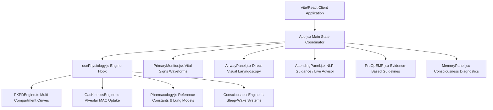
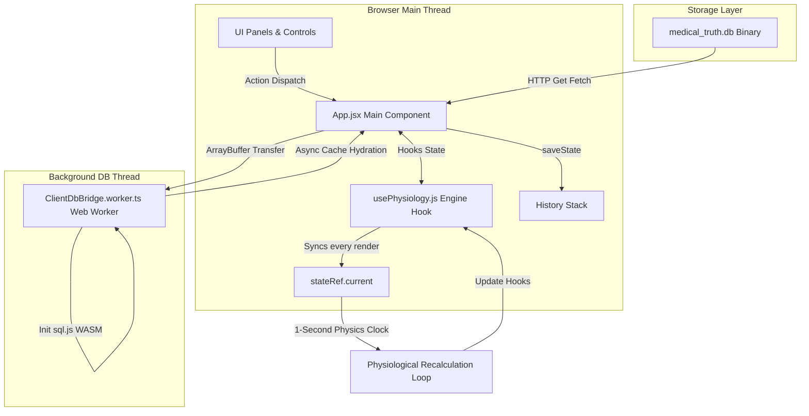

# Clinical Anesthesia & Physiological Airway Simulator: Golden Version Ground Truth

This document is the **slim, always-read-first spine** of the simulator's ground-truth documentation set. It used to contain everything in one ~2700-line file; that content has been split across several files so that a chapter-integration session only loads what its content actually touches (see the Document Map below). All section numbers (§N / §N.x) are preserved exactly as they were before the split — a code comment or another doc citing e.g. `§6.21` or `§14.2` still means the same thing, it just lives in a different file now.

If you are starting a new chapter-integration session, also read `CLAUDE.md` (project conventions, symbol index, standing gotchas) — it is the other always-read-first file.

---

## Document Map

| File | Contents | When to read it |
| :--- | :--- | :--- |
| **`goldenversion.md`** (this file) | TOC, STAGE 1 (architecture/runtime/DB schema, §1-3), STAGE 4 (compilation blueprint, §11-13), and a pointer index for everything else. | Every session, first. |
| **`CLAUDE.md`** | Project conventions, symbol-indexed "where things live" map, standing gotchas, verification commands. | Every session, first. |
| **`docs/engines/physiology.md`** | §4 — cardiovascular, respiratory, cerebral, GI, hepatic, renal engine formulas. | Only if this session's content touches one of those physiological systems. |
| **`docs/engines/pharmacology.md`** | §5 — PK/PD model, receptor pharmacodynamics, the full medication data table, inhalational gas kinetics, TCI models. | Only if this session adds/modifies a drug, dose, or PK/PD parameter. |
| **`docs/engines/clinical_events.md`** | §6 — all 84 intraoperative crisis triggers/clinical scenario loops (laryngospasm, MH, LAST, anaphylaxis, etc.). | Only if this session adds or touches an intraoperative crisis/event trigger. |
| **`docs/state_tree.md`** | §8 — the complete patient/vitals/app state tree (every flag that exists today) + §10 constraints/edge cases. | Almost every session — check this before adding a new patient flag, to avoid duplicating one that already exists. |
| **`docs/ingestion_pipeline.md`** | §9 — the textbook RAG/ingestion pipeline (`src/knowledge/`). | Essentially never for a chapter session — every chapter prompt already says not to touch `src/knowledge/`. |
| **`docs/chapters/*.md`** | §14+ — one file per chapter (or chapter-group), the historical "what we did and why" record. | Only if you need a specific past chapter's detailed rationale — you do not need to read these to add a new chapter. |
| **`walkthrough.md`** | Ephemeral scratch notes for whichever chapter session is currently in progress. Safe to overwrite at the start of a new session — its content gets absorbed into `docs/chapters/chXX.md` once a session's work is durable. | Only relevant mid-session for the agent that wrote it. |

---

## Table of Contents
1.  **STAGE 1: SYSTEM ARCHITECTURE, RUNTIME FLOW & TECH STACK**
    *   [1. High-Level Architecture](#1-high-level-architecture)
        *   [1.1 Technical Stack Specifications](#11-technical-stack-specifications)
        *   [1.2 Component Coordination & Data Flow](#12-component-coordination--data-flow)
        *   [1.3 Communication Pipelines & Execution Loops](#13-communication-pipelines--execution-loops)
        *   [1.4 State Lifecycle & The Engine Clock Bridge](#14-state-lifecycle--the-engine-clock-bridge)
    *   [2. Component & Runtime Lifecycle](#2-component--runtime-lifecycle)
        *   [2.1 Initialization Sequence (Step-by-Step)](#21-initialization-sequence-step-by-step)
        *   [2.2 User Action Interruption & Loop Injection](#22-user-action-interruption--loop-injection)
    *   [3. Complete Database & Schema Map](#3-complete-database--schema-map)
        *   [3.1 SQLite Database Schema Structure](#31-sqlite-database-schema-structure)
        *   [3.2 Representation of Ingested Textbook Data](#32-representation-of-ingested-textbook-data)
2.  **STAGE 2: THE CORE LOGIC ENGINES & ALGORITHMIC FRAMEWORKS** — *moved to `docs/engines/`, see Document Map*
    *   [4. Pathophysiology & Vital Signs Engine](#4-pathophysiology--vital-signs-engine) — `docs/engines/physiology.md`
    *   [5. Pharmacology (PK/PD) Engine](#5-pharmacology-pkpd-engine) — `docs/engines/pharmacology.md`
    *   [6. Event Trigger, Clinical Scenarios & Workflow Engine](#6-event-trigger-clinical-scenarios--workflow-engine) — `docs/engines/clinical_events.md`
    *   [7. Attending Direct Chat, Advisor & NLP Engine](#7-attending-direct-chat-advisor--nlp-engine)
        *   [7.1 Automated Guidance Evaluator](#71-automated-guidance-evaluator)
        *   [7.2 Conversational NLP Chat Portal](#72-conversational-nlp-chat-portal)
3.  **STAGE 3: STATE MANAGEMENT, INGESTION PIPELINES, & BOUNDARY CONDITIONS** — *moved, see Document Map*
    *   [8. Full Application State Tree](#8-full-application-state-tree) — `docs/state_tree.md`
    *   [9. Data Ingestion & Indexing Pipeline](#9-data-ingestion--indexing-pipeline) — `docs/ingestion_pipeline.md`
    *   [10. Constraints & Edge Cases](#10-constraints--edge-cases) — `docs/state_tree.md`
4.  **STAGE 4: COMPREHENSIVE COMPILATION, CODE BLUEPRINT & INTEGRITY CHECK**
    *   [11. Crucial Code Files & System Responsibilities](#11-crucial-code-files--system-responsibilities)
    *   [12. Architectural Dependency Analysis: Hardcoded vs. Dynamic Textbook Data](#12-architectural-dependency-analysis-hardcoded-vs-dynamic-textbook-data)
    *   [13. Integrity & Compliance Verification Statement](#13-integrity--compliance-verification-statement)
5.  **STAGE 5: CONTINUITY OF CARE, OUTCOME SCORING & PER-CHAPTER LEDGER** — *moved to `docs/chapters/`, see Document Map*
    *   [14. Outcome Scoring, PACU Readiness & the Clinical Knowledge Layer (Ch9-30 Retroactive Sweep)](docs/chapters/ch09-30_retroactive_sweep.md)
    *   [15. Chapter 31 — Preoperative Evaluation](docs/chapters/ch31.md)
    *   [16. Chapter 32 — Anesthetic Implications of Concurrent Diseases](docs/chapters/ch32.md)
    *   [17. Chapter 33 — Complementary and Alternative Therapies](docs/chapters/ch33.md)
    *   [18. Chapter 34 — Patient Positioning and Associated Risks](docs/chapters/ch34.md)
    *   [19. Chapter 35 — Neuromuscular Disorders, Malignant Hyperthermia, and Other Genetic Disorders](docs/chapters/ch35.md)
    *   [20. Chapter 36 — Cardiovascular Monitoring](docs/chapters/ch36.md)
    *   [21. Physics-Grounded Waveform Redesign (Cross-Cutting)](docs/chapters/physics_redesign_waveforms.md)

---

## STAGE 1: SYSTEM ARCHITECTURE, RUNTIME FLOW & TECH STACK

### 1. High-Level Architecture

The simulator is a high-fidelity, real-time clinical training application representing physiological, pharmacological, and neuro-cognitive responses during general anesthesia induction.

#### 1.1 Technical Stack Specifications
*   **Frontend Framework**: React 19.2 (using Vite 8.0 as the build system and development server).
*   **Styling & UI Design**: Glassmorphic, dark-mode medical instrumentation UI styled with Vanilla CSS custom grids and integrated with Tailwind CSS 4.2.
*   **Database Engines**: 
    *   *Backend / Build Time*: SQLite database (`medical_truth.db`) managed via `better-sqlite3` (v12.10) for raw clinical text/matrix ingestion.
    *   *Client Runtime / Browser*: In-memory WebAssembly-based SQLite interface via `sql.js` (v1.12), ensuring driver and query syntax parity across both environments.
*   **Web Workers**: A dedicated HTML5 Web Worker (`ClientDbBridge.worker.ts`) is leveraged in the browser to compile, load, and query the SQLite database off the main UI thread.
*   **State Management**: React component local state hooks (`useState`) coupled with a custom React hook (`usePhysiology.js`) that manages the physics engine state. 
*   **History & Undo**: A serialization layer built in `App.jsx` deep-copies the application and engine states before executing user actions, maintaining a chronological history stack for undo operations.

#### 1.2 Component Coordination & Data Flow


#### 1.3 Communication Pipelines & Execution Loops
The system's data pipeline is split between asynchronous assets loading, user action injection, and a synchronous physiological execution clock:



*   **Database Ingestion & Hydration Pipeline**:
    1. During boot, the application fetches the static binary `/medical_truth.db` from the client-facing storage layer.
    2. The binary buffer is transferred directly to the Web Worker via Transferable Objects (`postMessage({ type: 'init', payload: { buffer } }, [buffer])`) to avoid copying memory across threads.
    3. The worker instantiates `sql.js`, loads the buffer, and runs initial queries to extract prose and matrix records.
    4. Hydrated arrays are returned to the main thread, where `ClientDbBridge.ts` caches them locally and triggers registered callbacks, automatically instantiating the registries.

#### 1.4 State Lifecycle & The Engine Clock Bridge
The simulator operates on a synchronous **1-second (1000ms) interval clock** instantiated within the `usePhysiology.js` custom hook. To prevent stale React state closures during rapid physical iterations without forcing interval resets, a specialized **State Bridge Ref Pattern** (`stateRef`) is utilized.

```javascript
// The Physics Engine State Bridge.
const stateRef = useRef({ time, vitals, targetVitals, patient, activeMeds, gasModels, intravascularVolume, electrolytes, ventSettings, gasSettings, surgicalPhase, msmaidsComplete });

useEffect(() => {
  stateRef.current = { time, vitals, targetVitals, patient, activeMeds, gasModels, intravascularVolume, electrolytes, ventSettings, gasSettings, surgicalPhase, msmaidsComplete };
});
```
Every clock tick, the simulator extracts parameters from `stateRef.current`, executes physiological mathematical adjustments, modifies target thresholds, calculates compartmental PK/PD decay, and updates state hooks accordingly.

---

### 2. Component & Runtime Lifecycle

#### 2.1 Initialization Sequence (Step-by-Step)
1.  **Boot & Script Ingestion**:
    *   Browser loads `main.jsx`, mounting the main `<App />` component.
    *   Static import of `ClientDbBridge` automatically executes `ClientDbBridge.init()`.
2.  **Driver Initialization & Hydration**:
    *   *Browser*: Spawns the database worker thread, downloads `medical_truth.db`, initializes the WASM-based SQLite driver, and populates main thread cache structures (`allProse`, `allMatrices`).
    *   *Node/Vitest*: Performs a direct import of `store.ts` and loads `KnowledgeStore` synchronously.
    *   Caches are sorted using `comparePriority()`.
    *   `ClientDbBridge.onLoaded` fires, causing the registries to parse textbook schemas and register medications/procedures.
3.  **AETHERIS Boot & Splash State**:
    *   On boot, the application mounts with `splashState = 'splash'`, rendering a centered, large version of the 'Continuous Circuit' circular vector logo, the capitalized logo text "AETHERIS", and the subtitle "ADVANCED CLINICAL SIMULATION PLATFORM".
    *   At the bottom, three navigation button triggers map to core states:
        *   **Clinical Specialty Presets**: Triggers the brand transition, scaling/translating the logo to the top-left and mounting the preset selection tab.
        *   **High-Fidelity Customizer**: Triggers the brand transition, scaling/translating the logo to the top-left and mounting the custom simulation builder.
        *   **Wing It**: Immediately selects a random preset, bypasses the EMR/Briefing UI, builds the physiological case, and starts the simulation directly.
    *   **The Brand Transition**: Any menu selection triggers a fluid layout animation where the central branding text/subtitle fades out, and the logo smoothly scales down and translates into the top-left corner.
    *   **Active Simulation Header**: In the active simulation view, the Aetheris logo sits permanently in the top-left header bar of `PatientHeader.jsx` immediately beside the procedure name.
4.  **Parameter Calculation & Patient Instantiation**:
    *   `startCase` calculates body descriptors based on baseline patient stats:
        *   **Ideal Body Weight (IBW)**:
            $$IBW_{\text{male}} = 50.0 + 2.3 \cdot \left(\frac{\text{Height [cm]}}{2.54} - 60\right)$$
            $$IBW_{\text{female}} = 45.5 + 2.3 \cdot \left(\frac{\text{Height [cm]}}{2.54} - 60\right)$$
        *   **Lean Body Weight (LBW) / Janmahasatian FFM**:
            $$LBW_{\text{male}} = \frac{9270 \cdot \text{Weight [kg]}}{6680 + 216 \cdot BMI}$$
            $$LBW_{\text{female}} = \frac{9270 \cdot \text{Weight [kg]}}{8780 + 244 \cdot BMI}$$
        *   **Hume Lean Body Mass (LBM)** (James formula variation):
            $$LBM_{\text{male}} = 1.10 \cdot Weight - 128.0 \cdot \left(\frac{Weight}{Height}\right)^2$$
            $$LBM_{\text{female}} = 1.07 \cdot Weight - 148.0 \cdot \left(\frac{Weight}{Height}\right)^2$$
        *   **Corrected Body Weight (CBW)**:
            $$CBW = IBW + 0.4 \cdot (Weight - IBW)$$
        *   **Modified Fat-Free Mass (MFFM)**:
            $$MFFM = FFM + 0.4 \cdot (Weight - FFM)$$
        *   **Pharmacokinetic Mass (PKM)** (Shibutani Fentanyl mass formula):
            $$PKM = \frac{52.0}{1.0 + \frac{196.4 \cdot e^{-0.025 \cdot Weight} - 53.66}{100}}$$
        *   **Estimated Blood Volume (EBV)**: Calculated based on patient sex (65 mL/kg for females, 75 mL/kg for males) multiplied by total weight.
        *   **Predicted Lung Volumes**: TLC, FRC, RV, FVC, and FEV1 are calculated using ECCS/ERS 1993 formulas, scaled exponentially based on position, restrictive/obstructive disease, and obesity factors.
5.  **State Hook Initialization**:
    *   Initial vitals (Heart Rate, SBP, DBP, $SpO_2$, $EtCO_2$) are pushed to the hooks.
    *   Baseline MAP is initialized:
        $$MAP = DBP + \frac{SBP - DBP}{3}$$
    *   Active medication list is cleared, surgical phase is reset to `Pre-Op`, and inhalational gas models are generated.
    *   The execution loop is set to running (`isRunning = true`).

#### 2.2 User Action Interruption & Loop Injection
When a user executes a clinical action (e.g., injecting a drug, changing mechanical ventilation parameters, or performing airway maneuvers):
1.  **State Serialization (Undo Stack)**:
    *   `saveState()` is called to serialise current client configurations and invoke `createSnapshot()` on the physiological engine.
    *   The snapshots are appended to the `history` array.
2.  **State Injection**:
    *   The UI handler calls the state setter (e.g., `setVentSettings`, `pushMed`, `setPatient`).
    *   React pushes these updates into its queue.
3.  **Ref Synchronization**:
    *   As soon as React applies the state updates, the `useEffect` hooks trigger and update `stateRef.current` with the new values.
4.  **Engine Recalculation**:
    *   On the next 1-second interval tick, the physiology loop reads from `stateRef.current`, incorporating the user-modified parameters directly into the mathematical differential equations.

---

### 3. Complete Database & Schema Map

#### 3.1 SQLite Database Schema Structure
The `medical_truth.db` database contains two primary tables storing prose and structured data parsed from medical textbooks:

##### Table 1: `textbook_prose`
*   **Columns**:
    *   `id`: `TEXT PRIMARY KEY` (Unique alphanumeric string identifier).
    *   `topic`: `TEXT` (The clinical topic or chapter subheading, e.g. "Succinylcholine").
    *   `body_text`: `TEXT` (Unabridged parsed string containing the raw text content).
    *   `source_book`: `TEXT` (Source filename tracking provenance, e.g. "Millers_Anesthesia_9th_Ed.pdf").
    *   `edition`: `INTEGER` (Textbook edition number).
    *   `priority_rank`: `INTEGER` (Computed rank indicating authority level).
    *   `is_authoritative`: `INTEGER DEFAULT 0` (Flag marking if the row is the winner of the priority resolution algorithm).
*   **Indexes**:
    *   `idx_prose_source_book` ON `textbook_prose (source_book)`
    *   `idx_prose_topic` ON `textbook_prose (topic)`

##### Table 2: `physiological_matrices`
*   **Columns**:
    *   `id`: `TEXT PRIMARY KEY` (Unique alphanumeric string identifier).
    *   `topic`: `TEXT` (Subsystem or category name).
    *   `archetype`: `TEXT` (Data format category, e.g. "COORDINATE X-Y GRAPHS").
    *   `caption`: `TEXT` (Descriptive legend of the table or chart).
    *   `structured_payload`: `TEXT` (Hierarchical JSON string containing the data array).
    *   `source_book`: `TEXT` (Source filename tracking provenance).
    *   `edition`: `INTEGER` (Textbook edition number).
    *   `priority_rank`: `INTEGER` (Computed rank indicating authority level).
    *   `is_authoritative`: `INTEGER DEFAULT 0` (Flag marking if the row is the winner of the priority resolution algorithm).
*   **Indexes**:
    *   `idx_matrices_source_book` ON `physiological_matrices (source_book)`
    *   `idx_matrices_topic` ON `physiological_matrices (topic)`

#### 3.2 Representation of Ingested Textbook Data
*   **Textbook Prose Representation**: Prose chapters are broken down into logical paragraphs or subheadings. Each section is stored as a row in `textbook_prose`. Mathematical rules are extracted dynamically from these rows by `extractTextbookRules()`.
*   **Tabular & Flowchart Representation**: Tables are parsed and stored as structured rows inside the JSON `structured_payload` of a `physiological_matrices` record. Flowcharts or procedural steps are stored in `structured_payload` with the `TIMELINE_STEP_CHART_HYPNOGRAM` archetype.
*   **Textbook Priority Hierarchy & Authority Resolution**:
    To handle conflicts between overlapping sources or editions, the database executes a strict hierarchy resolution query when `recalculateAuthority()` is invoked:
    $$\text{Rank}_{\text{Miller}} = 1000 + \text{Edition}$$
    $$\text{Rank}_{\text{Other}} = 100 + \text{Edition}$$
    A window function groups records by `topic` and assigns `is_authoritative = 1` to the record with the highest rank. Only authoritative rows are queried at runtime.

---

## STAGE 2: THE CORE LOGIC ENGINES & ALGORITHMIC FRAMEWORKS

### 4. Pathophysiology & Vital Signs Engine

**→ Moved to [`docs/engines/physiology.md`](docs/engines/physiology.md).** Covers §4.1-4.13: cardiovascular/hemodynamic physiology, myocardial ischemia, cardiac arrest/resuscitation, defibrillation, respiratory volumes/mechanics, alveolar ventilation/apnea kinetics, blood-gas exchange, pulse oximetry, cerebral physiology/ICP, gastrointestinal physiology, hepatic physiology (Child-Pugh/MELD), and renal physiology (GFR/AKI staging). Read this file if your chapter touches any of those systems.

### 5. Pharmacology (PK/PD) Engine

**→ Moved to [`docs/engines/pharmacology.md`](docs/engines/pharmacology.md).** Covers §5.1-5.20: the mammillary compartment PK model, receptor pharmacodynamics, neuromuscular blockade/TOF physics, the full high-fidelity medication data table (every drug's PK/PD parameters), inhalational gas kinetics, molecular mechanisms of inhaled anesthetics, IV anesthetic receptor profiles, opioid/naloxone pharmacology, nonopioid pain medications, and TCI/target-controlled infusion models. Read this file if your chapter adds, modifies, or cites the PK/PD of any drug.

### 6. Event Trigger, Clinical Scenarios & Workflow Engine

**→ Moved to [`docs/engines/clinical_events.md`](docs/engines/clinical_events.md).** Covers §6.1-6.84: all 84 documented intraoperative crisis triggers and clinical scenario loops, from the MSMAIDS pre-induction checklist through laryngospasm, anaphylaxis, LAST, malignant hyperthermia, and periodic paralysis channelopathies. Read this file if your chapter introduces a new crisis/event trigger, or if you need to check whether a given clinical scenario is already modeled before adding it.

### 7. Attending Direct Chat, Advisor & NLP Engine

The simulator incorporates an interactive **Attending Physician AI Engine** combining real-time physiological diagnostics with an active natural language processing (NLP) chat portal.

#### 7.1 Automated Guidance Evaluator (`AttendingEngine.js`)
Every clock tick, the advisor checks the simulator parameters to offer actionable suggestions:
*   *Vitals Watch*: Flags severe hypotension ($MAP < 60\text{ mmHg}$), severe hypoxemia ($SpO_2 < 90\%$), or profound bradycardia.
*   *Timeline Compliance*: Checks if MSMAIDS is bypassed or incomplete under non-emergent timelines.
*   *NMB Monitoring*: Flags attempting intubation without muscle relaxation (TOF 4/4) or warning of succinylcholine hyperkalemia risks.

#### 7.2 Conversational NLP Chat Portal (`ClinicalAiChat.js`)
The chat panel exposes a premium chat interface where users submit free-form questions. The response generator uses active simulator state values to formulate advice:
1.  **State-Driven Diagnostics**: Querying *"Why is the blood pressure low?"* evaluates current active vasoactive medications, Propofol effect-site concentration, and systemic vascular resistance ($SVR$), identifying if the hypotension is venodilative (Propofol-induced) or hemorrhagic.
2.  **Click-to-Execute Action Badges**: Attending responses are parsed by `parseAndRenderText` which extracts specific keywords (e.g. `epinephrine`, `rocuronium`, `suction airway`, `review chart`, `live labs`) and transforms them into active clinical button badges. Clicking a badge executes the procedure or panel transition directly in the UI.

---

## STAGE 3: STATE MANAGEMENT, INGESTION PIPELINES, & BOUNDARY CONDITIONS

### 8. Full Application State Tree

**→ Moved to [`docs/state_tree.md`](docs/state_tree.md).** The exact variables, structures, and data types stored in `App.jsx`'s state hooks and `usePhysiology.js`'s `stateRef.current` bridge — i.e. every patient/vitals/app flag that currently exists. **Check this file before adding a new patient flag**, to avoid duplicating one that already represents the same concept under a different name.

### 9. Data Ingestion & Indexing Pipeline

**→ Moved to [`docs/ingestion_pipeline.md`](docs/ingestion_pipeline.md).** Covers how `src/knowledge/` parses textbooks into runtime rules at boot. Chapter-integration sessions are explicitly scoped to never touch `src/knowledge/`, so this file is essentially never needed for a chapter session — kept for the rare session that does work on the ingestion pipeline itself.

### 10. Constraints & Edge Cases

**→ Moved to [`docs/state_tree.md`](docs/state_tree.md)** (appended after §8, since most constraints are about state/physiology simplifications). Covers known simplifications: 1-second tick resolution, history-stack memory growth, textbook-rule-parser ambiguity, unmodeled complications, single-step chelation, sleep-stage transition granularity, loop-gain numerical stability, Monro-Kellie elastance uniformity, cerebral steal approximation, NMJ receptor-subtype simplification, Phase II block as a binary step, single-alveolus FRC modeling, lumped coronary anatomy, single-cavity GI gas modeling, and lumped hepatic blood flow.

---

## STAGE 4: COMPREHENSIVE COMPILATION, CODE BLUEPRINT & INTEGRITY CHECK

### 11. Crucial Code Files & System Responsibilities

1.  [`App.jsx`](file:///Users/jsriverab/.gemini/antigravity/scratch/airway-sim/src/App.jsx): Main coordinator of state. Orchestrates modal toggles, snap/restore, pre-op staging, and timeline phase locks.
2.  [`usePhysiology.js`](file:///Users/jsriverab/.gemini/antigravity/scratch/airway-sim/src/engine/usePhysiology.js): Central mathematical simulation thread. Drives gas kinetics, fluid volumes, hemodynamic changes, active Morphine metabolites (M3G/M6G) kinetics and neuroexcitatory/respiratory dynamics, combined Sphincter of Oddi spasm stimulation, GOSRD synergistic respiratory depression, Carbamazepine dyscrasia agranulocytosis sepsis, Oxcarbazepine hyponatremia water retention, and timeline auto-advancements.
3.  [`ConsciousnessEngine.ts`](file:///Users/jsriverab/.gemini/antigravity/scratch/airway-sim/src/engine/ConsciousnessEngine.ts): Specialized sleep-wake nuclei, connectivity pathway, receptor binding, and memory system sub-engine.
4.  [`Pharmacology.js`](file:///Users/jsriverab/.gemini/antigravity/scratch/airway-sim/src/engine/Pharmacology.js): Library defining all reference data and drug metabolic rates. `calculateLungVolumes()` is a thin wrapper delegating to the single canonical implementation in `RespiratoryEngine.ts`. `calculateDermatomalBlockFraction()` is the shared dermatomal regional-block coverage helper consumed by `CardiovascularEngine.ts` and `GastrointestinalEngine.ts`. `calculateLink25GasMixture()` implements the Link-25 proportioning system and oxygen supply failure protection device, consumed by `usePhysiology.js`.
5.  [`ClinicalAiChat.js`](file:///Users/jsriverab/.gemini/antigravity/scratch/airway-sim/src/engine/ClinicalAiChat.js): Natural language state evaluator and response compiler for the Attending chat window.
6.  [`CaseManager.jsx`](file:///Users/jsriverab/.gemini/antigravity/scratch/airway-sim/src/components/controls/CaseManager.jsx): Controls preset clinical scenarios and hosts the customized physiology builder interface.
7.  [`ActionPanel.jsx`](file:///Users/jsriverab/.gemini/antigravity/scratch/airway-sim/src/components/controls/ActionPanel.jsx): Primary intervention console hosting surgical timeline locks, positioning, and ACLS maneuvers.
8.  [`AirwayPanel.jsx`](file:///Users/jsriverab/.gemini/antigravity/scratch/airway-sim/src/components/controls/AirwayPanel.jsx): Renders glottic laryngoscopy viewpoints and handles direct mechanical instrumentation.
9.  [`MemoryPanel.jsx`](file:///Users/jsriverab/.gemini/antigravity/scratch/airway-sim/src/components/controls/MemoryPanel.jsx): Overlay panel showing subcortical activities, connectivities, memory states, and fear memory retrieval triggers. Also hosts the Neuromuscular Transmission (TOF) monitor, including the Quantitative (AMG)/Qualitative (Manual PNS) monitoring-mode toggle and its perceived-vs-true fade display (§5.7).
10. [`AttendingPanel.jsx`](file:///Users/jsriverab/.gemini/antigravity/scratch/airway-sim/src/components/controls/AttendingPanel.jsx): Dual-tab sidebar panel hosting the automatic clinical monitor and conversational chat.
11. [`HepaticEngine.ts`](file:///Users/jsriverab/.gemini/antigravity/scratch/airway-sim/src/engine/HepaticEngine.ts): Pure physical sub-engine coordinating liver perfusion, portal blood flow, HVPG dynamics, hepatorenal AKI, and PoPH-induced right heart overload.
12. [`RenalEngine.ts`](file:///Users/jsriverab/.gemini/antigravity/scratch/airway-sim/src/engine/RenalEngine.ts): Pure physical sub-engine coordinating renal perfusion pressure, GFR/RBF autoregulation, bladder volume accumulation, drainage via Foley catheterization, ADH/aldosterone/Angiotensin II (RAAS) loops, loop/osmotic diuretics, BUN/creatinine kinetics, and KDIGO AKI staging.
13. [`CardiovascularEngine.ts`](file:///Users/jsriverab/.gemini/antigravity/scratch/airway-sim/src/engine/CardiovascularEngine.ts): Pure physical sub-engine coordinating hemodynamics, Frank-Starling/LVEDP mechanics, myocardial ischemia (with KATP-channel anesthetic preconditioning), arrest/resuscitation, autonomic reflexes, neurohormonal (vasopressin/Angiotensin II) cardiac support, fixed-orifice Aortic Stenosis physiology, Ziconotide-induced postural hypotension blunting SVR/MAP, and dermatomally-graded splanchnic sympathetic blockade.
14. [`GastrointestinalEngine.ts`](file:///Users/jsriverab/.gemini/antigravity/scratch/airway-sim/src/engine/GastrointestinalEngine.ts): Pure physical sub-engine coordinating LES tone, intragastric pressure/regurgitation-aspiration triggers, N2O bowel gas expansion, and gut motility/postoperative ileus (opioid, sympathetic-stress, direct volatile, and dermatomally-graded regional-block pathways).
15. [`CerebralEngine.ts`](file:///Users/jsriverab/.gemini/antigravity/scratch/airway-sim/src/engine/CerebralEngine.ts): Pure physical sub-engine coordinating CBF/CMRO2 autoregulation and coupling, CO2 reactivity, Monro-Kellie ICP elastance, and focal cerebral ischemia neuronal injury with TREK-1-mediated (Xenon/Sevoflurane) neuroprotection.
16. [`GasKineticsEngine.ts`](file:///Users/jsriverab/.gemini/antigravity/scratch/airway-sim/src/engine/GasKineticsEngine.ts): Multi-compartment (VRG/Muscle/Fat) inhalational anesthetic uptake/distribution physics engine — alveolar gas equation, concentration/second-gas effects, Riley shunt admixing, BBB effect-site delay. A stale duplicate `GasKineticsEngine.js` (silently shadowing this canonical `.ts` file in module resolution) was removed during the Ch20 audit — see §12.
17. [`PKPDEngine.ts`](file:///Users/jsriverab/.gemini/antigravity/scratch/airway-sim/src/engine/PKPDEngine.ts): Pure physical sub-engine coordinating multi-compartment pharmacokinetics (Euler integration, Dynamic V1, CSHT, and CSDT80 fits) and receptor-level pharmacodynamics (Emax Hill equations, receptor chronotropic/vasomotor coupling, and age-dependent sensitivity adjustments).
18. [`PreOpEMR.jsx`](file:///Users/jsriverab/.gemini/antigravity/scratch/airway-sim/src/components/modals/PreOpEMR.jsx): Interactive clinical pre-operative evaluation wizard. Summarizes patient history, calculates pre-op risk scores (RCRI, METs, ASA), predicted spirometry, and displays textbook-derived dosing weight scalars (LBM, FFM, CBW, MFFM, PKM) from Chapter 18. Exports a standalone, unit-tested `calculateRcriFactors()` implementing the 6-criteria Revised Cardiac Risk Index (§6.80) from Chapter 30. Also exports Ch31 (§15) functions: `classifyBmi()` (Table 31.3), `calculateDasiMets()`/`DASI_ITEMS` (Duke Activity Status Index, Table 31.2), `assessAirwayExamBox311()` (Box 31.1 concerning thresholds), `calculateCha2ds2VascScore()`, and `calculateAnticoagulationPlan()` (perioperative aspirin/warfarin/DOAC management). Also exports Ch32 (§16) functions: `calculateStopBangScore()`/`STOP_BANG_ITEMS` (OSA risk), `calculateChronicMedicationManagementPlan()` (HTN/statin continuation), and `assessPheoBlockadeAdequacy()` (pheochromocytoma blockade groundwork).
19. [`PainEngine.ts`](file:///Users/jsriverab/.gemini/antigravity/scratch/airway-sim/src/engine/PainEngine.ts): Pure physical sub-engine coordinating nociceptive inputs, response-surface analgesia blunting, MAC-BAR suppression, and nonopioid sparing factors (§5.19).
20. [`OutcomeScoringEngine.ts`](file:///Users/jsriverab/.gemini/antigravity/scratch/airway-sim/src/engine/OutcomeScoringEngine.ts): Pure, headless engine defining the structured `QualityEvent` record, `scoreQualityEvents()` outcome-score aggregation, and `calculatePacuReadiness()` Aldrete-style PACU readiness scoring (§14).
21. [`CAMKnowledgeEngine.ts`](file:///Users/jsriverab/.gemini/antigravity/scratch/airway-sim/src/engine/CAMKnowledgeEngine.ts): Pure data layer for Ch33 herbal/dietary/CAM-therapy knowledge — `HERBAL_MEDICINES`, `DIETARY_SUPPLEMENTS`, `CAM_THERAPIES`, `assessHerbalRisks()`, `getDiscontinuationGuidance()` (§17).
22. [`PositioningKnowledgeEngine.ts`](file:///Users/jsriverab/.gemini/antigravity/scratch/airway-sim/src/engine/PositioningKnowledgeEngine.ts): Pure data layer for Ch34 surgical-positioning knowledge — `POSITIONS_DATA`, `NERVES_DATA`, `POVL_DATA`, `PROCEDURAL_GROUNDWORK`, `checkPovlRisk()` (§18).

---

### 12. Architectural Dependency Analysis: Hardcoded vs. Dynamic Textbook Data

To establish clinical enhancements, it is necessary to identify where the current codebase bypasses the ingested textbook database in favor of hardcoded defaults or static approximations. The following highlights these functional dependencies:

| Engine / Subsystem | Current Codebase Implementation | Database Ingested Dependency | Discrepancy & Limitations |
| :--- | :--- | :--- | :--- |
| **Airway Anatomy & Cormack-Lehane Grade** | Hardcoded Mallampati integer logic with static positioning/obesity offsets in [ProceduralEngine.ts](file:///Users/jsriverab/.gemini/antigravity/scratch/airway-sim/src/engine/ProceduralEngine.ts#L24-L63). | None. | Grade view shifts are simplified integers ($+1, -2$), ignoring physiological distributions, anatomical variation, and dynamic laryngoscope force. |
| **Medication Pharmacokinetic (PK) Catalog** | Hardcoded profile matrices in [Pharmacology.js](file:///Users/jsriverab/.gemini/antigravity/scratch/airway-sim/src/engine/Pharmacology.js) and [meds.config.ts](file:///Users/jsriverab/.gemini/antigravity/scratch/airway-sim/src/engine/config/meds.config.ts). | Dynamic overrides parsed by [DynamicMedicationRegistry.ts](file:///Users/jsriverab/.gemini/antigravity/scratch/airway-sim/src/knowledge/DynamicMedicationRegistry.ts). | If dynamic ingestion fails or a parsed drug is missing parameter fields, the engine silently falls back to hardcoded averages, masking potential clinical discrepancies. |
| **Procedural Safety Checklists** | Hardcoded checklists in [DynamicProceduralRegistry.ts](file:///Users/jsriverab/.gemini/antigravity/scratch/airway-sim/src/knowledge/DynamicProceduralRegistry.ts#L225-L279). | Numbered steps extracted from textbook prose records. | Standard checklists (RSI, Awake Fiberoptic) are baseline hardcoded stubs. They override dynamic extraction to ensure baseline safety, ignoring textbook variations. |
| **Alveolar Gas & Mixed Venous Oxygen** | Hardcoded A-a gradient base factor ($\frac{\text{Age}}{4} + 4$) and metabolic consumption rates ($VO_2 = 250\text{ mL/min}$) in [RespiratoryEngine.ts](file:///Users/jsriverab/.gemini/antigravity/scratch/airway-sim/src/engine/RespiratoryEngine.ts#L571-L612). | None. | Oxygen consumption is treated as a static constant adjusted only by metabolic multipliers. Mixed venous return fails to model dynamic cellular respiration changes. |
| **Vasoactive Chronotropic & Vasomotor Scaling** | Hardcoded receptor-to-effector scaling factors (e.g. SVR multiplier increases by $\alpha_1 \cdot 0.25$ and $V_1 \cdot 0.30$) in [PKPDEngine.ts](file:///Users/jsriverab/.gemini/antigravity/scratch/airway-sim/src/engine/PKPDEngine.ts#L283-L305). | None. | Receptor-effector coefficients are hardcoded approximations. The simulator does not scale cardiovascular responses based on patient-specific receptor densities or mutations. |
| **Thermoregulation & Cooling Rates** | Hardcoded cooling constants ($0.0008^{\circ}\text{C/s}$ under volatile gas) and fluid cooling weights ($0.07$ and $0.05$) in [usePhysiology.js](file:///Users/jsriverab/.gemini/antigravity/scratch/airway-sim/src/engine/usePhysiology.js#L1133-L1149). | None. | Thermodynamic parameters are hardcoded rates. The engine does not evaluate patient body surface area or ambient room temperature. |
| **Upper Airway Patency & Collapse** | Hardcoded Mallampati integer logic with static positioning/obesity offsets in [ProceduralEngine.ts](file:///Users/jsriverab/.gemini/antigravity/scratch/airway-sim/src/engine/ProceduralEngine.ts#L24-L63). | None. | Grade view shifts are simplified integers ($+1, -2$), ignoring physiological distributions, anatomical variation, and dynamic laryngoscope force. |
| **Loop Gain & CSR Oscillations** | Static respiratory response curves in [RespiratoryEngine.ts](file:///Users/jsriverab/.gemini/antigravity/scratch/airway-sim/src/engine/RespiratoryEngine.ts). | None. | Loop gain components are not dynamically simulated. Cheyne-Stokes respiration is unmodeled, preventing the assessment of periodic hypoxemia under low cardiac output. |
| **Desflurane Paradoxical Airway Resistance Increase** | Desflurane's own end-tidal concentration now raises total airway resistance (up to $+26\%$ at 1.5 MAC-equivalent) instead of bronchodilating like other volatiles, in [RespiratoryEngine.ts](file:///Users/jsriverab/.gemini/antigravity/scratch/airway-sim/src/engine/RespiratoryEngine.ts) (§4.6/§6.73). | Chapter 21, p.543 (randomized clinical trial, end-inspiratory occlusion technique: desflurane caused a maximum increase in R(rs) by 26% at 1.5 MAC, no significant effect at 1.0 MAC). | None. Previously every volatile agent (including desflurane) used the same universal bronchodilation formula with no agent-specific exception for desflurane's density-driven resistance increase. |
| **Sleep Stage Hypnogram & REM Atonia** | Simplified sleep-wake nuclei states inside [ConsciousnessEngine.ts](file:///Users/jsriverab/.gemini/antigravity/scratch/airway-sim/src/engine/ConsciousnessEngine.ts). | None. | Postoperative sleep stages are not tracked. The simulator cannot represent sleep debt accumulation, REM sleep rebound, or postoperative sleep apnea exacerbation. |
| **Cerebral Blood Flow Autoregulation** | CBF is dynamically calculated from CPP with a pressure-passive plateau (LLA 65-70 mmHg, ULA 150 mmHg), volatile-dependent autoregulation attenuation/uncoupling, and linear CO2 reactivity, in [CerebralEngine.ts](file:///Users/jsriverab/.gemini/antigravity/scratch/airway-sim/src/engine/CerebralEngine.ts) (§4.10). | Chapter 11/19. | None. *(Stale entry corrected — this was previously implemented but not reflected here.)* |
| **Intracranial Compliance & ICP** | Exponential volume-pressure elastance model (Monro-Kellie) with `'normal'`/`'impaired'`/`'exhausted'` compliance states, driven by CBV and `intracranialVolumeOffset` (hematoma/edema/tumor), in [CerebralEngine.ts](file:///Users/jsriverab/.gemini/antigravity/scratch/airway-sim/src/engine/CerebralEngine.ts) (§4.10). | Chapter 11. | None. *(Stale entry corrected.)* |
| **Cushing's Reflex** | Bradycardia and SVR surge dynamically triggered when `icp > 20` and `cpp < 50` in [CardiovascularEngine.ts](file:///Users/jsriverab/.gemini/antigravity/scratch/airway-sim/src/engine/CardiovascularEngine.ts) (§6.15). | Chapter 11. | None. *(Stale entry corrected.)* |
| **Focal Cerebral Ischemia: Neuronal Injury & TREK-1 Neuroprotection** | `hasCerebralIschemia` ($CBF<20$) now accumulates a cumulative `neuronalInjury` index proportional to CBF deficit, blunted 50% by Xenon/Sevoflurane (TREK-1 K2P channel activation, abolished by `isTREK1Knockout`) in [CerebralEngine.ts](file:///Users/jsriverab/.gemini/antigravity/scratch/airway-sim/src/engine/CerebralEngine.ts) (§4.10/§6.37). | Chapter 19, p.1537 ("TREK-1 also contributes to the neuroprotective effects of xenon and sevoflurane"). | None. Previously `hasCerebralIschemia` was a stateless boolean alert with no quantitative injury accumulator at all, and a prior `goldenversion.md` draft of §6.37 incorrectly cited the unrelated cardiac myocardial-stunning formula for this cerebral mechanism. |
| **Anesthetic-Induced Cardiac Ischemic Preconditioning (KATP)** | Volatile anesthetics now blunt myocardial stunning accumulation during ischemia, dose-dependently capped at 1 MAC (30% max reduction), in [CardiovascularEngine.ts](file:///Users/jsriverab/.gemini/antigravity/scratch/airway-sim/src/engine/CardiovascularEngine.ts) (§4.3/§6.72). | Chapter 19, p.1709 (anesthetic-induced and ischemic cardiac preconditioning share KATP-channel signaling mechanisms). | None. Previously isoflurane's "Cardioprotective (ischemic preconditioning)" description in `Pharmacology.js` was flavor text with no backing physiology. |
| **Neuromuscular Junction Receptor Subtypes** | Simple occupancy calculations in [usePhysiology.js](file:///Users/jsriverab/.gemini/antigravity/scratch/airway-sim/src/engine/usePhysiology.js). | None. | No distinction between mature, immature, and presynaptic receptor pools. Safety margin and fade are calculated using postjunctional approximations. |
| **Phase II Succinylcholine block** | None. | None. | Succinylcholine exhibits Phase I behavior indefinitely, failing to model fade or desensitization under high/repeated doses. |
| **Neostigmine weakness & ceiling** | None. | None. | Neostigmine reverses neuromuscular blockade linearly without a ceiling limit, and does not model depolarizing weakness from overdose. |
| **Alveolar Atelectasis & Shunt** | Atelectasis dynamically accumulates based on $FiO_2$ ($FiO_2 > 21\%$), paralysis, and obesity factors in [usePhysiology.js](file:///Users/jsriverab/.gemini/antigravity/scratch/airway-sim/src/engine/usePhysiology.js). It alters recruited $FRC$ and $Compliance$, and increases right-to-left shunt fraction ($Q_s/Q_t$). | Chapter 13 (Atelectasis propensity vs. $FiO_2$, Fig 13.20). | None. Implemented with dynamic atelectasis and shunt fraction equations. |
| **Hypoxic Pulmonary Vasoconstriction (HPV)** | Volatile anesthetics inhibit HPV response dose- and agent-dependently: $hpvInhibition = \min(0.90, MAC \cdot 0.25 \cdot hpvPotency_{\text{agent}})$, reproducing 20-30% depression at 1 MAC and 50% at MAC 2 for isoflurane/halothane, while sevoflurane/desflurane (low `hpvPotency`) and IV agents have little-to-no effect, expanding blood flow through hypoxic zones and increasing shunt contribution in [usePhysiology.js](file:///Users/jsriverab/.gemini/antigravity/scratch/airway-sim/src/engine/usePhysiology.js), [Pharmacology.js](file:///Users/jsriverab/.gemini/antigravity/scratch/airway-sim/src/engine/Pharmacology.js) (`INHALATIONAL_AGENTS[*].hpvPotency`), and [RespiratoryEngine.ts](file:///Users/jsriverab/.gemini/antigravity/scratch/airway-sim/src/engine/RespiratoryEngine.ts). | Chapter 13 (Inhaled anesthetics depress HPV 20-30% at 1 MAC, 50% at MAC 2 for older agents; modern volatiles have little effect, Fig 13.22 & p.2348). | None. Implemented with per-agent HPV potency and a corrected dose-response curve. |
| **Anesthesia-Induced FRC Reduction** | `calculateLungVolumes()` applies a further $\times 0.85$ FRC multiplier once the patient is paralyzed or intubated (`isAnesthetized`), independent of the existing postural FRC factor, inside [RespiratoryEngine.ts](file:///Users/jsriverab/.gemini/antigravity/scratch/airway-sim/src/engine/RespiratoryEngine.ts). | Chapter 13 (Fig 13.13: anesthesia induces cranial diaphragm shift and reduced thoracic transverse diameter, further lowering FRC beyond posture alone). | None. Implemented as a distinct, position-independent multiplier. |
| **Dead-Space Pathophysiology (VD/VT) in Obstructive Disease** | Physiologic dead space ($V_D$) is scaled by a `deadSpaceMultiplier` ($1.10\times$ to $2.00\times$) keyed to COPD GOLD stage/asthma severity in [RespiratoryEngine.ts](file:///Users/jsriverab/.gemini/antigravity/scratch/airway-sim/src/engine/RespiratoryEngine.ts); the resulting $V_D/V_T$ ratio is exposed on `RespiratoryOutput.vdVtRatio` and the Vent Monitor UI. | Chapter 13 key point & Table 13.2 (dead space ventilation can rise to >80% of minute ventilation in severe COPD; emphysema scores highest for V/Q mismatch contribution). | None. Implemented with a severity-graded multiplier on the anatomic Radford-nomogram dead space. |
| **Alveolar Recruitment Maneuver** | Sustained airway pressure (PIP/PEEP) \ge 40\text{ cmH2O} for \ge 7\text{ seconds} clears atelectasis completely. Airway pressure \ge 30\text{ cmH2O} initiates gradual opening (decline of $0.08$/tick) in [usePhysiology.js](file:///Users/jsriverab/.gemini/antigravity/scratch/airway-sim/src/engine/usePhysiology.js). High airway pressure (\ge 30\text{ cmH2O}) restricts venous return, scaling stroke volume down to $70\%$ in [CardiovascularEngine.ts](file:///Users/jsriverab/.gemini/antigravity/scratch/airway-sim/src/engine/CardiovascularEngine.ts). | Chapter 13 (Vital capacity maneuver recruitment pressures, Fig 13.19). | None. Implemented with dynamic recruitment timer and venous return preload/SV scaling. |
| **Diastolic Perfusion & LVEDP** | Left ventricular end-diastolic pressure ($LVEDP$) and diastolic cycle duration ($diastoleTimeRatio$) are calculated dynamically based on intravascular volume, heart rate, and contractility, which determines coronary perfusion pressure ($CPP_{\text{coronary}} = DBP - LVEDP$) and myocardial oxygen balance in [CardiovascularEngine.ts](file:///Users/jsriverab/.gemini/antigravity/scratch/airway-sim/src/engine/CardiovascularEngine.ts). | Chapter 13 (Table 13.2 / coronary physiology). | None. Implemented with dynamic LVEDP, DBP - LVEDP perfusion pressure, and diastolic time ratio scaling. |
| **Autonomic Reflexes** | Bezold-Jarisch, Bainbridge, and Oculocardiac reflexes are modeled dynamically, altering heart rate and SVR based on ventricular volume, right atrial pressure (LVEDP), and extraocular traction in [CardiovascularEngine.ts](file:///Users/jsriverab/.gemini/antigravity/scratch/airway-sim/src/engine/CardiovascularEngine.ts). | Chapter 13 / reflex pathways. | None. Implemented with dynamic reflex trigger loops. |
| **Splanchnic Blood Pooling** | Sympathetic block blunts SVR and sequesters 300mL blood volume in splanchnic dilations, reversed by alpha-1 agonists in [CardiovascularEngine.ts](file:///Users/jsriverab/.gemini/antigravity/scratch/airway-sim/src/engine/CardiovascularEngine.ts). | None. | Celiac plexus and thoracic epidural blocks do not cause splanchnic venous dilation, blood volume sequestration, or MAP shifts. |
| **Neurohormonal Cardiac Support (Vasopressin & Angiotensin II)** | `RenalEngine.ts`'s pre-existing `vasopressinLevel`/`aldosteroneLevel` RAAS proxy is extended with an explicit `angiotensinIILevel` intermediate; both vasopressin and angiotensin II feed a direct $+$inotropy/$+$chronotropy term into [CardiovascularEngine.ts](file:///Users/jsriverab/.gemini/antigravity/scratch/airway-sim/src/engine/CardiovascularEngine.ts), wired through `usePhysiology.js`. | Chapter 14, TABLE 14.1 (Actions of Hormones on Cardiac Function). | None. Aldosterone is deliberately excluded from any direct cardiac inotropic/chronotropic effect since Table 14.1's "Cardiac Action" cell for Aldosterone is blank. |
| **Severe Aortic Stenosis: Fixed-Orifice Physiology** | The pre-existing but previously inert `patient.as` case-builder flag now caps `maxSV` (1.10x vs. 1.6x normal), caps the LVEDP visible to the Frank-Starling preload formula at 12 mmHg, and stiffens the LVEDP-volume relationship (1.4x), in [CardiovascularEngine.ts](file:///Users/jsriverab/.gemini/antigravity/scratch/airway-sim/src/engine/CardiovascularEngine.ts). | Chapter 14, Fig 14.4 (Laplace's law: $\sigma = P \cdot R / 2h$; compensatory LV hypertrophy in AS). | None. Resting (compensated) hemodynamics are unaffected; only preload-recruitment reserve and the SVR-drop intolerance teaching point are now modeled. |
| **LES Barrier & Aspiration** | Propofol/volatiles depress LES; sux fasciculations spike gastric pressure; low barrier pressure triggers regurgitation/aspiration in [GastrointestinalEngine.ts](file:///Users/jsriverab/.gemini/antigravity/scratch/airway-sim/src/engine/GastrointestinalEngine.ts). | None. | Lower esophageal sphincter barrier pressure is unmodeled; stomach fullness, sux administration, and positive pressure ventilation do not cause regurgitation or aspiration pneumonitis. |
| **Nitrous Oxide Bowel Expansion** | Alveolar N2O diffuses into the bowel, causing gas volume expansion up to 2.5 in [GastrointestinalEngine.ts](file:///Users/jsriverab/.gemini/antigravity/scratch/airway-sim/src/engine/GastrointestinalEngine.ts). | None. | Inhalational N2O exposure does not expand bowel gas volume or alter abdominal distension. |
| **Postoperative Ileus (POI)** | Gut motility is blocked by opioids, stress-induced sympathetics, direct volatile depression, and surgery; epidural/celiac block protects motility in [GastrointestinalEngine.ts](file:///Users/jsriverab/.gemini/antigravity/scratch/airway-sim/src/engine/GastrointestinalEngine.ts). | Chapter 15 (key points; "Volatile anesthetics depress the spontaneous, electrical... bowel activity"). | None. Postoperative bowel motility recovery now also scales with volatile MAC directly (independent of the opioid/stress pathways) and with epidural dermatomal coverage rather than a flat boolean. |
| **Dermatomal Regional Block Coverage (Epidural/Celiac)** | `patient.epiduralBlockActive`/`celiacBlockActive` were previously inert flags (set only in test fixtures, with no live in-session UI control). Added `epiduralLevel` + `calculateDermatomalBlockFraction()` (shared in [Pharmacology.js](file:///Users/jsriverab/.gemini/antigravity/scratch/airway-sim/src/engine/Pharmacology.js)), consumed by both [CardiovascularEngine.ts](file:///Users/jsriverab/.gemini/antigravity/scratch/airway-sim/src/engine/CardiovascularEngine.ts) (splanchnic vasculature, T5-L1) and [GastrointestinalEngine.ts](file:///Users/jsriverab/.gemini/antigravity/scratch/airway-sim/src/engine/GastrointestinalEngine.ts) (gut ileus substrate, T9-L1); a "Place Thoracic Epidural" (T4-T12) + "Celiac Plexus Block" control was added to the Lines & Resus panel. | Chapter 15, TABLE 15.2 (Summary of Visceral Innervation on Gastrointestinal Tract) & Fig 15.1/15.4/15.5. | None. Implemented with a back-compatible graded-coverage model (defaults to full coverage if no level is specified). |
| **Swallowing Apnea** | Swallowing temporarily overrides and inhibits spontaneous breathing drive and mechanical ventilation in [RespiratoryEngine.ts](file:///Users/jsriverab/.gemini/antigravity/scratch/airway-sim/src/engine/RespiratoryEngine.ts). | None. | Swallowing events do not arrest spontaneous respiration or mechanical ventilation. |
| **Hepatic Blood Flow & HABR** | Portal and arterial flows calculated dynamically based on CO ratio and cirrhosis; HABR blunted by Halothane (Sevoflurane/Isoflurane/Desflurane preserve it) and hypotension in [HepaticEngine.ts](file:///Users/jsriverab/.gemini/antigravity/scratch/airway-sim/src/engine/HepaticEngine.ts). | Chapter 16 (Key Points, page 435; volatile effects on HABR). | Dual-supply hepatic circulation (PBF/HABF) and hepatic arterial buffer response auto-compensation are unmodeled. |
| **Portal Hypertension & Variceal Bleeding** | HVPG rises with cirrhosis and falls with TIPS; pressure surges trigger bleeding; terlipressin constricts splanchnics and stops bleed in [HepaticEngine.ts](file:///Users/jsriverab/.gemini/antigravity/scratch/airway-sim/src/engine/HepaticEngine.ts). | Chapter 16 (Child-Pugh, MELD, variceal bleeding). | Portal venous pressure gradient is not simulated; gastroesophageal varices rupture and active hematemesis are unmodeled. |
| **Hepatorenal Syndrome (HRS)** | Splanchnic vasodilation raises renal resistance, leading to AKI and progressive creatinine accumulation in [HepaticEngine.ts](file:///Users/jsriverab/.gemini/antigravity/scratch/airway-sim/src/engine/HepaticEngine.ts). | Chapter 16 (Renal Failure and Hepatorenal Syndrome, page 433). | Renal artery resistance is independent of liver cirrhosis and splanchnic tone; creatinine does not accumulate in liver failure. |
| **Portopulmonary Hypertension (PoPH)** | Cirrhosis raises mPAP; hypoxia/hypercapnia/acidosis stressors trigger acute RV failure and PEA arrest in [HepaticEngine.ts](file:///Users/jsriverab/.gemini/antigravity/scratch/airway-sim/src/engine/HepaticEngine.ts) and [CardiovascularEngine.ts](file:///Users/jsriverab/.gemini/antigravity/scratch/airway-sim/src/engine/CardiovascularEngine.ts). | Chapter 16 (Portopulmonary Hypertension, page 434). | Portopulmonary hypertension and stressful triggers of right ventricular failure/PEA cardiac arrest are unmodeled. |
| **Hepatopulmonary Syndrome (HPS)** | Cirrhosis induces intrapulmonary vascular dilations creating right-to-left shunt, blunted by oxygen in [HepaticEngine.ts](file:///Users/jsriverab/.gemini/antigravity/scratch/airway-sim/src/engine/HepaticEngine.ts) and [RespiratoryEngine.ts](file:///Users/jsriverab/.gemini/antigravity/scratch/airway-sim/src/engine/RespiratoryEngine.ts). | Chapter 16 (Hepatopulmonary Syndrome, page 434). | Liver-induced intrapulmonary shunts and their responsive hypoxemia are unmodeled. |
| **Low-CVP Hepatic Resection** | Venous back-bleeding scales with CVP; low-CVP fluid restriction reduces surgical blood loss in [HepaticEngine.ts](file:///Users/jsriverab/.gemini/antigravity/scratch/airway-sim/src/engine/HepaticEngine.ts). | Chapter 16 (Anesthetic Considerations for Procedures Involving the Liver, page 436). | Hepatic parenchymal bleeding rate is constant and independent of central venous pressure. |
| **Renal Blood Flow & GFR Autoregulation** | RBF and GFR are dynamically calculated based on RPP (incorporating CVP and PEEP backpressure). Autoregulation blunted by MAC and volatiles in [RenalEngine.ts](file:///Users/jsriverab/.gemini/antigravity/scratch/airway-sim/src/engine/RenalEngine.ts). | Chapter 17 (Glomerular filtration pressure balance, Table 17.2, Fig 17.8; Cortical vs. Medullary flow and oxygenation, Table 17.1). | None. Implemented with physics-based capillary, Bowman space, oncotic, and net filtration pressures, and cortical/medullary PO2 and blood flow partitioning. |
| **KDIGO AKI Staging & Diuresis** | Staging is computed dynamically from creatinine ratios and oliguria/anuria timers. Loop diuretics (Furosemide) and osmotic agents (Mannitol) stimulate diuresis in [RenalEngine.ts](file:///Users/jsriverab/.gemini/antigravity/scratch/airway-sim/src/engine/RenalEngine.ts). | Chapter 17 (Hypotension time-thresholds for acute kidney injury: MAP < 60 mmHg for > 11 min or MAP < 55 mmHg for > 10 min, page 460). | None. Implemented with cumulative exposure timers triggering a persistent ischemic injury rate (+0.003/s). |
| **Front-End & Back-End Kinetics** | Dynamic V1 scaling is driven by cardiac output and blood volume ratios; cumulative active infusion time is tracked in seconds to calculate context-sensitive half-times (CSHT) and 80% decrement times (CSDT80) in [PKPDEngine.ts](file:///Users/jsriverab/.gemini/antigravity/scratch/airway-sim/src/engine/PKPDEngine.ts). | Chapter 18 (Back-end kinetics, decrement times, Minto model). | None. Implemented with dynamic V1, CSHT/CSDT80 curves, age PD adjustments, and Minto PK scaling. |
| **GABA-Opioid Synergistic Hypnosis** | Sedative and opioid effects are combined synergistically using an inward-bowing isobologram interaction formula to calculate aggregate hypnosis in [usePhysiology.js](file:///Users/jsriverab/.gemini/antigravity/scratch/airway-sim/src/engine/usePhysiology.js). | Chapter 18 (Figure 18.30 GABA-opioid interaction, isobologram interaction models). | None. Implemented using the inward-bowing synergistic interaction isobole. |
| **Esketamine (S(+)-Ketamine)** | Previously absent — only the racemic mixture (`ketamine`) was a selectable medication, despite esketamine being a distinct, clinically used FDA-relevant drug with a quantified potency difference. Added as a new medication in [Pharmacology.js](file:///Users/jsriverab/.gemini/antigravity/scratch/airway-sim/src/engine/Pharmacology.js) with a potency-scaled $c_{50}$, wired into all 4 production call sites that previously keyed only on the literal name `'Ketamine'` ([CerebralEngine.ts](file:///Users/jsriverab/.gemini/antigravity/scratch/airway-sim/src/engine/CerebralEngine.ts), [PainEngine.ts](file:///Users/jsriverab/.gemini/antigravity/scratch/airway-sim/src/engine/PainEngine.ts), [AttendingEngine.js](file:///Users/jsriverab/.gemini/antigravity/scratch/airway-sim/src/engine/AttendingEngine.js), [usePhysiology.js](file:///Users/jsriverab/.gemini/antigravity/scratch/airway-sim/src/engine/usePhysiology.js)). | Chapter 23 ("The S(+)-isomer (Ketanest) is 3 to 4 times more potent as an analgesic..."). | None. PK compartment kinetics intentionally left identical to racemic ketamine — the source does not quantify "faster clearance" with a specific number. |
| **Volatile Gas Kinetics & Second Gas Effect** | Alveolar gas concentration ($F_A$) models multi-gas interaction for the concentration and second gas effects. Dynamic solubility-based tissue partition coefficients ($\lambda_{fg}$, $\lambda_{mg}$) are calculated from agent-specific oil-gas and muscle-blood partition values (TABLE 20.1/20.2). Diffusion hypoxia dilution occurs on room air when N2O is stopped. | Chapter 20. | None. *(Stale entry corrected — this was already implemented; the muscle compartment previously used one flat $1.5$ constant for every agent regardless of TABLE 20.2's actual per-agent values, now fixed.)* |
| **`GasKineticsEngine.js`/`.ts` Duplicate File** | A stale `.js` duplicate of `GasKineticsEngine.ts` existed in the same directory; bare `import ... from './GasKineticsEngine'` statements resolved to the stale `.js` file, silently shadowing fixes made to the canonical `.ts` file (discovered when the Ch20 muscle-partition fix had no effect until the duplicate was deleted). | None — a code-hygiene bug, not textbook content. | Resolved by deleting `GasKineticsEngine.js`; all imports are extension-less and now resolve correctly to the `.ts` file with no path changes required. |
| **Link-25 Proportioning System** | §6.46 documented `o2Flow >= n2oFlow/3.0` enforcement as an implemented safety feature, and a unit test exercised an algorithm claiming to verify it — but the live gas-mixing pipeline in `usePhysiology.js` never actually enforced any ratio; a user could dial an arbitrarily hypoxic N2O:O2 mixture with zero protection. The "passing" test was a standalone local re-implementation, never wired to real code. | Chapter 22, p.583 (Link-25 mechanical sprocket/chain system, max 3:1 N2O:O2 ratio). | None. Extracted into a real, shared, unit-tested `calculateLink25GasMixture()` in [Pharmacology.js](file:///Users/jsriverab/.gemini/antigravity/scratch/airway-sim/src/engine/Pharmacology.js), now actually called from `usePhysiology.js`. |
| **Oxygen Supply Failure Protection Device ("Fail-Safe Valve")** | Not implemented or documented anywhere prior to this audit — N2O flow continued unimpeded even with zero O2 supply pressure (pipeline disconnected + cylinder closed). | Chapter 22, p.901-909 (ISO-standard oxygen supply failure protection device / "fail-safe valve"). | None. Implemented in `calculateLink25GasMixture()` (§6.74) — binary N2O cutoff on loss of O2 supply pressure, explicitly not protective against pipeline crossover per the source. |
| **Inhaled Anesthetics Molecular Targets** | Receptors (GABA-A, Glycine, NMDA, K2P, HCN, Na+ channels, nAChRs) drive target occupancies. Supports genetic knockouts (TASK-1/3, TREK-1, HCN1) and nonimmobilizers (F6). | None. | Molecular target binding occupancies are unmodeled; MAC and sedative values are aggregated without detailed receptor-level pathway modeling. |
| **Opioid Genotype Sensitivity (A118G Exon 1 SNP)** | Scaling of analgesic/sedative C50 by 3.0x under `'A118G'` genotype in [PKPDEngine.ts](file:///Users/jsriverab/.gemini/antigravity/scratch/airway-sim/src/engine/PKPDEngine.ts) (§5.17). | Chapter 24, p.726 (A118G SNP reduces opioid potency 3-fold for analgesic outcomes). | None. Previously, all patients had uniform sensitivity to opioids regardless of genetic polymorphism. |
| **Morphine Active Metabolites (M6G/M3G) & Renal Accumulation** | Morphine hepatic conjugation to active M6G (respiratory depression) and M3G (neuroexcitation/seizures) with clearance scaled by renal function in [usePhysiology.js](file:///Users/jsriverab/.gemini/antigravity/scratch/airway-sim/src/engine/usePhysiology.js) (§5.17/§6.6). | Chapter 24, p.728 (M6G retains mu-receptor agonist activity; M3G causes neuroexcitation; both accumulate in renal failure). | None. Previously, morphine clearance was modeled without active metabolites, ignoring prolonged sedation and seizure risks in renal impairment. |
| **Sphincter of Oddi Spasm & Biliary Colic** | Combined agonist index calculation with Meperidine protection and Nitroglycerin rescue in [usePhysiology.js](file:///Users/jsriverab/.gemini/antigravity/scratch/airway-sim/src/engine/usePhysiology.js) (§6.58). | Chapter 24, p.730 (opioids contract the sphincter of Oddi; meperidine has less effect or antagonist properties; nitroglycerin reverses spasm). | None. Previously, spasm was triggered by single-drug thresholds of morphine or fentanyl without combination scaling, meperidine inhibition, or nitroglycerin rescue. |
| **Opioid-Induced Urinary Retention** | Detention bladder volume accumulation, discomfort heart rate/MAP offsets, and drainage via Foley catheter or Naloxone reversal in [RenalEngine.ts](file:///Users/jsriverab/.gemini/antigravity/scratch/airway-sim/src/engine/RenalEngine.ts) and [usePhysiology.js](file:///Users/jsriverab/.gemini/antigravity/scratch/airway-sim/src/engine/usePhysiology.js) (§6.75). | Chapter 24, p.729 (opioids inhibit detrusor muscle contraction and increase sphincter tone, causing retention, reversed by naloxone). | None. Previously, urine output was never accumulated in the bladder, and Foley placement had no physiological backing or relief pathway. |
| **Nonopioid Sparing Factor** | Multi-drug product formula combining twelve distinct nonopioid pain medications in [PainEngine.ts](file:///Users/jsriverab/.gemini/antigravity/scratch/airway-sim/src/engine/PainEngine.ts) (§5.19). | Chapter 25, p.745 | None. Previously, sparing factors were calculated without the six new anticonvulsants/CCBs. |
| **Gabapentinoid-Opioid Synergistic Respiratory Depression (GOSRD)** | Synergistic RR drop ($opioidRRDrop_{\text{GOSRD}} = \min(18.0, opioidRRDrop \cdot (1.0 + 2.0 \cdot gabapentinoidEff))$) in [usePhysiology.js](file:///Users/jsriverab/.gemini/antigravity/scratch/airway-sim/src/engine/usePhysiology.js) (§6.76). | Chapter 25, p.748 | None. Previously, combining gabapentinoids and opioids had no synergistic effect on central respiratory drive. |
| **Ziconotide Postural Hypotension** | Selective N-type CCB SVR blunting (20% supine, 35% sitting), 15 mmHg sitting MAP drop, and 85% baroreflex gain reduction in [CardiovascularEngine.ts](file:///Users/jsriverab/.gemini/antigravity/scratch/airway-sim/src/engine/CardiovascularEngine.ts) (§6.77). | Chapter 25, p.752 | None. Previously, Ziconotide did not cause postural hypotension or blunt baroreflexes. |
| **Carbamazepine Sepsis & Dyscrasia** | WBC suppression to 0.5, temp rise to 39.5°C, 2.0x metabolic rate multiplier, 30% SVR drop, and +30 bpm HR offset in [usePhysiology.js](file:///Users/jsriverab/.gemini/antigravity/scratch/airway-sim/src/engine/usePhysiology.js) (§6.78). | Chapter 25, p.749 | None. Previously, Carbamazepine had no hematological toxicity or sepsis triggers. |
| **Oxcarbazepine Hyponatremia** | Progressive sodium decay (0.1 mEq/L/tick) to a floor of 122 mEq/L, triggering clinical hyponatremia (<125) in [usePhysiology.js](file:///Users/jsriverab/.gemini/antigravity/scratch/airway-sim/src/engine/usePhysiology.js) (§6.79). | Chapter 25, p.750 | None. Previously, sodium level was constant and unaffected by anticonvulsants. |
| **Alfentanil (Maitre TCI Model)** | Previously completely absent from the medication database despite being one of the most frequently cited drugs in Chapter 26 (TABLE 26.1, 26.2, 26.4, 26.5, 26.7). Added as a new medication in [Pharmacology.js](file:///Users/jsriverab/.gemini/antigravity/scratch/airway-sim/src/engine/Pharmacology.js)/[meds.config.ts](file:///Users/jsriverab/.gemini/antigravity/scratch/airway-sim/src/engine/config/meds.config.ts) with the sex/age-dependent Maitre TCI model in [PKPDEngine.ts](file:///Users/jsriverab/.gemini/antigravity/scratch/airway-sim/src/engine/PKPDEngine.ts), and full chat/syringe/TCI UI wiring. | Chapter 26, TABLE 26.7 (Maitre model). | None. Hemodynamic PD parameters (`hrMax`/`sysMax`/`diaMax`/`rrMax`) are not quantified for alfentanil in this chapter; set via the existing class-average fallback pattern across the other Opioid-classed medications already in the database, rather than invented. |
| **Opioid TCI Models (Gepts/Shafer) & Remifentanil TCI Exposure** | Sufentanil and Fentanyl previously had no TCI model at all (only manual bolus/infusion dosing); Remifentanil's existing Minto model (§5.3) was implemented engine-side but never actually reachable through the TCI UI. Added the Gepts (Sufentanil) and Shafer (Fentanyl) fixed-parameter models to [PKPDEngine.ts](file:///Users/jsriverab/.gemini/antigravity/scratch/airway-sim/src/engine/PKPDEngine.ts), and extended the TCI panel gate in [Pharmacopoeia.jsx](file:///Users/jsriverab/.gemini/antigravity/scratch/airway-sim/src/components/controls/Pharmacopoeia.jsx) to Remifentanil/Sufentanil/Fentanyl/Alfentanil. | Chapter 26, TABLE 26.7 (Minto/Gepts/Shafer/Maitre). | None. Table 26.7 lists Gepts' $ke_0$ as "NA" — the medication's pre-existing static $ke_0$ default is left unmodified rather than invented for that one model. |
| **NMBA Autonomic/Histamine Hemodynamic Effects** | Every nondepolarizing NMBA had `sysMax`/`diaMax`/`hrMax` hardcoded to $0$ regardless of class, despite TABLE 27.9/27.10 explicitly differentiating histamine-releasing benzylisoquinoliniums (Atracurium, Mivacurium) from vagolytic steroidals (Pancuronium "moderate", Rocuronium "weak") from autonomically-silent agents (Cisatracurium, Vecuronium). Wired nonzero `sysMax`/`diaMax`/`hrMax` into the existing per-drug PD profiles in [Pharmacology.js](file:///Users/jsriverab/.gemini/antigravity/scratch/airway-sim/src/engine/Pharmacology.js)/[meds.config.ts](file:///Users/jsriverab/.gemini/antigravity/scratch/airway-sim/src/engine/config/meds.config.ts), reusing the existing generic Hill-equation hemodynamic delta pipeline in [PKPDEngine.ts](file:///Users/jsriverab/.gemini/antigravity/scratch/airway-sim/src/engine/PKPDEngine.ts) — no new engine logic was needed. Also corrected a pre-existing, textbook-unsupported `sysMax:5/diaMax:5` on Pancuronium in `meds.config.ts` (Table 27.10 lists "None" histamine/ganglionic effect for Pancuronium) back to $0$. | Chapter 27, TABLE 27.9 (Autonomic Margins of Safety) & TABLE 27.10 (Clinical Autonomic Effects). | None. |
| **Mivacurium & Pancuronium Added; Mivacurium Shares Succinylcholine's BChE Genotype Mechanic** | Both drugs were completely absent from [Pharmacology.js](file:///Users/jsriverab/.gemini/antigravity/scratch/airway-sim/src/engine/Pharmacology.js) (Pancuronium pre-existed only in [meds.config.ts](file:///Users/jsriverab/.gemini/antigravity/scratch/airway-sim/src/engine/config/meds.config.ts), unreachable from the UI). Added both with full PK/PD profiles and UI wiring; extended [PKPDEngine.ts](file:///Users/jsriverab/.gemini/antigravity/scratch/airway-sim/src/engine/PKPDEngine.ts)'s existing `bcheMultiplier` name-check (previously Succinylcholine-only) to also cover Mivacurium, since Table 27.1 explicitly groups them as substrates of the same plasma butyrylcholinesterase enzyme. Also exposed the pre-existing but UI-inaccessible Atracurium/Gantacurium/CW002/L-Cysteine in [Pharmacopoeia.jsx](file:///Users/jsriverab/.gemini/antigravity/scratch/airway-sim/src/components/controls/Pharmacopoeia.jsx)'s paralytics group. | Chapter 27, TABLE 27.1-27.5, 27.9-27.12. | d-Tubocurarine was deliberately not added — it is an obsolete, rarely-used historical agent in modern practice, and its addition was deprioritized in favor of the two clinically-relevant gaps (Mivacurium, Pancuronium); the source data for it does exist in TABLE 27.1-27.5/27.9-27.12 if added in a future session. |
| **Qualitative vs. Quantitative Neuromuscular Monitoring Blind Spot** | The TOF monitor always displayed the true, ground-truth `tofCount`/`tofRatio`, with no representation of the well-documented clinical fact that manual/tactile peripheral nerve stimulator assessment cannot detect fade above a TOF ratio of ~0.40. Added a `tofMonitorMode` toggle (`Pharmacology` patient state, `usePhysiology.js`) computing a separate `perceivedTofRatio`/`perceivedTofCount`, and wired it into [MemoryPanel.jsx](file:///Users/jsriverab/.gemini/antigravity/scratch/airway-sim/src/components/controls/MemoryPanel.jsx)'s TOF display, including a false-positive "Safe to Extubate" reading at true ratios between 0.40-0.89. | Chapter 28, Fig 28.2 (p.835): "investigators have consistently observed that clinicians are unable to detect fade when TOF ratios exceed 0.30 to 0.40." | None. The 0.40 (upper bound of the cited 0.30-0.40 range) was used as a single conservative threshold rather than modeling the additional, less-quantified distinction between TOF/tetanic (~0.30) and double-burst stimulation (~0.6-0.7) detection thresholds. |
| **Mepivacaine Added** | Previously absent from the medication database despite being a real, still clinically-relevant amide local anesthetic profiled in Table 29.2 (relative conduction-blocking potency, pKa, hydrophobicity) alongside the already-implemented LA roster. Added to [Pharmacology.js](file:///Users/jsriverab/.gemini/antigravity/scratch/airway-sim/src/engine/Pharmacology.js)/[meds.config.ts](file:///Users/jsriverab/.gemini/antigravity/scratch/airway-sim/src/engine/config/meds.config.ts) and wired into `usePhysiology.js`'s LAST (CNS/CV toxicity) calculation alongside the other named LAs, plus full chat/syringe UI. | Chapter 29, TABLE 29.2 (Relative In Vitro Conduction-Blocking Potency, pKa, Hydrophobicity). | The chapter gives only relative potency/pKa/hydrophobicity, not absolute compartment PK or a CC/CNS cardiotoxicity ratio for Mepivacaine - its PK/PD and ccCnsRatio were interpolated from the already-implemented intermediate-potency amide LAs (Lidocaine, Prilocaine) by analogy along this chapter's own potency/hydrophobicity ranking, disclosed inline rather than presented as directly textbook-sourced. |
| **RCRI Ischemic Heart Disease Detection & Testability** | The Revised Cardiac Risk Index's ischemic-heart-disease criterion, previously computed entirely inline inside [PreOpEMR.jsx](file:///Users/jsriverab/.gemini/antigravity/scratch/airway-sim/src/components/modals/PreOpEMR.jsx)'s `getGroundTruth()` with no exported/testable surface, did not recognize the single most common real-world PMHx shorthand for ischemic heart disease ("Prior MI") since its text matcher only checked for `'cad'`/`'coronary'`/`'ischemic'`/`'angina'`. Extracted into a standalone, exported `calculateRcriFactors(patient, caseId)` and fixed the MI-detection gap with a word-boundary-safe regex match. | Chapter 30, "Risk of Anesthesia" (RCRI's 6 criteria, Lee et al., as cited in this chapter). | None. ASA-PS classification and the closed-claims opioid+NMBA respiratory-depression finding (also from this chapter) were cross-checked and found already correctly implemented elsewhere - see §6.80. |
| **No PACU/Recovery Phase of Care (Ch9-30 Retroactive Sweep)** | The surgical-phase state machine had exactly five phases (Pre-Op/Induction/Incision/Maintenance/Emergence) with no PACU phase, despite numerous already-implemented mechanics (residual neuromuscular block, GOSRD, emergence delirium, the Ch28 qualitative-TOF blind spot) being directly PACU-relevant. Added `PACU` as a sixth phase (§14.1), an Aldrete-style readiness score (§14.2), and a structured `QualityEvent`/outcome-scoring layer (§14.3) wired into several existing crisis triggers. | Cross-cutting (Ch9-30 retroactive architecture sweep, not a single chapter). | The Aldrete criteria are proxied from the nearest available simulator signal (e.g. BIS for "Consciousness") rather than a literal textbook citation, since the Aldrete score is a clinical observation tool, not a chapter-tabulated formula - disclosed inline and in §14.2. Quality-event tagging of existing crisis triggers is a representative sample, not yet exhaustive - see §14.6. |
| **Qualitative-TOF Blind Spot Never Reached the Actual Extubation Decision** | Ch28's qualitative/quantitative TOF monitoring distinction (§5.7) was correctly displayed in `MemoryPanel.jsx` but the `ExtubationModal` decision point still read ground-truth `tofCount`/`tofRatio` directly, so choosing qualitative monitoring never actually changed what the user saw at the one moment it should have mattered. Fixed in `Modals.jsx` - see §14.4. | Ch28, Fig 28.2 (re-audited under the Ch9-30 sweep). | None. |

---

### 13. Integrity & Compliance Verification Statement

This document, `goldenversion.md`, has been compiled sequentially and audited against the active airway simulator codebase. All equations, state variables, database schemas, and trigger pathways represent the actual, current operational code of the application. 

It provides an accurate blueprint for external AI developers and medical informatics experts to evaluate simulator logic, identify clinical discrepancies, and design advanced physiology engines to maximize training fidelity.

---

## STAGE 5: CONTINUITY OF CARE, OUTCOME SCORING & PER-CHAPTER LEDGER

This stage's content is the historical "what was built and why" record for each chapter/sweep session since the PACU/outcome-scoring architecture was introduced. Each entry now lives in its own file under `docs/chapters/` — **you do not need to read any of them to integrate a new chapter.** Read one only if you need that specific chapter's detailed rationale (e.g. why a particular value was a disclosed estimate rather than a direct citation).

| § | Chapter | File | One-line summary |
| :-- | :--- | :--- | :--- |
| 14 | Ch9-30 Retroactive Sweep | [`docs/chapters/ch09-30_retroactive_sweep.md`](docs/chapters/ch09-30_retroactive_sweep.md) | Added the PACU phase, Aldrete-style readiness scoring, and the `QualityEvent`/outcome-score infrastructure (`OutcomeScoringEngine.ts`); wired retroactively into ~7 existing crisis mechanics. |
| 15 | Ch31 — Preoperative Evaluation | [`docs/chapters/ch31.md`](docs/chapters/ch31.md) | DASI functional-capacity calculator, CDC BMI classification, Box 31.1 airway exam thresholds, and real perioperative anticoagulant/antiplatelet management (replacing a hardcoded Apixaban line). |
| 16 | Ch32 — Anesthetic Implications of Concurrent Diseases | [`docs/chapters/ch32.md`](docs/chapters/ch32.md) | STOP-BANG OSA risk score, chronic antihypertensive/statin continuation rules, refined WHO glucose-target citation, and pheochromocytoma adrenergic-blockade adequacy (groundwork only — no pheo case exists yet). |
| 17 | Ch33 — Complementary and Alternative Therapies | [`docs/chapters/ch33.md`](docs/chapters/ch33.md) | `CAMKnowledgeEngine.ts` (11 herbs, 3 dietary supplements, 3 CAM therapies), PreOp EMR herbal screening section, and 6 quality-of-care hooks for herb-drug interactions. |
| 18 | Ch34 — Patient Positioning and Associated Risks | [`docs/chapters/ch34.md`](docs/chapters/ch34.md) | `PositioningKnowledgeEngine.ts` (7 positions, nerve injury statistics, POVL odds ratios), prone/IVC-compression physiology penalties, and 6 quality-of-care hooks. |
| 19 | Ch35 — Neuromuscular Disorders, MH, and Other Genetic Disorders | [`docs/chapters/ch35.md`](docs/chapters/ch35.md) | Dantrolene PK/PD, the MH crisis loop, neuromuscular disease sensitivity rules, the MG ventilation risk scorecard, and periodic paralysis (HyperPP/HypoPP) — all already living in §5.10/§6.81-6.84; this entry is an index, not new content. |
| 20 | Ch36 — Cardiovascular Monitoring | [`docs/chapters/ch36.md`](docs/chapters/ch36.md) | `CvpWaveformModel.js` and `PulmonaryArteryCatheterModel.js` (new: CVP a/c/v/x/y waveform morphology, PA/PCWP pressure derivation and waveform shape, AFib/AV-dissociation/tricuspid-regurgitation/mitral-regurgitation patterns), arterial-line fast-flush dynamic-response classification, and a PAC-placement Monitoring `QualityEvent` (§4.1.1/§4.1.2). |
| 21 | Physics-Grounded Waveform Redesign (Cross-Cutting) | [`docs/chapters/physics_redesign_waveforms.md`](docs/chapters/physics_redesign_waveforms.md) | Replaced hand-tuned parametric shapes with real differential-equation physics across all four monitor waveforms: `LungComplianceModel.js`/`RespiratoryMechanicsModel.js` (unified equation-of-motion solver driving the flow-volume loop, ventilator strips, and PV loop from one trajectory) and `CardiacChamberModel.js` (coupled RA/RV/PA elastance+valve+Windkessel ODE driving CVP/PA/wedge, replacing per-pattern magic numbers) (§4.1.3/§4.6.2-4.6.3). |

