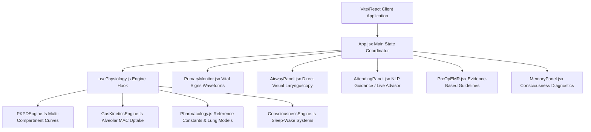
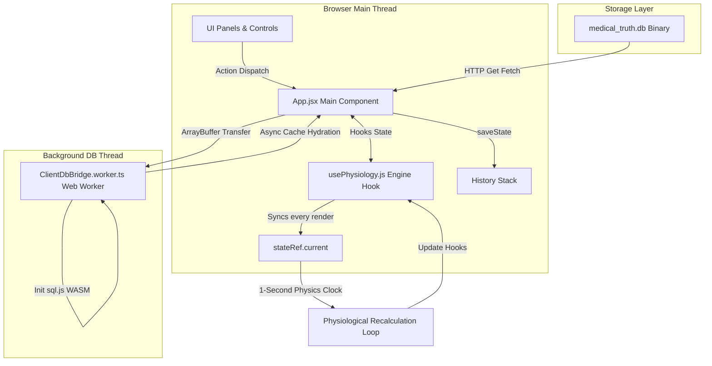
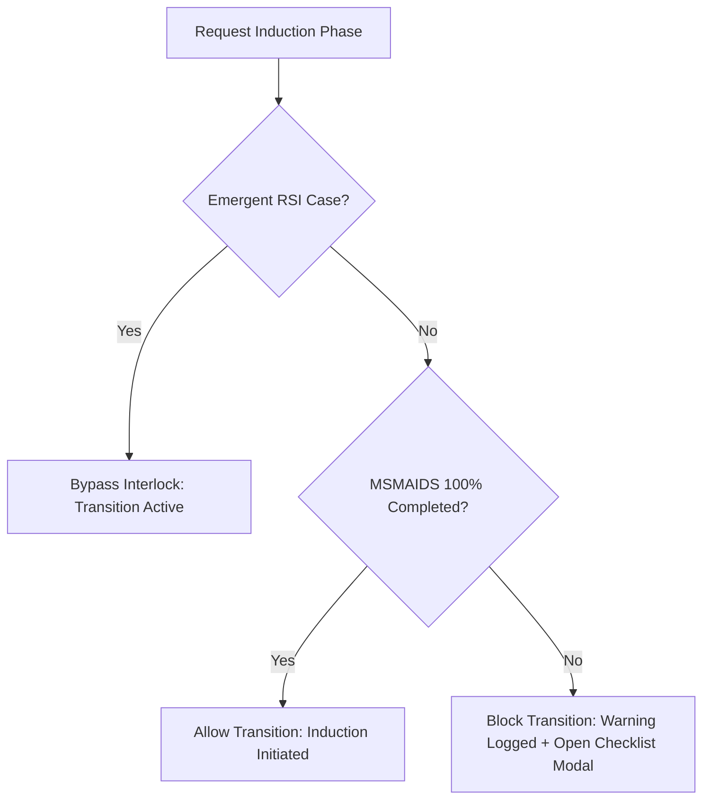

# Clinical Anesthesia & Physiological Airway Simulator: Golden Version Ground Truth

This document represents the unified, consolidated, and authoritative system architecture, physiological formulas, database schemas, and codebase blueprints for the Clinical Anesthesia & Physiological Airway Simulator. It serves as the single source of truth for the entire application.

---

## Table of Contents
1.  **STAGE 1: SYSTEM ARCHITECTURE, RUNTIME FLOW & TECH STACK**
    *   [1. High-Level Architecture](#1-high-level-architecture)
        *   [1.1 Technical Stack Specifications](#11-technical-stack-specifications)
        *   [1.2 Component Coordination & Data Flow](#12-component-coordination--data-flow)
        *   [1.3 Communication Pipelines & Execution Loops](#13-communication-pipelines--execution-loops)
        *   [1.4 State Lifecycle & The Engine Clock Bridge](#14-state-lifecycle--the-engine-clock-bridge)
    *   [2. Component & Runtime Lifecycle](#2-component--runtime-lifecycle)
        *   [2.1 Initialization Sequence (Step-by-Step)](#21-initialization-sequence-step-by-step)
        *   [2.2 User Action Interruption & Loop Injection](#22-user-action-interruption--loop-injection)
    *   [3. Complete Database & Schema Map](#3-complete-database--schema-map)
        *   [3.1 SQLite Database Schema Structure](#31-sqlite-database-schema-structure)
        *   [3.2 Representation of Ingested Textbook Data](#32-representation-of-ingested-textbook-data)
2.  **STAGE 2: THE CORE LOGIC ENGINES & ALGORITHMIC FRAMEWORKS**
    *   [4. Pathophysiology & Vital Signs Engine](#4-pathophysiology--vital-signs-engine)
        *   [4.1 Cardiovascular & Hemodynamic Physiology](#41-cardiovascular--hemodynamic-physiology)
        *   [4.2 Oscillations & Homeostatic Waves](#42-oscillations--homeostatic-waves)
        *   [4.3 Myocardial Ischemia & Metabolic Demand](#43-myocardial-ischemia--metabolic-demand)
        *   [4.4 Cardiac Arrest & Resuscitation Loop](#44-cardiac-arrest--resuscitation-loop)
        *   [4.5 Defibrillation & Cardioversion Shock Physics](#45-defibrillation--cardioversion-shock-physics)
        *   [4.6 Respiratory Volumes, Mechanics & Upper Airway Resistance](#46-respiratory-volumes-mechanics--upper-airway-resistance)
        *   [4.7 Alveolar Ventilation, Apnea Kinetics & Loop Gain](#47-alveolar-ventilation-apnea-kinetics--loop-gain)
        *   [4.8 Blood-Gas Exchange, Shunt Mathematics & Alveolar Dynamics](#48-blood-gas-exchange-shunt-mathematics--alveolar-dynamics)
        *   [4.9 Optical Pulse Oximetry Absorption Model](#49-optical-pulse-oximetry-absorption-model)
        *   [4.10 Cerebral Physiology & Intracranial Mechanics](#410-cerebral-physiology--intracranial-mechanics)
        *   [4.11 Gastrointestinal Physiology & Lower Esophageal Barrier Pressure](#411-gastrointestinal-physiology--lower-esophageal-barrier-pressure)
        *   [4.12 Hepatic Physiology, Pathophysiology, and Anesthetic Considerations](#412-hepatic-physiology-pathophysiology-and-anesthetic-considerations)
        *   [4.13 Renal Physiology, Pathophysiology, and Anesthetic Considerations](#413-renal-physiology-pathophysiology-and-anesthetic-considerations)
    *   [5. Pharmacology (PK/PD) Engine](#5-pharmacology-pkpd-engine)
        *   [5.1 Mammillary Multi-Compartment PK Model](#51-mammillary-multi-compartment-pk-model)
        *   [5.2 Numerical Integration (Euler Sub-stepping)](#52-numerical-integration-euler-sub-stepping)
        *   [5.3 Flow-Dependent Clearance, Distribution Autoregulation & Front-End Recirculatory Kinetics](#53-flow-dependent-clearance-distribution-autoregulation--front-end-recirculatory-kinetics)
        *   [5.4 Organ Impairment & Protein Binding Corrections](#54-organ-impairment--protein-binding-corrections)
        *   [5.5 Receptor-Level Pharmacodynamics](#55-receptor-level-pharmacodynamics)
        *   [5.6 Receptor-Level Vasoactive Chronotropic & Vasomotor Coupling](#56-receptor-level-vasoactive-chronotropic--vasomotor-coupling)
        *   [5.7 Neuromuscular Blockade, Receptor Subtypes, Fade (TOF Count/Ratio) & Pseudocholinesterase Variants](#57-neuromuscular-blockade-receptor-subtypes-fade-tof-countratio--pseudocholinesterase-variants)
        *   [5.8 Drug-Drug Synergism, Chelation Reversal, Anticholinesterase ceiling, & Back-End CSHT decrement curves](#58-drug-drug-synergism-chelation-reversal-anticholinesterase-ceiling--back-end-csht-decrement-curves)
        *   [5.9 Consciousness, Sleep Stages, Memory, & Processed EEG Engine](#59-consciousness-sleep-stages-memory--processed-eeg-engine)
        *   [5.10 High-Fidelity Medication Data Table](#510-high-fidelity-medication-data-table)
    *   [5.11 High-Fidelity Inhalational Gas Kinetics & Multi-Gas Interactions](#511-high-fidelity-inhalational-gas-kinetics--multi-gas-interactions)
    *   [5.12 Molecular Mechanisms of Inhalational Anesthetics](#512-molecular-mechanisms-of-inhalational-anesthetics)
    *   [5.13 Inhaled Anesthetic Metabolism & Toxicities](#513-inhaled-anesthetic-metabolism--toxicities)
    *   [5.14 Inhaled Anesthetics, Environmental Effects, & Long-Term Neurocognition](#514-inhaled-anesthetics-environmental-effects--long-term-neurocognition)
    *   [5.15 Intravenous Anesthetics: Sedative-Hypnotic Receptor Profiles](#515-intravenous-anesthetics-sedative-hypnotic-receptor-profiles)
    *   [5.16 Active Metabolites Kinetics: 1-Hydroxymidazolam & Norketamine](#516-active-metabolites-kinetics-1-hydroxymidazolam--norketamine)
    *   [5.17 Opioid Physiology & Pharmacodynamics](#517-opioid-physiology--pharmacodynamics)
    *   [5.18 Naloxone Pharmacokinetics, Competitive Antagonism & Renarcotization](#518-naloxone-pharmacokinetics-competitive-antagonism--renarcotization)
    *   [5.19 Nonopioid Pain Medications: Pharmacokinetics & Pharmacodynamics](#519-nonopioid-pain-medications-pharmacokinetics--pharmacodynamics)
    *   [5.20 Intravenous Drug Delivery Systems & Target-Controlled Infusion (TCI)](#520-intravenous-drug-delivery-systems--target-controlled-infusion-tci)
    *   [6. Event Trigger, Clinical Scenarios & Workflow Engine](#6-event-trigger-clinical-scenarios--workflow-engine)
        *   [6.1 Pre-induction Workflow Interlock (MSMAIDS Checklist)](#61-pre-induction-workflow-interlock-msmaids-checklist)
        *   [6.2 Airway Assessment & Direct Laryngoscopy Glottic Visualization](#62-airway-assessment--direct-laryngoscopy-glottic-visualization)
        *   [6.3 Laryngospasm & Bronchospasm Spasmodic Reflex Loops](#63-laryngospasm--bronchospasm-spasmodic-reflex-loops)
        *   [6.4 IgE-Mediated Anaphylactic Shock Vasoplegia](#64-ige-mediated-anaphylactic-shock-vasoplegia)
        *   [6.5 Gastric Aspiration Chemical Pneumonitis](#65-gastric-aspiration-chemical-pneumonitis)
        *   [6.6 Active Metabolite Accumulation & Neurotoxicity (Seizures)](#66-active-metabolite-accumulation--neurotoxicity-seizures)
        *   [6.7 Local Anesthetic Systemic Toxicity (LAST) & Cyanide Toxicity](#67-local-anesthetic-systemic-toxicity-last--cyanide-toxicity)
        *   [6.8 Serotonin Syndrome Hyperpyrexia](#68-serotonin-syndrome-hyperpyrexia)
        *   [6.9 Belmont IO Blowout & Arterial Injection Safety Interlocks](#69-belmont-io-blowout--arterial-injection-safety-interlocks)
        *   [6.10 Connected Intraoperative Awareness & Neuro-Cognitive Crises](#610-connected-intraoperative-awareness--neuro-cognitive-crises)
    *   [6.11 Obstructive Sleep Apnea Collapse Crisis](#611-obstructive-sleep-apnea-collapse-crisis)
    *   [6.12 Cheyne-Stokes Respiration & Central Sleep Apnea](#612-cheyne-stokes-respiration--central-sleep-apnea)
    *   [6.13 Obesity Hypoventilation Syndrome Loop](#613-obesity-hypoventilation-syndrome-loop)
    *   [6.14 Special SDB Anesthesia Bundle Checklist](#614-special-sdb-anesthesia-bundle-checklist)
    *   [6.15 Intracranial Hypertension & Cushing's Reflex Loop](#615-intracranial-hypertension--cushings-reflex-loop)
    *   [6.16 Cerebral Steal Syndrome vs. Robin Hood Effect](#616-cerebral-steal-syndrome-vs-robin-hood-effect)
    *   [6.17 Severe Traumatic Brain Injury (TBI) & Brain Herniation](#617-severe-traumatic-brain-injury-tbi--brain-herniation)
    *   [6.18 Succinylcholine Hyperkalemia & Cardiac Membrane Stabilization](#618-succinylcholine-hyperkalemia--cardiac-membrane-stabilization)
    *   [6.19 Neostigmine Ceiling Effect & Overdose Weakness](#619-neostigmine-ceiling-effect--overdose-weakness)
    *   [6.20 Absorption Atelectasis & Shunt Hypoxemia](#620-absorption-atelectasis--shunt-hypoxemia)
    *   [6.21 Alveolar Recruitment Maneuver](#621-alveolar-recruitment-maneuver)
    *   [6.22 Bezold-Jarisch Reflex](#622-bezold-jarisch-reflex)
    *   [6.23 Bainbridge Reflex](#623-bainbridge-reflex)
    *   [6.24 Oculocardiac Reflex](#624-oculocardiac-reflex)
    *   [6.25 Postoperative Ileus (POI) & Gut Motility Dysregulation](#625-postoperative-ileus-poi--gut-motility-dysregulation)
    *   [6.26 Swallowing Apnea Reflex & Pharyngeal Protection](#626-swallowing-apnea-reflex--pharyngeal-protection)
    *   [6.27 Acute Variceal Bleeding Emergency](#627-acute-variceal-bleeding-emergency)
    *   [6.28 Hepatorenal Syndrome (HRS) Loop](#628-hepatorenal-syndrome-hrs-loop)
    *   [6.29 Portopulmonary Hypertension (PoPH) Right Ventricular PEA Collapse](#629-portopulmonary-hypertension-poph-right-ventricular-pea-collapse)
    *   [6.30 Hepatopulmonary Syndrome (HPS) Right-to-Left Shunt](#630-hepatopulmonary-syndrome-hps-right-to-left-shunt)
    *   [6.31 Low Central Venous Pressure (CVP) Surgical Resection Bleeding Guidelines](#631-low-central-venous-pressure-cvp-surgical-resection-bleeding-guidelines)
    *   [6.32 Prerenal Oliguria Loop](#632-prerenal-oliguria-loop)
    *   [6.33 Intrinsic Acute Kidney Injury (AKI) & Acute Tubular Necrosis (ATN)](#633-intrinsic-acute-kidney-injury-aki--acute-tubular-necrosis-atn)
    *   [6.34 Fluid Overload Pulmonary Edema Crisis](#634-fluid-overload-pulmonary-edema-crisis)
    *   [6.35 Amnestic Nonimmobilizer (F6) Disassociation Scenario](#635-amnestic-nonimmobilizer-f6-disassociation-scenario)
    *   [6.36 K2P (TASK/TREK) Channel Knockout Anesthetic Resistance](#636-k2p-tasktrek-channel-knockout-anesthetic-resistance)
    *   [6.37 Xenon & Sevoflurane TREK-1 Mediated Neuroprotection](#637-xenon--sevoflurane-trek-1-mediated-neuroprotection)
    *   [6.38 Halothane-Induced Hepatitis Crisis Loop](#638-halothane-induced-hepatitis-crisis-loop)
    *   [6.39 Methoxyflurane Fluoride-Induced High-Output Renal Failure](#639-methoxyflurane-fluoride-induced-high-output-renal-failure)
    *   [6.40 Desiccated CO2 Absorbent Fire & Carbon Monoxide Poisoning](#640-desiccated-co2-absorbent-fire--carbon-monoxide-poisoning)
    *   [6.41 Nitrous Oxide-Induced Vitamin B12 & Methionine Synthase Shutdown](#641-nitrous-oxide-induced-vitamin-b12--methionine-synthase-shutdown)
    *   [6.42 Pediatric Anesthesia Neurodevelopmental Risk & Postoperative Cognitive Decline (POCD)](#642-pediatric-anesthesia-neurodevelopmental-risk--postoperative-cognitive-decline-pocd)
    *   [6.43 Ciliary Clearance Inhibition, Mucus Plug, and Bronchial Suctioning](#643-ciliary-clearance-inhibition-mucus-plug-and-bronchial-suctioning)
    *   [6.44 Xenon-Induced Viscous Airway Resistance Surge](#644-xenon-induced-viscous-airway-resistance-surge)
    *   [6.45 Pipeline Crossover and Oxygen Supply Pressure Failure](#645-pipeline-crossover-and-oxygen-supply-pressure-failure)
    *   [6.46 Link-25 Proportioning System and Hypoxic Mixture Protection](#646-link-25-proportioning-system-and-hypoxic-mixture-protection)
    *   [6.47 APL Valve Mechanical Model and Low-Pressure Leak Kinetics](#647-apl-valve-mechanical-model-and-low-pressure-leak-kinetics)
    *   [6.48 Mapleson Breathing Circuit Rebreathing and Fresh Gas Flow Limits](#648-mapleson-breathing-circuit-rebreathing-and-fresh-gas-flow-limits)
    *   [6.49 Stuck Unidirectional Valves and Rebreathing Fraction](#649-stuck-unidirectional-valves-and-rebreathing-fraction)
    *   [6.50 Oxygen Flush Valve dilution and Tension Pneumothorax Barotrauma](#650-oxygen-flush-valve-dilution-and-tension-pneumothorax-barotrauma)
    *   [6.51 Propofol Infusion Syndrome (PRIS) Crisis Loop](#651-propofol-infusion-syndrome-pris-crisis-loop)
    *   [6.52 Etomidate-Induced Adrenocortical Suppression Crisis](#652-etomidate-induced-adrenocortical-suppression-crisis)
    *   [6.53 Ketamine Washout Emergence Delirium Loop](#653-ketamine-washout-emergence-delirium-loop)
    *   [6.54 Intra-Arterial Barbiturate Precipitation and Vasospasm Injury](#654-intra-arterial-barbiturate-precipitation-and-vasospasm-injury)
    *   [6.55 Benzodiazepine Withdrawal Seizures and Flumazenil Antagonism](#655-benzodiazepine-withdrawal-seizures-and-flumazenil-antagonism)
    *   [6.56 Opioid-Induced Chest Wall Rigidity (Wooden Chest Syndrome)](#656-opioid-induced-chest-wall-rigidity-wooden-chest-syndrome)
    *   [6.57 Remifentanil-Induced Hyperalgesia (OIH)](#657-remifentanil-induced-hyperalgesia-oih)
    *   [6.58 Sphincter of Oddi Spasm & Biliary Colic](#658-sphincter-of-oddi-spasm--biliary-colic)
    *   [6.59 Opioid-Induced Pruritus](#659-opioid-induced-pruritus)
    *   [6.60 Naloxone-Induced Autonomic Sympathetic Surge & Renarcotization](#660-naloxone-induced-autonomic-sympathetic-surge--renarcotization)
    *   [6.61 Postoperative Ileus Sparing & Multimodal Analgesia](#661-postoperative-ileus-sparing--multimodal-analgesia)
    *   [6.62 Connected Awareness under TCI Closed-Loop Failure & Adaptive Overdrive](#662-connected-awareness-under-tci-closed-loop-failure--adaptive-overdrive)
    *   [6.63 Atypical Pseudocholinesterase Succinylcholine Prolongation Crisis](#663-atypical-pseudocholinesterase-succinylcholine-prolongation-crisis)
    *   [6.64 Laudanosine Accumulation & Epileptogenic Seizure Loop](#664-laudanosine-accumulation--epileptogenic-seizure-loop)
    *   [7. Attending Direct Chat, Advisor & NLP Engine](#7-attending-direct-chat-advisor--nlp-engine)
        *   [7.1 Automated Guidance Evaluator](#71-automated-guidance-evaluator)
        *   [7.2 Conversational NLP Chat Portal](#72-conversational-nlp-chat-portal)
3.  **STAGE 3: STATE MANAGEMENT, INGESTION PIPELINES, & BOUNDARY CONDITIONS**
    *   [8. Full Application State Tree](#8-full-application-state-tree)
        *   [8.1 Global Application Hooks](#81-global-application-hooks)
        *   [8.2 Core Physiology Engine State Bridge Ref](#82-core-physiology-engine-state-bridge-ref)
    *   [9. Data Ingestion & Indexing Pipeline](#9-data-ingestion--indexing-pipeline)
        *   [9.1 The Ingestion Engine & Cache Hydration](#91-the-ingestion-engine--cache-hydration)
        *   [9.2 Dynamic Medication Ingestion](#92-dynamic-medication-ingestion)
        *   [9.3 Dynamic Procedural Ingestion](#93-dynamic-procedural-ingestion)
        *   [9.4 Dynamic Textbook Rule Indexer](#94-dynamic-textbook-rule-indexer)
    *   [10. Constraints & Edge Cases](#10-constraints--edge-cases)
4.  **STAGE 4: COMPREHENSIVE COMPILATION, CODE BLUEPRINT & INTEGRITY CHECK**
    *   [11. Crucial Code Files & System Responsibilities](#11-crucial-code-files--system-responsibilities)
    *   [12. Architectural Dependency Analysis: Hardcoded vs. Dynamic Textbook Data](#12-architectural-dependency-analysis-hardcoded-vs-dynamic-textbook-data)
    *   [13. Integrity & Compliance Verification Statement](#13-integrity--compliance-verification-statement)

---

## STAGE 1: SYSTEM ARCHITECTURE, RUNTIME FLOW & TECH STACK

### 1. High-Level Architecture

The simulator is a high-fidelity, real-time clinical training application representing physiological, pharmacological, and neuro-cognitive responses during general anesthesia induction.

#### 1.1 Technical Stack Specifications
*   **Frontend Framework**: React 19.2 (using Vite 8.0 as the build system and development server).
*   **Styling & UI Design**: Glassmorphic, dark-mode medical instrumentation UI styled with Vanilla CSS custom grids and integrated with Tailwind CSS 4.2.
*   **Database Engines**: 
    *   *Backend / Build Time*: SQLite database (`medical_truth.db`) managed via `better-sqlite3` (v12.10) for raw clinical text/matrix ingestion.
    *   *Client Runtime / Browser*: In-memory WebAssembly-based SQLite interface via `sql.js` (v1.12), ensuring driver and query syntax parity across both environments.
*   **Web Workers**: A dedicated HTML5 Web Worker (`ClientDbBridge.worker.ts`) is leveraged in the browser to compile, load, and query the SQLite database off the main UI thread.
*   **State Management**: React component local state hooks (`useState`) coupled with a custom React hook (`usePhysiology.js`) that manages the physics engine state. 
*   **History & Undo**: A serialization layer built in `App.jsx` deep-copies the application and engine states before executing user actions, maintaining a chronological history stack for undo operations.

#### 1.2 Component Coordination & Data Flow


#### 1.3 Communication Pipelines & Execution Loops
The system's data pipeline is split between asynchronous assets loading, user action injection, and a synchronous physiological execution clock:



*   **Database Ingestion & Hydration Pipeline**:
    1. During boot, the application fetches the static binary `/medical_truth.db` from the client-facing storage layer.
    2. The binary buffer is transferred directly to the Web Worker via Transferable Objects (`postMessage({ type: 'init', payload: { buffer } }, [buffer])`) to avoid copying memory across threads.
    3. The worker instantiates `sql.js`, loads the buffer, and runs initial queries to extract prose and matrix records.
    4. Hydrated arrays are returned to the main thread, where `ClientDbBridge.ts` caches them locally and triggers registered callbacks, automatically instantiating the registries.

#### 1.4 State Lifecycle & The Engine Clock Bridge
The simulator operates on a synchronous **1-second (1000ms) interval clock** instantiated within the `usePhysiology.js` custom hook. To prevent stale React state closures during rapid physical iterations without forcing interval resets, a specialized **State Bridge Ref Pattern** (`stateRef`) is utilized.

```javascript
// The Physics Engine State Bridge.
const stateRef = useRef({ time, vitals, targetVitals, patient, activeMeds, gasModels, intravascularVolume, electrolytes, ventSettings, gasSettings, surgicalPhase, msmaidsComplete });

useEffect(() => {
  stateRef.current = { time, vitals, targetVitals, patient, activeMeds, gasModels, intravascularVolume, electrolytes, ventSettings, gasSettings, surgicalPhase, msmaidsComplete };
});
```
Every clock tick, the simulator extracts parameters from `stateRef.current`, executes physiological mathematical adjustments, modifies target thresholds, calculates compartmental PK/PD decay, and updates state hooks accordingly.

---

### 2. Component & Runtime Lifecycle

#### 2.1 Initialization Sequence (Step-by-Step)
1.  **Boot & Script Ingestion**:
    *   Browser loads `main.jsx`, mounting the main `<App />` component.
    *   Static import of `ClientDbBridge` automatically executes `ClientDbBridge.init()`.
2.  **Driver Initialization & Hydration**:
    *   *Browser*: Spawns the database worker thread, downloads `medical_truth.db`, initializes the WASM-based SQLite driver, and populates main thread cache structures (`allProse`, `allMatrices`).
    *   *Node/Vitest*: Performs a direct import of `store.ts` and loads `KnowledgeStore` synchronously.
    *   Caches are sorted using `comparePriority()`.
    *   `ClientDbBridge.onLoaded` fires, causing the registries to parse textbook schemas and register medications/procedures.
3.  **Case Selection**:
    *   The user picks a case configuration from the UI.
    *   The client triggers `startCase(selectedCase)`.
4.  **Parameter Calculation & Patient Instantiation**:
    *   `startCase` calculates body descriptors based on baseline patient stats:
        *   **Ideal Body Weight (IBW)**:
            $$IBW_{\text{male}} = 50.0 + 2.3 \cdot \left(\frac{\text{Height [cm]}}{2.54} - 60\right)$$
            $$IBW_{\text{female}} = 45.5 + 2.3 \cdot \left(\frac{\text{Height [cm]}}{2.54} - 60\right)$$
        *   **Lean Body Weight (LBW)**:
            $$LBW_{\text{male}} = \frac{9270 \cdot \text{Weight [kg]}}{6680 + 216 \cdot BMI}$$
            $$LBW_{\text{female}} = \frac{9270 \cdot \text{Weight [kg]}}{8780 + 244 \cdot BMI}$$
        *   **Estimated Blood Volume (EBV)**: Calculated based on patient sex (65 mL/kg for females, 75 mL/kg for males) multiplied by total weight.
        *   **Predicted Lung Volumes**: TLC, FRC, RV, FVC, and FEV1 are calculated using ECCS/ERS 1993 formulas, scaled exponentially based on position, restrictive/obstructive disease, and obesity factors.
5.  **State Hook Initialization**:
    *   Initial vitals (Heart Rate, SBP, DBP, $SpO_2$, $EtCO_2$) are pushed to the hooks.
    *   Baseline MAP is initialized:
        $$MAP = DBP + \frac{SBP - DBP}{3}$$
    *   Active medication list is cleared, surgical phase is reset to `Pre-Op`, and inhalational gas models are generated.
    *   The execution loop is set to running (`isRunning = true`).

#### 2.2 User Action Interruption & Loop Injection
When a user executes a clinical action (e.g., injecting a drug, changing mechanical ventilation parameters, or performing airway maneuvers):
1.  **State Serialization (Undo Stack)**:
    *   `saveState()` is called to serialise current client configurations and invoke `createSnapshot()` on the physiological engine.
    *   The snapshots are appended to the `history` array.
2.  **State Injection**:
    *   The UI handler calls the state setter (e.g., `setVentSettings`, `pushMed`, `setPatient`).
    *   React pushes these updates into its queue.
3.  **Ref Synchronization**:
    *   As soon as React applies the state updates, the `useEffect` hooks trigger and update `stateRef.current` with the new values.
4.  **Engine Recalculation**:
    *   On the next 1-second interval tick, the physiology loop reads from `stateRef.current`, incorporating the user-modified parameters directly into the mathematical differential equations.

---

### 3. Complete Database & Schema Map

#### 3.1 SQLite Database Schema Structure
The `medical_truth.db` database contains two primary tables storing prose and structured data parsed from medical textbooks:

##### Table 1: `textbook_prose`
*   **Columns**:
    *   `id`: `TEXT PRIMARY KEY` (Unique alphanumeric string identifier).
    *   `topic`: `TEXT` (The clinical topic or chapter subheading, e.g. "Succinylcholine").
    *   `body_text`: `TEXT` (Unabridged parsed string containing the raw text content).
    *   `source_book`: `TEXT` (Source filename tracking provenance, e.g. "Millers_Anesthesia_9th_Ed.pdf").
    *   `edition`: `INTEGER` (Textbook edition number).
    *   `priority_rank`: `INTEGER` (Computed rank indicating authority level).
    *   `is_authoritative`: `INTEGER DEFAULT 0` (Flag marking if the row is the winner of the priority resolution algorithm).
*   **Indexes**:
    *   `idx_prose_source_book` ON `textbook_prose (source_book)`
    *   `idx_prose_topic` ON `textbook_prose (topic)`

##### Table 2: `physiological_matrices`
*   **Columns**:
    *   `id`: `TEXT PRIMARY KEY` (Unique alphanumeric string identifier).
    *   `topic`: `TEXT` (Subsystem or category name).
    *   `archetype`: `TEXT` (Data format category, e.g. "COORDINATE X-Y GRAPHS").
    *   `caption`: `TEXT` (Descriptive legend of the table or chart).
    *   `structured_payload`: `TEXT` (Hierarchical JSON string containing the data array).
    *   `source_book`: `TEXT` (Source filename tracking provenance).
    *   `edition`: `INTEGER` (Textbook edition number).
    *   `priority_rank`: `INTEGER` (Computed rank indicating authority level).
    *   `is_authoritative`: `INTEGER DEFAULT 0` (Flag marking if the row is the winner of the priority resolution algorithm).
*   **Indexes**:
    *   `idx_matrices_source_book` ON `physiological_matrices (source_book)`
    *   `idx_matrices_topic` ON `physiological_matrices (topic)`

#### 3.2 Representation of Ingested Textbook Data
*   **Textbook Prose Representation**: Prose chapters are broken down into logical paragraphs or subheadings. Each section is stored as a row in `textbook_prose`. Mathematical rules are extracted dynamically from these rows by `extractTextbookRules()`.
*   **Tabular & Flowchart Representation**: Tables are parsed and stored as structured rows inside the JSON `structured_payload` of a `physiological_matrices` record. Flowcharts or procedural steps are stored in `structured_payload` with the `TIMELINE_STEP_CHART_HYPNOGRAM` archetype.
*   **Textbook Priority Hierarchy & Authority Resolution**:
    To handle conflicts between overlapping sources or editions, the database executes a strict hierarchy resolution query when `recalculateAuthority()` is invoked:
    $$\text{Rank}_{\text{Miller}} = 1000 + \text{Edition}$$
    $$\text{Rank}_{\text{Other}} = 100 + \text{Edition}$$
    A window function groups records by `topic` and assigns `is_authoritative = 1` to the record with the highest rank. Only authoritative rows are queried at runtime.

---

## STAGE 2: THE CORE LOGIC ENGINES & ALGORITHMIC FRAMEWORKS

### 4. Pathophysiology & Vital Signs Engine

#### 4.1 Cardiovascular & Hemodynamic Physiology (`CardiovascularEngine.ts`)
The cardiovascular engine calculates the patient's continuous perfusion status every second. It models cardiac output ($CO$, L/min) and mean arterial pressure ($MAP$, mmHg):

1.  **Mean Arterial Pressure (MAP)**:
    $$MAP = DBP + \frac{SBP - DBP}{3}$$
    $$MAP_{\text{exact}} = \frac{CO \cdot SVR}{80} + \Delta P_{\text{pressor}} + \Delta P_{\text{sepsis}} - \text{Stunning}_{\text{MAP\_penalty}}$$
    *   *Systemic Vascular Resistance ($SVR$)*: Normal range is $900 - 1400\text{ dyn}\cdot\text{s}\cdot\text{cm}^{-5}$. Updates dynamically based on vasodilation, vasoactive infusions, and autonomic reflexes. Under celiac or thoracic epidural sympathetic blockade (TEA):
        $$\text{targetSVR} *= (1.0 - 0.15 \cdot \text{SympatheticBlock})$$
        where $\text{SympatheticBlock} = 1.0$ if celiac or thoracic epidural block is active, else $0.0$.
    *   *Pressor Pressure Shift (\Delta P_{\text{pressor}})*:
        $$\Delta P_{\text{pressor}} = \frac{\text{EffectiveVolume} - EBV - \text{splanchnicPoolingOffset}}{250} \cdot 8$$
        where $\text{splanchnicPoolingOffset} = 1000 \cdot (V_{\text{splanchnic}} - 1.0)\text{ mL}$. Sympathetic block dilates mesenteric capacitance vessels, causing relative splanchnic pooling ($V_{\text{splanchnic}} > 1.0$). This is reversed by alpha-1 adrenergic receptor stimulation:
        $$V_{\text{splanchnic}} = 1.0 + 0.3 \cdot \text{SympatheticBlock} \cdot (1.0 - \text{AlphaAgonistEffect})$$
        where $\text{AlphaAgonistEffect} = 1.0$ if Phenylephrine, Norepinephrine, or Epinephrine is active.
    *   *Sepsis Pressure Shift (\Delta P_{\text{sepsis}})*: Drops SVR and subtracts $33.33\text{ mmHg}$ from MAP due to vasoplegia.
    *   *Stunning MAP Penalty (\text{Stunning}_{\text{MAP\_penalty}})*: If myocardial stunning is present, MAP is reduced by the stunning percentage.
2.  **Cardiac Output (CO)**:
    $$CO = \frac{HR \cdot SV}{1000} \quad \text{[L/min]}$$
    *   *Stroke Volume ($SV$)*: Derived from Frank-Starling preload curves, contractility, and stunning factors:
        $$SV = \min\left(SV_{\text{max}}, SV_{\text{base}} \cdot Preload_{SV} \cdot \max(0.1, Inotropy) \cdot CHF_{\text{penalty}} \cdot AFib_{\text{penalty}}\right)$$
        *   *Frank-Starling Preload Stroke Volume ($Preload_{SV}$)*: Models stroke volume variation as a function of LVEDP:
            $$Preload_{SV} = 1.2 \cdot \left(1.0 - e^{-0.15 \cdot LVEDP}\right) \cdot \left(1.0 - 1.2 \cdot \text{BloodLossRatio}\right)$$
        *   *Left Ventricular End-Diastolic Pressure ($LVEDP$)*: Calculated dynamically from intravascular volume offsets and myocardial inotropy:
            $$LVEDP = \max\left(2.0, \min\left(40.0, 8.0 + 4.0 \cdot \frac{\text{EffectiveVolume} - EBV}{250} + \frac{5.0}{Inotropy}\right)\right)$$
        *   *Inotropy ($Inotropy$)*:
            $$Inotropy = \max\left(0.01, 1.0 - \frac{\text{Stunning}}{100} + \text{Inotropy}_{\text{drugs}} + \text{Spike}_{\text{contractility}}\right)$$
3.  **Systolic (SBP) & Diastolic (DBP) Pressures**:
    Systolic and diastolic pressures are derived from MAP and Pulse Pressure ($PP$, mmHg), which scales with stroke volume:
    $$PP = 40 \cdot \frac{SV}{SV_{\text{base}}}$$
    $$SBP = MAP + \frac{2}{3} \cdot PP + \text{Noise}_{\text{sys}}$$
    $$DBP = MAP - \frac{1}{3} \cdot PP + \text{Noise}_{\text{dia}}$$
4.  **Autonomic Reflexes - Baroreceptor Reflex**:
    *   *Baroreflex Gain (\text{baroreflexGain})*: Blunted dose-dependently by volatile anesthetics and completely bypassed under connected awareness crises:
        $$\text{baroreflexGain} = \max\left(0, 1.0 - \text{currentMac} \cdot 0.67\right)$$
    *   *Autonomic Heart Rate Mod (\text{autonomicHrMod})*:
        $$\text{Error}_{\text{baro}} = MAP - MAP_{\text{set}} \quad \text{where } MAP_{\text{set}} = DBP_{\text{base}} + \frac{SBP_{\text{base}} - DBP_{\text{base}}}{3}$$
        $$\text{autonomicHrMod} = \max\left(-25, \min\left(30, -0.5 \cdot \text{Error}_{\text{baro}} \cdot \text{baroreflexGain}\right)\right)$$
        Reflex bradycardia is blunted (set to 0) if antimuscarinic drugs block cholinergic receptors (`totalHrDelta > 15`).

#### 4.2 Oscillations & Homeostatic Waves
The hemodynamics engine superimposes oscillatory waveforms onto heart rate and blood pressures to represent in-vivo responses:
*   **Respiratory Sinus Arrhythmia (RSA) & Breathing Fluctuations**:
    $$\text{RSA}_{\text{Effect}} = \sin(\theta_{\text{resp}}) \cdot 1.3 \quad \text{[bpm]} \quad \text{where } \theta_{\text{resp}} = \frac{t \cdot 2\pi}{60/RR}$$
    $$\text{RespBp}_{\text{Var}} = \sin(\theta_{\text{resp}}) \cdot 2.2 \quad \text{[mmHg]}$$
*   **Traube-Hering-Mayer (THM) Waves**:
    $$\text{THM}_{\text{Effect}} = \sin\left(\frac{t \cdot 2\pi}{10}\right) \cdot 0.9 \quad \text{[mmHg]}$$
*   **Micro-Fluctuations (Nervous Noise)**:
    $$\text{Noise}_{\text{HR\_Micro}} \approx \text{Random}(-0.2, 0.2) \quad \text{Noise}_{\text{BP\_Micro}} \approx \text{Random}(-0.35, 0.35)$$

#### 4.3 Myocardial Ischemia & Metabolic Demand
Myocardial oxygen balance represents a dynamic supply-demand relationship. Perfusion occurs primarily during diastole and is governed by coronary driving pressure:

*   **Coronary Perfusion Pressure ($CPP_{\text{coronary}}$)**:
    $$CPP_{\text{coronary}} = \max\left(5.0, DBP - LVEDP\right)$$
*   **Diastolic Time Ratio (\text{DiastoleTimeRatio})**: Shrinks as heart rate rises, limiting the duration of coronary perfusion:
    $$\text{DiastoleTimeRatio} = \max\left(0.20, \min\left(0.85, \frac{60.0 - 0.2 \cdot HR}{60.0}
ight)\right)$$
*   **Myocardial Oxygen Demand ($MVO_2$)**: Scales with heart rate, systolic pressure, contractility, and ventricular radius:
    $$MVO_2 = HR \cdot SBP \cdot Inotropy \cdot RadiusMod \quad \text{where } RadiusMod = 1.0 + \max\left(0, \frac{LVEDP - 12.0}{15.0}
ight)$$
*   **Myocardial Oxygen Supply ($Supply_{\text{myo}}$)**:
    $$Supply_{\text{myo}} = CPP_{\text{coronary}} \cdot \text{DiastoleTimeRatio} \cdot CaO_2 \cdot \text{coronaryStenosisMod} \cdot 8.5$$
    where $CaO_2 = Hb \cdot 1.34 \cdot (SpO_2 / 100) + PaO_2 \cdot 0.0031$, and $\text{coronaryStenosisMod} = 0.40$ if CAD patient, else $1.0$.
*   **Ischemia & Stunning Accumulation**:
    If oxygen demand exceeds supply, stunning accumulates at a rate proportional to the deficit:
    $$\text{StunningRate} = \max\left(0, \frac{MVO_2 - Supply_{\text{myo}}}{10000} \cdot 0.381
ight) \quad [\%/\text{s}]$$
    Stunning restricts inotropy and contractility. It decays slowly by $0.2\%$ per second once oxygen supply exceeds demand.

#### 4.4 Cardiac Arrest & Resuscitation Loop
*   **Arrest Triggers**: Initiated if:
    1.  *Hypoxemia*: Arterial oxygen tension ($PaO_2$) remains below $30\text{ mmHg}$ for $>15$ continuous seconds.
    2.  *Severe Acidosis*: Arterial pH drops below $6.9$.
    3.  *Hyperkalemia*: Potassium levels ($K^+$) exceed $10.0\text{ mEq/L}$ (or $9.0\text{ mEq/L}$ if not membrane-stabilized by Calcium).
    4.  *Anomalous shock*: Severe anaphylactic vasoplegia.
*   **CPR Mechanics**: When CPR is active, the engine bypasses standard hemodynamic equations and generates survival perfusion pressure:
    $$SBP_{\text{CPR}} = 80 + \text{Random}(0, 15) \quad [mmHg] \quad DBP_{\text{CPR}} = 25 + \text{Random}(0, 10) \quad [mmHg]$$
    $$CO_{\text{CPR}} \approx 1.5\text{ L/min}$$
*   **Ischemic Damage Accumulation**:
    $$\frac{d(\text{Damage})}{dt} = (90 - SpO_2) \cdot 0.4 + (55 - MAP_{\text{cerebral}}) \cdot 0.7 \quad \text{[per second]}$$
    CPR reduces this damage accumulator by $4.5$ units/s (if $SpO_2 \ge 80\%$) or $1.0$ unit/s (if hypoxemic).
    If $\text{Damage} > 1200$, cardiac arrest is triggered. If $\text{Damage} > 6000$, irreversible **biological death** occurs.
*   **Spontaneous ROSC**: CPR chest compression cycles have a $4\%$ chance per second to trigger spontaneous ROSC if oxygen buffer is sufficient ($>50\%$ of FRC capacity), hemorrhage is restricted ($\text{BloodLossRatio} < 0.2$), and therapeutic levels of Epinephrine are present.

#### 4.5 Defibrillation & Cardioversion Shock Physics
*   **Shock Success Probability**:
    $$P_{\text{ROSC}} = \max\left(0.01, 0.70 + \text{Bonus}_{\text{meds}} - \text{Penalty}_{\text{ischemia}} - \text{Penalty}_{\text{hypoxia}} - \text{Penalty}_{\text{hypovolemia}}\right)$$
    *   $\text{Bonus}_{\text{meds}}$: Amiodarone ($+0.25$), Lidocaine ($+0.20$), Epinephrine ($+0.10$).
    *   $\text{Penalty}_{\text{ischemia}}$: $\frac{\text{IschemicDamage}}{5000}$.
    *   $\text{Penalty}_{\text{hypoxia}}$: $0.60$ if $O_2\text{ Buffer} < 40\%\text{ of FRC}$.
    *   $\text{Penalty}_{\text{hypovolemia}}$: $0.60$ if $\text{BloodLossRatio} > 0.30$.
*   **Rhythm Conversion**: Organized Sinus Rhythm is restored if successful, setting myocardial stunning to $60\%$. An unsynchronized shock during a perfusing rhythm has a $100\%$ chance to induce R-on-T Ventricular Fibrillation (VFib).

#### 4.6 Respiratory Volumes, Mechanics & Upper Airway Resistance (`RespiratoryEngine.ts`)
*   **Upper Airway Resistance ($R_{\text{upper}}$)**: Models pharyngeal patency as a function of neuromuscular blockade, anesthetic depth, sleep stage REM atonia, and airway pressures:
    $$R_{\text{upper}} = \frac{R_{\text{base}}}{(\text{dilatorMuscleTone})^{2.5}} \cdot e^{0.5 \cdot (P_{\text{crit}} - P_{\text{airway}})}$$
    where $R_{\text{base}} = 5\text{ cmH2O/L/s}$ is the baseline airway resistance, $P_{\text{crit}}$ is the critical pharyngeal collapse pressure (mmHg), and $P_{\text{airway}}$ is the positive pressure in the airway (mmHg, e.g. PEEP, CPAP, or BiPAP settings).
    *   *Dilator Genioglossus Muscle Tone ($\text{dilatorMuscleTone}$)*: Represents upper airway dilator muscle activity index ($0.0 - 1.0$).
        $$\text{dilatorMuscleTone} = 1.0 - \text{NMBA}_{\text{block}} - 0.7 \cdot \text{Propofol}_{Ce} - 0.5 \cdot \text{Volatile}_{\text{MAC}} - \text{REMAtonia}_{\text{penalty}}$$
        where $\text{NMBA}_{\text{block}}$ is nicotinic acetylcholine receptor occupancy, and $\text{REMAtonia}_{\text{penalty}} = 0.85$ when the active sleep stage is REM (Stage R).
    *   *Pharyngeal Collapse Pressure ($P_{\text{crit}}$)*: Mapped based on patient airway status. In normal patients, $P_{\text{crit}} = -5.0\text{ mmHg}$ (highly stable). In moderate-to-severe Obstructive Sleep Apnea (OSA) patients, $P_{\text{crit}}$ increases to $\ge 0.0\text{ mmHg}$ (collapses even at atmospheric pressure).
    *   *Airway Obstruction Index*: In un-intubated, spontaneously ventilating patients, insufficient genioglossus muscle tone causes snoring and pharyngeal collapse:
        $$\text{airwayObstructionIndex} = \min\left(1.0, \max\left(0.0, \frac{(1.0 - \text{dilatorMuscleTone}) \cdot (P_{\text{crit}} + 6.0)}{7.0}\right)\right)$$
        If $\text{airwayObstructionIndex} > 0.6$, airway obstruction occurs, adding an obstruction resistance penalty:
        $$\text{Resistance}_{\text{obstruction}} = 35.0 \cdot \text{airwayObstructionIndex} \quad [\text{cmH2O/L/s}]$$
*   **Intercostal vs. Diaphragmatic Mechanics**: Volatile agents depress intercostal muscle activity more than diaphragmatic activity:
    $$\text{intercostalContribution} = \max\left(0.1, 1.0 - 0.7 \cdot \text{Volatile}_{\text{MAC}}\right)$$
    $$\text{diaphragmContribution} = \max\left(0.5, 1.0 - 0.15 \cdot \text{Volatile}_{\text{MAC}}\right)$$
    If $\text{intercostalContribution} < 0.4$, paradoxical abdominal breathing is triggered. FRC volume scales by $(0.7 + 0.3 \cdot \text{intercostalContribution})$ and pulmonary compliance scales by $\text{intercostalContribution}$.
*   **Ciliary Transport & Surfactant Dynamics**:
    - *Cilia Beat Frequency ($CBF$)*: Volatile agents, smoking, and dry fresh gas flows ($FGF > 5\text{ L/min}$) depress ciliary beat frequency:
        $$CBF = 100.0 - 25.0 \cdot \text{Volatile}_{\text{MAC}} - (\text{tobaccoSmoker} ? 30.0 : 0.0) - (FGF > 5.0 ? 15.0 : 0.0) \quad [\%]$$
    - *Surfactant Production*: Volatile agents decay Alveolar Type II surfactant synthesis dose- and time-dependently:
        $$\text{surfactantProduction} = \max\left(10.0, 100.0 - 20.0 \cdot \text{Volatile}_{\text{MAC}} \cdot (\text{time} > 600 ? 1.5 : 1.0)\right) \quad [\%]$$
        Pulmonary compliance scales linearly with surfactant level: $Compliance *= (\text{surfactantProduction} / 100.0)$.
*   **Volatile Bronchodilation vs. Xenon Resistance**:
    - *Bronchial Smooth Muscle Relaxation*: Volatiles reduce calcium sensitivity in airway smooth muscle:
        $$\text{bronchialSmoothMuscleCa} = \max\left(0.2, 1.0 - 0.5 \cdot \text{Volatile}_{\text{MAC}}\right)$$
        This scales down the bronchospasm resistance penalty: $\text{Resistance}_{\text{bronchospasm}} = 40.0 \cdot \text{bronchialSmoothMuscleCa}$. (Xenon has no bronchodilating effect).
    - *Xenon Viscous Airway Resistance*: Xenon's high density and viscosity increase total airway resistance:
        $$\text{xenonResistanceMultiplier} = 1.0 + 0.4 \cdot \left(\frac{etAgent}{70.0}\right) \cdot (1.0 + (\text{bronchospasm} ? 1.5 : 0.0))$$
        $$\text{Resistance}_{\text{final}} *= \text{xenonResistanceMultiplier}$$

#### 4.6.1 Predicted Lung Volumes (ECCS/ERS 1993)

    *   *Male Predicted FRC*: $FRC_{\text{pred}} = 2.34 \cdot H + 0.009 \cdot A - 1.09$
    *   *Female Predicted FRC*: $FRC_{\text{pred}} = 2.24 \cdot H + 0.001 \cdot A - 1.00$
*   **Volume Corrections**:
    $$\text{Volume}_{\text{final}} = \text{Volume}_{\text{pred}} \cdot \text{Disease}_{\text{scale}} \cdot e^{-0.02 \cdot (BMI - 25)} \cdot \text{Position}_{\text{factor}}$$
    *   $\text{Position}_{\text{factor}}$: Sitting ($1.0$), Supine/Sniffing ($0.80$), Trendelenburg ($0.70$).
*   **Pulmonary Compliance & Resistance**:
    *   *Compliance ($C$, mL/cmH2O)*: Baseline is $65$. Modified by position (Trendelenburg decreases compliance by $20\%$), obesity ($-25$), and sepsis ($-20$).
    *   *Resistance ($R$, cmH2O/L/s)*: Baseline is $5$. Elevated by obesity ($+3$), bronchospasm ($+40$), bucking ($+15$), and laryngospasm ($R = 999$).
*   **Ventilator Pressures & Tidal Volume ($V_{TE}$)**:
    *   *VCV Mode*: $V_{TE} = \text{dialed } V_T$. Peak inspiratory pressure is calculated as:
        $$PIP = P_{\text{plat}} + \left(\text{Flow} \cdot R \cdot 5\right) \quad \text{where } P_{\text{plat}} = PEEP + \frac{V_{TE}}{C}$$
    *   *PCV Mode*: $PIP = PEEP + P_{\text{insp}}$. Tidal volume is calculated as:
        $$V_{TE} = \left(P_{\text{plat}} - PEEP\right) \cdot C \quad \text{where } P_{\text{plat}} = PIP - 2$$
    *   *PCV-VG Mode*: $V_{TE} = \text{dialed } V_T$. Peak pressure converges: $P_{\text{plat}} = PEEP + \frac{V_{TE}}{C}$, $PIP = P_{\text{plat}} + 2$.

#### 4.7 Alveolar Ventilation, Apnea Kinetics & Loop Gain
*   **Chemoreceptor Feedback Loop Gain ($LG$)**: Quantifies ventilatory control stability and propensity to periodic breathing:
*   **Hypoxic & Hypercapnic Ventilatory Drive Blunting**:
    - *Hypoxic Ventilatory Response (HVR)*: Sub-MAC concentrations ($0.1\text{ MAC}$) of volatiles (Sevoflurane, Isoflurane, Halothane, Methoxyflurane) blunt peripheral chemoreceptor hypoxic drive by $70\%$:
        $$\text{hvrBlunting} = \begin{cases} \left(\frac{\text{Volatile}_{\text{MAC}}}{0.1}\right) \cdot 0.7 & \text{if } \text{Volatile}_{\text{MAC}} \le 0.1 \\ 0.7 + (\text{Volatile}_{\text{MAC}} - 0.1) \cdot 0.3 & \text{if } \text{Volatile}_{\text{MAC}} > 0.1 \end{cases}$$
        For Desflurane and Xenon, HVR is not blunted at sub-MAC ($0.1\text{ MAC}$):
        $$\text{hvrBlunting} = \max\left(0.0, \min\left(1.0, \frac{\text{Volatile}_{\text{MAC}} - 0.1}{1.0}\right)\right)$$
    - *Hypercapnic Ventilatory Response (HCVR)*: Volatiles blunt the central carbon dioxide drive dose-dependently:
        $$\text{hcvrBlunting} = \min\left(1.0, \text{Volatile}_{\text{MAC}} \cdot 0.6\right)$$
        (Xenon does not blunt HCVR).
    - *Blunted Compensatory Drive*:
        $$\text{compensatoryRR} = \max(0, (PaCO_2 - 45) \cdot 0.8 \cdot (1 - \text{hcvrBlunting})) + \max(0, (70 - PaO_2) \cdot 0.4 \cdot (1 - \text{hvrBlunting}))$$
    - *Xenon Spontaneous Respiratory Rate Depression*: Spontaneous breathing rate is depressed by Xenon:
        $$\text{patientDriveRR} = \max\left(0.0, \text{patientDriveRR} - 0.25 \cdot etXenon\right)$$
    $$LG = G_{\text{controller}} \cdot G_{\text{plant}} \cdot \text{mixingGainMod}$$
    *   *Controller Gain ($G_{\text{controller}}$)*: Sensitivity of the central and peripheral chemoreceptors to changes in $PaCO_2$.
        $$G_{\text{controller}} = G_{\text{base}} \cdot \max(1.0, 1.0 + 3.0 \cdot (7.4 - pH) + 2.0 \cdot \frac{100 - SpO_2}{10})$$
        where $G_{\text{base}} = 1.2$. It increases significantly during severe hypoxia (e.g. altitude exposure, low $FiO_2$) and metabolic acidosis.
    *   *Plant Gain ($G_{\text{plant}}$)*: Efficiency of the lungs in clearing $CO_2$ from the blood.
        $$G_{\text{plant}} = \frac{1.0}{\text{recruitedFRC\_L}}$$
        It is inversely proportional to functional residual capacity ($FRC$). It increases under lung volume restriction, atelectasis, or supine/Trendelenburg positioning, causing larger $PaCO_2$ swings per breath.
    *   *Mixing Gain ($mixingGainMod$)*: Scales with circulatory mixing delay ($mixingGain$, in seconds, representing transport time from pulmonary capillaries to chemoreceptors):
        $$\text{mixingGainMod} = \frac{\text{mixingGain}}{12.0}$$
        In patients with Congestive Heart Failure (CHF) or severe low cardiac output states, circulatory delay exceeds $30\text{ seconds}$ (increasing `mixingGain` to $\ge 30.0$, thus elevating loop gain to $LG > 1.0$).
*   **Periodic Crescendo-Decrescendo Breathing (Cheyne-Stokes Respiration [CSR])**: When $LG > 1.0$ and the patient is in NREM sleep (stages N1/N2), the respiratory rate ($RR$) and Tidal Volume ($V_T$) oscillate cyclically:
    $$RR_{\text{oscillated}} = RR_{\text{target}} \cdot (1.0 + \sin(\theta_{\text{CSR}}))$$
    $$V_{T,\text{oscillated}} = V_T \cdot (1.0 + \sin(\theta_{\text{CSR}}))$$
    where $\theta_{\text{CSR}} = \frac{t \cdot 2\pi}{60}$ (representing a 60-second periodic cycle of hyperpnea followed by central apnea).
*   **Apneic Threshold PaCO2**: If $PaCO_2$ drops below the threshold (normally $35\text{ mmHg}$ but shifts rightward to $40\text{ mmHg}$ during sleep):
    $$PaCO_2 < \text{apneicThresholdPaCO2}$$
    all respiratory muscle drive ceases ($RR = 0$, $V_A = 0$), causing central apnea.


    $$V_A = (V_T - V_D) \cdot RR \quad \text{[L/min]} \quad \text{where } V_D = \frac{IBW_{\text{kg}} \cdot 2.2}{1000}\text{ L}$$
*   **Apnea CO2 Accumulation (Eger & Severinghaus)**:
    When tidal exchange is absent ($V_A \le 0.1\text{ L/min}$):
    *   During the first minute of apnea: $\frac{d(PaCO_2)}{dt} = +\frac{6}{60}\text{ mmHg/s}$
    *   During subsequent minutes: $\frac{d(PaCO_2)}{dt} = +\frac{3}{60}\text{ mmHg/s}$
*   **Henderson-Hasselbalch Equation**:
    $$pH = 6.1 + \log_{10}\left(\frac{HCO_3^-}{0.03 \cdot PaCO_2}\right)$$

#### 4.8 Blood-Gas Exchange, Shunt Mathematics & Alveolar Dynamics
*   **Alveolar Oxygen Tension (PAO2)**:
    $$PAO_2 = \left(FiO_2 \cdot (P_B - P_{H_2O})\right) - \frac{PaCO_2}{R} \quad \text{[mmHg]} \quad (P_B = 760, P_{H_2O} = 47, R = 0.8)$$
*   **Apnea Oxygen Buffer Depletion**:
    $$\frac{d(\text{O2Buffer})}{dt} = -VO_2 \cdot \text{Temp}_{\text{scale}} \cdot \text{Shivering}_{\text{scale}} + \text{PassiveO2}_{\text{influx}}$$
*   **Bohr Shift & Hemoglobin Dissociation (Adair-Riley Equation)**:
    $$PO_{2,\text{eff}} = PO_2 \cdot 10^{0.48 \cdot (pH - 7.4) - 0.024 \cdot (\text{Temp} - 37) - \text{Shift}_{\text{volatile}}}$$
    $$SaO_2 = \frac{PO_{2,\text{eff}}^3 + 150 \cdot PO_{2,\text{eff}}}{PO_{2,\text{eff}}^3 + 150 * PO_{2,\text{eff}} + 23400} \cdot 100$$
*   **Absorption Atelectasis Kinetics**:
    High inspired oxygen fractions combined with a lack of positive airway pressure and tone loss (induction apnea/paralysis) accelerate alveolar collapse:
    $$\frac{d(\text{Atelectasis})}{dt} = \text{rate}_{\text{base}} \cdot (1.0 + \text{isParalyzed} \cdot 2.0) \cdot (1.0 + \text{isObese} \cdot 1.5)$$
    where:
    $$\text{rate}_{\text{base}} = 0.0005 \cdot \left(\frac{FiO_2 - 21.0}{79.0}\right) - 0.0002 \cdot \text{PEEP}$$
*   **Ciliary Atelectasis & Mucus Plug**:
    If $CBF < 45\%$, mucus accumulates, driving ciliary atelectasis:
    $$\text{ciliaryAtelectasisAccumulation} += 0.015 \cdot \left(\frac{45.0 - CBF}{100.0}\right) \quad [\text{per second}]$$
    If $\text{ciliaryAtelectasisAccumulation} > 3.0$, a mucus plug forms (`isMucusPlugged = true`), adding a $+20\text{ cmH2O/L/s}$ resistance penalty.
*   **Shunt Fraction with HPV Inhibition Penalty**:
    Hypoxic pulmonary vasoconstriction (HPV) shifts blood flow away from hypoxic lung zones, reducing shunt fraction by $50\%$. Volatile agents inhibit HPV dose-dependently, increasing shunt contribution:
    $$\text{hpvInhibition} = \min\left(0.80, \text{Volatile}_{\text{MAC}} \cdot 0.20\right) \quad \text{(Xenon has no HPV inhibition)}$$
    $$\text{shunt}_{\text{HPV\_penalty}} = 0.25 \cdot \text{atelectasis} \cdot \text{hpvInhibition}$$
    $$\text{actualShunt} = \max(0.02, \text{baselineShunt} - \text{shuntReduction} + \text{hpsShunt} + 0.15 \cdot \text{atelectasis} + \text{shunt}_{\text{HPV\_penalty}})$$
*   **Alveolar Recruitment**:
    PEEP recruits collapsed units gradually, while a sustained inflation recruitment maneuver (airway pressure held $\ge 30\text{ cmH2O}$ for $\ge 10\text{ seconds}$) instantly restores volume:
    $$\text{recruitment}_{\text{PEEP}} = -0.005 \cdot \text{PEEP} \quad (\text{per second})$$
    $$\text{If } P_{\text{airway}} \ge 30\text{ cmH2O for } \ge 10\text{ seconds} \rightarrow \text{Atelectasis} = 0.0$$
*   **Hypoxic Pulmonary Vasoconstriction (HPV) & Shunt**:
    HPV protects against hypoxemia by diverting blood flow away from collapsed hypoxic units, reducing shunt contribution by $50\%$. Volatiles inhibit HPV dose-dependently:
    $$\text{hpvInhibition} = \min\left(1.0, \text{Volatile}_{\text{MAC}} \cdot 0.67\right)$$
    $$\text{hpvProtection} = 0.50 \cdot (1 - \text{hpvInhibition})$$
    $$\text{shunt}_{\text{atelectasis}} = 0.30 \cdot \text{Atelectasis} \cdot (1 - \text{hpvProtection})$$
    $$\text{actualShunt} = \text{baselineShunt} + \text{shunt}_{\text{atelectasis}}$$
*   **FRC & Compliance Corrections**:
    $$FRC_{\text{actual}} = FRC_{\text{baseline}} \cdot (1.0 - 0.35 \cdot \text{Atelectasis})$$
    $$Compliance_{\text{actual}} = Compliance_{\text{baseline}} \cdot (1.0 - 0.40 \cdot \text{Atelectasis})$$
*   **Mixed Venous Return & Pulmonary Shunt Exchange**:
    *   *Capillary O2 Content ($CcO_2$)*: $CcO_2 = Hb \cdot 1.34 \cdot \frac{SaO_2}{100} + PAO_2 \cdot 0.0031$
    *   *Mixed Venous O2 Content ($CvO_2$)*: $CvO_2 = CcO_2 - \frac{VO_2}{CO \cdot 10}$
    *   *Arterial O2 Content ($CaO_2$)*: $CaO_2 = CcO_2 \cdot (1 - \text{actualShunt}) + CvO_2 \cdot \text{actualShunt}$
    *   *Arterial O2 Saturation ($SpO_2$)*: $SpO_2 = \frac{CaO_2}{Hb \cdot 1.34} \cdot 100$
*   **Oxygen Delivery ($DO_2$)**:
    $$DO_2 = CaO_2 \cdot CO \cdot 10 \quad \text{[mL/min]}$$

#### 4.9 Optical Pulse Oximetry Absorption Model
*   **Absorbance Equations**:
    $$A_{660} = 0.1 \cdot S_O + 1.0 \cdot S_D + 1.0 \cdot S_M + 0.1 \cdot S_C$$
    $$A_{940} = 1.0 \cdot S_O + 0.1 \cdot S_D + 1.0 \cdot S_M + 1.0 \cdot S_C$$
    *   $S_O = \frac{SaO_2}{100} \cdot (1 - S_M - S_C)$, $S_D = (1 - \frac{SaO_2}{100}) \cdot (1 - S_M - S_C)$, $S_M$ is MetHb, $S_C$ is COHb.
*   **Oximetry Ratio (R)**:
    $$R_{\text{ratio}} = \frac{A_{660}}{A_{940}} \quad \text{yielding} \quad SpO_{2,\text{measured}} = 110 - 25 \cdot R_{\text{ratio}} \quad [\%]$$

#### 4.10 Cerebral Physiology & Intracranial Mechanics
*   **Cerebral Blood Flow ($CBF$)**: Global baseline is $50\text{ mL/100 g/min}$ (representing $12\% - 15\%$ of cardiac output). Gray matter (cortical) receives $80\%$ ($75 - 80\text{ mL/100 g/min}$); white matter (subcortical) receives $20\%$ ($8 - 20\text{ mL/100 g/min}$).
*   **Cerebral Metabolic Rate of Oxygen ($CMRO_2$)**: Baseline is $3.0 - 3.5\text{ mL/100 g/min}$ (approx $50\text{ mL/min}$ total, $20\%$, of total body oxygen consumption).
    - *Functional metabolism*: Approximately $60\%$ of $CMRO_2$ supports electrophysiological function (neurotransmitter synthesis, transport, and synaptic potentials). Reduced dose-dependently by anesthetics (Propofol, Barbiturates) up to a maximum of $60\%$ reduction (at electrophysiologic silence / EEG flatline).
    - *Basal cellular metabolism*: The remaining $40\%$ supports cellular homeostatic integrity. Spared by anesthetics, but reduced by hypothermia (decreases by $6\% - 7\%$ per $^{\circ}\text{C}$ reduction; $Q_{10} = 2.4$).
*   **Cerebral Perfusion Pressure ($CPP$)**: The net pressure gradient driving blood flow to the brain:
    $$CPP = MAP - ICP \quad \text{(or CVP if } CVP > ICP\text{)}$$
    - *Lower Limit of Autoregulation (LLA)*: $70\text{ mmHg}$ MAP (or $60 - 65\text{ mmHg}$ CPP). Below this, CBF is pressure-passive, causing cerebral ischemia risk.
    - *Upper Limit of Autoregulation (ULA)*: $150\text{ mmHg}$ MAP. Above this, vasoconstrictor tone is overcome, causing pressure-passive hyperfusion.
*   **Intracranial Volume-Compliance Mechanics (Monro-Kellie Doctrine)**:
    The rigid cranium creates a fixed total volume:
    $$V_{\text{intracranial}} = V_{\text{brain}} + V_{\text{blood}} + V_{\text{CSF}} = \text{Constant}$$
    - *Intracranial Pressure ($ICP$)*: Baseline is $8 - 12\text{ mmHg}$ (supine). Calculated using an exponential volume-pressure elastance model:
        $$ICP = ICP_{\text{baseline}} \cdot e^{\text{elastance} \cdot \Delta V}$$
        where $\Delta V$ is driven by changes in Cerebral Blood Volume ($CBV$) and `intracranialVolumeOffset` (representing hematoma, edema, or tumors).
    - *Elastance States*: Determined by intracranial compliance:
        - `'normal'`: elastance $\approx 0.05$. CSF is easily displaced into spinal space; venous blood is squeezed out of sinuses.
        - `'impaired'`: elastance $\approx 0.20$. Compensation mechanisms are partially exhausted.
        - `'exhausted'`: elastance $\ge 0.50$. Compensation is fully exhausted; small volume additions trigger exponential ICP surges.
*   **Cerebral Autoregulation & Coupling**: CBF is tightly coupled to $CMRO_2$ (neurovascular coupling) under intravenous anesthetics (Propofol, Barbiturates) which reduce both in parallel. Volatile anesthetics ($>1\text{ MAC}$) uncouple this relationship, causing direct cerebral vasodilation (increasing CBF/CBV) while decreasing $CMRO_2$. Volatiles also dose-dependently attenuate autoregulation (lost at $>1.5\text{ MAC}$).
*   **Carbon Dioxide ($CO_2$) Reactivity**: CBF varies linearly with changes in $PaCO_2$ between $25$ and $75\text{ mmHg}$:
    - *Normotension*: hypercapnia ($+2.5\% \text{ CBF per mmHg}$), hypocapnia ($-1.67\% \text{ CBF per mmHg}$).
    - *Moderate Hypotension* ($MAP$ reduced by $<33\%$): hypercapnia ($+1.3\% \text{ CBF per mmHg}$), hypocapnia ($-1.3\% \text{ CBF per mmHg}$).
    - *Severe Hypotension* ($MAP$ reduced by $>66\%$): CO2 reactivity is fully abolished ($0\% \text{ CBF per mmHg}$).
    - *Limits*: CBF vasoconstriction plateaus below $PaCO_2 = 25\text{ mmHg}$; vasodilation plateaus above $75-80\text{ mmHg}$. Reactivity is transient, returning to baseline over $6-8\text{ hours}$ due to active bicarbonate extrusion and CSF pH normalization.

#### 4.11 Gastrointestinal Physiology & Lower Esophageal Barrier Pressure (`GastrointestinalEngine.ts`)
The gastrointestinal engine models the lower esophageal sphincter ($LES$) tone, intragastric pressure ($P_{\text{gastric}}$), nitrous oxide ($N_2O$) bowel gas diffusion dynamics, and gut motility.

1.  **Lower Esophageal Sphincter (LES) Tone**:
    $$LES_{\text{tone}} = 25.0 \cdot \max(0.2, 1.0 - 0.4 \cdot \text{Propofol}_{Ce} - 0.3 \cdot \text{Volatile}_{\text{MAC}}) \quad \text{[mmHg]}$$
    LES tone represents the active sphincter barrier preventing the regurgitation of gastric contents. It is blunted dose-dependently by intravenous sedatives (Propofol) and inhalational volatiles.

2.  **Intragastric Pressure**:
    $$P_{\text{gastric}} = 7.0 + 15.0 \cdot suxFasciculation \quad \text{[mmHg]}$$
    Intragastric pressure is normally $7.0\text{ mmHg}$. However, during the first 45 seconds of succinylcholine administration, intense skeletal muscle fasciculations spike intragastric pressure by $+15.0\text{ mmHg}$ to $22.0\text{ mmHg}$.

3.  **Barrier Pressure & Regurgitation / Aspiration Triggers**:
    Regurgitation occurs if the stomach is not empty and gastric pressure exceeds LES tone:
    $$\text{Regurgitation} = \text{stomach === 'full'} \land P_{\text{gastric}} > LES_{\text{tone}} \land \neg\text{airwaySecured}$$
    If regurgitation occurs, active positive pressure ventilation ($PPV$) or spontaneous breathing will pull the regurgitated contents into the respiratory tract, causing **Chemical Aspiration Pneumonitis**:
    $$\text{Aspiration} = \text{Regurgitation} \land (\text{positivePressureVentilationActive} \lor \text{spontaneousBreathingActive})$$
    Aspiration triggers severe bronchospasm (resistance penalty $+25\text{ cmH2O/L/s}$) and chemical pneumonitis (compliance penalty $-30\text{ mL/cmH2O}$), which can be partially mitigated by suctioning the airway in the Trendelenburg position (reducing penalties to $+8$ resistance and $-10$ compliance).

4.  **Nitrous Oxide Bowel Gas Expansion**:
    Nitrous oxide ($N_2O$) is 34 times more soluble in blood than nitrogen ($N_2$). It diffuses into air-filled bowel cavities faster than nitrogen can escape, causing cavity expansion:
    $$\frac{d(\text{bowelGasVolume})}{dt} = +0.02 \cdot \left(\frac{EtN_2O}{100}\right) - 0.005 \cdot (\text{bowelGasVolume} - 1.0)$$
    clamped to a maximum of $2.5$.

#### 4.12 Hepatic Physiology, Pathophysiology, and Anesthetic Considerations (`HepaticEngine.ts`)
The hepatic physiological engine simulates liver perfusion, portal blood flow, hepatic arterial buffer response (HABR) compensation, portal venous pressure gradient (HVPG) elevation, Child-Pugh and MELD classification, and drug/volatile/pressure influences on hepatic hemodynamics.

1.  **Dual-Supply Hepatic Circulation**:
    The liver receives dual blood supply: portal venous flow ($PBF$) and hepatic arterial flow ($HABF$):
    $$PBF = 1000.0 \cdot CO_{\text{ratio}} \cdot (1.0 - 0.5 \cdot \text{cirrhosisFactor}) \quad \text{[mL/min]}$$
    where $CO_{\text{ratio}}$ is the current Cardiac Output divided by baseline Cardiac Output. Portal inflow is reduced by up to $50\%$ in patients with severe hepatic cirrhosis due to elevated structural vascular resistance.

2.  **Hepatic Arterial Buffer Response (HABR)**:
    The HABR is an intrinsic compensatory mechanism where a drop in portal venous inflow triggers immediate hepatic arterial vasodilation to maintain total hepatic blood flow ($THBF$):
    $$HABF = 300.0 + \max(0.0, 0.5 \cdot (1000.0 - PBF)) \cdot HABR_{\text{efficiency}} \quad \text{[mL/min]}$$
    $$THBF = PBF + HABF$$
    where the compensatory capacity is governed by the HABR efficiency:
    $$HABR_{\text{efficiency}} = \max(0.0, 1.0 - 0.6 \cdot \text{Volatile}_{\text{MAC}}) \cdot \max\left(0.1, \min\left(1.0, \frac{MAP - 40.0}{20.0}\right)\right)$$
    - *Volatile Blunting*: Volatile anesthetics (Sevoflurane, Isoflurane, Desflurane) dose-dependently blunt the arterial dilation response by up to $60\%$.
    - *Hypotensive Blunting*: When Mean Arterial Pressure ($MAP$) falls below $60\text{ mmHg}$, local autoregulation is impaired, abolishing the buffer response at $MAP \le 40\text{ mmHg}$.

3.  **Portal Venous Pressure Gradient (HVPG) & TIPS Decompression**:
    Normal HVPG is $5.0\text{ mmHg}$. Cirrhosis increases portal resistance, raising the gradient:
    $$HVPG = 5.0 + 15.0 \cdot \text{cirrhosisFactor} \cdot \left(\frac{THBF}{1300.0}\right) \quad \text{[mmHg]}$$
    A Transjugular Intrahepatic Portosystemic Shunt (TIPS) decompresses the portal system by creating a low-resistance pathway from the portal vein to the hepatic vein:
    $$\text{If patient has TIPS} \rightarrow HVPG = \min(12.0, HVPG)$$

4.  **Child-Pugh Classification**:
    Grades hepatic dysfunction based on scoring ($1-3\text{ points}$ each) five clinical parameters:
    - *Bilirubin (mg/dL)*: $<2.0$ ($1\text{ pt}$), $2.0-3.0$ ($2\text{ pts}$), $>3.0$ ($3\text{ pts}$)
    - *Albumin (g/dL)*: $>3.5$ ($1\text{ pt}$), $2.8-3.5$ ($2\text{ pts}$), $<2.8$ ($3\text{ pts}$)
    - *INR*: $<1.7$ ($1\text{ pt}$), $1.7-2.3$ ($2\text{ pts}$), $>2.3$ ($3\text{ pts}$)
    - *Ascites*: None ($1\text{ pt}$), Slight/Controlled ($2\text{ pts}$), Moderate/Refractory ($3\text{ pts}$)
    - *Encephalopathy Grade*: None ($1\text{ pt}$), Grade 1-2 ($2\text{ pts}$), Grade 3-4 ($3\text{ pts}$)
    - *Classes*: Class A ($5-6\text{ points}$), Class B ($7-9\text{ points}$), Class C ($\ge 10\text{ points}$)

5.  **Model for End-Stage Liver Disease (MELD)**:
    Predicts 3-month mortality and guides organ allocation using clinical laboratory values:
    $$MELD = 3.78 \cdot \ln(\max(1.0, \text{bilirubin})) + 11.2 \cdot \ln(\max(1.0, \text{INR})) + 9.57 \cdot \ln(\max(1.0, \text{creatinine})) + 6.43$$
    clamped to integer values between $6$ and $40$.

#### 4.13 Renal Physiology, Pathophysiology, and Anesthetic Considerations (`RenalEngine.ts`)
The renal physiological engine simulates renal perfusion, glomerular filtration, tubular function, ADH (vasopressin) and Aldosterone feedback loops, biochemical marker kinetics (BUN and creatinine), and acute kidney injury (AKI) development.

1.  **Renal Perfusion Pressure (RPP)**:
    Governed by Mean Arterial Pressure ($MAP$), Central Venous Pressure ($CVP$), and Positive End-Expiratory Pressure ($PEEP$) transmitting backpressure through the renal veins ($RVP$):
    $$RVP = CVP + 0.5 \cdot PEEP \quad \text{[mmHg]}$$
    $$RPP = \max(0.0, MAP - RVP) \quad \text{[mmHg]}$$

2.  **Renal Blood Flow (RBF) Autoregulation**:
    RBF is maintained relatively constant ($1100\text{ mL/min}$ baseline) between $RPP$ of $80$ and $180\text{ mmHg}$. Below $80\text{ mmHg}$, RBF drops rapidly and becomes pressure-passive:
    $$\text{If } RPP < 80.0 \rightarrow RBF_{\text{auto}} = \max(0.1, 0.1 + 0.9 \cdot \frac{RPP - 40.0}{40.0})$$
    $$\text{If } RPP \ge 80.0 \land RPP \le 180.0 \rightarrow RBF_{\text{auto}} = 1.0$$
    $$\text{If } RPP > 180.0 \rightarrow RBF_{\text{auto}} = \min\left(1.5, 1.0 + \frac{RPP - 180.0}{180.0} \cdot 0.2\right)$$
    - *Volatile Blunting*: Volatile agents ($>1\text{ MAC}$) blunt the autoregulatory response dose-dependently, shifting RBF towards passive dependence on perfusion pressure:
      $$RBF_{\text{auto, final}} = (1.0 - 0.5 \cdot \text{Volatile}_{\text{MAC}}) \cdot RBF_{\text{auto}} + 0.5 \cdot \text{Volatile}_{\text{MAC}} \cdot \left(\frac{RPP}{90.0}\right)$$
    - *Vasoactive Constriction*: Stress catecholamines, vasopressors, or alpha-adrenergic stimulants scale down RBF:
      $$VasoScale = \max(0.4, 1.0 - 0.35 \cdot \text{Symp} - 0.25 \cdot \min(1.0, \text{PressorCe} \cdot 5.0))$$
      where Fenoldopam (DA1 agonist) dilates the renal vasculature to offset constriction:
      $$VasoScale_{\text{final}} = \min(1.35, VasoScale + 2.5 \cdot \text{Fenoldopam}_{\text{Ce}})$$
      $$RBF = \max\left(30.0, \min(1600.0, 1100.0 \cdot CO_{\text{ratio}} \cdot RBF_{\text{auto, final}} \cdot VasoScale_{\text{final}} \cdot (1.0 - 0.4 \cdot \text{akiDamage}))\right)$$

3.  **Glomerular Filtration Rate (GFR)**:
    Filtration is driven by hydrostatic pressure and ceases below $RPP$ of $45\text{ mmHg}$ (MAP ~50 mmHg):
    $$\text{If } RPP < 80.0 \rightarrow GFR_{\text{auto}} = \max\left(0.0, \frac{RPP - 45.0}{35.0}\right)$$
    $$\text{If } RPP \ge 80.0 \land RPP \le 180.0 \rightarrow GFR_{\text{auto}} = 1.0$$
    $$\text{If } RPP > 180.0 \rightarrow GFR_{\text{auto}} = \min\left(1.3, 1.0 + \frac{RPP - 180.0}{180.0} \cdot 0.1\right)$$
    - *PEEP transmission penalty*: $GFR_{\text{PEEP}} = \max(0.55, 1.0 - 0.018 \cdot PEEP)$
    - *Anesthetic MAC penalty*: $GFR_{\text{MAC}} = \max(0.4, 1.0 - 0.25 \cdot \text{Volatile}_{\text{MAC}})$
    - *Efferent Vasoconstriction (AVP / Ang II)*: Constriction of the efferent arteriole preserves filtration pressure:
      $$GFR_{\text{efferentMod}} = 1.0 + \min(0.25, (\text{Vasopressin}_{\text{Ce}} \cdot 5.0 + \text{Symp} \cdot 0.4) \cdot (1.0 - 0.5 \cdot \text{Volatile}_{\text{MAC}}))$$
      $$GFR = \max\left(0.0, \min(180.0, 125.0 \cdot GFR_{\text{auto}} \cdot GFR_{\text{PEEP}} \cdot GFR_{\text{MAC}} \cdot GFR_{\text{efferentMod}} \cdot (1.0 - \text{akiDamage}))\right)$$

4.  **Urine Output (UOP) and Water Balance**:
    Urine flow rates scale with GFR and are regulated by ADH (vasopressin) water absorption and loops diuretics:
    $$UOP_{\text{mL/min}} = (GFR \cdot 0.01) \cdot (1.0 - 0.92 \cdot AVP_{\text{level}} \cdot (1.0 - \text{Diuretic}_{\text{effect}})) \cdot Diuretic_{\text{multiplier}}$$
    where $Diuretic_{\text{effect}}$ is determined by loop diuretics (Furosemide, Bumetanide) or osmotic agents (Mannitol):
    $$\text{Diuretic}_{\text{effect}} = \max\left(0.0, \min\left(0.92, \frac{loopDiureticCe + 0.15 \cdot MannitolCe}{loopDiureticCe + 0.15 \cdot MannitolCe + 1.2}
ight)\right)$$
    $$Diuretic_{\text{multiplier}} = 1.0 + 8.5 \cdot \text{Diuretic}_{\text{effect}}$$
    - ADH (AVP) levels ($AVP_{\text{level}}$) respond to plasma osmolality ($Osm$) and blood volume depletion:
      $$Osm = 2.0 \cdot [Na^+] + 2.0 \cdot [K^+] + \frac{BUN}{2.8} + \frac{Glucose}{18.0}$$
      $$AVP_{\text{level}} = \max\left(0.05, \min\left(1.0, 0.1 + \frac{Osm - 280.0}{20.0} + avpVol + avpStress\right)\right)$$
      where $avpVol$ scales with blood loss ratio and $avpStress$ scales with sympathetic activation.

5.  **Biochemical Marker Kinetics (BUN and Creatinine)**:
    - *Serum Creatinine ($Cr$)*: Accumulates at a rate dependent on GFR clearance relative to muscle production:
      $$\frac{d(Cr)}{dt} = 0.000018 \cdot \left(1.0 - \frac{GFR}{125.0} \cdot \frac{Cr}{Cr_{\text{baseline}}}\right) \quad \text{[mg/dL/s]}$$
    - *Blood Urea Nitrogen ($BUN$)*: Accumulates based on filtration clearance and urea reabsorption scaling:
      $$\frac{d(BUN)}{dt} = 0.00025 \cdot \left(1.0 - \frac{GFR}{125.0} \cdot \frac{BUN}{BUN_{\text{baseline}}} \cdot \left(1.0 - 0.35 \cdot \left(1.0 - \frac{GFR}{125.0}\right)\right)\right) \quad \text{[mg/dL/s]}$$

6.  **KDIGO Acute Kidney Injury (AKI) Staging**:
    AKI is staged according to serum creatinine fold-rise and the duration of oliguria ($UOP < 0.5\text{ mL/kg/h}$) or anuria ($UOP < 0.1\text{ mL/kg/h}$):
    - **Stage 1**: Creatinine rise $\ge 1.5\text{x}$ baseline OR oliguria duration $\ge 6\text{ hours}$.
    - **Stage 2**: Creatinine rise $\ge 2.0\text{x}$ baseline OR oliguria duration $\ge 12\text{ hours}$.
    - **Stage 3**: Creatinine rise $\ge 3.0\text{x}$ baseline OR creatinine $\ge 4.0\text{ mg/dL}$ OR oliguria $\ge 24\text{ hours}$ OR anuria $\ge 12\text{ hours}$.

---

### 5. Pharmacology (PK/PD) Engine

#### 5.1 Mammillary Multi-Compartment PK Model (`PKPDEngine.ts`)
Medications are modeled using a mammillary three-compartment model (Central $V_1$, Rapid Peripheral $V_2$, and Slow Peripheral $V_3$), linked to an effect-site compartment ($V_e$):

```
        [ Rapid Peripheral V2 ]
             ^         |
             | k12     | k21
             v         v
-----> [ Central Compartment V1 ] -----> [ Elimination k10 ]
             ^         |
             | k13     | k31
             v         v
        [ Slow Peripheral V3 ]
               |
               | k1e (ke0)
               v
        [ Effect Site Ve ]
```

*   **Pharmacokinetic Differential Equations**:
    $$\frac{dA_1}{dt} = \text{InfusionRate} - (k_{10} + k_{12} + k_{13}) \cdot A_1 + k_{21} \cdot A_2 + k_{31} \cdot A_3$$
    $$\frac{dA_2}{dt} = k_{12} \cdot A_1 - k_{21} \cdot A_2 \quad \text{and} \quad \frac{dA_3}{dt} = k_{13} \cdot A_1 - k_{31} \cdot A_3$$
    $$\frac{dC_e}{dt} = k_{e0} \cdot (C_p - C_e) \quad \text{where } C_p = \frac{A_1}{V_1}$$

#### 5.2 Numerical Integration (Euler Sub-stepping)
To maintain numerical stability when simulating high drug concentration changes (such as large rapid boluses), the solver splits the 1-second clock tick ($dt = 1$) into 10 sub-steps ($dt_{\text{sub}} = 0.1\text{ s}$):
```typescript
const subSteps = 10;
const subDt = dt / subSteps;
for (let i = 0; i < subSteps; i++) {
  A1 += infusionRate * subDt;
  const flux10 = k10 * A1 * subDt;
  const flux12 = k12 * A1 * subDt;
  const flux21 = k21 * A2 * subDt;
  const flux13 = k13 * A1 * subDt;
  const flux31 = k31 * A3 * subDt;

  A1 = Math.max(0, A1 - flux10 - flux12 + flux21 - flux13 + flux31);
  A2 = Math.max(0, A2 + flux12 - flux21);
  A3 = Math.max(0, A3 + flux13 - flux31);

  const Cp = (A1 / V_1) * freeFraction;
  Ce += ke0 * (Cp - Ce) * subDt;
}
```

#### 5.3 Flow-Dependent Clearance, Distribution Autoregulation & Front-End Recirculatory Kinetics
*   **Cardiac Output Scaling Modifier ($coMod$)**:
    $$coMod = \max\left(0, 1.0 + (\text{CoRatio} - 1.0) \cdot CoSensitivity\right) \quad \text{where } \text{CoRatio} = \frac{CO_{\text{current}}}{CO_{\text{baseline}}}$$
    *   *Autoregulated Rates*: $k_{10} = k_{10,\text{baseline}} \cdot coMod$, $k_{12} = k_{12,\text{baseline}} \cdot coMod$, $k_{13} = k_{13,\text{baseline}} \cdot coMod$.
*   **Effect-Site Equilibration ($ke_0$) Autoregulation**:
    Cerebral autoregulation maintains brain perfusion until severe shock occurs. For sedatives and opioids, $ke_0$ scales as:
    $$ke_0 = ke_{0,\text{baseline}} \cdot \text{BrainFlowMod} \quad \text{where } \text{BrainFlowMod} = \begin{cases} \text{CoRatio} \cdot 2 & \text{if } \text{CoRatio} < 0.5 \\ 1.0 & \text{otherwise} \end{cases}$$
    For other peripheral drugs (e.g. paralytics, vasopressors), onset delays linearly with perfusion:
    $$ke_0 = ke_{0,\text{baseline}} \cdot \max(0.1, \text{CoRatio})$$
*   **Front-End Recirculatory Volume ($dynamicV_1$)**:
    To model how low cardiac output states reduce mixing volume and elevate peak concentrations, the central volume $V_1$ scales dynamically:
    $$dynamicV_1 = \max\left(0.1, V_1 \cdot v_1VolumeRatio \cdot (0.6 + 0.4 \cdot coRatio)\right)$$
    where $v_1VolumeRatio$ is the ratio of current blood volume to baseline estimated blood volume, and $coRatio$ is the ratio of current cardiac output to baseline.

#### 5.4 Organ Impairment & Protein Binding Corrections
*   **Organ Clearance Fractions**:
    $$k_{10,\text{effective}} = k_{10} \cdot (Frac_{\text{independent}} + Frac_{\text{renal}} \cdot \text{renalRatio} + Frac_{\text{hepatic}} \cdot \text{hepaticRatio})$$
*   **Hemodilution & Protein Binding**:
    $$Cp_{\text{effective}} = \frac{A_1}{V_1} \cdot FreeFraction_{\text{effective}}$$
    In severe hemodilution (intravascular volume expansion $V_{1,\text{ratio}} > 1.2$), plasma protein levels fall, increasing the free fraction:
    $$FreeFraction_{\text{effective}} = \min\left(1.0, (1.0 - ProteinBinding) \cdot 1.2\right)$$

#### 5.5 Receptor-Level Pharmacodynamics (Sigmoid Emax Hill Equation)
Effect-site concentrations ($C_e$) drive clinical responses using the Hill equation:
$$Effect = \frac{E_{\max} \cdot C_e^\gamma}{EC_{50}^\gamma + C_e^\gamma} \quad \text{implemented ratio-wise as} \quad Effect = \frac{\text{Ratio}^\gamma}{1.0 + \text{Ratio}^\gamma} \quad \text{where } \text{Ratio} = \frac{C_e}{EC_{50}}$$

#### 5.6 Receptor-Level Vasoactive Chronotropic & Vasomotor Coupling
Vasoactive medications act directly on cardiovascular receptors ($\alpha_1, \beta_1, \beta_2, V_1$):
*   **Systemic Vascular Resistance (SVR)**:
    $$SVR_{\text{multiplier}} = 1.0 + \left(\alpha_1 \cdot 0.25 \cdot Effect_{\alpha 1} + V_1 \cdot 0.30 \cdot Effect_{V1}\right) - \beta_2 \cdot 0.15 \cdot Effect_{\beta 2}$$
*   **Cardiac Contractility (Inotropy)**: $CO_{\text{multiplier}} = 1.0 + \beta_1 \cdot 0.25 \cdot Effect_{\beta 1}$
*   **Chronotropy (Heart Rate)**: $HR_{\text{delta}} = \beta_1 \cdot 15 \cdot Effect_{\beta 1}$
*   **Baroreceptor Reflex Chronotropic Offset**: Pure vasopressors induce a reflex bradycardia offset in heart rate:
    $$HR_{\text{baroreflex\_offset}} = -(\text{Alpha1} \cdot 5 \cdot Effect_{\alpha 1}) - (V_1 \cdot 5 \cdot Effect_{V1})$$

#### 5.7 Neuromuscular Blockade, Receptor Subtypes, Fade (TOF Count/Ratio) & Pseudocholinesterase Variants
Neuromuscular blocking agents (NMBAs) block nicotinic acetylcholine receptors ($nAChR$) at the motor endplate. The simulator models three distinct receptor populations representing mature, extrajunctional, and presynaptic sites:
*   **Nicotinic Receptor Subtypes**:
    1.  *Mature Junctional ($nAChR_{\text{mature}}$)*: Pentameric structure of $\alpha_2\beta\delta\epsilon$. Found strictly at the postjunctional endplate crests. Exhibits short channel opening time and high electrical conductance.
    2.  *Immature / Extrajunctional Fetal ($nAChR_{\text{immature}}$)*: Pentameric structure of $\alpha_2\beta\delta\gamma$. Synthesized in states of denervation, burns, immobility, or severe trauma. Extends across the entire extrajunctional muscle membrane, exhibits long open times (2-10x longer than mature), and low conductance. Additionally, the homopentameric $\alpha_7$ neuronal subtype is co-expressed, showing high Calcium/Potassium permeability.
    3.  *Presynaptic Neuronal ($nAChR_{\text{presynaptic}}$)*: Pentameric structure of $\alpha_3\beta_2$. Facilitates positive-feedback release of acetylcholine during repetitive nerve stimulation.
*   **Safety Margin of Neuromuscular Transmission**:
    Under normal physiology, there is a large safety buffer. At least $75\%$ of mature postjunctional receptors must be occupied before twitch height ($T_1$) begins to decline. Full transmission block (TOF twitches $= 0/4$) is reached when mature occupancy exceeds $95\%$:
    *   *Receptor Occupancy ($Occupancy_{\text{mature}}$)*:
        *   If $Occupancy_{\text{mature}} \le 0.75$: All 4 twitches present, TOF ratio is $1.0$.
        *   If $0.75 < Occupancy_{\text{mature}} \le 0.80$: 4 twitches present, muscle response fades (TOF ratio $< 0.90$).
        *   If $0.80 < Occupancy_{\text{mature}} \le 0.85$: 3 twitches present.
        *   If $0.85 < Occupancy_{\text{mature}} \le 0.90$: 2 twitches present.
        *   If $0.90 < Occupancy_{\text{mature}} \le 0.95$: 1 twitch present.
        *   If $Occupancy_{\text{mature}} > 0.95$: 0 twitches present (profound paralysis).
*   **Fade Physics (Presynaptic positive feedback)**:
    Fade is caused by competitive blockade of presynaptic $\alpha_3\beta_2$ receptors, which halts the positive feedback replenishment of acetylcholine:
    $$\text{TOF Ratio} = 1.0 - nAChR_{\text{presynaptic\_occupancy}} \cdot 0.95$$
    - *Nondepolarizers (NDMRs)*: Bind competitively to presynaptic receptors, causing immediate dose-dependent fade.
    - *Succinylcholine Phase I*: Does not block presynaptic receptors ($nAChR_{\text{presynaptic\_occupancy}} = 0$), producing non-fade blockade (TOF ratio $= 1.0$, equal twitch height depression).
    - *Succinylcholine Phase II*: Under high cumulative doses ($>4\text{ mg/kg}$ or $>300\text{ mg}$ or $>120$ seconds of exposure), receptors undergo desensitization. The block transitions to exhibit fade:
      $$nAChR_{\text{presynaptic\_occupancy}} = suxOccupancy \cdot 0.85$$

*   **Pseudocholinesterase (Butyrylcholinesterase / BChE) Genotypes & Clearance**:
    Succinylcholine clearance is mediated by plasma butyrylcholinesterase (BChE). The simulator models genetic variants that alter this clearance multiplier ($bcheMultiplier$):
    1. *Normal ($E_1^u E_1^u$)*: Dibucaine Number $\approx 80$. Clearance multiplier $= 1.0$. Block duration is 5-10 minutes.
    2. *Heterozygous ($E_1^u E_1^a$)*: Dibucaine Number $\approx 50$. Clearance multiplier $= 0.1$. Block duration is prolonged to 20-30 minutes.
    3. *Atypical Homozygous ($E_1^a E_1^a$)*: Dibucaine Number $\approx 20$. Clearance multiplier $= 0.01$. Block duration is severely prolonged to 4-6 hours.
    4. *Acquired / Physiological Blunting*: Plasma BChE activity is further blunted in pregnancy (activity multiplier $= 0.8$), liver cirrhosis / Child-Pugh C ($= 0.5$), and neostigmine administration ($= 0.1$ due to competitive AChE/BChE inhibition).

*   **Hofmann Spontaneous Elimination**:
    Atracurium and Cisatracurium clearance occurs via Hofmann elimination, a temperature- and pH-dependent spontaneous chemical degradation independent of organ function:
    $$hofmannMultiplier = 1.07^{(\text{temp} - 37.0)} \cdot 10^{(\text{pH} - 7.4)}$$
    Hypothermia (temp $< 35^{\circ}\text{C}$) and acidosis (pH $< 7.2$) slow elimination, while hyperthermia and alkalosis accelerate it.

#### 5.8 Drug-Drug Synergism, Chelation Reversal, Anticholinesterase ceiling, & Back-End CSHT decrement curves
*   **MAC-BAR Suppression Synergy (Minto/Greco concept)**:
    Opioids shift the concentration curves of volatiles and hypnotics required to suppress the somatic response to pain:
    $$MAC_{\text{BAR,50}} = 1.2 \cdot e^{-3.0 \cdot Effect_{\text{opioid}}} \quad Hypnotic_{\text{BAR,50}} = 1.5 \cdot e^{-3.0 \cdot Effect_{\text{opioid}}}$$
    $$BAR_{\text{suppression}} = 1.0 - (1.0 - Effect_{\text{volatile}}) \cdot (1.0 - Effect_{\text{hypnotic}})$$
    $$\text{Surge}_{\text{sympathetic}} = C_{\text{cat}} \cdot (1.0 - BAR_{\text{suppression}})$$
*   **GABA-Opioid Synergistic Hypnosis (Inward-Bowing Isoboles)**:
    Instead of simple independent probability, the simulator models GABA-opioid synergistic hypnosis (inward-bowing isoboles representing Figure 18.30) for processed EEG metrics (BIS and SEF95):
    $$aggregateHypnosis = \min\left(1.0, sedativeEff + opioidEff + 1.8 \cdot sedativeEff \cdot opioidEff\right)$$
*   **Back-End Decrement Times / Context-Sensitive Half-Times (CSHT)**:
    Cumulative active infusion durations ($t_{\text{inf}}$ in minutes) are tracked continuously. Context-sensitive half-times (CSHT, in minutes) are calculated at runtime using empirical rational fits matching Figure 18.16:
    - *Remifentanil*: $CSHT = 3.5\text{ minutes}$ (constant/context-insensitive due to blood/tissue esterase clearance).
    - *Propofol*: $CSHT = 3.0 + 37.0 \cdot \frac{t_{\text{inf}}}{t_{\text{inf}} + 80.0}\text{ minutes}$
    - *Fentanyl*: $CSHT = 5.0 + 300.0 \cdot \frac{t_{\text{inf}}^{1.2}}{t_{\text{inf}}^{1.2} + 120.0}\text{ minutes}$
    - *Sufentanil*: $CSHT = 4.0 + 80.0 \cdot \frac{t_{\text{inf}}}{t_{\text{inf}} + 240.0}\text{ minutes}$
    - *Midazolam*: $CSHT = 5.0 + 150.0 \cdot \frac{t_{\text{inf}}}{t_{\text{inf}} + 180.0}\text{ minutes}$
*   **Drug Chelation Reversal (Sugammadex)**:
    Sugammadex encapsulates steroidal NMBAs (Rocuronium, Vecuronium) in the plasma ($V_1$), removing active drug molecules from circulation:
    $$A_{1,\text{effective}} = A_{1,\text{initial}} \cdot (1 - ChelateRatio)$$
    This creates a steep concentration gradient that pulls drug molecules out of the effect-site ($V_e$) and peripheral tissues back into $V_1$ to be cleared, rapidly reversing paralysis.
*   **Anticholinesterase Reversal & Ceiling Effect (Neostigmine)**:
    Neostigmine inhibits acetylcholinesterase (AChE) to increase synaptic ACh. However, it exhibits a clear ceiling effect at $0.07 - 0.08\text{ mg/kg}$ ($5.0\text{ mg}$ total in adults), corresponding to $100\%$ enzyme inhibition. Higher doses are ineffective at accelerating recovery, and instead cause channel block, causing depolarizing weakness.

#### 5.9 Consciousness, Sleep Stages, Memory, & Processed EEG Engine (`ConsciousnessEngine.ts`)


##### 1. Subcortical Sleep-Wake Nuclei
*   **Locus Ceruleus (LC)**: Noradrenergic wake-promoting core. Active at baseline ($1.0$). Hyperpolarized by dexmedetomidine, propofol, thiopental, halothane, and sleep-active inputs from VLPO and MnPO.
    $$\text{LC}_{\text{target}} = \max\left(0.01, 1.0 - 0.9 \cdot \text{Dex}_{\text{effective}} - 0.5 \cdot \text{Propofol}_{Ce} - 0.4 \cdot \text{Thiopental}_{Ce} - 0.4 \cdot \text{Halo}_{\text{MAC}} + 0.3 \cdot \text{Ketamine}_{Ce} - 0.8 \cdot \text{VLPO} - 0.5 \cdot \text{MnPO}\right)$$
    
    
    
*   **Tuberomammillary Nucleus (TMN)**: Histaminergic wake-promoting center. Inhibited by propofol (unless TMN-propofol resistant comorbidity), thiopental, halothane, VLPO, and MnPO.
    $$\text{TMN}_{\text{target}} = \max\left(0.01, 1.0 - \text{PropEffect}_{\text{TMN}} - 0.7 \cdot \text{Thiopental}_{Ce} - 0.6 \cdot \text{Halo}_{\text{MAC}} - 0.8 \cdot \text{VLPO} - 0.6 \cdot \text{MnPO}\right)$$
    
*   **Ventrolateral Preoptic Nucleus (VLPO)**: GABA/galanin sleep-active core. Activated by propofol, thiopental, dexmedetomidine, and isoflurane.
    
*   **Median Preoptic Nucleus (MnPO)**: Sleep-active center located at the rostral end of the third ventricle. Inhibits AAS wake-promoting nuclei, co-mediating sleep induction:
    $$\text{MnPO}_{\text{target}} = \min\left(1.0, 0.75 \cdot \text{Propofol}_{Ce} + 0.6 \cdot \text{Thiopental}_{Ce} + 0.8 \cdot \text{Dex}_{\text{effective}} + 0.4 \cdot \text{Iso}_{\text{MAC}}\right)$$

    
*   **Orexinergic Neurons (Lateral Hypothalamus)**: Wake-promoting orexin A/B pathway. Inhibited by propofol, sevoflurane, and isoflurane (spared by halothane). A baseline deficiency models narcolepsy. Receptors ($OX_1R$ and $OX_2R$) are competitively blocked by Suvorexant:
    $$\text{Orexin}_{\text{effective}} = \frac{\text{Orexin}_{\text{level}}}{1.0 + \text{Suvorexant}_{Ce} \cdot 5.0}$$
    
    

##### 2. Thalamocortical & Cortico-cortical Connectivity
*   **Thalamocortical Connectivity ($TC$)**: Models nonspecific thalamic relay integration. Disrupted by propofol, sevoflurane, isoflurane, and midazolam. Spared/enhanced by ketamine.
    $$TC = \max\left(0, \min\left(1.0, 1.0 - 0.9 \cdot \text{Propofol}_{Ce} - 0.85 \cdot \text{Sevo}_{\text{MAC}} - 0.8 \cdot \text{Iso}_{\text{MAC}} - 0.7 \cdot \text{Midaz}_{Ce} + 0.15 \cdot \text{Ketamine}_{Ce}\right)\right)$$
*   **Frontoparietal Feedback ($FP$)**: Causal top-down feedback connectivity, preferentially disrupted by all anesthetics.
    $$FP = \max\left(0, \min\left(1.0, 1.0 - 0.95 \cdot \text{Propofol}_{Ce} - 0.9 \cdot \text{Sevo}_{\text{MAC}} - 0.85 \cdot \text{Iso}_{\text{MAC}} - 0.85 \cdot \text{Midaz}_{Ce} - 0.8 \cdot \text{Thio}_{Ce} - 0.7 \cdot \text{Ket}_{Ce}\right)\right)$$
*   **Global Corticocortical Coherence ($CC$)**: Derived from top-down connectivity modulated by slow delta-wave power fragmentation.
    $$CC = FP \cdot (1.0 - \min(0.8, \text{soPower} \cdot 0.1))$$

##### 3. Receptor Binding & Memory Decay (Power-Law Model)
*   **Sleep Stage Transition Rules**: Transition probabilities between Wake ($W$), N1, N2, N3 (slow-wave sleep), and R (REM) are driven by the balance of sleep-promoting ($S_{\text{drive}}$) and wake-promoting ($W_{\text{drive}}$) inputs:
    $$\text{Wake Drive } (W_{\text{drive}}) = \frac{LC + TMN + Orexin_{\text{effective}}}{3}$$
    $$\text{Sleep Drive } (S_{\text{drive}}) = \frac{VLPO + MnPO}{2}$$
    - Transition $W \rightarrow N1$ occurs when $S_{\text{drive}} > 0.6$ and $W_{\text{drive}} < 0.4$.
    - Transition $N1 \rightarrow N2$ occurs after $300\text{ seconds}$ in $N1$ (vertex sharp waves resolve to sleep spindles and K-complexes).
    - Transition $N2 \rightarrow N3$ occurs when homeostatic sleep pressure $H_{\text{sleep}} > 0.7$, driving slow wave delta power ($\delta$-power $> 1.5$).
    - Transition $N2 \rightarrow R$ (REM Sleep) occurs when pontine REM-on pathways are disinhibited by low monoaminergic tone (low $LC$ and $TMN$):
      $$P_{\text{REM-on}} = \max(0, 1.0 - LC - TMN)$$
      REM sleep is characterized by marked chin electromyogram atonia ( Chin EMG $\approx 0$), rapid ocular movements, and high heart rate and respiratory rate variability.
*   **Postoperative Sleep Disruption & REM Rebound**:
    - *Night 1*: High postoperative pain, localized tissue inflammation, and surgical stress (elevated cortisol/epinephrine) cause extreme sympathetic drive, suppressing N3 and REM sleep to $<10\%$ of normal baseline.
    - *Night 2-4*: The accumulated sleep debt triggers a massive REM rebound:
      $$\text{REM Rebound Drive } (R_{\text{rebound}}) = 2.5 \cdot \text{sleepDebt}$$
      This leads to prolonged, high-intensity REM sleep episodes in the PACU or ward, predisposing the patient to severe upper airway muscle atonia.
*   **The VLPO-Lesion Paradox**: complete lesions of the VLPO severely fragment sleep but do not prevent general anesthesia, as volatile anesthetics directly suppress the AAS wake nuclei (TMN, LC) and bypass the preoptic flip-flop switch. However, VLPO lesions increase baseline sensitivity to Isoflurane due to pre-existing sleep debt.

*   **Receptor Occupancies**: Models hippocampal $\alpha_5$-GABA_A and dentate/thalamic $\alpha_4$-GABA_A receptor activation driving amnesia (blocked in knockouts).
    $$\text{Occupancy}_{\alpha 5} = \frac{\text{Etomidate}_{\text{effective}} + \text{Iso}_{\text{MAC}}}{K_d + \text{Etomidate}_{\text{effective}} + \text{Iso}_{\text{MAC}}} \quad (K_d = 0.5)$$
*   **Memory Encoding Strength ($\lambda$)**: Encodes new episodic traces. Driven by subcortical arousal levels, and depressed by thiopental, dexmedetomidine, midazolam, propofol, and scopolamine.
    $$\lambda = \max\left(0, \text{Arousal}_{\text{base}} \cdot (1.0 - 0.85 \cdot \text{Thio}_{Ce} - 0.9 \cdot \text{Dex}_{Ce} - 0.75 \cdot \text{Midaz}_{\text{eff}} - 0.25 \cdot \text{Prop}_{Ce} - 0.85 \cdot \text{Scopo}_{Ce})\right)$$
*   **Consolidation Failure Rate ($\psi$)**: Coefficient governing the power law decay of episodic memory ($m(t) = \lambda \cdot t^{-\psi}$). Controlled by GABAA receptor subunits.
    $$\psi = 0.1 + 0.85 \cdot \text{Prop}_{Ce} + 0.8 \cdot \text{Midaz}_{\text{active}} + 0.4 \cdot \text{Sevo}_{\text{MAC}} + 0.4 \cdot \text{Iso}_{\text{MAC}}$$
    *   *LTP Blockade*: If $\alpha_5$ or $\alpha_4$ GABAA activation is high, or propofol concentration is high ($C_e > 0.5$), Long-Term Potentiation is blocked, causing memory decay to accelerate instantly ($\psi \ge 3.5$).

##### 4. Electrophysiology & Processed EEG Metrics
*   **Event-Related Potentials (ERPs)**: Models voltage amplitudes of cortical responses.
    *   *P300 / N2P3*: Depressed dose-dependently by propofol, midazolam, and dexmedetomidine.
    *   *Primary Sensory P1*: Robustly spared ($4.0\text{ }\mu\text{V}$) across all anesthetic levels.
*   **Processed EEG Parameters**:
    *   *BIS (Bispectral Index)*: Approximated dynamically from pathway connectivities.
        $$BIS = \text{bisBase} \cdot \left(1.0 - \frac{BSR}{100}\right) \quad \text{where } \text{bisBase} = 98 \cdot (TC \cdot 0.4 + FP \cdot 0.4 + \text{Arousal}_{\text{sub}} \cdot 0.2)$$
    *   *SEF95 (Spectral Edge Frequency)*: Shifts from baseline wake ($30\text{ Hz}$) down to delta range as connectivity falls:
        $$\text{SEF95} = \max\left(1.0, 30.0 \cdot \left(0.8 \cdot FP + 0.2 \cdot TC\right)\right) \cdot \left(1.0 - \frac{BSR}{100}\right)$$
    *   *BSR (Burst Suppression Ratio)*: Active when MAC or drug concentration is extremely high, representing isoelectric flatline intervals alternating with delta burst waveforms.
        $$BSR = \max\left(0, \min\left(100, \max\left((\text{MAC} - 1.5) \cdot 70, (\text{Prop}_{Ce} - 4.5) \cdot 20\right)\right)\right)$$

#### 5.10 High-Fidelity Medication Data Table

| Drug Name | Class / Type | PK Parameters ($V_1, k_{10}, ke_0$) | PD Parameters ($EC_{50}, \gamma$) | Primary Clinical Effect | Secondary Side Effects |
| :--- | :--- | :--- | :--- | :--- | :--- |
| **Propofol** | Sedative / Hypnotic | $V_1: 4.27\text{ L}$<br>$k_{10}: 0.443$<br>$ke_0: 1.2$ | $EC_{50}: 2.5\text{ mcg/mL}$<br>$\gamma: 2.0$ | GABA-A agonist. Triggers deep hypnosis, suppresses BIS to $<40$. | Direct venodilator. Decreases SVR (up to $-40\%$) and MAP. Induces apnea at $C_e \ge 2.5$. |
| **Fentanyl** | Opioid Analgesic | $V_1: 13.0\text{ L}$<br>$k_{10}: 0.05$<br>$ke_0: 0.15$ | $EC_{50}: 0.002\text{ mcg/mL}$<br>$\gamma: 1.5$ | Mu-Opioid agonist. Robust analgesia, blunts laryngoscopy stress response. | Respiratory depressant. Blunts ventilatory drive. Induces apnea at $C_e \ge 0.003$. |
| **Succinylcholine** | Depolarizing NMB | $V_1: 4.00\text{ L}$<br>$k_{10}: 0.80$<br>$ke_0: 1.6$ | $EC_{50}: 0.8\text{ mcg/mL}$<br>$\gamma: 3.0$ | Nicotinic AChR agonist. Ultra-rapid paralysis. TOF twitches fall to $0/4$ within 45s. | **Upregulated AChR Danger**: Triggers massive hyperkalemic potassium leak and cardiac arrest. |
| **Rocuronium** | Non-Depolarizing NMB | $V_1: 5.50\text{ L}$<br>$k_{10}: 0.09$<br>$ke_0: 0.18$ | $EC_{50}: 1.2\text{ mcg/mL}$<br>$\gamma: 2.5$ | Competitive Nicotinic antagonist. Safe alternative to Sux. TOF twitches to $0/4$ in 90s. | Prolonged paralysis ($C_e > 1.2$ blocks twitches). Reversible with Sugammadex. |
| **Epinephrine** | Vasopressor / Inotrope | $V_1: 5.00\text{ L}$<br>$k_{10}: 0.90$<br>$ke_0: 2.0$ | $EC_{50}: 0.08\text{ ng/mL}$<br>$\gamma: 1.5$ | $\alpha_1$, $\beta_1$, $\beta_2$ agonist. Profound raise in SVR ($+120\%$) and HR ($+60\%$). | Tachycardia, risks myocardial ischemia under high coronary demand. |
| **Phenylephrine** | Pure Vasopressor | $V_1: 6.00\text{ L}$<br>$k_{10}: 0.30$<br>$ke_0: 0.8$ | $EC_{50}: 0.15\text{ ng/mL}$<br>$\gamma: 1.2$ | Pure $\alpha_1$ agonist. Raises SVR ($+80\%$). Treats vasoplegia. | Reflex bradycardia due to carotid baroreceptor trigger (HR drops up to $-25\%$). |
| **Glycopyrrolate** | Anticholinergic | $V_1: 8.00\text{ L}$<br>$k_{10}: 0.12$<br>$ke_0: 0.4$ | $EC_{50}: 0.5\text{ mcg/mL}$<br>$\gamma: 1.5$ | Muscarinic antagonist. Increases HR, resolves hypoxemic bradycardia. | Mild tachycardia, xerostomia (dry mouth). |
| **Calcium Chloride** | Electrolyte | Instant distribution | $EC_{50}: N/A$<br>$\gamma: N/A$ | Myocardial membrane stabilizer. Counteracts potassium hyperkalemia danger. | Negligible at therapeutic doses. |
| **Methylphenidate** | Dopamine Agonist / CNS Stimulant | $V_1: 15.00\text{ L}$<br>$k_{10}: 0.08$<br>$ke_0: 1.0$ | $EC_{50}: 2.0\text{ ng/mL}$<br>$\gamma: 1.5$ | Dopamine/norepinephrine reuptake inhibitor. Reverses/accelerates emergence via VTA activation. | Tachycardia, hypertension (systolic/diastolic elevations). |
| **Atipamezole** | Alpha-2 Antagonist | $V_1: 10.00\text{ L}$<br>$k_{10}: 0.10$<br>$ke_0: 1.0$ | $EC_{50}: 1.0\text{ ng/mL}$<br>$\gamma: 1.0$ | Specific competitive $\alpha_2$ antagonist. Specifically reverses sedation and cardiovascular actions of dexmedetomidine. | Mild tachycardia, transient hypertension. |
| **Scopolamine** | Anticholinergic / Amnestic | $V_1: 15.00\text{ L}$<br>$k_{10}: 0.04$<br>$ke_0: 0.5$ | $EC_{50}: 0.05\text{ ng/mL}$<br>$\gamma: 1.5$ | Muscarinic antagonist. Crosses blood-brain barrier. Induces profound anterograde amnesia. | Mild tachycardia, accelerates hippocampal theta frequency while decreasing power. |
| **Suvorexant** | Dual Orexin Receptor Antagonist | $V_1: 15.00\text{ L}$<br>$k_{10}: 0.08$<br>$ke_0: 1.0$ | $EC_{50}: 2.0\text{ ng/mL}$<br>$\gamma: 1.5$ | Reversibly binds $OX_1R$/$OX_2R$, blocking orexinergic arousal and promoting sleep onset. | Daytime drowsiness, sleep paralysis. Contraindicated in narcolepsy. |
| **Solriamfetol** | Dopamine-Norepinephrine Reuptake Inhibitor | $V_1: 18.00\text{ L}$<br>$k_{10}: 0.05$<br>$ke_0: 1.2$ | $EC_{50}: 4.0\text{ ng/mL}$<br>$\gamma: 1.2$ | Selective DAT/NET inhibitor. Excites VTA/AAS, promoting wakefulness. | Mild tachycardia, hypertension, palpitations. |
| **F6 (Nonimmobilizer)** | Cyclobutane / Nonimmobilizer | $V_1: 10.00\text{ L}$<br>$k_{10}: 0.15$<br>$ke_0: 1.0$ | $EC_{50}: 2.0\text{ vol\%}$<br>$\gamma: 1.5$ | Selective amnesic cyclobutane. Blocks learning/fear memory. | Does NOT cause sedation, hypnosis, or immobility (no effect on MAC). |
| **F3 (Anesthetic)** | Halogenated Cyclobutane | $V_1: 10.00\text{ L}$<br>$k_{10}: 0.10$<br>$ke_0: 0.8$ | $EC_{50}: 1.2\text{ vol\%}$<br>$\gamma: 2.5$ | Volatile anesthetic. Produces immobility, sedation, and amnesia. | Vasodilation, cardiodepression, and respiratory depression. |
| **S-Isoflurane** | Chiral Volatile (Active) | $V_1: 1.40\text{ L}$<br>$k_{10}: 0.08$<br>$ke_0: 0.8$ | $EC_{50}: 0.9\text{ vol\%}$<br>$\gamma: 2.0$ | Active enantiomer of Isoflurane. High-affinity binding to proteins. | More potent vasodilation, bradycardia, and sedation. |
| **R-Isoflurane** | Chiral Volatile (Less Active) | $V_1: 1.40\text{ L}$<br>$k_{10}: 0.08$<br>$ke_0: 0.8$ | $EC_{50}: 1.8\text{ vol\%}$<br>$\gamma: 2.0$ | Less active enantiomer of Isoflurane. Lower-affinity protein binding. | Requires twice the dose of S-enantiomer for same clinical effect. |
| **Xenon** | Gaseous Anesthetic | $V_1: 5.00\text{ L}$<br>$k_{10}: 0.80$<br>$ke_0: 1.5$ | $EC_{50}: 63-71\text{ vol\%}$<br>$\gamma: 2.5$ | NMDA antagonist. Fast wash-in/wash-out due to low blood-gas partition coefficient ($0.115$). | High viscosity and density increase airway resistance. Depresses spontaneous respiratory rate. Does not blunt HVR or inhibit HPV. |
| **Atracurium** | Non-Depolarizing NMB | $V_1: 10.0\text{ L}$<br>$k_{10}: 0.08$<br>$ke_0: 0.12$ | $EC_{50}: 0.4\text{ mcg/mL}$<br>$\gamma: 4.0$ | Competitive postsynaptic Nicotinic antagonist. Intermediate block duration. Cleared by Hofmann elimination. | Generates active metabolite laudanosine (30% of cleared dose), which clears renal/hepatic and triggers seizures in organ failure. |
| **Gantacurium** | Non-Depolarizing NMB | $V_1: 8.0\text{ L}$<br>$k_{10}: 0.12$<br>$ke_0: 0.18$ | $EC_{50}: 0.2\text{ mcg/mL}$<br>$\gamma: 4.0$ | Ultrashort-acting asymmetric mixed-onium chlorofumarate. Rapid paralysis onset. Reversed by L-cysteine adduction. | Minimal. High density increases airway resistance when given with Xenon. |
| **CW002** | Non-Depolarizing NMB | $V_1: 10.0\text{ L}$<br>$k_{10}: 0.06$<br>$ke_0: 0.10$ | $EC_{50}: 0.15\text{ mcg/mL}$<br>$\gamma: 4.0$ | Intermediate-acting asymmetric fumarate NDMR. Reversed immediately by L-cysteine. | Extremely clean safety profile. |
| **L-Cysteine** | Specific Reversal Agent | $V_1: 15.0\text{ L}$<br>$k_{10}: 0.10$<br>$ke_0: 1.0$ | $EC_{50}: 0.5\text{ mcg/mL}$<br>$\gamma: 1.0$ | Specific chemical rescue reversal agent. Covalently adducts to fumarate double bond of gantacurium/CW002. | Endogenous amino acid. High safety margin. |

---

#### 5.11 High-Fidelity Inhalational Gas Kinetics & Multi-Gas Interactions

*   **Solubility and Partition Coefficients**:
    The simulator uses agent-specific blood-gas ($\lambda_{bg}$) and oil-gas ($\lambda_{og}$) partition coefficients to model pharmacokinetic distribution. The fat-blood partition coefficient ($\lambda_{fg}$) and other tissue-blood coefficients are used to calculate tissue time constants ($	au = V_{	ext{eff}} / \dot{Q}$), representing the duration required for tissue equilibration (Table 20.2):
    
    | Anesthetic Agent | Blood/Gas ($\lambda_{bg}$) | Oil/Gas ($\lambda_{og}$) | Brain/Blood ($\lambda_{	ext{brain}/b}$) | Muscle/Blood ($\lambda_{	ext{muscle}/b}$) | Fat/Blood ($\lambda_{	ext{fat}/b}$) | Vessel-Poor/Blood ($\lambda_{	ext{vpt}/b}$) |
    | :--- | :--- | :--- | :--- | :--- | :--- | :--- |
    | **Nitrous Oxide** | $0.47$ | $1.4$ | $1.1$ | $1.2$ | $2.3$ | $1.2$ |
    | **Halothane** | $2.50$ | $197.0$ | $2.7$ | $3.3$ | $65.0$ | $2.3$ |
    | **Methoxyflurane** | $12.00$ | $950.0$ | $2.0$ | $4.7$ | $76.0$ | $1.2$ |
    | **Enflurane** | $1.90$ | $98.5$ | $1.4$ | $3.3$ | $36.0$ | $2.0$ |
    | **Isoflurane** | $1.40$ | $90.8$ | $1.5$ | $2.9$ | $45.0$ | $2.0$ |
    | **Desflurane** | $0.45$ | $19.0$ | $1.3$ | $2.0$ | $27.0$ | $2.0$ |
    | **Sevoflurane** | $0.65$ | $47.0$ | $1.7$ | $3.1$ | $48.0$ | $2.0$ |
    | **Xenon** | $0.14$ | $1.9$ | $1.2$ | $1.2$ | $16.5$ | $1.2$ |

*   **Vaporizer Output & Circuit Wash-in Kinetics**:
    Anesthetic gas wash-in replaces the volume of the breathing circuit ($V_{	ext{circ}}$) with fresh gas flow ($FGF$) from the vaporizer. Vaporizer output delivery (in L/min of gas-phase agent) is:
    $$V_{	ext{del}} = P_{	ext{del}} \cdot FGF$$
    The rate of change of circuit anesthetic partial pressure ($P_{	ext{circ}}$) is:
    $$rac{dP_{	ext{circ}}}{dt} = rac{FGF}{V_{	ext{circ}}} \cdot (P_{	ext{del}} - P_{	ext{circ}})$$
    Assuming constant $P_{	ext{del}}$, integrating yields:
    $$P_{	ext{circ}}(t) = P_{	ext{circ}}(0) + (P_{	ext{del}} - P_{	ext{circ}}(0)) \cdot \left(1 - e^{-t / 	au}
ight) \quad 	ext{where } 	au = rac{V_{	ext{circ}}}{FGF}$$
    *Adsorption Correction*: Circuit tubing and CO2 absorbents absorb volatile anesthetics dose-dependently, increasing the effective circuit volume:
    $$V_{	ext{circ, effective}} = V_{	ext{circ}} + k_{	ext{adsorption}} \cdot \lambda_{og}$$

*   **Circuit and Alveolar Ventilation Equilibration**:
    Rebreathing of expired gases depends on the balance between $FGF$ and minute ventilation ($MV$):
    $$rac{dP_{	ext{circ}}}{dt} = rac{FGF}{V_{	ext{circ}}} \cdot (P_{	ext{del}} - P_{	ext{circ}}) - rac{MV}{V_{	ext{pulm}}} \cdot (P_{	ext{circ}} - P_{	ext{pulm}})$$
    Alveolar concentration ($F_A$ or $P_{	ext{alv}}$) exchange across the alveolar-capillary membrane is driven by ventilation delivery and uptake into pulmonary blood flow ($\dot{Q}$):
    $$rac{dPa_{	ext{alv}}}{dt} = rac{\dot{V}_A}{V_{	ext{alv}}} \cdot (P_{	ext{circ}} - P_{	ext{alv}}) - rac{\dot{Q} \cdot \lambda_{bg}}{V_{	ext{alv}}} \cdot (P_{	ext{alv}} - P_{	ext{MV}})$$
    where $\dot{V}_A$ is alveolar ventilation, $V_{	ext{alv}}$ is alveolar lung volume (FRC), and $P_{	ext{MV}}$ is mixed venous partial pressure.

*   **Concentration and Second Gas Effects (Gas Shrinkage)**:
    When a highly soluble gaseous agent (like Nitrous Oxide, $N_2O$) is administered in high concentrations ($50-70\%$), its rapid uptake into pulmonary capillary blood shrinks the remaining alveolar gas volume. This concentrates co-administered gases (such as Oxygen and volatile anesthetics), accelerating their alveolar rate of rise and uptake (the second gas effect):
    $$	ext{dFa}_j = rac{\dot{V}_A \cdot (F_{I,j} - F_{A,j}) - 	ext{Uptake}_j + \left(\sum_k 	ext{Uptake}_k
ight) \cdot F_{I,j}}{V_{FRC}}$$
    where $\sum_k 	ext{Uptake}_k$ represents the sum of the volumetric uptake rates of all active gases (specifically $N_2O$ uptake drawing circuit gas into the lungs).

*   **Ventilation-Perfusion (V/Q) Mismatches & Shunt**:
    A right-to-left pulmonary shunt bypasses gas exchange. Arterial partial pressure ($P_{	ext{art}}$) represents a mixture of equilibrated capillary blood and shunted mixed venous blood ($P_{	ext{MV}}$):
    $$P_{	ext{art}} = P_{	ext{MV}} \cdot 	ext{shunt} + P_{	ext{alv}} \cdot (1 - 	ext{shunt})$$
    Right-to-left shunting reduces transcapillary gas exchange, slowing alveolar uptake and maintaining higher circuit concentrations. The dilution effect on $P_{	ext{art}}$ relative to $P_{	ext{alv}}$ is more pronounced for insoluble agents ($N_2O$, desflurane) than for soluble agents (halothane, methoxyflurane).

*   **Washout Kinetics & Diffusion Hypoxia (Fink Effect)**:
    Upon discontinuation of Nitrous Oxide, the low blood solubility and large volume of dissolved $N_2O$ in tissues causes it to rapidly diffuse out of pulmonary capillaries back into the alveoli ($	ext{Uptake}_{N2O} < 0$). This dilutes alveolar oxygen ($PAO_2$) and carbon dioxide ($PACO_2$):
    $$	ext{O2Buffer} -= \left(rac{	ext{O2Buffer}}{FRC_{	ext{recruited}}}
ight) \cdot (-	ext{Uptake}_{N_2O}) \cdot dt$$
    If the patient is breathing room air ($FiO_2 = 21\%$), this alveolar oxygen dilution reduces $PaO_2$, causing arterial hypoxemia and desaturation ($SpO_2 < 90\%$). This fink effect is mitigated by administering $100\%$ oxygen during washout.
    *Context-Sensitive Half-Times*: Emergence rates are context-sensitive. Long anesthetic exposures saturate muscle and fat reservoirs, causing volatile agents to diffuse back into circulation for extended periods, slowing recovery.

#### 5.12 Molecular Mechanisms of Inhalational Anesthetics

The pharmacology of inhaled anesthetics is governed by direct binding to specific hydrophobic and amphiphilic cavities in critical neuronal signaling proteins, rather than non-specific lipid membrane disruptions. This is demonstrated by the enantiomeric stereoselectivity of chiral anesthetics (e.g. S-isoflurane being twice as potent as R-isoflurane) and the distinct receptor profiles of nonimmobilizers like F6.

1.  **GABA-A Receptor Potentiation (Sedation, Hypnosis, and Amnesia)**:
    Volatile anesthetics (Isoflurane, Sevoflurane, Desflurane, Halothane) directly potentiate $\gamma$-aminobutyric acid type A ($GABA_A$) receptors:
    - *Synaptic IPSC Prolongation*: Slows the decay rate of inhibitory postsynaptic currents (IPSCs), prolonging synaptic inhibition.
    - *Extrasynaptic Tone*: Enhances tonic currents at extrasynaptic GABA-A receptors, hyperpolarizing resting potentials.
    - *Subtype Specialization*: $lpha_1$-containing subtypes mediate sedation and hypnosis (unconsciousness), while $lpha_5$ (hippocampus) and $lpha_4$ (dentate gyrus/thalamus) mediate amnesia.
    - *Gaseous Exceptions*: Nitrous oxide and Xenon do NOT modulate GABA-A receptors.

2.  **Glycine Receptor Potentiation (Immobility)**:
    Volatile anesthetics enhance glycine receptors postsynaptically in the spinal cord. Potentiation of glycine receptors containing the $lpha_1$-subunit suppresses motor efferent outputs from the ventral horn (nocifensive withdrawal reflex arc), mediating the immobility component of anesthesia (measured by MAC).

3.  **Two-Pore-Domain Potassium Channel (K2P) Activation (Hyperpolarization)**:
    Both volatile and gaseous agents directly activate leak potassium channels ($K_{2P}$), specifically the TASK-1, TASK-3, and TREK-1 subfamilies. This increases $K^+$ conductance, hyperpolarizing resting membrane potentials and reducing neuronal excitability. TASK-3 channels are required for halothane-induced EEG theta rhythm slowing, and TREK-1 activation mediates neuroprotective preconditioning during ischemic insult.

4.  **Glutamate Receptor Inhibition (Excitatory Suppression)**:
    Anesthetics suppress excitatory glutamatergic transmission:
    - *NMDA Blockade*: Gaseous anesthetics (Nitrous oxide and Xenon) are potent antagonists of N-methyl-D-aspartate ($NMDA$) receptors. They compete with co-agonists (Glycine at the GluN1 site and Glutamate at the GluN2 site) to block calcium influx. Volatiles also inhibit NMDA receptors at clinical concentrations.
    - *AMPA/Kainate Receptors*: Volatiles weakly inhibit $lpha$-amino-3-hydroxy-5-methyl-4-isoxazolepropionic acid ($AMPA$) receptors.
    - *Presynaptic Release*: Volatiles reduce presynaptic glutamate release from excitatory terminals by blocking presynaptic voltage-gated sodium and calcium channels.

5.  **HCN Pacemaker Current Inhibition (Integrative Functions)**:
    Volatiles inhibit hyperpolarization-activated cyclic nucleotide-gated ($HCN1$ and $HCN2$) channels, reducing the hyperpolarization-activated pacemaker current ($I_h$). This slows spontaneous neuronal firing and dendritic integration.

6.  **Voltage-Gated Sodium Channel Blockade (Presynaptic Release)**:
    Volatiles inhibit major mammalian voltage-gated sodium channel ($Na^+$) isoforms, including neuronal ($Nav1.2$, $Nav1.6$) and presynaptic terminal sodium channels. This blockade reduces the amplitude of action potentials arriving at synaptic terminals, suppressing presynaptic calcium influx and subsequent neurotransmitter release.

7.  **Nicotinic Acetylcholine Receptor Blockade (Amnesia)**:
    Neuronal nicotinic acetylcholine receptors ($nnAChR$, specifically the $lpha_4eta_2$ and $lpha_7$ pentamers) are highly sensitive to volatiles, being inhibited at sub-MAC concentrations ($<0.25	ext{ MAC}$), contributing to anterograde amnesia.

8.  **Receptor Profile Discrimination: F6 vs. F3**:
    - **F6 (1,2-dichlorohexafluorocyclobutane)**: An amnestic nonimmobilizer. It does NOT produce immobility or sedation (does not affect MAC, does not affect GABA-A, glycine, or Na+ channels), but it DOES produce amnesia by selectively inhibiting neuronal nicotinic, M1 muscarinic, 5-HT2C, and mGluR5 receptors.
    - **F3 (1-chloro-1,2,2-trifluorocyclobutane)**: A volatile anesthetic. It produces immobility, sedation, and amnesia by modulating GABA-A, glycine, AMPA, kainate, 5-HT3, nicotinic, and Na+ channels.

#### 5.13 Inhaled Anesthetic Metabolism & Toxicities

*   **CYP-Mediated Hepatic Biotransformation**:
    Volatile anesthetics undergo hepatic clearance primarily via cytochrome P450 enzymes in the endoplasmic reticulum of hepatocytes. The major oxidative enzyme is the **CYP2E1** isoform (inducible by ethanol and isoniazid; inhibited by disulfiram and hepatic disease). Under hypoxic conditions, cytochromes CYP2A6 and CYP3A4 can catalyze reductive dechlorination/defluorination pathways.
    
    *Metabolism Extents*: Methoxyflurane ($70\%$) > Halothane ($25\%$) > Sevoflurane ($2-5\%$) > Enflurane ($2.5\%$) > Isoflurane ($0.2\%$) > Desflurane ($0.02\%$) > Nitrous Oxide/Xenon ($0\%$).

*   **Halothane Hepatotoxicity**:
    1.  *Subclinical Hepatotoxicity*: Occurs in $20\%$ of adult patients, characterized by transient, reversible elevations in transaminases (ALT/AST). It is mediated by anaerobic reductive metabolism of halothane via CYP2A6, yielding a reactive 2-chloro-1,1,1-trifluoroethyl radical that causes lipid peroxidation.
    2.  *Fulminant Halothane Hepatitis*: Rare (1:20,000 administrations) but fatal in $50-75\%$ of cases. It is caused by an immune-mediated hypersensitivity reaction. CYP2E1-mediated oxidative metabolism of halothane produces a highly reactive intermediate, **trifluoroacetyl chloride (TFA-Cl)**. TFA-Cl covalently binds to hepatocellular proteins, forming **trifluoroacetylated neoantigens (neohaptens)**. In genetically susceptible individuals, subsequent exposure triggers a cytotoxic T-cell response against hepatocytes, causing massive hepatic necrosis.
    3.  *Cross-Sensitization*: Enflurane, isoflurane, and desflurane also oxidize to form TFA intermediates that can acylate proteins (halothane $\gg$ enflurane $>$ isoflurane $>$ desflurane). Prior exposure can sensitize patients, leading to cross-reactive hepatic necrosis upon subsequent volatile anesthetic exposure. Sevoflurane forms a stable hexafluoroisopropanol intermediate and does not form TFA adducts.

*   **Fluoride-Associated Nephrotoxicity**:
    Oxidative metabolism of fluorinated ether anesthetics releases inorganic fluoride ($F^-$) ions. 
    1.  *Methoxyflurane Nephrotoxicity*: Methoxyflurane is metabolized extensively ($70\%$), releasing high concentrations of inorganic fluoride. Serum fluoride levels exceeding the nephrotoxic threshold of **$50	ext{ }\mu	ext{M}$** lead to polyuric (high-output) renal failure. Factors enhancing its nephrotoxicity include high tissue solubility (fat reservoir prolongation), slow clearance, and extensive intrarenal defluorination by renal CYPs, causing high local fluoride levels in the renal parenchyma.
    2.  *Sevoflurane Defluorination*: Sevoflurane undergoes $2-5\%$ defluorination via CYP2E1. Although peak blood fluoride levels can exceed $50	ext{ }\mu	ext{M}$ during prolonged cases, it is NOT associated with nephrotoxicity. This is because of rapid pulmonary clearance (low solubility) and extremely low renal **\(eta\)-lyase** activity in humans compared to rodents.

*   **Carbon Dioxide Absorbent Chemical Degradation**:
    1.  *Sevoflurane & Compound A*: In the presence of strong bases (NaOH, KOH) in soda lime or Baralyme, sevoflurane undergoes proton extraction from its isopropyl group, forming a volatile haloalkene: **Compound A**.
        - *Nephrotoxicity*: Compound A is nephrotoxic in rodents, causing proximal tubular necrosis above a cumulative exposure of $150	ext{ ppm-hours}$. In rats, Compound A is metabolized via glutathione conjugation in the liver, followed by renal **\(eta\)-lyase** degradation to form a highly reactive thionoacyl fluoride that acylates tubular proteins.
        - *Human Safety*: Humans have very low renal \(eta\)-lyase activity, preventing thionoacyl fluoride formation. Extensive clinical studies show no nephrotoxicity in humans. Compound A production is minimized by maintaining fresh gas flows $\ge 2	ext{ L/min}$ and avoiding KOH-containing absorbents.
    2.  *Carbon Monoxide (CO) Production*: In desiccated CO2 absorbents (water content $<1.4\%$ for soda lime, $<5\%$ for Baralyme), volatile anesthetics containing a difluoromethyl group (Desflurane $>$ Enflurane $>$ Isoflurane) undergo degradation, releasing carbon monoxide (CO). 
        - CO binds to hemoglobin with 250-fold higher affinity than $O_2$, forming **carboxyhemoglobin (COHb)** and causing severe cellular hypoxia. Standard pulse oximeters cannot distinguish COHb from oxyhemoglobin, masking the hypoxemia.
    3.  *Exothermic Canister Reactions*: Sevoflurane degradation on desiccated absorbents is highly exothermic. Canister temperatures can exceed $80^{\circ}	ext{C}$, creating risks of breathing circuit melting, explosions, and airway fires. This is prevented by using newer absorbents (e.g., Amsorb) that lack strong bases (NaOH, KOH).

*   **Nitrous Oxide, Vitamin B12, and Homocysteine**:
    Nitrous oxide ($N_2O$) irreversibly oxidizes the monovalent cobalt ($Co(I)$) cofactor of cobalamin (Vitamin B12) to the inactive trivalent state ($Co(III)$). 
    - *Methionine Synthase Shutdown*: Cobalamin is an essential cofactor for **methionine synthase**, which converts homocysteine to methionine (Fig 20.21). Methionine is converted to S-adenosylmethionine, the primary methyl donor for DNA, RNA, myelin sheath, and catecholamine synthesis.
    - *Hyperhomocysteinemia*: Inactivation of methionine synthase leads to an accumulation of homocysteine in blood. Elevated homocysteine induces vascular endothelial inflammation and hypercoagulability, increasing the risk of coronary and cerebral thrombosis.
    - *Neurological & Hematological Injury*: In patients with baseline B12 deficiency (pernicious anemia, malabsorption, malnutrition, strict vegetarianism) or genetic mutations in **methyltetrahydrofolate reductase (MTHFR)**, $N_2O$ exposure causes rapid toxicity. Prolonged exposure ($>12$ hours) or repeated recreational abuse causes megaloblastic bone marrow changes, myelopathy (**subacute combined degeneration** of the spinal cord), and peripheral neuropathy.

#### 5.14 Inhaled Anesthetics, Environmental Effects, & Long-Term Neurocognition

*   **Global Warming Potential (GWP) & Ozone Depletion**:
    Inhaled anesthetics are greenhouse gases that are excreted unchanged into the atmosphere via waste gas scavenging systems:
    - *Global Warming Potential (GWP)*: Integrated radiative heat retention relative to Carbon Dioxide ($CO_2 = 1$). Nitrous Oxide has a $GWP_{100}$ of $298$ and an atmospheric lifetime of $114$ years. Volatile agents have high GWPs: Isoflurane $350$, Sevoflurane $575$, and Desflurane $3714$ (highly greenhouse-active, lifetime $10$ years).
    - *Ozone Depletion Potential (ODP)*: Chlorine-containing agents (Halothane, Enflurane, Isoflurane) undergo photolysis in the stratosphere, releasing chlorine radicals that catalytically destroy ozone. Halothane has an ODP of $0.36$. Desflurane and Sevoflurane contain only fluorine and have an ODP of $0$.
    - *Mitigation*: Environmental impact is reduced by using low fresh gas flows ($<1	ext{ L/min}$), avoiding desflurane and $N_2O$, and using cryogenic waste gas traps to condense, reclaim, and recycle agents.

*   **Pediatric Anesthetic Neurotoxicity**:
    Exposure of general anesthetics (both GABA-A agonists and NMDA antagonists) in developing animal models (including nonhuman primates) during peak synaptogenesis alters neural circuit formation and triggers widespread neuronal apoptosis. 
    - *Clinical Correlation*: Clinical studies (PANDA, GAS trials) show that a single brief exposure ($<1$ hour) before age 3 does not produce detectable neurocognitive deficits. However, repeated or lengthy exposures ($>3-4$ hours) are associated with small but detectable neurocognitive deficits.

*   **Postoperative Cognitive Decline (POCD) in Elderly**:
    POCD is characterized by persistent memory impairment, attention deficits, and cognitive decline in elderly patients weeks to months after anesthesia and surgery. Its pathogenesis is multifactorial, involving anesthetic-induced neuroinflammation, blood-brain barrier disruption, micro-embolization, and postoperative sleep disturbances.

#### 5.15 Intravenous Anesthetics: Sedative-Hypnotic Receptor Profiles
The simulator integrates the comparative pharmacodynamics and receptor-level interactions of intravenous sedatives, hypnotics, and adjuvants.

*   **Propofol & Etomidate (GABA-A Beta-2/3 Subtypes)**:
    - *Mechanism*: Directly bind and potentiate GABA-A receptors, primarily those containing $\beta_2$ or $\beta_3$ subunits, which mediate clinical sedation, hypnosis, and EEG slowing.
    - *Adrenal Side Effects*: Etomidate selectively inhibits the enzyme 11-$\beta$-hydroxylase, completely shutting down cortisol synthesis even after a single induction dose.
    - *PRIS Pathophysiology*: Propofol Infusion Syndrome (PRIS) is triggered by high-dose propofol ($>67\text{ mcg/kg/min}$) over prolonged periods, leading to mitochondrial respiratory chain failure, lactic acidosis, rhabdomyolysis, hyperkalemia, lipemic plasma, and progressive myocardial stunning.

*   **Dexmedetomidine (Alpha-2 Adrenergic Receptors)**:
    - *Mechanism*: High affinity selective $\alpha_2$-adrenoceptor agonist. Acts on pre-synaptic receptors in the locus coeruleus (LC) to decrease noradrenaline release, inducing a natural-like NREM sleep state (sparing respiratory drive).
    - *Reversal*: Atipamezole acts as a competitive antagonist, rapidly reversing LC suppression and restoring wakefulness.

*   **Ketamine (NMDA Receptor Blockade)**:
    - *Mechanism*: Non-competitive antagonist of N-methyl-D-aspartate (NMDA) receptors. Restricts excitatory glutamate neurotransmission, producing dissociative anesthesia and analgesia.
    - *Washout Agitation*: Rapid clearance can lead to emergence delirium and intense psychotomimetic surges, characterized by tachycardia, hypertension, and sialorrhea.

*   **Benzodiazepines (GABA-A Alpha-Subtypes & Reversal)**:
    - *Mechanism*: Positive allosteric modulators that bind to the interface of $\alpha$ and $\gamma$ subunits on GABA-A receptors.
    - *Reversal*: Flumazenil acts as a competitive antagonist. In patients with chronic benzodiazepine dependence, rapid flumazenil administration triggers severe withdrawal seizures.

*   **Barbiturates (Thiopental & Methohexital)**:
    - *Mechanism*: Bind to distinct sites on GABA-A receptors, prolonging channel open state. At high doses, they directly activate the channel, causing profound cerebral metabolic rate depression (burst suppression) and cardiovascular vasodilation.
    - *Intra-arterial Crystal Precipitation*: Barbiturate solutions are highly alkaline (pH 10.5). If injected into an arterial line, contact with blood triggers immediate acid-base precipitation, forming micro-crystals that occlude microvasculature, triggering severe chemical endarteritis, intense spasm, and distal limb gangrene. Papaverine (direct vasodilator) or Lidocaine can reverse this spasm.

#### 5.16 Active Metabolites Kinetics: 1-Hydroxymidazolam & Norketamine
Active metabolites of intravenous anesthetics are cleared by distinct metabolic routes:
- **1-Hydroxymidazolam**: Midazolam undergoes hepatic CYP3A4/5 metabolism to 1-hydroxymidazolam. This metabolite retains significant sedative potency ($60-80\%$ of parent) and is cleared exclusively by renal excretion (glucuronidated to 1-hydroxymidazolam glucuronide). In renal impairment, this active metabolite accumulates, causing prolonged, refractory sedation.
- **Norketamine**: Ketamine is metabolized by CYP2B6/3A4 to norketamine, which retains $20-30\%$ of parent anesthetic potency and undergoes hepatic elimination.

#### 5.17 Opioid Physiology & Pharmacodynamics
Opioids selectively bind to G-protein coupled Mu-opioid receptors ($\mu_1, \mu_2$), triggering Gi-protein activation, inhibition of adenylate cyclase, decreased intracellular cAMP, closing of voltage-gated calcium channels, and opening of inward-rectifying potassium channels. This hyperpolarizes neurons, suppressing nociceptive transmission.
*   **Respiratory Depression**: Opioids depress the hypercapnic and hypoxic ventilatory response curves by acting directly on Mu receptors in the pre-Bötzinger complex.
*   **Chest Wall Rigidity**: High doses or rapid administration of lipophilic agonists (Fentanyl, Remifentanil, Sufentanil) lock the chest wall, creating severe apnea, compliance drops to $3\text{ mL/cmH2O}$, and airway resistance of $999\text{ cmH2O/L/s}$.
*   **Sphincter of Oddi Spasm**: Agonist accumulation leads to severe choledochoduodenal spasm, causing bile duct pressure spikes and intense biliary colic pain.
*   **Pruritus**: Induced centrally via Mu-receptor co-activation with gastrin-releasing peptide receptors, manifesting as severe facial itching.

#### 5.18 Naloxone Pharmacokinetics, Competitive Antagonism & Renarcotization
Naloxone is a pure competitive opioid receptor antagonist.
*   **Competitive Antagonism Math**: Shifts the concentration-effect curve of agonists to the right:
    \[EC_{50,\text{apparent}} = EC_{50} \cdot \left(1 + \frac{[\text{Naloxone}]}{K_i}\right)\]
    where $K_i = 0.001\text{ mg/L}$.
*   **Sympathetic Surge**: Rapid reversal of high agonist concentrations causes a massive sympathetic discharge, triggering severe hypertension and tachycardia.
*   **Renarcotization**: Naloxone has a short half-life ($\approx 30-45\text{ minutes}$). Agonists like Morphine or Fentanyl have much longer durations. As Naloxone decays ($Ce < 0.0005\text{ mg/L}$), remaining agonist levels re-depress respiration, triggering secondary apnea.

#### 5.19 Nonopioid Pain Medications: Pharmacokinetics & Pharmacodynamics
Chapter 25 introduces nonopioid pain medications to support multimodal analgesia strategies. These drugs act synergistically with opioids and ketamine to blunt nociceptive pathways while sparing bowel function and reducing opioid-induced side effects.
*   **Analgesic Sparing Factor**: Combines nonopioid pain medication effects: $E_{\text{nonopioid}} = 1.0 - \prod (1.0 - w_{\text{med}} \cdot E_{\text{med}})$, where weights are $w_{\text{acetaminophen}} = 0.35$, $w_{\text{ketorolac}} = 0.40$, $w_{\text{gabapentin}} = 0.30$, $w_{\text{pregabalin}} = 0.35$, $w_{\text{mexiletine}} = 0.25$, $w_{\text{topiramate}} = 0.20$.
*   **Pharmacokinetics & Pharmacodynamics Table**:
    *   *Acetaminophen*: $V_1 = 20.0\text{ L}$, $C_{50} = 10.0\text{ mcg/mL}$, $\gamma = 1.5$.
    *   *Ketorolac*: $V_1 = 10.0\text{ L}$, $C_{50} = 1.0\text{ mcg/mL}$, $\gamma = 1.5$.
    *   *Gabapentin*: $V_1 = 15.0\text{ L}$, $C_{50} = 5.0\text{ mcg/mL}$, $\gamma = 1.5$.
    *   *Pregabalin*: $V_1 = 15.0\text{ L}$, $C_{50} = 3.0\text{ mcg/mL}$, $\gamma = 1.5$.
    *   *Mexiletine*: $V_1 = 20.0\text{ L}$, $C_{50} = 1.0\text{ mcg/mL}$, $\gamma = 1.5$.
    *   *Topiramate*: $V_1 = 20.0\text{ L}$, $C_{50} = 4.0\text{ mcg/mL}$, $\gamma = 1.5$.
*   **CNS Pathways & processed EEG**: Gabapentinoids and Topiramate depress noradrenergic tone in the Locus Coeruleus (LC), stimulate sleep-promoting pathways in the Ventrolateral Preoptic Area (VLPO), and decrease frontoparietal connectivity, thereby reducing anesthetic requirements and processed EEG (BIS) values.

#### 5.20 Intravenous Drug Delivery Systems & Target-Controlled Infusion (TCI)
Chapter 26 details pharmacokinetic-pharmacodynamic model-driven intravenous drug delivery. TCI systems calculate infusion rates required to achieve and maintain a user-specified target concentration in plasma ($C_p$) or effect site ($C_e$).
*   **Dynamic PK Model Covariate Scaling**:
    *   *Marsh Model* (Propofol): $V_1 = 0.228 \cdot \text{weight}$, $V_2 = 0.363 \cdot \text{weight}$, $V_3 = 2.893 \cdot \text{weight}$, $k_{10} = 0.119$, $k_{12} = 0.112$, $k_{13} = 0.042$, $k_{21} = 0.055$, $k_{31} = 0.0033$, $k_{e0} = 0.26$.
    *   *Schnider Model* (Propofol): $V_1 = 4.27\text{ L}$, $V_2 = 18.9 - 0.391 \cdot (\text{age} - 53)$, $V_3 = 238.0\text{ L}$, $Cl_1 = 1.29 - 0.024 \cdot (\text{age} - 53)$, $k_{10} = Cl_1 / V_1$, $k_{12} = 0.302 - 0.0056 \cdot (\text{age} - 53)$, $k_{13} = 0.196$, $k_{21} = Cl_1 / V_2$, $k_{31} = 0.0035$, $k_{e0} = 0.456$.
    *   *Paedfusor Model* (Pediatric Propofol): $V_1 = 0.458 \cdot \text{weight}$, $V_2 = 1.34 \cdot \text{weight}$, $V_3 = 8.20 \cdot \text{weight}$, $k_{10} = 70 \cdot \text{weight}^{-0.3} / 458.3$, $k_{12} = 0.12$, $k_{13} = 0.034$, $k_{21} = 0.041$, $k_{31} = 0.0019$, $k_{e0} = 0.26$.
    *   *Kataria Model* (Pediatric Propofol): $V_1 = 0.52 \cdot \text{weight}$, $V_2 = 1.0 \cdot \text{weight}$, $V_3 = 8.2 \cdot \text{weight}$, $k_{10} = 0.066$, $k_{12} = 0.113$, $k_{13} = 0.051$, $k_{21} = 0.059$, $k_{31} = 0.0032$, $k_{e0} = 0.26$.
    *   *Domino Model* (Ketamine): $V_1 = 0.063 \cdot \text{weight}$, $V_2 = 0.207 \cdot \text{weight}$, $V_3 = 1.51 \cdot \text{weight}$, $k_{10} = 0.4381$, $k_{12} = 0.5921$, $k_{13} = 0.59$, $k_{21} = 0.2470$, $k_{31} = 0.0146$, $k_{e0} = 0.15$.
*   **Numerical Integration & Backward-Solving**: Continuous infusion rates $I(t)$ are computed inside the Euler integration loop (10x sub-steps per physical tick) to maintain numerical stability:
    \[I(t) = \max\left(0, \frac{\text{targetA}_1 - A_1(t)}{\Delta t} + (k_{10} + k_{12} + k_{13})A_1(t) - k_{21}A_2(t) - k_{31}A_3(t)\right)\]
*   **Ce-Targeted Overdrive Control**: To minimize time-to-target at the effect site ($C_e$), the system calculates a dynamic plasma target ($C_{p,\text{target}}$) with a safety limit of 3x the effect-site target:
    \[C_{p,\text{target}} = \max\left(0, \min\left(3.0 \cdot C_{e,\text{target}}, C_{e,\text{target}} + (C_{e,\text{target}} - C_e) \cdot 1.5\right)\right)\]

### 6. Event Trigger, Clinical Scenarios & Workflow Engine

#### 6.1 Pre-induction Workflow Interlock (MSMAIDS Checklist)
A strict, high-fidelity safety interlock prevents entry into the **Induction** phase unless all preparation criteria are met.



*   **Standard Elective Rule**: Transition to the "Induction" surgical phase is **locked** unless the MSMAIDS checklist is 100% complete.
*   **The MSMAIDS Checklist Structure**:
    *   **M**achine: Check anesthesia ventilator, circuit, and $O_2$ cylinders.
    *   **S**uction: Ensure working suction catheter is accessible at head of bed.
    *   **M**onitor: Apply ECG, NIBP, and Pulse Oximetry.
    *   **A**irway: Verify blade size, ETT cuff, stylet, and adjuncts are checked.
    *   **I**V: Ensure working large-bore intravenous access is flushed.
    *   **D**rugs: Confirm labeled induction agents, paralytics, and emergency vasopressors are drawn.
    *   **S**afety / Special: Confirm active case context, consent, and airway plan.
*   **Emergent RSI Exception Bypass**: If the case is flagged as an emergent **Rapid Sequence Intubation (RSI)** (e.g. trauma, emergent C-section presets), the safety interlock is automatically bypassed.

#### 6.2 Airway Assessment & Direct Laryngoscopy Glottic Visualization
*   **Airway Assessment Metrics**:
    *   *Mallampati Score*: Grade I to IV (Grade IV significantly reduces glottic exposure).
    *   *Neck Mobility*: Normal or Reduced (limits extension, worsening Cormack-Lehane visual grades).
    *   *Airway Blood*: Traumatic hemorrhage obscures visualization unless actively suctioned.
*   **Glottic Exposure (Cormack-Lehane Grade)**:
    *   **Grade 1**: Full view of vocal cords (easy intubation).
    *   **Grade 2**: Partial view of cords/arytenoids.
    *   **Grade 3**: Epiglottis only visible (requires airway adjunct like Bougie or Stylet).
    *   **Grade 4**: No airway structures visible (requires rescue ventilation or surgical cricothyroidotomy).
*   **Tracheal Intubation Verification**:
    1.  **End-Tidal Capnography ($EtCO_2$)**: Positive, sustained capnogram waveform over multiple breaths.
    2.  **Auscultation**: Bilateral breath sounds present, gastric sounds absent.
    3.  **Inspection**: Symmetrical chest rise, visible condensation misting in the tube.

#### 6.3 Laryngospasm & Bronchospasm Spasmodic Reflex Loops
*   **Trigger Conditions**: Airway manipulation under inadequate anesthesia ($BAR_{\text{suppression}} < 0.50$) without muscle relaxation ($isParalyzed = false$) has a $5\%$ chance per second to trigger laryngospasm or bronchospasm.
*   **Physiological Impact**:
    *   *Laryngospasm*: Vocal cords snap shut. Compliance falls to $2\text{ mL/cmH2O}$, and resistance rises to $999\text{ cmH2O/L/s}$ (complete airway obstruction).
    *   *Bronchospasm*: Airway smooth muscle constricts. Compliance is halved, and resistance increases by $40\text{ cmH2O/L/s}$.
*   **Resolution Criteria**:
    *   *Laryngospasm*: Resolves if paralyzed ($Occupancy > 0.90$), anesthetized deeply ($MAC > 1.2$), or Larson's jaw-thrust maneuver performed.
    *   *Bronchospasm*: Resolves if anesthetized deeply ($MAC > 1.2$) or Epinephrine administered ($Ce > 0.01$).

#### 6.4 IgE-Mediated Anaphylactic Shock Vasoplegia
*   **Trigger Condition**: Administering a penicillin-containing drug (Ampicillin/Sulbactam) to a patient with a documented penicillin allergy. Triggers probabilistically by default (2% baseline clinical incidence, increased 4x if asthmatic, COPD, atopic, or highly anxious). Can be forced deterministically via `forcePenicillinAnaphylaxis: true` in patient state.
*   **Physiological Impact**: Triggers immediate anaphylaxis, causing vasoplegia and bronchospasm:
    *   *Vasoplegia*: SVR is severely reduced:
        $$SVR_{\text{multiplier}} = 0.25 + 0.75 \cdot e^{-0.05 \cdot dt_{\text{anaphylaxis}}}$$
    *   *Bronchospasm & Tachycardia*: Compliance falls, resistance rises, and heart rate increases:
        $$\text{Compliance}_{\text{penalty}} = 45 \cdot (1 - e^{-0.08 \cdot dt_{\text{anaphylaxis}}})$$
        $$\text{Resistance}_{\text{penalty}} = 45 \cdot (1 - e^{-0.08 \cdot dt_{\text{anaphylaxis}}})$$
        $$HR_{\text{penalty}} = 40 \cdot (1 - e^{-0.08 \cdot dt_{\text{anaphylaxis}}})$$
*   **Treatment**: Epinephrine resolves the reaction ($Recovery = \min(1.0, Ce_{\text{Epi}} \cdot 12)$). Penalties are reduced by $(1 - Recovery)$. Once $Recovery > 0.80$, the reaction resolves.

#### 6.5 Gastric Aspiration Chemical Pneumonitis
*   **Trigger Condition**: Delivering positive pressure ventilation ($PIP > 15\text{ cmH2O}$) to a patient with a full stomach before the airway is secured.
*   **Physiological Impact**: Forces gas into the esophagus, causing gastric regurgitation and aspiration of acidic stomach contents:
    *   Triggers immediate chemical pneumonitis and bronchospasm.
    *   Compliance falls by $30\text{ mL/cmH2O}$, and resistance increases by $25\text{ cmH2O/L/s}$.
*   **Mitigation**: Suctioning the pharynx while the patient is in the Trendelenburg position (head-down) clears aspirated fluids, reducing compliance penalty to $10$ and resistance penalty to $8$.

#### 6.6 Active Metabolite Accumulation & Neurotoxicity (Seizures)
*   **Active Metabolite Kinetics**: Primary medications undergo hepatic metabolism to form active metabolites, which are cleared by the kidneys:
    $$\frac{d(\text{Metabolite})}{dt} = Ce_{\text{parent}} \cdot 0.01 - 0.002 \cdot \text{renalMult} \quad \text{where } \text{renalMult} = 0.1 \text{ in renal failure}$$
*   **Metabolite Pathways**:
    1.  *Vecuronium* metabolism yields **3-desacetylvecuronium (3-OH-vecuronium)**, which retains $80\%$ of the parent drug's paralytic potency. Accumulation prolongs paralysis.
    2.  *Morphine* metabolism yields **Morphine-6-glucuronide (M6G)**. If $M6G > 0.8\text{ mcg/mL}$, it triggers central respiratory depression, reducing respiratory rate: $RR_{\text{offset}} = -10$ bpm.
    3.  *Meperidine* metabolism yields **Normeperidine**. If $Normeperidine > 1.2\text{ mcg/mL}$, it causes central nervous system hyper-excitation, triggering tonic-clonic seizures (`isSeizure = true` / `seizureMetabolicMultiplier = 8.0`) probabilistically by default (15% baseline clinical incidence, increased 3x if patient has pre-existing epilepsy or seizure history). Can be forced deterministically via `forceNormepSeizure: true` in patient state.

#### 6.7 Local Anesthetic Systemic Toxicity (LAST) & Cyanide Toxicity
*   **LAST**: Lidocaine infusion at high doses blocks cardiac sodium channels, causing central nervous system excitation (seizures) followed by cardiac depression (bradycardia, conduction blocks, and asystole).
*   **Cyanide Toxicity**: Nitroprusside infusion at high rates ($Ce > 1.5$) causes cyanide ions to accumulate:
    $$\frac{d(\text{Cyanide})}{dt} = +Ce_{\text{Nip}} \cdot 0.002 \quad (\text{clears by } 0.005\text{ units/s if infusion stopped})$$
    Cyanide binds to cytochrome c oxidase, disabling aerobic metabolism. Oxygen consumption falls ($cyanideVO2Mod = \max(0.1, 1.0 - \text{Cyanide} \cdot 2.0)$), causing severe lactic acidosis. SpO2 remains locked at $100\%$ because oxygen cannot be extracted from hemoglobin.

#### 6.8 Serotonin Syndrome Hyperpyrexia
*   **Trigger Condition**: Co-administration of Meperidine (a weak serotonin reuptake inhibitor) and a Monoamine Oxidase Inhibitor (MAOI).
*   **Physiological Impact**: Triggers hyperpyrexic Serotonin Syndrome:
    *   Core body temperature rises rapidly: $\frac{d(\text{Temp})}{dt} = +0.05^{\circ}\text{C/s}$ ($3.0^{\circ}\text{C/min}$).
    *   Once core temperature exceeds $42.0^{\circ}\text{C}$, the myocardium fails, triggering cardiac arrest (Asystole).

#### 6.9 Belmont IO Blowout & Arterial Injection Safety Interlocks
*   **Belmont IO Blowout**: Connecting a Belmont Rapid Infuser to an Intraosseous (IO) line or narrow peripheral IV ($\le 20\text{G}$) causes a pressure blowout. The Belmont infuser generates high pressures ($300\text{ mmHg}$) and flows ($500\text{ mL/min}$). Pushing this volume into a rigid bone cavity or small vein causes immediate vascular blowout, extravasation, and loss of access.
*   **Arterial Injection Block**: Injecting resuscitation fluids or medications into an arterial line is blocked by safety loops. Arterial lines are used strictly for blood pressure monitoring and blood draws. Direct arterial injection triggers severe arterial vasospasm, endothelial damage, and distal limb ischemia/necrosis.

#### 6.10 Connected Intraoperative Awareness & Neuro-Cognitive Crises
*   **Connected Intraoperative Awareness**:
    *   *Trigger Conditions*: Patient is fully paralyzed ($\text{NMB Occupancy} > 90\%$), under-anesthetized ($\text{MAC} < 0.4$ and $\text{Propofol } C_e < 0.8$), and exposed to surgical incision/stimulus.
    *   *Physiological Impact*: Triggers a profound sympathetic storm (heart rate increases by $+35\text{ bpm}$, SBP/DBP increases by $+45\text{ mmHg}$). Catecholamines surge, and a PTSD risk score accumulates (`ptsdScore` increases by $1.2$ units/second).
    *   *Mitigation / Resolution*: Raising anesthetic depth (MAC $> 0.8$ or Propofol $C_e > 1.5$) deactivates awareness. Administering midazolam ($C_e > 0.08$) blocks memory consolidation ($\psi > 3.0$), stopping explicit memory formation and freezing PTSD risk score progression.
*   **Retrograde Facilitation**:
    *   *Trigger Conditions*: Episodic memory items encoded in pre-op, followed by low-dose sedatives (propofol $C_e < 0.5$ or midazolam $C_e < 0.05$).
    *   *Physiological Impact*: Blockade of new LTP prevents retroactive interference, freeing consolidation resources and increasing memory retention of pre-induction items by $+30\%$ (`retrogradeFacilitationRatio = 1.3`).
*   **Reconsolidation Window Memory Modulatory Erasure**:
    *   *Trigger Conditions*: Presentation of a fear memory retrieval cue opens a 10-minute (600s) reconsolidation window.
    *   *Physiological Impact*: Administration of low-dose sevoflurane or midazolam during this window disrupts protein synthesis required for restabilization, causing gradual decay of fear memory strength (`fearConditioning` decreases by $0.005$ units/second).
*   **Emergence Lag & Hysteresis**:
    *   *Trigger Conditions*: A sleep-promoting pressure (orexin deficiency/narcolepsy or high residual drug levels) induces a neural inertia emergence lag.
    *   *Resolution*: Emergence is accelerated by administering methylphenidate (dopaminergic stimulation of VTA) or by normal drug clearance.

---

#### 6.11 Obstructive Sleep Apnea Collapse Crisis
*   **Trigger Conditions**: Sleep stage is REM (Stage R) or N3, or sedative concentrations (Propofol $C_e > 1.2$) reduce genioglossus muscle tone (`dilatorMuscleTone` $< 0.35$), causing pharyngeal collapse pressure to exceed airway pressure ($P_{\text{crit}} > P_{\text{airway}}$).
*   **Physiological Impact**: Upper airway resistance ($R$) escalates to $999\text{ cmH2O/L/s}$ (complete physical obstruction). Alveolar ventilation ($V_A$) drops to $0.0\text{ L/min}$. Arterial $PaCO_2$ rises rapidly ($+6\text{ mmHg}$ in first minute, $+3\text{ mmHg/min}$ thereafter). Oxygen saturation ($SpO_2$) desaturates exponentially. Heart rate climbs (tachycardia) due to sympathetic distress, followed by bradycardia if severe hypoxia occurs.
*   **Mitigation / Resolution**:
    1. *EEG Arousal*: Severe hypoxia ($SpO_2 < 85\%$) or hypercapnia ($PaCO_2 > 50\text{ mmHg}$) triggers cortical arousal, setting `sleepStage` to `'W'`, restoring `dilatorMuscleTone` to $1.0$, and opening the airway.
    2. *Positive Pressure Support*: Application of CPAP or BiPAP ($P_{\text{airway}} > P_{\text{crit}}$) splints the pharynx open, restoring patency.
    3. *Intubation*: Tracheal intubation physically secures the airway.

#### 6.12 Cheyne-Stokes Respiration & Central Sleep Apnea
*   **Trigger Conditions**: Loop gain $LG > 1.0$, patient is in NREM sleep (N1/N2), and $PaCO_2$ drops below the apneic threshold ($PaCO_2 < \text{apneicThresholdPaCO2}$).
*   **Physiological Impact**: Cyclic crescendo-decrescendo breathing patterns. Tidal volume oscillates from $0\text{ mL}$ (central apnea) to $>700\text{ mL}$ (hyperpnea). Heart rate and arterial pressure fluctuate in phase with ventilation. Causes periodic drops in $SpO_2$ and increases myocardial stress (Rate Pressure Product $RPP > 14,000$).
*   **Mitigation / Resolution**:
    1. *Supplemental Oxygen*: Elevating $FiO_2 > 40\%$ increases $PaO_2$, reducing controller sensitivity ($G_{\text{controller}}$) and lowering loop gain ($LG < 1.0$), stabilizing respiration.
    2. *Anesthetic Washout / Emergence*: Transitioning to wakefulness removes NREM-associated chemoreceptor delays.
    3. *CHF Optimization*: Improving cardiac output (increasing preload, inotrope administration) reduces circulatory delay ($t_{\text{delay}}$) and mixing gain, lowering loop gain.

#### 6.13 Obesity Hypoventilation Syndrome Loop
*   **Trigger Conditions**: Patient is obese ($BMI > 30$) and has chronic hypoventilation ($PaCO_2 \ge 45\text{ mmHg}$).
*   **Physiological Impact**: Shifts the $CO_2$ chemosensitivity curve rightward (blunts carbon dioxide drive). Baseline chronic respiratory acidosis ($pH < 7.35$) is compensated by metabolic bicarbonate retention ($HCO_3^- \ge 28\text{ mEq/L}$). When anesthetics (Propofol, volatiles) are administered, the patient experiences profound, prolonged apnea and rapid hypoxemia due to low baseline FRC oxygen reserves.
*   **Mitigation / Resolution**: Mechanical ventilation in PCV or VCV mode. Setting PEEP $\ge 8\text{ cmH2O}$ and recruitment maneuvers are required to splint open micro-atelectasis and optimize compliance.

#### 6.14 Special SDB Anesthesia Bundle Checklist
To prevent airway collapse and respiratory failure in patients with sleep-disordered breathing, the clinician must execute the following checklist:
1.  *Pre-induction*: Sniffing position, ramped or Reverse Trendelenburg position (elevated by $25^{\circ}-45^{\circ}$).
2.  *Intubation*: Limit NMBAs; prefer short-acting Succinylcholine or intubate without NMBAs under deep anesthesia.
3.  *Ventilation*: Set pressure-controlled ventilation (PCV) with PEEP $\ge 8\text{ cmH2O}$ and perform recruitment maneuvers immediately after intubation.
4.  *Extubation*: Patient must be fully awake, cooperative, and reverse neuromuscular blockade to TOF ratio $>0.90$. Position the patient $45^{\circ}$ head-up or in the lateral position in the PACU.
5.  *Discharge*: Perform the Room Air Challenge test. Confirm Aldrete Score $\ge 8$, vital signs within $20\%$ of baseline, pain score $\le 40\%$.

#### 6.15 Intracranial Hypertension & Cushing's Reflex Loop
*   **Trigger Conditions**: Intracranial pressure is elevated ($ICP > 20\text{ mmHg}$) and cerebral perfusion pressure is severely compromised ($CPP < 50\text{ mmHg}$).
*   **Physiological Impact**: Sympathetic vasomotor center excitation triggers a massive vasoconstrictor surge, increasing systemic vascular resistance ($SVR \propto e^{\gamma \cdot (50 - CPP)}$, up to $+150\%$ SVR increase) to support MAP. The severe arterial hypertension ($SBP > 180\text{ mmHg}$) stimulates carotid sinus baroreceptors, producing reflex bradycardia (HR drops to $<40\text{ bpm}$). Brainstem compression triggers irregular, gasping respirations, progressing to central apnea.
*   **Mitigation / Resolution**:
    1. *Osmotic Therapy*: Administer Mannitol ($0.5 - 1.0\text{ g/kg}$) or Hypertonic Saline ($3\%$) to reduce brain tissue water and lower `intracranialVolumeOffset`.
    2. *Hyperventilation*: Briefly target mild hypocapnia ($PaCO_2 = 30-35\text{ mmHg}$) to induce vasoconstrictive reduction of CBV.
    3. *Surgical Decompression*: Perform decompressive craniectomy or CSF drainage.

#### 6.16 Cerebral Steal Syndrome vs. Robin Hood Effect
*   **Trigger Conditions**: Focal brain ischemia is present (local vascular bed is maximally dilated and pressure-passive) during administration of a cerebral vasodilator (high-dose volatile $>1.2\text{ MAC}$) [Steal] vs. a coupled vasoconstrictor (Propofol or Barbiturate) [Robin Hood].
*   **Physiological Impact**:
    - *Cerebral Steal*: Direct vasodilation of healthy vessels reduces local resistance in non-ischemic brain tissue, shunting blood flow *away* from the ischemic zone, worsening local hypoxia.
    - *Robin Hood (Inverse Steal)*: Constriction of healthy vessels increases resistance in normal brain tissue, shunting blood flow *toward* the passive, maximally dilated ischemic zone, improving local oxygenation.
*   **Mitigation / Resolution**: Discontinue volatile agents and vasodilators. Prefer Propofol or Barbiturates for neuroanesthesia, and maintain CPP in the normal range.

#### 6.17 Severe Traumatic Brain Injury (TBI) & Brain Herniation
*   **Trigger Conditions**: Traumatic brain swelling, contusion, or expanding hematoma increases `intracranialVolumeOffset` until $ICP > 25\text{ mmHg}$ and intracranial compliance is exhausted.
*   **Physiological Impact**: Cerebral herniation (uncal or tonsillar). Triggers compression of the ipsilateral oculomotor nerve (fixed dilated pupil), Cushing's triad, brainstem ischemia, and progresses rapidly to biological death.
*   **Mitigation / Resolution**: Urgent surgical evacuation of expanding hematoma, mannitol, hyperventilation, and vasopressor support to maintain CPP $>60\text{ mmHg}$.

#### 6.18 Succinylcholine Hyperkalemia & Cardiac Membrane Stabilization
*   **Trigger Conditions**: Succinylcholine administered in the presence of $nAChR$ upregulation (burns, denervation, hemiplegia, or prolonged immobility; `nAChR_state === 'upregulated'`).
*   **Physiological Impact**: Succinylcholine acts as a potent agonist on upregulated extrajunctional $\alpha_2\beta\delta\gamma$ and $\alpha_7$ receptors. Due to their long open channel times, a massive intracellular potassium efflux occurs, elevating serum Potassium ($K^+$) by $+5.2\text{ mEq/L}$ (compared to $+0.5\text{ mEq/L}$ in normal patients).
    - *Cardio-electrophysiologic Arrest Loop*: Unless stabilized, the sudden hyperkalemia ($K^+ > 7.0\text{ mEq/L}$) alters cardiac resting membrane potentials, triggering peaked T-waves, PR prolongation, QRS widening, sinusoidal waves, and rapid progression to ventricular fibrillation (VFib) or asystole when $K^+ \ge 8.5\text{ mEq/L}$.
*   **Mitigation / Resolution**:
    1.  *Calcium Chloride / Gluconate*: Administer Calcium Chloride ($10-15\text{ mg/kg}$ or $1\text{ g}$ IV) to stabilize cardiac cell membranes. Calcium shifts the electrical excitation threshold upward, restoring normal conduction and raising the arrest threshold to $K^+ \ge 9.0\text{ mEq/L}$ without reducing serum potassium.
    2.  *Potassium Shifts*: Administer Insulin (10 units IV) + Dextrose (50 mL D50W), Sodium Bicarbonate ($50\text{ mEq}$ IV), or induce hyperventilation ($PaCO_2 = 30-35\text{ mmHg}$) to drive potassium intracellularly via $Na^+/K^+\text{-ATPase}$ stimulation.
    3.  *Resuscitation*: Standard CPR and defibrillation if VFib occurs.

#### 6.19 Neostigmine Ceiling Effect & Overdose Weakness
*   **Trigger Conditions**: Neostigmine reversal administered in overdose ($>0.08\text{ mg/kg}$ or $>5.0\text{ mg}$ total) or in the absence of active neuromuscular blockade (recovering normally with TOF count $4/4$ and TOF ratio $1.0$).
*   **Physiological Impact**: Excessive acetylcholinesterase inhibition allows high concentrations of acetylcholine to accumulate at the motor endplate, triggering depolarizing channel block and nicotinic receptor desensitization. This manifests as muscle weakness (`neostigmineWeakness = true`), which paradoxically reduces the TOF ratio to $<0.90$ and decreases genioglossus tone to $<0.80$, predisposing the patient to upper airway collapse and post-extubation hypoxemia.
*   **Mitigation / Resolution**: Avoid neostigmine when TOF ratio is already $>0.90$. Support ventilation, administer oxygen, or wait for neostigmine metabolic clearance (approx $45-60\text{ minutes}$).

#### 6.20 Absorption Atelectasis & Shunt Hypoxemia
*   **Trigger Conditions**: Preoxygenation with $FiO_2 = 1.0$ (or prolonged exposure to high $FiO_2 > 0.8$) combined with loss of diaphragmatic tone (general anesthesia induction with muscle relaxation) and a lack of positive end-expiratory pressure (PEEP $= 0$).
*   **Physiological Impact**: Oxygen is rapidly absorbed from alveolar units, leading to gas volume depletion and collapse (atelectasis). This decreases Functional Residual Capacity ($FRC$) by up to $35\%$ and reduces lung compliance by up to $40\%$ (worsening airway pressure: $PIP$ surges by $+50\%$).
    - *Right-to-Left Shunt*: Atelectasis creates non-ventilated but perfused lung segments. The shunt fraction ($Q_s/Q_t$) rises to $>35\%$, causing rapid arterial oxygen desaturation ($SpO_2 < 85\%$) within $60-90\text{ seconds}$ of apnea.
    - *Volatile-Induced HPV Inhibition*: If high-dose volatile anesthetic ($>1.0\text{ MAC}$) is administered, the protective Hypoxic Pulmonary Vasoconstriction (HPV) reflex is inhibited, expanding blood flow through the collapsed zones, further worsening shunt and accelerating hypoxemia.
*   **Mitigation / Resolution**:
    1.  *Reduce FiO2*: Keep $FiO_2$ at $0.8$ or lower during induction if possible.
    2.  *PEEP*: Apply positive end-expiratory pressure ($\ge 5-10\text{ cmH2O}$) to resist collapse and gradually recruit alveoli.
    3.  *Recruitment Maneuver*: Deliver sustained positive airway pressure ($30-40\text{ cmH2O}$) for $\ge 10\text{ seconds}$.

#### 6.21 Alveolar Recruitment Maneuver
*   **Trigger Conditions**: Active absorption atelectasis is present (`atelectasisFraction > 0.15`), and the clinician applies sustained airway pressure of $\ge 30-40\text{ cmH2O}$ for $\ge 10\text{ seconds}$ (manually squeezing the reservoir bag or using ventilator recruitment mode).
*   **Physiological Impact**: The high transpulmonary pressure overcomes the critical opening pressure of collapsed alveoli, splinting them open. This instantly resets `atelectasisFraction = 0.0`, restoring baseline compliance and FRC, reducing $PIP$, and correcting the right-to-left shunt ($Q_s/Q_t$ returns to baseline $5\%$).
*   **Hemodynamic Safety Interlock**: Squeezing the reservoir bag to maintain airway pressure at $40\text{ cmH2O}$ severely restricts venous return to the right atrium (decreases cardiac preload). This triggers a transient drop in cardiac output ($CO$ drops up to $-30\%$) and MAP during the maneuver. Clinicians must verify adequate intravascular volume before execution and limit duration to $\le 15\text{ seconds}$ to prevent circulatory shock.

#### 6.22 Bezold-Jarisch Reflex
*   **Trigger Conditions**: Active when `myocardialStunning > 25.0` or `bloodLossRatio > 0.35` (low ventricular volume), stimulating ventricular mechanoreceptors and unmyelinated vagal C-fibers.
*   **Physiological Impact**: Induces a classic triad of bradycardia, vasodilation, and hypotension:
    - Reduces heart rate: `totalHrDelta -= 20` bpm.
    - Induces vasodilation: reduces systemic vascular resistance: `targetSVR *= 0.75`.
*   **Resolution Criteria**: Resolves when underlying ischemia/stunning falls below $25.0$ and intravascular volume is restored (bloodLossRatio $< 0.35$).

#### 6.23 Bainbridge Reflex
*   **Trigger Conditions**: Active when venous return increases significantly, elevating right atrial pressure (modeled via LVEDP: `LVEDP > 18.0`), provided the Bezold-Jarisch reflex is inactive.
*   **Physiological Impact**: Overrides baroreceptor bradycardia to prevent pulmonary venous congestion:
    - Triggers compensatory tachycardia:
      $$\Delta HR_{\text{Bainbridge}} = \max\left(0, \min\left(20, 1.5 \cdot (LVEDP - 18.0)\right)\right)$$
*   **Resolution Criteria**: Resolves as right atrial pressure and LVEDP normalize to $\le 18.0\text{ mmHg}$.

#### 6.24 Oculocardiac Reflex
*   **Trigger Conditions**: Traction on the extraocular muscles (especially medial rectus), pressure on the globe, or orbital pathology triggers sensory afferents through the ciliary nerves to the ophthalmic division of the trigeminal nerve (CN V1), synapsing in the gasserian ganglion, and terminating in the sensory nucleus of CN V. The efferent pathway is mediated by the vagal CN X fibers.
*   **Physiological Impact**: Triggers profound bradycardia or cardiac arrest (Asystole):
    - Reduces heart rate: `totalHrDelta -= 35` bpm.
*   **Mitigation / Resolution**: Stopped immediately by releasing traction/pressure. Prevented or treated by antimuscarinic medications (Atropine or Glycopyrrolate) which occupy cardiac muscarinic acetylcholine receptors, preventing acetylcholine-mediated vagal slowing.

#### 6.25 Postoperative Ileus (POI) & Gut Motility Dysregulation
Postoperative ileus is a multifactorial bowel motility dysfunction governed by surgical bowel manipulation, opioid-induced mu-receptor activation, and sympathetic inhibitory drive.

*   **Gut Motility Index ($motility_{\text{gut}}$)**:
    $$motility_{\text{gut}} = (1.0 - \text{Opioid}_{\text{block}}) \cdot (1.0 - \text{Sympathetic}_{\text{inhibition}}) \cdot (1.0 - \text{Inflammatory}_{\text{ileus}})$$
    - *Opioid-Induced Mu Blockade (\text{Opioid}_{\text{block}})*:
      $$\text{Opioid}_{\text{block}} = \frac{Ce_{\text{opioid}}}{Ce_{\text{opioid}} + EC50_{\text{opioid}}}$$
      Opioids bind to enteric $\mu$-receptors, suppressing acetylcholine release and inhibiting peristalsis. This blockade can be reversed by Naloxone or peripheral $\mu$-antagonists (e.g. Alvimopan, Methylnaltrexone).
    - *Sympathetic Inhibitory Drive (\text{Sympathetic}_{\text{inhibition}})*:
      $$\text{Sympathetic}_{\text{inhibition}} = \min\left(0.9, 0.4 \cdot \frac{C_{\text{cat}}}{40} \cdot (1.0 - \text{SympatheticBlock})\right)$$
      Catecholamine stress increases sympathetic outflow, stimulating $\alpha$-receptors on cholinergic nerves to inhibit motility. A celiac plexus or thoracic epidural block (TEA) blocks this inhibitory pathway (`SympatheticBlock = 1.0`), preserving motility.
    - *Inflammatory Ileus (\text{Inflammatory}_{\text{ileus}})*:
      $$\frac{d(\text{Inflammatory}_{\text{ileus}})}{dt} = +0.00015 \cdot \text{manipulationIndex} \cdot (1.0 - \text{epiduralAnalgesiaBonus})$$
      Surgical bowel manipulation recruits inflammatory cells (macrophages/mast cells) to the muscularis, releasing nitric oxide and prostaglandins that paralyze smooth muscle. This accumulation is mitigated by thoracic epidural analgesia (`epiduralAnalgesiaBonus = 0.36`).
*   **Postoperative Ileus Duration ($POI_{\text{hours}}$)**:
    $$POI_{\text{hours}} = 72.0 \cdot \text{manipulationIndex} \cdot (1.0 - \text{SympatheticBlock} \cdot 0.36) \cdot \left(1.0 + 0.5 \cdot \max(0, \text{bowelGasVolume} - 1.0)\right)$$
    POI duration represents the clinical recovery time (in hours) before return of bowel function, prolonged by bowel gas distension and shortened by epidural analgesia.

#### 6.26 Swallowing Apnea Reflex & Pharyngeal Protection
*   **Trigger Conditions**: Swallowing is a complex reflex coordinated by the brainstem swallowing center. Afferent signals from CN V, VII, IX, and X initiate a motor sequence that pulls the larynx anteriorly and superiorly, closing the epiglottis.
*   **Physiological Impact**: Temporarily arrests breathing to prevent aspiration of food, liquid, or saliva:
    - Inhibits all spontaneous respiratory drive: target respiratory rate ($RR = 0$), tidal volume ($V_T = 0$), and alveolar ventilation ($V_A = 0$).
    - Overrides and halts active mechanical ventilation breath delivery.
*   **Resolution Criteria**: Resolves within $1 - 2\text{ seconds}$ once the swallow phase is complete, restoring baseline ventilatory drive and parameters.

#### 6.27 Acute Variceal Bleeding Emergency
*   **Trigger Conditions**: Sudden arterial/portal hypertensive pressure surge ($SBP \ge 160\text{ mmHg}$ or $HVPG \ge 12\text{ mmHg}$) in a patient with severe cirrhosis and pre-existing gastroesophageal varices. Triggers probabilistically by default (10% baseline clinical incidence per pressure surge). Can be forced deterministically via `forceVaricealBleed: true` in patient state.
*   **Physiological Impact**: Initiates active massive upper gastrointestinal hemorrhage ($BleedRate = 2.0 - 5.0\text{ mL/s}$). Rapid blood loss causes hypovolemia, falling CVP, drop in cardiac output, systemic hypotension, and subsequent profound tissue ischemia.
*   **Resolution Criteria**: Requires splanchnic vasoconstrictor therapy (Terlipressin infusion or high-dose Octreotide, reducing portal pressure) maintained for $\ge 60\text{ seconds}$ combined with aggressive volume resuscitation to terminate the hemorrhage.

#### 6.28 Hepatorenal Syndrome (HRS) Loop
*   **Trigger Conditions**: Severe portal hypertension ($HVPG \ge 10\text{ mmHg}$) causing splanchnic arterial vasodilation and relative arterial underfilling, which triggers intense renal afferent arteriolar vasoconstriction.
*   **Physiological Impact**: Renomedullary hypoperfusion elevates renal artery resistance:
    $$R_{\text{renal}} = 1.0 + 3.0 \cdot \text{cirrhosisFactor} \cdot (1.0 - \text{Terlipressin}_{\text{Ce}})$$
    This drops renal perfusion pressure, blunts GFR, and initiates progressive accumulation of serum creatinine and BUN, leading to functional AKI in the absence of primary kidney pathology.
*   **Resolution Criteria**: Managed via portal decompression (TIPS placement) or splanchnic vasoconstrictor therapy (Terlipressin) to restore effective arterial blood volume and normalize renal artery resistance.

#### 6.29 Portopulmonary Hypertension (PoPH) Right Ventricular PEA Collapse
*   **Trigger Conditions**: Severe liver cirrhosis ($cirrhosisFactor \ge 0.8$) elevates baseline mean pulmonary artery pressure ($mPAP > 25\text{ mmHg}$). Under acute physiologic stressors like hypoxia ($SpO_2 < 85\%$), hypercapnia ($PaCO_2 > 50\text{ mmHg}$), or severe acidosis ($pH < 7.15$), pulmonary vascular resistance spikes. Triggers probabilistically by default (10% baseline clinical incidence under stress, increased 3x if multiple stressors are present, and 2x if hypothermia Temp < 35°C is present). Can be forced deterministically via `forcePoPHCollapse: true` in patient state.
*   **Physiological Impact**: The right ventricle, unaccustomed to high afterload, undergoes acute dilatation and failure. Cardiac output drops to near-zero, inducing pulseless electrical activity (PEA) cardiac arrest.
*   **Resolution Criteria**: Emergency resuscitation requires immediate relief of pulmonary vasoconstriction (high $FiO_2$, hyperventilation to induce hypocapnic alkalosis) coupled with CPR chest compressions and epinephrine to restore coronary perfusion.

#### 6.30 Hepatopulmonary Syndrome (HPS) Right-to-Left Shunt
*   **Trigger Conditions**: Severe cirrhosis causes pulmonary capillary vasodilatation (loss of capillary tone), leading to functional right-to-left shunting of blood due to poor oxygen diffusion across dilated vessels.
*   **Physiological Impact**: Increases the alveolar-arterial oxygen gradient ($A-a$ gradient) and creates a significant right-to-left shunt:
    $$Shunt_{\text{HPS}} = 0.25 \cdot \text{cirrhosisFactor} \cdot (1.0 - 0.2 \cdot FiO_2)$$
    This induces progressive arterial hypoxemia ($SpO_2 < 90\%$) which is only partially responsive to oxygen therapy.
*   **Resolution Criteria**: Requires liver transplantation for long-term resolution; acute management relies on high inspired oxygen fractions ($FiO_2 \ge 0.60$) and optimization of ventilation-perfusion matching.

#### 6.31 Low Central Venous Pressure (CVP) Surgical Resection Bleeding Guidelines
*   **Trigger Conditions**: Active parenchymal transection phase during major hepatic resection surgery.
*   **Physiological Impact**: Surgical bleeding from the hepatic veins is directly proportional to the venous pressure gradient. High CVP ($CVP \ge 8\text{ mmHg}$) drives severe retrograde back-bleeding:
    $$BleedRate_{\text{resection}} = 2.5 + 1.5 \cdot (CVP - 5.0) \quad \text{[mL/s]}$$
    Maintaining a low CVP ($CVP < 5\text{ mmHg}$) restricts the bleeding rate to a baseline of $0.5\text{ mL/s}$.
*   **Resolution Criteria**: Controlled by anesthetic fluid restriction, head-down tilt (Trendelenburg), or vasodilator therapy to target CVP $< 5\text{ mmHg}$ during parenchymal transection.

#### 6.32 Prerenal Oliguria Loop
*   **Trigger Conditions**: Reduced renal perfusion pressure ($RPP < 65\text{ mmHg}$) driven by systemic arterial hypotension ($MAP < 70\text{ mmHg}$), elevated systemic venous backpressure ($CVP$), or high mechanical ventilator positive end-expiratory pressure ($PEEP$).
*   **Physiological Impact**: Drops GFR and urine flow rate ($UOP < 0.5\text{ mL/kg/h}$). Hypovolemia and hyperosmolality stimulate maximal vasopressin (ADH) release, resulting in concentrated urine ($U_{\text{osm}} > 500\text{ mOsm/kg}$) and avid tubular sodium reabsorption ($FENa < 1\%$).
*   **Resolution Criteria**: Restoration of systemic perfusion pressure ($MAP \ge 75\text{ mmHg}$ or $RPP \ge 70\text{ mmHg}$) via fluid resuscitation or vasopressor support.

#### 6.33 Intrinsic Acute Kidney Injury (AKI) & Acute Tubular Necrosis (ATN)
*   **Trigger Conditions**: Prolonged severe renal ischemia ($MAP < 55\text{ mmHg}$ for $>10\text{ minutes}$) or exposure to direct nephrotoxins (myoglobin from rhabdomyolysis, mismatched blood transfusion hemolysis, iodinated contrast agents, or fluoride metabolites from prolonged Sevoflurane).
*   **Physiological Impact**: Accumulates direct tubular cell damage ($akiDamage > 0.35$). Normal tubular concentration and reabsorption mechanisms fail:
    - Urine osmolality is fixed close to plasma ($U_{\text{osm}} \approx 300\text{ mOsm/kg}$, isosthenuria).
    - Fractional excretion of sodium rises ($FENa > 2\%$) due to impaired tubular sodium transport.
    - Serum creatinine and BUN accumulate progressively.
*   **Resolution Criteria**: Avoidance of further nephrotoxic insults, fluid optimization, and supportive renal replacement therapy if severe uremia or volume overload develops.

#### 6.34 Fluid Overload Pulmonary Edema Crisis
*   **Trigger Conditions**: Aggressive intravenous fluid resuscitation ($netFluidBalance > 2000\text{ mL}$) administered in the presence of severe oliguria/AKI ($UOP < 15\text{ mL/h}$). Triggers probabilistically by default (10% baseline clinical incidence, increased 4x in presence of heart failure [CHF] or coronary artery disease [CAD], and 3x if patient is elderly >65 or has renal insufficiency). Can be forced deterministically via `forceFluidOverloadEdema: true` in patient state.
*   **Physiological Impact**: Hydrostatic pressure drives fluid extravasation into the pulmonary interstitium and alveoli. This causes a severe drop in lung compliance:
    $$Compliance_{\text{overload}} = Compliance_{\text{baseline}} - 25.0 \quad \text{[mL/cmH2O]}$$ 
    In volume-controlled ventilation, this spikes peak inspiratory pressure ($PIP$) and impairs blood-gas exchange, resulting in progressive hypoxemia ($SpO_2 < 90\%$).
*   **Resolution Criteria**: Requires urgent loop diuretic therapy (Furosemide) or renal replacement therapy to remove excess volume, combined with positive airway pressure (PEEP/CPAP) to recruit flooded alveoli.

#### 6.35 Amnestic Nonimmobilizer (F6) Disassociation Scenario
*   **Trigger Conditions**: Administration of F6 (nonimmobilizer cyclobutane).
*   **Physiological Impact**: F6 selectively blocks memory encoding without causing immobility or sedation:
    - Inhibits episodic memory formation (`explicitEncoding = 0` and `fearConditioning = 0`).
    - Does NOT affect MAC (displayed MAC is unaffected by F6).
    - Does NOT cause sedation or loss of consciousness (BIS remains at wake baseline $\ge 95$).
*   **Resolution Criteria**: Discontinuation and clearance of F6.

#### 6.36 K2P (TASK/TREK) Channel Knockout Anesthetic Resistance
*   **Trigger Conditions**: Setting `isTASK1Knockout`, `isTASK3Knockout`, or `isTREK1Knockout` to true.
*   **Physiological Impact**: Mutated animals lack leak potassium currents that mediate anesthetic hyperpolarization:
    - Reduces sensitivity to the immobilizing action of volatiles, requiring $1.3-2.5\text{x}$ higher concentrations to prevent movement (increases MAC).
    - In `isTASK3Knockout === true`, halothane-induced atropine-sensitive slow-wave $\theta$-oscillatory rhythms disappear.
*   **Resolution Criteria**: Maintain higher anesthetic concentrations (dialed volatile agent) to overcome receptor-level resistance.

#### 6.37 Xenon & Sevoflurane TREK-1 Mediated Neuroprotection
*   **Trigger Conditions**: Active administration of Xenon or Sevoflurane in a patient with focal cerebral ischemia (`hasCerebralIschemia === true`) and `isTREK1Knockout === false`.
*   **Physiological Impact**: Selective activation of TREK-1 leak channels hyperpolarizes neurons, preventing calcium overload and glutamate excitotoxicity:
    - Reduces ischemic stunning accumulation rate by $50\%$:
      $$\text{StunningRate} = \max\left(0, \frac{MVO_2 - Supply_{\text{myo}}}{10000} \cdot 0.381\right) \cdot 0.5$$
*   **Resolution Criteria**: Ischemic event resolves, or anesthetic agent washed out.


#### 6.38 Halothane-Induced Hepatitis Crisis Loop
*   **Trigger Conditions**: Cumulative metabolism of halothane (generating TFA-adducts $> 15.0$ arbitrary units) in a patient with a history of prior volatile anesthetic exposure (`priorAnestheticExposure === true`). Triggers probabilistically by default (0.5% baseline clinical incidence when threshold is crossed, increased 10x if prior volatile exposure is documented, 2x if obese BMI > 30, 2x if female sex, and 2x if middle-aged between 30 and 60). Can be forced deterministically via `forceHalothaneHepatitis: true` in patient state.
*   **Physiological Impact**: Triggers severe immune-mediated hepatocellular necrosis:
    - Liver transaminases spike: `AST` and `ALT` increase to $>1000$ U/L, and `bilirubin` increases to $>10.0$ mg/dL.
    - Core body temperature rises due to systemic inflammatory response: $\frac{d(\text{Temp})}{dt} = +0.02^{\circ}\text{C/s}$ ($1.2^{\circ}\text{C/min}$).
    - Liver synthetic function fails: INR rises $>3.0$, and albumin drops, causing acute coagulopathy and bleeding risk.
*   **Mitigation / Resolution**: Immediately discontinue all volatile anesthetics. Support hemodynamics, administer intravenous corticosteroids, and monitor liver function panels.

#### 6.39 Methoxyflurane Fluoride-Induced High-Output Renal Failure
*   **Trigger Conditions**: Serum fluoride levels exceeding the nephrotoxic threshold ($50\text{ }\mu\text{M}$) for a sustained duration (cumulative fluoride AUC: `accumulatedFluorideTime > 150` $\mu$M-hours). By default, this triggers with a baseline probability of $15\%$ (`0.15`), unless forced by setting `forceMethoxyfluraneNephrotoxicity: true`.
*   **Risk Modifiers**: $2.0\times$ multiplier for elderly patients (`age > 65`), and $3.0\times$ multiplier for patients with pre-existing renal disease (`isRenal || renalFailure || hasAki`), up to a maximum probability of $100\%$ ($1.0$).
*   **Physiological Impact**: Causes acute proximal tubular necrosis, leading to nephrogenic diabetes insipidus:
    - Renal concentrating ability is lost, triggering polyuria: urine output rises to $>4.0$ mL/kg/h.
    - Urine osmolality is fixed close to plasma ($U_{\text{osm}} \approx 300$ mOsm/kg), and fractional excretion of sodium increases ($FENa > 2\%$).
    - Serum creatinine and BUN accumulate progressively. Severe dehydration and hypernatremia occur unless fluid losses are aggressively replaced.
*   **Mitigation / Resolution**: Discontinue methoxyflurane. Administer intravenous fluids to match urine output, support renal perfusion, and avoid other nephrotoxic drugs.

#### 6.40 Desiccated CO2 Absorbent Fire & Carbon Monoxide Poisoning
*   **Trigger Conditions**: Exposure to difluoromethyl-ethyl ether volatile agents (Desflurane > Isoflurane) on desiccated CO2 absorbent canister (`absorbent.waterContent < 1.4%` for soda lime, or $<5\%$ for Baralyme). Exothermic fire Sevoflurane degradation on dry soda lime generates extreme heat, spiking canister temperature: `absorbent.temperature` rises to $>80^{\circ}\text{C}$. Once the canister temperature exceeds $80^{\circ}\text{C}$, there is a baseline probability of $2\%$ (`0.02`) of a runaway exothermic ignition leading to active fire, unless forced by setting `forceAirwayFire: true`.
*   **Physiological Impact**:
    - *Carbon Monoxide Poisoning*: CO accumulates in the circuit, elevating carboxyhemoglobin (`carboxyhemoglobin > 15\%`). COHb reduces oxygen delivery, causing tissue hypoxia. The pulse oximeter falsely reads normal saturation ($SpO_{2,\text{measured}} \approx 98\%$), masking the hypoxemia.
    - *Exothermic Fire*: Runaway reaction melts circuit plastics, triggering an airway fire (`isAirwayFire = true`) and airway burns.
*   **Mitigation / Resolution**: Immediately replace the CO2 absorbent canister with a fresh, hydrated canister. Flush the breathing circuit with $100\%$ oxygen at high flows, discontinue the volatile agent, and treat airway fire according to fire protocol.

#### 6.41 Nitrous Oxide-Induced Vitamin B12 & Methionine Synthase Shutdown
*   **Trigger Conditions**: Exposure to Nitrous Oxide ($Fa_{N2O} > 0.3$) in a patient with baseline B12 deficiency (`b12Baseline < 200` pg/mL) or homozygous MTHFR mutations.
*   **Physiological Impact**: Irreversible oxidation of Vitamin B12 inactivates methionine synthase (`methionineSynthaseActivity` drops to $0.0$).
    - Homocysteine accumulates: $\frac{d(\text{Homocysteine})}{dt} = +1.5 \text{ }\mu\text{M/s}$, triggering vascular endothelial inflammation and microvascular thrombosis.
    - DNA and myelin synthesis cease. Megaloblastic changes occur in bone marrow within $2-6$ hours.
    - If exposure is prolonged ($>12$ hours or repeated recreational inhalation), subacute combined degeneration (demyelination of spinal cord posterior/lateral columns) is triggered, presenting as sensory ataxia, neuropathies, and spasticity.
*   **Mitigation / Resolution**: Discontinue Nitrous Oxide. Administer high-dose intramuscular cobalamin (Vitamin B12) and folate.

#### 6.42 Pediatric Anesthesia Neurodevelopmental Risk & Postoperative Cognitive Decline (POCD)
*   **Trigger Conditions**: Lengthy anesthetic exposure ($>4$ hours) of volatile or gaseous agents (GABA-A agonists and NMDA antagonists) in pediatric patients under $2$ years old (`patient.age < 2` years), or in elderly patients ($>65$ years).
*   **Physiological Impact**:
    - *Pediatric Neurotoxicity*: Accelerates neuronal apoptosis and synaptic alterations in the developing cortex and hippocampus. Long-term neurocognitive risk score accumulates: `pediatricNeuroRisk += 0.05` units/minute.
    - *Postoperative Cognitive Decline (POCD)*: Surgical trauma and anesthetic exposure trigger neuroinflammation and blood-brain barrier disruption in the elderly, causing cognitive decline and memory deficits.
*   **Mitigation / Resolution**: Limit anesthetic exposure time to the minimum necessary for the procedure. Consider regional/spinal anesthesia techniques (GAS trial protocols) for brief procedures.


#### 6.43 Ciliary Clearance Inhibition, Mucus Plug, and Bronchial Suctioning
*   **Trigger Conditions**: Sustained depression of cilia beat frequency (`ciliaBeatFrequency < 45%`), leading to `ciliaryAtelectasisAccumulation > 3.0`. By default, triggers with a baseline probability of $5\%$ (`0.05`) of forming a focal mucus plug (`isMucusPlugged = true`), unless forced by setting `forceMucusPlug: true`.
*   **Risk Modifiers**: $2.0\times$ multiplier for tobacco smokers (`tobaccoSmoker`), $2.0\times$ multiplier for COPD (`copd`), and $2.0\times$ multiplier for asthma (`asthma`), up to a maximum probability of $100\%$ ($1.0$).
*   **Physiological Impact**:
    - *Airway Resistance Penalty*: Airway resistance increases by $+20\text{ cmH2O/L/s}$, driving up peak airway pressures under volume control ventilation.
    - *Alveolar Shunt*: Atelectasis is promoted, increasing the shunt fraction.
*   **Mitigation / Resolution**: Perform deep bronchial suctioning (airway toilet) in the checklists panel, which resets `isMucusPlugged` to `false` and `ciliaryAtelectasisAccumulation` to `0.0`.

#### 6.44 Xenon-Induced Viscous Airway Resistance Surge
*   **Trigger Conditions**: Active administration of Xenon ($etAgent > 40\%$) on the vaporizer dial.
*   **Physiological Impact**: Xenon's high density and viscosity cause a dynamic surge in airway resistance:
    $$\text{Resistance}_{\text{final}} *= 1.0 + 0.4 \cdot \left(\frac{etAgent}{70.0}\right) \cdot (1.0 + (\text{bronchospasm} ? 1.5 : 0.0))$$
    This surge is aggravated if the patient has active bronchospasm.
*   **Mitigation / Resolution**: Discontinue or reduce Xenon concentration. Administer bronchodilators to relax bronchial smooth muscle if bronchospasm is co-active.

#### 6.45 Pipeline Crossover and Oxygen Supply Pressure Failure
*   **Trigger Conditions**: Pipeline crossover active (`isO2PipelineCrossover === true`) or oxygen pipeline disconnected (`isO2PipelineDisconnected === true`) while backup cylinder is closed (`isO2CylinderOpen === false`).
*   **Physiological Impact**:
    - *Hypoxic Gas Mixture*: Crossover forces the oxygen pipeline to deliver $100\%$ nitrous oxide ($N_2O$) instead of oxygen ($O_2$), dropping inspired oxygen ($FiO_2$) precipitously and causing hypoxic arrest.
    - *Oxygen Supply Pressure Loss*: Loss of pipeline pressure without an open cylinder drops oxygen gas flow to 0, raising a critical alarm and triggering severe arterial hypoxemia.
*   **Mitigation / Resolution**: Open the backup oxygen cylinder (`isO2CylinderOpen = true`) and disconnect the pipeline from the wall outlet (`isO2PipelineDisconnected = true`).

#### 6.46 Link-25 Proportioning System and Hypoxic Mixture Protection
*   **Trigger Conditions**: User attempts to adjust nitrous oxide flow rate relative to oxygen flow rate.
*   **Physiological Impact**: The Link-25 system mechanically links the $O_2$ and $N_2O$ flow control valves, enforcing a minimum ratio of $1:3$ ($o2Flow \ge n2oFlow / 3.0$). This guarantees a minimum inspired oxygen concentration ($FiO_2 \ge 25\%$) when ventilating with an oxygen-nitrous mixture.
*   **Mitigation / Resolution**: Enforced automatically by the anesthesia machine flow control system.

#### 6.47 APL Valve Mechanical Model and Low-Pressure Leak Kinetics
*   **Trigger Conditions**: Attempting manual/assisted ventilation with the APL (adjustable pressure limiting) valve set to low pressures (`aplValveSetting < 15.0`).
*   **Physiological Impact**: Squeezing the manual breathing bag is ineffective because gas leaks past the open APL valve, dropping effective minute ventilation (`effectiveMV_L_min`) to $0.0$ (if `aplValveSetting < 5.0`) or scaling it down proportionally (if `aplValveSetting < 15.0`). This stops pre-oxygenation and drives progressive hypercapnia.
*   **Mitigation / Resolution**: Close the APL valve to $\ge 15\text{ cmH2O}$ when performing manual bag ventilation.

#### 6.48 Mapleson Breathing Circuit Rebreathing and Fresh Gas Flow Limits
*   **Trigger Conditions**: Fresh gas flow ($FGF$) set below the circuit-specific rebreathing requirements.
*   **Physiological Impact**:
    - *Mapleson A (Spontaneous)*: $FGF_{\text{req}} = MV$. If $FGF < MV$, expired alveolar gas accumulates, causing rebreathing.
    - *Mapleson A (Controlled)*: $FGF_{\text{req}} = \max(20.0, 3.0 \cdot MV)$ (very inefficient under mechanical ventilation).
    - *Mapleson D (Spontaneous)*: $FGF_{\text{req}} = 2.5 \cdot MV$.
    - *Mapleson D (Controlled)*: $FGF_{\text{req}} = 2.0 \cdot MV$.
    - *Rebreathing fraction*: $R_f = 1.0 - FGF / FGF_{\text{req}}$, driving inspired CO2 ($FiCO_2 = R_f \cdot EtCO_2$) and elevating PaCO2.
*   **Mitigation / Resolution**: Increase fresh gas flow ($FGF$) above circuit-specific limits or switch to a circle system.

#### 6.49 Stuck Unidirectional Valves and Rebreathing Fraction
*   **Trigger Conditions**: Circle system inspiratory or expiratory unidirectional valves stuck open (`stuckInspiratoryValve === true` or `stuckExpiratoryValve === true`).
*   **Physiological Impact**: A stuck unidirectional valve allows expired gas containing CO2 to backflow into the inspiratory limb, bypassing the CO2 absorbent canister and triggering a flat-rate $40\%$ rebreathing fraction ($R_f = 0.40$), causing severe hypercapnia ($FiCO_2 \approx 16\text{ mmHg}$).
*   **Mitigation / Resolution**: Unstick the breathing circuit valves in the UI.

#### 6.50 Oxygen Flush Valve dilution and Tension Pneumothorax Barotrauma
*   **Trigger Conditions**: Momentary activation of the oxygen flush valve (`isOxygenFlushPressed === true`).
*   **Physiological Impact**:
    - *Gaseous Dilution*: Delivers $35-75\text{ L/min}$ of $100\%$ oxygen, immediately diluting circuit anesthetic agents by $50\%$.
    - *Alveolar Pre-oxygenation*: Rapidly pre-oxygenates the FRC buffer.
    - *Barotrauma / Tension Pneumothorax*: If the flush is pressed during inspiration (ventilator cycle active) or when the APL valve is closed ($\ge 30\text{ cmH2O}$), the high pressure ($50\text{ psi}$) triggers barotrauma and a tension pneumothorax (`hasPneumothorax = true`), causing lung compliance to drop to $25\%$, stroke volume to drop by $70\%$ (vena cava compression), and blood pressure (MAP) to collapse.
*   **Mitigation / Resolution**: Perform needle decompression (`hasPneumothorax = false`) to release pleural air.

#### 6.51 Propofol Infusion Syndrome (PRIS) Crisis Loop
*   **Trigger Conditions**: Propofol infusion rate exceeds $67\text{ mcg/kg/min}$ ($4\text{ mg/kg/hr}$) for a cumulative duration of $>120$ seconds. Triggers probabilistically by default (5% baseline clinical incidence, increased 4x in presence of sepsis, trauma, or pediatric age <12). Can be forced deterministically via `forcePris: true` in patient state.
*   **Physiological Impact**:
    - *Mitochondrial Failure*: Accumulation of propofol inhibits the mitochondrial respiratory chain, blocking fatty acid oxidation.
    - *Rhabdomyolysis & Hyperkalemia*: Skeletal muscle necrosis drives serum potassium ($K^+$) upwards at a rate of $+0.03\text{ mEq/L/s}$.
    - *Acidosis*: Uncoupling of oxidative phosphorylation shifts metabolism to anaerobic pathways, raising lactate at $+0.08\text{ mmol/L/s}$ and causing severe metabolic acidosis (drop in pH).
    - *Myocardial Stunning*: Direct myocardial mitochondrial dysfunction leads to progressive heart failure (stunning accumulation $+0.5\%/\text{s}$), reducing MAP and SV.
    - *Lipemic Warning*: Serum turns milky/lipemic due to lipid vehicle accumulation.
*   **Mitigation / Resolution**: Immediately discontinue the propofol infusion, support hemodynamics, administer Calcium to stabilize cardiac membranes, administer Sodium Bicarbonate to treat acidosis, and hyperventilate to clear CO2.

#### 6.52 Etomidate-Induced Adrenocortical Suppression Crisis
*   **Trigger Conditions**: Effect-site concentration of Etomidate exceeds $0.05\text{ mcg/mL}$ (`etomidateCe > 0.05`). Triggers probabilistically by default (10% baseline clinical incidence, increased 5x in presence of sepsis, trauma, or elderly age >65). Can be forced deterministically via `forceAdrenalSuppression: true` in patient state.
*   **Physiological Impact**:
    - *11-Beta-Hydroxylase Inhibition*: Etomidate binds and reversibly inhibits the mitochondrial enzyme 11-$\beta$-hydroxylase, blocking conversion of 11-deoxycortisol to cortisol.
    - *Steroid Depletion*: Serum cortisol levels rapidly decay from normal ($15\text{ mcg/dL}$) to exhausted levels ($<3.0\text{ mcg/dL}$).
    - *Vasopressor Resistance*: Cortisol depletion blunts vascular responsiveness to catecholamines. Sympathetic vasoconstrictive surges and vasopressor SVR/CO multipliers are blunted by $40\%$, leading to refractory hypotension during surgical incision.
*   **Mitigation / Resolution**: Administer **Dexamethasone** or Hydrocortisone to restore glucocorticoid activity and reverse vasopressor blunting.

#### 6.53 Ketamine Washout Emergence Delirium Loop
*   **Trigger Conditions**: Ketamine wash-out phase when effect-site concentration decays into the psychotomimetic window ($0.05 < ketamineCe < 0.3$) while sedative coverage is inadequate (`sedativeEff < 0.2`). Triggers probabilistically by default (15% baseline clinical incidence, increased 3x in presence of high anxiety, trauma, or age extremes <18 or >65). Can be forced deterministically via `forceEmergenceDelirium: true` in patient state.
*   **Physiological Impact**:
    - *Dissociative Agitation*: Hyper-excitation of limbic structures causes severe emergence delirium and psychotomimetic agitation.
    - *Sympathetic Surge*: Triggers intense endogenous catecholamine release, raising heart rate (+20 bpm) and blood pressure (+25 mmHg targets).
    - *Sialorrhea*: Excitation of salivary glands causes profound hypersalivation (sialorrhea), adding a severe laryngospasm risk.
*   **Mitigation / Resolution**: Administer Midazolam or Propofol to restore sedative coverage. Administer Glycopyrrolate or Atropine to treat sialorrhea.

#### 6.54 Intra-Arterial Barbiturate Precipitation and Vasospasm Injury
*   **Trigger Conditions**: Injection of Thiopental or Methohexital into an active arterial line (`targetLine.category === 'Arterial'`). Triggers probabilistically by default (50% baseline clinical incidence). Can be forced deterministically via `forceBarbituratePrecipitation: true` in patient state.
*   **Physiological Impact**:
    - *Chemical Endarteritis*: Highly alkaline barbiturate (pH 10.5) mixes with blood (pH 7.4), causing instant crystallization and drug precipitation.
    - *Microvascular Occlusion*: Solid micro-crystals occlude distal arterioles, causing severe pain (hemodynamic surge: HR +30, MAP +40) and immediate cyanosis/loss of pulse waveform in the distal limb.
    - *Severe Vasospasm*: Endothelial irritation triggers intense reflex arterial vasospasm, worsening distal limb ischemia.
*   **Mitigation / Resolution**: Administer **Papaverine** (direct vasodilator) or **Lidocaine** into the same arterial line to relieve spasm and dissolve crystals.

#### 6.55 Benzodiazepine Withdrawal Seizures and Flumazenil Antagonism
*   **Trigger Conditions**: Flumazenil administration (`flumazenilCe > 0.02`) in a patient with chronic benzodiazepine use (`chronicBenzoUse === true`). Triggers probabilistically by default (10% baseline clinical incidence, increased 3x in presence of sepsis, trauma, or high anxiety). Can be forced deterministically via `forceBenzoWithdrawalSeizure: true` in patient state.
*   **Physiological Impact**:
    - *Acute GABA-A Antagonism*: Flumazenil displaces benzodiazepines from the receptor, removing inhibitory tone.
    - *Tonic-Clonic Seizures*: Sudden disinhibition triggers generalized tonic-clonic seizures (`isSeizure = true`, `seizureMetabolicMultiplier = 8.0`).
    - *Metabolic Surge*: Seizure activity causes a $300\%$ spike in metabolic oxygen demand ($VO_2$), driving rapid oxygen desaturation ($SpO_2$ collapse) if the airway is unprotected.
*   **Mitigation / Resolution**: Administer **Propofol** ($Ce > 1.2\text{ mcg/mL}$) or restart Benzodiazepines (e.g. Midazolam $Ce > 0.08$) to restore GABA-A mediated inhibition.

#### 6.56 Opioid-Induced Chest Wall Rigidity (Wooden Chest Syndrome)
*   **Trigger Conditions**: Effect-site concentration of Fentanyl, Remifentanil, or Sufentanil exceeds the high threshold (`fentanylCe > 0.0015` or `remifentanilCe > 0.003` or `sufentanilCe > 0.00015`) and no muscle relaxant is active (`maxNMJOccupancy < 0.8`). Triggers probabilistically by default (3% baseline clinical incidence, increased 4x if age is extreme [<12 or >65] or concurrent `sedativeEff < 0.1`). Can be forced deterministically via `forceOpioidRigidity: true` in patient state.
*   **Physiological Impact**: Patient becomes apneic, chest wall compliance drops to $3\text{ mL/cmH2O}$, and airway resistance surges to $999\text{ cmH2O/L/s}$, completely preventing bag-mask or mechanical ventilation.
*   **Mitigation / Resolution**: Administer a neuromuscular blocking agent (`maxNMJOccupancy >= 0.8`) or Naloxone (`naloxoneCe > 0.001`).

#### 6.57 Remifentanil-Induced Hyperalgesia (OIH)
*   **Trigger Conditions**: Discontinuation of high-dose Remifentanil infusion after prolonged exposure (`remifentanilInfusionDuration > 180` seconds at rate $>0.15\text{ mcg/kg/min}$). Triggers probabilistically by default (15% baseline clinical incidence, increased 3x if female or highly anxious). Can be forced deterministically via `forceRemifentanilHyperalgesia: true` in patient state.
*   **Physiological Impact**: Central glutamate and substance P sensitization causes a $2.5\text{x}$ amplification of sympathetic pain spikes and nociceptive response.
*   **Mitigation / Resolution**: Prevented or resolved by NMDA antagonists such as Ketamine (`ketamineCe > 0.05`) or Magnesium Sulfate (`magnesiumCe > 1.0`).

#### 6.58 Sphincter of Oddi Spasm & Biliary Colic
*   **Trigger Conditions**: Opioid agonist accumulation (`morphineCe > 0.04` or `fentanylCe > 0.001`). Triggers probabilistically by default (2% baseline clinical incidence, increased 4x if elderly [age >50] or 10x if prior biliary disease/cholecystectomy). Can be forced deterministically via `forceSphincterOfOddiSpasm: true` in patient state.
*   **Physiological Impact**: Spasm of the choledochoduodenal sphincter induces severe biliary colic pain, causing autonomic surges (+15 bpm HR and +20 mmHg MAP offsets).
*   **Mitigation / Resolution**: Reversible by Naloxone (`naloxoneCe > 0.001`) or Atropine (`atropineCe > 0.01`).

#### 6.59 Opioid-Induced Pruritus
*   **Trigger Conditions**: Histamine/central mu-receptor activation (`morphineCe > 0.03`). Triggers probabilistically by default (10% baseline clinical incidence, increased 3x if female). Can be forced deterministically via `forceOpioidPruritus: true` in patient state.
*   **Physiological Impact**: Central co-activation of Mu-opioid and gastrin-releasing peptide receptors triggers severe facial itching.
*   **Mitigation / Resolution**: Administer Ondansetron (`ondansetronCe > 0.02`) or titrate low-dose Naloxone (`0.0002 < naloxoneCe < 0.002`).

#### 6.60 Naloxone-Induced Autonomic Sympathetic Surge & Renarcotization
*   **Trigger Conditions**:
    - *Sympathetic Surge*: Rapid Naloxone reversal (`naloxoneCe > 0.002`) in the presence of high opioid concentrations (`opioidEff > 0.4`). Triggers probabilistically by default (5% baseline clinical incidence, increased 5x if patient has coronary artery disease [CAD], heart failure [CHF], or high anxiety). Can be forced deterministically via `forceNaloxoneSurge: true` in patient state.
    - *Renarcotization*: Naloxone levels decay (`naloxoneCe < 0.0005`) while longer-acting agonist levels remain elevated.
*   **Physiological Impact**:
    - *Sympathetic Surge*: Hypertensive crisis and tachycardia (HR +30 bpm, MAP +35 mmHg offsets) decaying over 120 seconds.
    - *Renarcotization*: Recurrence of central respiratory depression and apnea.
*   **Mitigation / Resolution**: Repeat dose of Naloxone (`naloxoneCe >= 0.001`).

#### 6.61 Postoperative Ileus Sparing & Multimodal Analgesia
*   **Trigger Conditions**: Multimodal non-opioid pain medications (Acetaminophen or Ketorolac) are administered in the presence of active opioid infusions or concentrations (Fentanyl, Morphine, Remifentanil).
*   **Physiological Impact**: The non-opioid sparing effect reduces the Mu-opioid receptor-mediated gut blockade fraction on motility by up to $40\%$ ($\text{sparingFactor} = 1.0 - 0.40 \cdot \max(\text{acetEff}, \text{ketoEff})$), preserving gastrointestinal motility and accelerating the resolution of postoperative or inflammatory ileus.
*   **Mitigation / Resolution**: Optimization of perioperative non-opioid dosing regimens ($1000\text{ mg}$ Acetaminophen IV/PO, $30\text{ mg}$ Ketorolac IV/IM) combined with regional/epidural sympathetic blockade.

#### 6.62 Connected Awareness under TCI Closed-Loop Failure & Adaptive Overdrive
*   **Trigger Conditions**: Disconnection or failure of TCI closed-loop feed (e.g. processed EEG electrode artifact or pump communication loss) while surgical stimulus remains active. Can also trigger during underdosing or incorrect PK model selections in obese patients (e.g. using Marsh/Schnider without body weight adjustments).
*   **Physiological Impact**:
    - *AAGA Initiation*: Rapid drop in hypnosis levels ($Ce < C_{50}$) under surgical stimulation triggers connected intraoperative awareness (AAGA).
    - *Autonomic Activation*: Leading to hypertensive and tachycardic surges (HR +25 bpm, MAP +30 mmHg offsets) and active sympathetic drive.
*   **Mitigation / Resolution**: Rapid restoration of TCI target concentration or transition to manual override. Under Ce-mode, the adaptive overdrive algorithm automatically boosts the plasma concentration target to load the effect site and suppress awareness.

#### 6.63 Atypical Pseudocholinesterase Succinylcholine Prolongation Crisis
*   **Trigger Conditions**: Administration of standard Succinylcholine dose ($1.0 - 1.5\text{ mg/kg}$) to a patient with an atypical butyrylcholinesterase genotype (heterozygous $E_1^u E_1^a$ or homozygous atypical $E_1^a E_1^a$), pregnancy, severe liver failure, or after neostigmine administration.
*   **Physiological Impact**:
    - *Severe Prolongation*: In homozygous atypical ($E_1^a E_1^a$, Dibucaine Number $\approx 20$), Succinylcholine clearance is reduced to 1%, causing the block to persist for 4 to 6 hours instead of the normal 5 to 10 minutes.
    - *Phase II Transition*: Persistent receptor occupancy transitions the block from a non-fade depolarizing Phase I block to a fade-exhibiting Phase II block.
    - *Apnea*: Persistent diaphragmatic paralysis prevents spontaneous ventilation.
*   **Mitigation / Resolution**: Maintain mechanical ventilation and sedation until the block spontaneously resolves (verified by TOF count 4/4 and TOF ratio $> 0.90$).

#### 6.64 Laudanosine Accumulation & Epileptogenic Seizure Loop
*   **Trigger Conditions**: Administration of high-dose or continuous infusions of Atracurium or Cisatracurium, especially in the presence of severe renal and/or hepatic failure, allowing the active metabolite laudanosine to accumulate in plasma.
*   **Physiological Impact**:
    - *Metabolite Accumulation*: Atracurium (30% yield) and Cisatracurium (10% yield) clearance generates laudanosine. Normal clearance ($0.005$ per second) is blunted in organ failure.
    - *Seizure Threshold Reduction*: If plasma laudanosine level exceeds $2.0\text{ mcg/mL}$, it lowers the seizure threshold and triggers generalized epileptogenic seizures.
    - *Metabolic Surge*: Seizure activity triggers a massive metabolic surge: carbon dioxide production and oxygen demand increase by a factor of 8.0 ($seizureMetabolicMultiplier = 8.0$).
*   **Mitigation / Resolution**: Immediate administration of anticonvulsant GABA-A agonists (Propofol Ce $> 1.2\text{ mcg/mL}$ or Midazolam Ce $> 0.08\text{ mcg/mL}$) to abort seizure activity. Optimize ventilation to manage the severe metabolic acidosis and hypercapnia.

### 7. Attending Direct Chat, Advisor & NLP Engine

The simulator incorporates an interactive **Attending Physician AI Engine** combining real-time physiological diagnostics with an active natural language processing (NLP) chat portal.

#### 7.1 Automated Guidance Evaluator (`AttendingEngine.js`)
Every clock tick, the advisor checks the simulator parameters to offer actionable suggestions:
*   *Vitals Watch*: Flags severe hypotension ($MAP < 60\text{ mmHg}$), severe hypoxemia ($SpO_2 < 90\%$), or profound bradycardia.
*   *Timeline Compliance*: Checks if MSMAIDS is bypassed or incomplete under non-emergent timelines.
*   *NMB Monitoring*: Flags attempting intubation without muscle relaxation (TOF 4/4) or warning of succinylcholine hyperkalemia risks.

#### 7.2 Conversational NLP Chat Portal (`ClinicalAiChat.js`)
The chat panel exposes a premium chat interface where users submit free-form questions. The response generator uses active simulator state values to formulate advice:
1.  **State-Driven Diagnostics**: Querying *"Why is the blood pressure low?"* evaluates current active vasoactive medications, Propofol effect-site concentration, and systemic vascular resistance ($SVR$), identifying if the hypotension is venodilative (Propofol-induced) or hemorrhagic.
2.  **Click-to-Execute Action Badges**: Attending responses are parsed by `parseAndRenderText` which extracts specific keywords (e.g. `epinephrine`, `rocuronium`, `suction airway`, `review chart`, `live labs`) and transforms them into active clinical button badges. Clicking a badge executes the procedure or panel transition directly in the UI.

---

## STAGE 3: STATE MANAGEMENT, INGESTION PIPELINES, & BOUNDARY CONDITIONS

### 8. Full Application State Tree

The following lists the exact variables, structures, and data types stored in the active React coordinate state hooks and ref state bridge memory during a simulation session:

#### 8.1 Global Application Hooks (`App.jsx`)
*   `activeCase`: `Object | null` (Active scenario config properties, including baseline vitals, patient descriptions).
*   `isRunning`: `boolean` (Active simulation execution clock running state).
*   `nibp`: `Object` (Last measured cuff blood pressure and timestamp):
    *   `sys`: `number`, `dia`: `number`, `time`: `number`
*   `nibpIntervalMs`: `number` (Periodic automatic cuff cycle frequency in ms, e.g. $60000$ for 1 minute).
*   `logs`: `string[]` (Chronological console notifications log history).
*   `history`: `Object[]` (Chronological stack of snapshot objects for the undo history stack). Each entry contains:
    *   `appState`: `Object` (Vitals, vent settings, logs)
    *   `engineSnapshot`: `Object` (Serialized snapshot of the physiology engine states)
*   `labs`: `Record<string, Record<string, { val: string; ref: string; unit: string }>>` (ABG, CBC, CMP, TEG).
*   `showLabPanel`: `boolean` (Diagnostic panel visibility overlay).
*   `showFidelityPanel`: `boolean` (Fidelity Auditor overlay visibility).
*   `airwayQuizModal`: `Object` (Airway Mallampati diagnostic quiz state):
    *   `show`: `boolean`, `description`: `string`, `trueMallampati`: `number` (1 to 4)
*   `accessModal`: `Object` (Vascular access line placement UI modal category state):
    *   `show`: `boolean`, `category`: `string` ('Peripheral IV', 'Central Line', 'Intraosseous (IO)', 'Arterial Line')
*   `tubeConfirmModal`: `Object` (Auscultation confirmation box state):
    *   `show`: `boolean`, `result`: `string`
*   `viewModal`: `Object` (Glottic laryngoscopy video overlay state):
    *   `show`: `boolean`, `blade`: `string`, `bladeSize`: `string`, `tubeSize`: `string`, `adjunct`: `string`, `description`: `string`, `trueGrade`: `number` (Cormack-Lehane Grade 1 to 4)
*   `setupModal`: `boolean` (Laryngoscopy blade setup overlay toggle).
*   `pocusModal`: `Object` (POCUS ultrasound display):
    *   `show`: `boolean`, `title`: `string`, `finding`: `string`
*   `isCyclingNibp`: `boolean` (Indicates active 15s non-invasive cuff cycle).
*   `isAirwayCollapsed`: `boolean` (Indicates complete soft tissue upper airway obstruction).
*   `preopModal`: `boolean`, `preOpEMR`: `boolean`, `showPreOp`: `boolean`
*   `stagedCase`: `Object | null` (Config staged for initialization).
*   `msmaidsModal`: `boolean`, `msmaidsComplete`: `boolean`
*   `attendingMode`: `string` ('observing' | 'coaching' | 'teaching').
*   `postIntubationModal`: `boolean`, `extubationModal`: `boolean`, `ekgModalOpen`: `boolean`
*   `ventSettings`: `Object` (Ventilator manifold dial values):
    *   `mode`: `string` ('PCV-VG', 'VCV', 'PCV', 'PSV')
    *   `vt`: `number`, `rr`: `number`, `peep`: `number`, `fio2`: `number`, `pinsp`: `number`, `ieRatio`: `number`, `pmax`: `number`, `ps`: `number`, `air`: `number`, `o2`: `number`
*   `gasSettings`: `Object` (Anesthetic vaporizer manifold dials):
    *   `agent`: `string`, `dial`: `number`, `airFlow`: `number`, `o2Flow`: `number`, `n2oFlow`: `number`
*   `defibSettings`: `Object` (ACLS shock configurations):
    *   `joules`: `number`, `sync`: `boolean`

#### 8.2 Core Physiology Engine State Bridge Ref (`stateRef.current`)
*   `time`: `number` (Running simulation second).
*   `vitals`: `Object` (Primary vital signs parameters updated by loops):
    *   `sleepStage`: `'W' | 'N1' | 'N2' | 'N3' | 'R'` (Active sleep stage)
    *   `cbf`: `number` (Cerebral Blood Flow, mL/100 g/min)
    *   `cmro2`: `number` (Cerebral Metabolic Rate of Oxygen, mL/100 g/min)
    *   `icp`: `number` (Intracranial Pressure, mmHg)
    *   `cpp`: `number` (Cerebral Perfusion Pressure, mmHg)
    *   `intracranialCompliance`: `'normal' | 'impaired' | 'exhausted'` (Intracranial compliance state)
    *   `intracranialVolumeOffset`: `number` (Cranial space-occupying volume offset, mL)
    *   `cbv`: `number` (Cerebral Blood Volume index, 0.0 - 1.0)
    *   `hasCerebralIschemia`: `boolean` (Active cerebral ischemia flag)
    *   `cushingsTriadActive`: `boolean` (Active Cushing's reflex flag)
    *   `sjvo2`: `number` (Jugular venous oxygen saturation, %)
    *   `rso2`: `number` (Regional cerebral oxygen saturation, %)
    *   `nAChR_mature_occupancy`: `number` (Occupancy of mature postjunctional receptors)
    *   `nAChR_immature_occupancy`: `number` (Occupancy of extrajunctional fetal receptors)
    *   `nAChR_presynaptic_occupancy`: `number` (Occupancy of presynaptic receptors)
    *   `nmjSafetyMargin`: `number` (Neuromuscular transmission safety factor)
    *   `atelectasisFraction`: `number` (Alveolar collapse fraction, 0.0 - 1.0)
    *   `hpvInhibition`: `number` (Hypoxic Pulmonary Vasoconstriction inhibition, 0.0 - 1.0)
    *   `recruitmentManeuverTimer`: `number` (Timer for sustained recruitment pressure, seconds)
    *   `recruitmentPressureActive`: `boolean` (Active recruitment pressure flag)
    *   `do2`: `number` (Systemic oxygen delivery rate, mL/min)
    *   `lvedp`: `number` (Left ventricular end-diastolic pressure, mmHg)
    *   `cpp_coronary`: `number` (Coronary perfusion pressure, mmHg)
    *   `diastoleTimeRatio`: `number` (Ratio of diastolic time to total cardiac cycle)
    *   `mvo2`: `number` (Myocardial oxygen consumption index)
    *   `mvo2Supply`: `number` (Myocardial oxygen supply index)
    *   `lesTone`: `number` (Lower Esophageal Sphincter tone, mmHg)
    *   `gastricPressure`: `number` (Intragastric pressure, mmHg)
    *   `bowelGasVolume`: `number` (Bowel gas volume expansion index, 1.0 - 2.5)
    *   `gutMotility`: `number` (Gut motility index, 0.0 - 1.0)
    *   `inflammatoryIleus`: `number` (Inflammatory ileus factor, 0.0 - 1.0)
    *   `postoperativeIleus`: `number` (Postoperative ileus duration, hours)
    *   `mPAP`: `number` (Mean Pulmonary Artery Pressure, mmHg)
    *   `HVPG`: `number` (Hepatic Venous Pressure Gradient, mmHg)
    *   `pbf`: `number` (Portal Blood Flow, mL/min)
    *   `habf`: `number` (Hepatic Arterial Blood Flow, mL/min)
    *   `thbf`: `number` (Total Hepatic Blood Flow, mL/min)
    *   `renalArteryResistance`: `number` (Renal Artery Resistance index)
    *   `gfr`: `number` (Glomerular Filtration Rate, mL/min)
    *   `rbf`: `number` (Renal Blood Flow, mL/min)
    *   `bun`: `number` (Blood Urea Nitrogen, mg/dL)
    *   `creatinine`: `number` (Serum Creatinine, mg/dL)
    *   `urineOutput`: `number` (Total cumulative urine output, mL)
    *   `urineOutputRate`: `number` (Urine output rate, mL/h)
    *   `urineOsmolality`: `number` (Urine osmolality, mOsm/kg)
    *   `feNa`: `number` (Fractional excretion of sodium, %)
    *   `akiStage`: `number` (KDIGO AKI stage, 0 - 3)
    *   `akiDamage`: `number` (Tubular cellular damage index, 0.0 - 1.0)
    *   `uopOliguriaTimer`: `number` (Oliguria duration timer, seconds)
    *   `uopAnuriaTimer`: `number` (Anuria duration timer, seconds)
    *   `vasopressinLevel`: `number` (Circulating ADH level, 0.0 - 1.0)
    *   `aldosteroneLevel`: `number` (Circulating Aldosterone level, 0.0 - 1.0)
    *   `osm`: `number` (Calculated plasma osmolality, mOsm/kg)
    *   `sleepArousalThreshold`: `number` (Vigilance threshold for sensory arousal)
    *   `loopGain`: `number` (Respiratory feedback instability factor)
    *   `controllerGain`: `number` (Chemoreceptor sensitivity multiplier)
    *   `plantGain`: `number` (Lung CO2 excretion efficiency)
    *   `mixingGain`: `number` (Circulatory transport time delay)
    *   `dilatorMuscleTone`: `number` (Genioglossus muscle tone index)
    *   `pharyngealCollapseThreshold`: `number` ($P_{\text{crit}}$, pharyngeal closing pressure)
    *   `sleepDebt`: `number` (Cumulative sleep deprivation hours)
    *   `postOpSleepNight`: `number` (Postoperative night count)
    *   `remReboundIntensity`: `number` (REM sleep pressure modifier)
    *   `suvorexantCe`: `number` (Suvorexant effect-site concentration)
    *   `solriamfetolCe`: `number` (Solriamfetol effect-site concentration)
    *   `ahi`: `number` (Apnea-Hypopnea Index events/hr)
    *   `rdi`: `number` (Respiratory Disturbance Index events/hr)
    *   `isCSRActive`: `boolean` (Active Cheyne-Stokes respiration flag)
    *   `isOHSActive`: `boolean` (Active Obesity Hypoventilation Syndrome flag)
    *   `apneicThresholdPaCO2`: `number` (PCO2 drive boundary condition)
    *   `hr`: `number`, `sys`: `number`, `dia`: `number`, `map`: `number`, `co`: `number`, `svr`: `number`, `cmap`: `number`, `bis`: `number`, `temp`: `number`, `spo2`: `number`, `paco2`: `number`, `etco2`: `number`, `pip`: `number`, `pplat`: `number`, `vte`: `number`, `pmean`: `number`, `mv`: `number`, `peep`: `number`, `tofCount`: `number`, `tofRatio`: `number`, `mac`: `number`, `etAgent`: `number`, `etN2O`: `number`, `pao2`: `number`, `metHb`: `number`, `coHb`: `number`, `cyanide`: `number`, `lacticAcid`: `number`, `cao2`: `number`, `cvo2`: `number`, `p50`: `number`, `r_ratio`: `number`
    *   `sef95`: `number` (Spectral edge frequency in Hz)
    *   `bsr`: `number` (Burst suppression ratio percentage 0 to 100)
    *   `p300Amplitude`: `number`, `n2p3Amplitude`: `number`, `p2Amplitude`: `number`, `oldNewEffect`: `number`, `mismatchNegativity`: `number`, `p1Amplitude`: `number`, `n2Latency`: `number` (EEG ERP parameters)
*   `targetVitals`: `Object` (Physiological target attractor baseline values).
*   `patient`: `Object` (State flags, clinical modifiers, and anthropometric data):
    *   `age`: `number`, `sex`: `string`, `weight`: `number`, `height`: `number`
    *   `ibw`: `number`, `bmi`: `number`, `ebv`: `number`, `ebl`: `number`, `bleedRate`: `number`
    *   `oxygenBuffer`: `number | null`, `airwayBlood`: `boolean`, `isObese`: `boolean`, `isSeptic`: `boolean`, `hasCCollar`: `boolean`, `stomach`: `string` ('empty' | 'full'), `limitedMouth`: `boolean`, `trauma`: `boolean`, `chronicBetaBlockade`: `boolean`, `chronicHTN`: `boolean`, `highAnxiety`: `boolean`, `hasALine`: `boolean`, `hasCVC`: `boolean`, `hasIV`: `boolean`, `currentO2Device`: `string`, `currentFiO2`: `number`, `currentO2Flow`: `number`, `oculocardiacTriggered`: `boolean`
    *   `isApneic`: `boolean`, `isParalyzed`: `boolean`, `isTopicalized`: `boolean`, `airwaySecured`: `boolean`, `airwayExamined`: `boolean`, `ventilationStatus`: `string` ('none' | 'assisted' | 'successful' | 'failed' | 'spontaneous'), `tubePosition`: `string | null` ('trachea' | 'right_mainstem' | 'left_mainstem' | 'esophagus' | `null`), `isCuffDeflated`: `boolean`, `bmvOptimized`: `boolean`
    *   `vec3oh`: `number`, `normep`: `number`, `m6g`: `number`, `isSeizure`: `boolean`, `calciumStabilized`: `boolean`, `calciumStabilizedTime`: `number`, `bradycardiaTriggered`: `boolean`, `bradycardiaTime`: `number`, `laryngospasm`: `boolean`, `bronchospasm`: `boolean`, `isBucking`: `boolean`, `celiacBlockActive`: `boolean`, `epiduralBlockActive`: `boolean`, `swallowingActive`: `boolean`, `manipulationIndex`: `number`, `hasRegurgitated`: `boolean`, `hasAspirated`: `boolean`, `suxInjectionTime`: `number`
    *   `cirrhosisFactor`: `number` (Hepatic cirrhosis score, 0.0 - 1.0)
    *   `bilirubin`: `number` (Serum bilirubin level, mg/dL)
    *   `inr`: `number` (International Normalized Ratio)
    *   `creatinine`: `number` (Serum creatinine level, mg/dL)
    *   `albumin`: `number` (Serum albumin level, g/dL)
    *   `encephalopathyGrade`: `number` (West Haven criteria encephalopathy grade, 0 - 4)
    *   `ascitesDegree`: `number` (Ascites severity degree, 0 - 2)
    *   `surgicalProcedure`: `string` (Current scheduled surgical procedure)
    *   `varicealBleedingActive`: `boolean` (Active gastroesophageal varices rupture flag)
    *   `varicealBleedTime`: `number | null` (Timestamp of variceal rupture initiation)
    *   `hasPoPHCollapse`: `boolean` (Portopulmonary acute RV collapse flag)
    *   `hasTIPS`: `boolean` (Presence of Transjugular Intrahepatic Portosystemic Shunt)
    *   `gfr`: `number` (Glomerular Filtration Rate, mL/min)
    *   `rbf`: `number` (Renal Blood Flow, mL/min)
    *   `bun`: `number` (Blood Urea Nitrogen, mg/dL)
    *   `creatinine`: `number` (Serum Creatinine, mg/dL)
    *   `urineOutput`: `number` (Total cumulative urine output, mL)
    *   `urineOutputRate`: `number` (Urine output rate, mL/h)
    *   `urineOsmolality`: `number` (Urine osmolality, mOsm/kg)
    *   `feNa`: `number` (Fractional excretion of sodium, %)
    *   `akiStage`: `number` (KDIGO AKI stage, 0 - 3)
    *   `akiDamage`: `number` (Tubular cellular damage index, 0.0 - 1.0)
    *   `uopOliguriaTimer`: `number` (Oliguria duration timer, seconds)
    *   `uopAnuriaTimer`: `number` (Anuria duration timer, seconds)
    *   `baselineCreatinine`: `number` (Baseline serum creatinine reference, mg/dL)
    *   `baselineBun`: `number` (Baseline BUN reference, mg/dL)
    *   `glucose`: `number` (Patient serum glucose level, mg/dL)
    *   `vasopressinLevel`: `number` (Circulating ADH level, 0.0 - 1.0)
    *   `aldosteroneLevel`: `number` (Circulating Aldosterone level, 0.0 - 1.0)
    *   `osm`: `number` (Calculated plasma osmolality, mOsm/kg)
    *   `hasAki`: `boolean` (Presence of acute kidney injury flag)
    *   `hasPrerenalOliguria`: `boolean` (Active prerenal oliguria state flag)
    *   `hasFluidOverloadEdema`: `boolean` (Active fluid overload pulmonary edema flag)
    *   `nAChR_state`: `'normal' | 'upregulated' | 'downregulated'` (Nicotinic receptor expression state)
    *   `suxPhaseII`: `boolean` (Active Succinylcholine Phase II block flag)
    *   `suxCumulativeDose`: `number` (Cumulative succinylcholine dose, mg)
    *   `neostigmineWeakness`: `boolean` (Active Neostigmine-induced muscle weakness flag)
    *   `C_cat`: `number` (Endogenous catecholamine level), `MAP_set`: `number` (Baroreceptor MAP attractor setpoint)
    *   `bloodBank`: `Object` (status, unitsInOR, deliveryCountdown, totalDeliveryTime, pendingUnits, preOpWorkup)
    *   `accessLines`: `Object[]` (id, name, category, type, location, radius, length, venousPressure, veinResistance, fluidLine, failed, activeInfusions, activeMedInfusions)
    *   `lcActivity`: `number` (Locus Ceruleus noradrenergic activity 0.0-1.0)
    *   `tmnActivity`: `number` (Tuberomammillary Nucleus histaminergic activity 0.0-1.0)
    *   `vlpoActivity`: `number` (Ventrolateral Preoptic sleep-active GABA/galanin activity 0.0-1.0)
    *   `mnpoActivity`: `number` (Median Preoptic sleep-pressure activity 0.0-1.0)
    *   `ldtPptActivity`: `number` (Laterodorsal/pedunculopontine tegmentum cholinergic activity 0.0-1.0)
    *   `prfActivity`: `number` (Pontine Reticular Formation activity 0.0-1.0)
    *   `vtaActivity`: `number` (Ventral Tegmental Area dopaminergic activity 0.0-1.0)
    *   `orexinLevel`: `number` (Hypothalamic orexin A/B level 0.0-1.0)
    *   `gabaa_occupancy`: `number` (Sedation & hypnosis receptor state)
*   `glycine_occupancy`: `number` (Spinal cord motor immobility receptor state)
*   `k2p_activation`: `number` (Leak potassium hyperpolarization state)
*   `nmda_blockade`: `number` (NMDA receptor inhibition state)
*   `hcn_inhibition`: `number` (HCN pacemaker current inhibition state)
*   `nav_blockade`: `number` (Voltage-gated sodium channel inhibition state)
*   `nachr_inhibition`: `number` (Nicotinic AChR inhibition state)
*   `isF6Active`: `boolean` (Amnestic nonimmobilizer active flag)
*   `isF3Active`: `boolean` (Anesthetic cyclobutane active flag)
*   `isTASK1Knockout`: `boolean` (TASK-1 gene knockout comorbidity)
*   `isTASK3Knockout`: `boolean` (TASK-3 gene knockout comorbidity)
*   `isTREK1Knockout`: `boolean` (TREK-1 gene knockout comorbidity)
*   `isHCN1Knockout`: `boolean` (HCN1 forebrain knockout comorbidity)
*   `slowOscillationPower`: `number` (Delta slow-wave power 0.0-10.0)
    *   `thalamocorticalConn`: `number` (Nonspecific thalamocortical connectivity 0.0-1.0)
    *   `frontoparietalFeedback`: `number` (Top-down FP directional connectivity 0.0-1.0)
    *   `corticocorticalConn`: `number` (Global corticocortical connectivity 0.0-1.0)
    *   `basalGangliaConn`: `number` (Basal ganglia pathway connectivity 0.0-1.0)
    *   `alpha5GabaaOccupancy`: `number` (Hippocampal alpha-5 GABA-A occupancy 0.0-1.0)
    *   `alpha4GabaaOccupancy`: `number` (Dentate gyrus/thalamus alpha-4 GABA-A occupancy 0.0-1.0)
    *   `explicitEncoding`: `number` (Explicit memory encoding strength lambda 0.0-1.0)
    *   `explicitConsolidation`: `number` (Explicit memory consolidation decay rate psi 0.1-5.0)
    *   `ltpInductionInhibited`: `boolean` (Long-Term Potentiation induction blockade flag)
    *   `p300Amplitude`: `number`, `n2p3Amplitude`: `number`, `p2Amplitude`: `number`, `oldNewEffect`: `number`, `mismatchNegativity`: `number`, `p1Amplitude`: `number`, `n2Latency`: `number` (ERP waveforms)
    *   `hippocampalThetaFreq`: `number` (Theta wave frequency in Hz)
    *   `hippocampalThetaPower`: `number` (Theta wave power 0.0-1.2)
    *   `amygdaloHippocampalConn`: `number` (Basolateral amygdala-hippocampal coupling 0.0-1.0)
    *   `neuralInertiaLag`: `number` (Hysteresis emergence lag tracker 0.0-1.0)
    *   `alpha5Knockout`: `boolean` (Genetic alpha-5 GABA-A mutation comorbidity)
    *   `alpha4Knockout`: `boolean` (Genetic alpha-4 GABA-A mutation comorbidity)
    *   `tmnPropofolResistant`: `boolean` (TMN histaminergic propofol resistance)
    *   `narcolepsy`: `boolean` (Orexin deficiency comorbidity)
    *   `alpha2AKnockout`: `boolean` (Alpha-2A receptor knockout comorbidity)
    *   `isAwarenessActive`: `boolean` (Intraoperative awareness active indicator)
    *   `ptsdScore`: `number` (Cumulative trauma/PTSD risk score 0.0-100.0)
    *   `hasExplicitRecall`: `boolean` (Patient consolidated explicit memory of surgery)
    *   `hasImplicitRecall`: `boolean` (Patient consolidated implicit memory familiarity)
    *   `isDreaming`: `boolean` (Disconnected consciousness active flag)
    *   `preopMemoryEncoded`: `boolean` (Indicates memory items encoded in pre-op)
    *   `retrogradeFacilitationRatio`: `number` (Pre-induction memory facilitation scaling factor)
    *   `fearMemoryRetrieved`: `boolean` (Fear memory retrieval cue presented indicator)
    *   `reconsolidationWindowOpen`: `boolean` (Reconsolidation window active state)
    *   `reconsolidationTimer`: `number` (Seconds remaining in the reconsolidation window)
    *   `fearConditioning`: `number` (Amygdala fear memory associative strength 0.0-1.0)
    *   `fearExtinguished`: `boolean` (Fear memory successfully erased indicator)
    *   `displayEmergenceLag`: `boolean` (Indicates emergence delay is active)
*   `activeMeds`: `PKPDModel[]` (Instantiated pharmacology models tracking compartment amounts $A_1, A_2, A_3$, effect site $C_e$, plasma concentration $C_p$, dynamic central volume `dynamicV1`, active infusion duration `infusionDurationSeconds`, and context-sensitive half-times `csht`).
*   `cortisolLevel`: `number` (Dynamic cortisol level in mcg/dL)
*   `adrenalSuppressionActive`: `boolean` (Adrenocortical 11-beta-hydroxylase blockade flag)
*   `prisAccumulation`: `number` (Cumulative seconds of high-dose propofol infusion)
*   `prisTriggered`: `boolean` (Propofol Infusion Syndrome crisis active flag)
*   `emergenceDeliriumTriggered`: `boolean` (Ketamine emergence delirium agitation active flag)
*   `barbiturateArterialPrecipitation`: `boolean` (Arterial crystal precipitation active flag)
*   `barbiturateArterialDrugName`: `string` (Name of injected precipitating barbiturate)
*   `chronicBenzoUse`: `boolean` (Chronic benzodiazepine tolerance flag)
*   `hydroxyMidazolam`: `number` (Active metabolite 1-hydroxymidazolam level)
*   `norketamine`: `number` (Active metabolite norketamine level)
*   `opioidRigidityActive`: `boolean` (Chest wall rigidity active flag)
*   `remifentanilHyperalgesiaActive`: `boolean` (Opioid-induced hyperalgesia active flag)
*   `remifentanilInfusionDuration`: `number` (Seconds of high-rate remifentanil infusion)
*   `sphincterOfOddiSpasmActive`: `boolean` (Sphincter of Oddi spasm active flag)
*   `opioidPruritusActive`: `boolean` (Opioid-induced pruritus active flag)
*   `renarcotizationActive`: `boolean` (Renarcotization central apnea active flag)
*   `naloxoneSurgeTriggered`: `boolean` (Naloxone sympathetic surge triggered flag)
*   `naloxoneSurgeActive`: `boolean` (Naloxone sympathetic surge active flag)
*   `naloxoneSurgeTime`: `number` (Remaining seconds of sympathetic surge)
*   `forcePenicillinAnaphylaxis`: `boolean` (Force IgE-mediated anaphylactic shock flag)
*   `forcePris`: `boolean` (Force Propofol Infusion Syndrome flag)
*   `forceAdrenalSuppression`: `boolean` (Force Etomidate adrenal suppression flag)
*   `forceEmergenceDelirium`: `boolean` (Force Ketamine emergence delirium flag)
*   `forceBarbituratePrecipitation`: `boolean` (Force Barbiturate arterial precipitation flag)
*   `forceBenzoWithdrawalSeizure`: `boolean` (Force Flumazenil benzo withdrawal seizure flag)
*   `forceOpioidRigidity`: `boolean` (Force Opioid chest wall rigidity flag)
*   `forceRemifentanilHyperalgesia`: `boolean` (Force Remifentanil-induced hyperalgesia flag)
*   `forceSphincterOfOddiSpasm`: `boolean` (Force Sphincter of Oddi spasm flag)
*   `forceOpioidPruritus`: `boolean` (Force Opioid-induced pruritus flag)
*   `forceNaloxoneSurge`: `boolean` (Force Naloxone sympathetic surge flag)
*   `forceHalothaneHepatitis`: `boolean` (Force Halothane hepatitis flag)
*   `forceMethoxyfluraneNephrotoxicity`: `boolean` (Force Methoxyflurane fluoride-induced nephrotoxicity flag)
*   `forceAirwayFire`: `boolean` (Force runaway exothermic CO2 absorbent fire flag)
*   `forceMucusPlug`: `boolean` (Force focal mucus plug formation flag)
*   `forceVaricealBleed`: `boolean` (Force variceal bleeding event flag)
*   `forcePoPHCollapse`: `boolean` (Force Portopulmonary Hypertension acute right ventricular collapse flag)
*   `forceFluidOverloadEdema`: `boolean` (Force Fluid Overload pulmonary edema flag)
*   `forceNormepSeizure`: `boolean` (Force Normeperidine-induced seizure flag)
*   `halothaneHepatitisRolled`: `boolean | undefined` (Indicates if Halothane hepatitis has been randomly rolled)
*   `methoxyfluraneNephrotoxicityRolled`: `boolean | undefined` (Indicates if Methoxyflurane nephrotoxicity has been randomly rolled)
*   `airwayFireRolled`: `boolean | undefined` (Indicates if runaway airway fire has been randomly rolled)
*   `mucusPlugRolled`: `boolean | undefined` (Indicates if mucus plug has been randomly rolled)
*   `varicealBleedRolled`: `boolean | undefined` (Indicates if variceal bleeding has been randomly rolled)
*   `poPHCollapseRolled`: `boolean | undefined` (Indicates if PoPH collapse has been randomly rolled)
*   `fluidOverloadEdemaRolled`: `boolean | undefined` (Indicates if fluid overload edema has been randomly rolled)
*   `normepSeizureRolled`: `boolean | undefined` (Indicates if normeperidine seizure has been randomly rolled)
*   `electrolytes`: `Object` (na, k, cl, ca, ph)
*   `coags`: `Object` (r_offset, ma_offset, angle_offset)

---

### 9. Data Ingestion & Indexing Pipeline

The simulator parses clinical textbooks into runtime rules and profiles during boot, using three indexers:

```
[ Ingested medical_truth.db ]
            |
            +---> (Cache Hydration on Worker Thread) ---> [ ClientDbBridge Cache ]
                                                                   |
            +------------------------------------------------------+
            |                                                      |
            v                                                      v
[ DynamicMedicationRegistry ]                               [ extractTextbookRules() ]
  - Parses JSON structured_payload matrices                   - Extracts prose sentences
  - Reads Markdown tables via regex                           - Matches vitals & conditions
  - Hydrates static & dynamic medications                     - Hydrates active rule offsets
```

#### 9.1 The Ingestion Engine & Cache Hydration
1.  **Binary Asset Loading**: `ClientDbBridge.ts` fetches `/medical_truth.db` from the client-facing storage layer.
2.  **Worker Transfer**: The buffer is transferred to `ClientDbBridge.worker.ts`. The worker initializes `sql.js`, loads the buffer, and runs initial queries to extract all prose and matrix records.
3.  **Caches Hydration**: Cached in `ClientDbBridge.allProse` and `ClientDbBridge.allMatrices`.
4.  **Priority Sorting**: Sorted by `comparePriority()`. Miller's Anesthesia takes priority:
    $$\text{Rank}_{\text{Miller}} = 1000 + \text{Edition} \quad \text{Rank}_{\text{Other}} = 100 + \text{Edition}$$
5.  `ClientDbBridge.onLoaded` fires, initiating the dynamic registries.

#### 9.2 Dynamic Medication Ingestion (`DynamicMedicationRegistry.ts`)
1.  **Matrix Table Scanner**: Scans `physiologicalMatrices` records with `is_authoritative === 1` that contain keywords like `pharmacokinetics` or `dosing`.
2.  **Prose Markdown Scanner**: Scans `textbookProse` records with `is_authoritative === 1` and parses markdown tables (`|`) using regex to extract drug rows.
3.  **Profile Builder**: Builds `MedicationProfile` objects. If any parameter is missing, it fills it in using average templates for classes.
4.  **Pharmacopoeia Hydration**: Pushes the profiles to `Pharmacology.MEDICATIONS` and `meds.config.MEDICATIONS_CONFIG`, updating the UI and drug engines.

#### 9.3 Dynamic Procedural Ingestion (`DynamicProceduralRegistry.ts`)
1.  **Numbered Step Extraction**: Scans `textbookProse` for paragraphs containing numbered procedural steps under headings like `intubation`, `rsi`, or `awake`.
2.  **Timeline Step Chart Ingestion**: Scans `physiologicalMatrices` for `TIMELINE_STEP_CHART_HYPNOGRAM` archetypes.
3.  **Programmatic Constraint Binding**: Translates steps into programmatic validation gates based on vocabulary mapping (e.g. `topicalize` $\to$ `isTopicalized = true`).
4.  **Procedural Gates**: When a user attempts a procedure, `validateState(pathwayKey, patientState)` is called, which evaluates the patient's current state fields.

#### 9.4 Dynamic Textbook Rule Indexer (`oracle_query.ts`)
1.  **Sentence Splitting**: Scans all `textbookProse` records and splits the text into sentences.
2.  **Verb Filtering**: Filters for sentences containing physiological verbs of change.
3.  **Target Vitals Matching**: Identifies target vital signs and matching conditions (drug name, position, or pathology).
4.  **Operator & Value Extraction**: Extracts operators (`+`, `-`, `scale`, `clamp`) and values using regex patterns.
5.  **Proximity Constraint**: Enforces that the vital keyword must be within 50 characters of the parsed value.
6.  **Physiological Plausibility Check**: Asserts physiological plausibility bounds to discard erratic values.
7.  **Hydration**: Hydrates a cached array of rules which `usePhysiology.js` runs every second to inject dynamic offsets.

---

### 10. Constraints & Edge Cases

1.  **1-Second Tick Resolution**: The physics engine ticks at 1Hz. Events that require finer time divisions are handled using internal sub-stepping (10 steps per second). Decoupled graphical waveforms (60Hz) read from hooks.
2.  **Memory Limits on History Stack**: Every user action calls `saveState()` which deep-copies the entire state tree. Over long training sessions, the history array grows linearly in memory, which could cause browser tab slow-downs.
3.  **Textbook Rule Ambiguities**: The natural language parser uses regex patterns to extract relationships. This is prone to false positives if descriptions are metaphorical. Strictly validated via `isPhysiologicallyPlausible`.
4.  **Unsupported Clinical Complications**: High-frequency pathology waveforms like malignant hyperthermia or severe valvular stenoses are currently either unmodeled or modeled purely as static text alerts.
5.  **Unary Chelation Limitations**: Sugammadex chelation resolves muscle relaxant concentrations by scaling down A1 in a single step, rather than modeling binding affinity curves over time.
6.  **Sleep Stage Transition Modeling**: Sleep stage transitions are modeled on a 1-second interval grid. Fine-grained hypnogram features like micro-arousals (lasting $<3\text{ seconds}$) are smoothed out, which may slightly underestimate transient airway collapses.
7.  **Loop Gain Numerical Stability**: High loop gain values ($LG > 2.5$) can introduce numerical resonance oscillations in the respiratory rate and tidal volume calculations during Euler integration. Solved by clamping maximum oscillations and smoothing ventilatory updates.
8.  **Monro-Kellie Elastance Resolution**: The exponential ICP compliance model assumes uniform pressure distribution throughout the cranial vault. Local pressure gradients (such as tentorial or tonsillar herniation shear forces) are not modeled mechanically, but are represented via functional threshold triggers.
9.  **Cerebral Steal Approximation**: Steal and Robin Hood effects are modeled as local perfusion resistance offsets in the blood-gas exchange and target oxygenation equations rather than a full 3D vascular network simulation.
10. **Neuromuscular Receptor Subtype Simplification**: The three-compartment receptor pool assumes direct proportional equilibrium of effect-site concentration without representing complex multi-step binding kinetics or local synaptic clearance gradients.
11. **Phase II Block Threshold**: Transition to Phase II succinylcholine block is modeled as a binary step function based on cumulative dose rather than a continuous transition curve.
12. **Alveolar Gas Partitioning**: The single-alveolus FRC model simplifies ventilation-perfusion distribution. Gravitational West zones and regional ventilation heterogeneities are represented through overall shunt fraction and compliance multipliers rather than discrete anatomical compartments.
13. **Coronary Anatomy & Autoregulation**: The coronary system is modeled globally via left ventricular end-diastolic pressure and mean diastolic perfusion, representing local flow dynamics as a single lumped compartment with uniform stenosis scaling rather than independent regional vessel trees.
14. **Gastrointestinal Cavities & Gas Solubility**: The bowel is treated as a single uniform gas cavity. Regional micro-peristalsis, stomach geometry, and anatomical divisions of the small and large bowel are represented via aggregate indices (`bowelGasVolume`, `gutMotility`, `inflammatoryIleus`) rather than detailed multi-segment spatial modeling.
15. **Hepatic Blood Flow & Metabolism Autoregulation**: Liver circulation is represented as a lumped dual-supply system. Micro-lobular architecture, zone-specific hypoxia (Zones 1-3), and enzymatic induction rates for specific cytochrome P450 isoenzymes are simulated via aggregate flow rates and drug clearance ratios rather than detailed metabolic spatial maps.


---

## STAGE 4: COMPREHENSIVE COMPILATION, CODE BLUEPRINT & INTEGRITY CHECK

### 11. Crucial Code Files & System Responsibilities

1.  [`App.jsx`](file:///Users/jsriverab/.gemini/antigravity/scratch/airway-sim/src/App.jsx): Main coordinator of state. Orchestrates modal toggles, snap/restore, pre-op staging, and timeline phase locks.
2.  [`usePhysiology.js`](file:///Users/jsriverab/.gemini/antigravity/scratch/airway-sim/src/engine/usePhysiology.js): Central mathematical simulation thread. Drives gas kinetics, fluid volumes, hemodynamic changes, and timeline auto-advancements.
3.  [`ConsciousnessEngine.ts`](file:///Users/jsriverab/.gemini/antigravity/scratch/airway-sim/src/engine/ConsciousnessEngine.ts): Specialized sleep-wake nuclei, connectivity pathway, receptor binding, and memory system sub-engine.
4.  [`Pharmacology.js`](file:///Users/jsriverab/.gemini/antigravity/scratch/airway-sim/src/engine/Pharmacology.js): Library defining all reference data, predicted lung capacities, and drug metabolic rates.
5.  [`ClinicalAiChat.js`](file:///Users/jsriverab/.gemini/antigravity/scratch/airway-sim/src/engine/ClinicalAiChat.js): Natural language state evaluator and response compiler for the Attending chat window.
6.  [`CaseManager.jsx`](file:///Users/jsriverab/.gemini/antigravity/scratch/airway-sim/src/components/controls/CaseManager.jsx): Controls preset clinical scenarios and hosts the customized physiology builder interface.
7.  [`ActionPanel.jsx`](file:///Users/jsriverab/.gemini/antigravity/scratch/airway-sim/src/components/controls/ActionPanel.jsx): Primary intervention console hosting surgical timeline locks, positioning, and ACLS maneuvers.
8.  [`AirwayPanel.jsx`](file:///Users/jsriverab/.gemini/antigravity/scratch/airway-sim/src/components/controls/AirwayPanel.jsx): Renders glottic laryngoscopy viewpoints and handles direct mechanical instrumentation.
9.  [`MemoryPanel.jsx`](file:///Users/jsriverab/.gemini/antigravity/scratch/airway-sim/src/components/controls/MemoryPanel.jsx): Overlay panel showing subcortical activities, connectivities, memory states, and fear memory retrieval triggers.
10. [`AttendingPanel.jsx`](file:///Users/jsriverab/.gemini/antigravity/scratch/airway-sim/src/components/controls/AttendingPanel.jsx): Dual-tab sidebar panel hosting the automatic clinical monitor and conversational chat.
11. [`HepaticEngine.ts`](file:///Users/jsriverab/.gemini/antigravity/scratch/airway-sim/src/engine/HepaticEngine.ts): Pure physical sub-engine coordinating liver perfusion, portal blood flow, HVPG dynamics, hepatorenal AKI, and PoPH-induced right heart overload.
12. [`RenalEngine.ts`](file:///Users/jsriverab/.gemini/antigravity/scratch/airway-sim/src/engine/RenalEngine.ts): Pure physical sub-engine coordinating renal perfusion pressure, GFR/RBF autoregulation, ADH/aldosterone loops, loop/osmotic diuretics, BUN/creatinine kinetics, and KDIGO AKI staging.

---

### 12. Architectural Dependency Analysis: Hardcoded vs. Dynamic Textbook Data

To establish clinical enhancements, it is necessary to identify where the current codebase bypasses the ingested textbook database in favor of hardcoded defaults or static approximations. The following highlights these functional dependencies:

| Engine / Subsystem | Current Codebase Implementation | Database Ingested Dependency | Discrepancy & Limitations |
| :--- | :--- | :--- | :--- |
| **Airway Anatomy & Cormack-Lehane Grade** | Hardcoded Mallampati integer logic with static positioning/obesity offsets in [ProceduralEngine.ts](file:///Users/jsriverab/.gemini/antigravity/scratch/airway-sim/src/engine/ProceduralEngine.ts#L24-L63). | None. | Grade view shifts are simplified integers ($+1, -2$), ignoring physiological distributions, anatomical variation, and dynamic laryngoscope force. |
| **Medication Pharmacokinetic (PK) Catalog** | Hardcoded profile matrices in [Pharmacology.js](file:///Users/jsriverab/.gemini/antigravity/scratch/airway-sim/src/engine/Pharmacology.js) and [meds.config.ts](file:///Users/jsriverab/.gemini/antigravity/scratch/airway-sim/src/engine/config/meds.config.ts). | Dynamic overrides parsed by [DynamicMedicationRegistry.ts](file:///Users/jsriverab/.gemini/antigravity/scratch/airway-sim/src/knowledge/DynamicMedicationRegistry.ts). | If dynamic ingestion fails or a parsed drug is missing parameter fields, the engine silently falls back to hardcoded averages, masking potential clinical discrepancies. |
| **Procedural Safety Checklists** | Hardcoded checklists in [DynamicProceduralRegistry.ts](file:///Users/jsriverab/.gemini/antigravity/scratch/airway-sim/src/knowledge/DynamicProceduralRegistry.ts#L225-L279). | Numbered steps extracted from textbook prose records. | Standard checklists (RSI, Awake Fiberoptic) are baseline hardcoded stubs. They override dynamic extraction to ensure baseline safety, ignoring textbook variations. |
| **Alveolar Gas & Mixed Venous Oxygen** | Hardcoded A-a gradient base factor ($\frac{\text{Age}}{4} + 4$) and metabolic consumption rates ($VO_2 = 250\text{ mL/min}$) in [RespiratoryEngine.ts](file:///Users/jsriverab/.gemini/antigravity/scratch/airway-sim/src/engine/RespiratoryEngine.ts#L571-L612). | None. | Oxygen consumption is treated as a static constant adjusted only by metabolic multipliers. Mixed venous return fails to model dynamic cellular respiration changes. |
| **Vasoactive Chronotropic & Vasomotor Scaling** | Hardcoded receptor-to-effector scaling factors (e.g. SVR multiplier increases by $\alpha_1 \cdot 0.25$ and $V_1 \cdot 0.30$) in [PKPDEngine.ts](file:///Users/jsriverab/.gemini/antigravity/scratch/airway-sim/src/engine/PKPDEngine.ts#L283-L305). | None. | Receptor-effector coefficients are hardcoded approximations. The simulator does not scale cardiovascular responses based on patient-specific receptor densities or mutations. |
| **Thermoregulation & Cooling Rates** | Hardcoded cooling constants ($0.0008^{\circ}\text{C/s}$ under volatile gas) and fluid cooling weights ($0.07$ and $0.05$) in [usePhysiology.js](file:///Users/jsriverab/.gemini/antigravity/scratch/airway-sim/src/engine/usePhysiology.js#L1133-L1149). | None. | Thermodynamic parameters are hardcoded rates. The engine does not evaluate patient body surface area or ambient room temperature. |
| **Upper Airway Patency & Collapse** | Hardcoded Mallampati integer logic with static positioning/obesity offsets in [ProceduralEngine.ts](file:///Users/jsriverab/.gemini/antigravity/scratch/airway-sim/src/engine/ProceduralEngine.ts#L24-L63). | None. | Grade view shifts are simplified integers ($+1, -2$), ignoring physiological distributions, anatomical variation, and dynamic laryngoscope force. |
| **Loop Gain & CSR Oscillations** | Static respiratory response curves in [RespiratoryEngine.ts](file:///Users/jsriverab/.gemini/antigravity/scratch/airway-sim/src/engine/RespiratoryEngine.ts). | None. | Loop gain components are not dynamically simulated. Cheyne-Stokes respiration is unmodeled, preventing the assessment of periodic hypoxemia under low cardiac output. |
| **Sleep Stage Hypnogram & REM Atonia** | Simplified sleep-wake nuclei states inside [ConsciousnessEngine.ts](file:///Users/jsriverab/.gemini/antigravity/scratch/airway-sim/src/engine/ConsciousnessEngine.ts). | None. | Postoperative sleep stages are not tracked. The simulator cannot represent sleep debt accumulation, REM sleep rebound, or postoperative sleep apnea exacerbation. |
| **Cerebral Blood Flow Autoregulation** | None. | None. | Cerebral blood flow is not calculated dynamically. MAP-dependent perfusion shifts, uncoupling by volatiles, and CO2 reactivity are unmodeled. |
| **Intracranial Compliance & ICP** | Static MAP-to-ICP estimation stubs. | None. | ICP compliance curves (Monro-Kellie) are absent. The simulator cannot model hematoma mass effect, brain swelling, or herniation. |
| **Cushing's Reflex** | None. | None. | Cushing's triad (hypertension, bradycardia, irregular breathing) under elevated ICP is unmodeled, preventing TBI crisis simulation. |
| **Neuromuscular Junction Receptor Subtypes** | Simple occupancy calculations in [usePhysiology.js](file:///Users/jsriverab/.gemini/antigravity/scratch/airway-sim/src/engine/usePhysiology.js). | None. | No distinction between mature, immature, and presynaptic receptor pools. Safety margin and fade are calculated using postjunctional approximations. |
| **Phase II Succinylcholine block** | None. | None. | Succinylcholine exhibits Phase I behavior indefinitely, failing to model fade or desensitization under high/repeated doses. |
| **Neostigmine weakness & ceiling** | None. | None. | Neostigmine reverses neuromuscular blockade linearly without a ceiling limit, and does not model depolarizing weakness from overdose. |
| **Alveolar Atelectasis & Shunt** | Simple PEEP-based shunt reduction in [RespiratoryEngine.ts](file:///Users/jsriverab/.gemini/antigravity/scratch/airway-sim/src/engine/RespiratoryEngine.ts). | None. | Alveolar collapse (absorption atelectasis) is not simulated dynamically as a function of FiO2 and airway pressure, and does not alter compliance or FRC. |
| **Hypoxic Pulmonary Vasoconstriction (HPV)** | None. | None. | Volatile anesthetics do not alter pulmonary vascular shunt. Protective diversion of blood flow in hypoxic zones and its inhibition are unmodeled. |
| **Alveolar Recruitment Maneuver** | None. | None. | Sustained positive pressure maneuvers do not affect alveolar volume or cardiovascular preload. |
| **Diastolic Perfusion & LVEDP** | None. | None. | Coronary perfusion pressure is assumed constant and is independent of left ventricular end-diastolic pressure or diastolic cycle duration. |
| **Autonomic Reflexes** | Simple baroreceptor heart rate drop in [CardiovascularEngine.ts](file:///Users/jsriverab/.gemini/antigravity/scratch/airway-sim/src/engine/CardiovascularEngine.ts). | None. | Bezold-Jarisch, Bainbridge, and Oculocardiac reflexes are unmodeled; heart rate changes do not depend on ventricular volume or trigeminal afferents. |
| **Splanchnic Blood Pooling** | Sympathetic block blunts SVR and sequesters 300mL blood volume in splanchnic dilations, reversed by alpha-1 agonists in [CardiovascularEngine.ts](file:///Users/jsriverab/.gemini/antigravity/scratch/airway-sim/src/engine/CardiovascularEngine.ts). | None. | Celiac plexus and thoracic epidural blocks do not cause splanchnic venous dilation, blood volume sequestration, or MAP shifts. |
| **LES Barrier & Aspiration** | Propofol/volatiles depress LES; sux fasciculations spike gastric pressure; low barrier pressure triggers regurgitation/aspiration in [GastrointestinalEngine.ts](file:///Users/jsriverab/.gemini/antigravity/scratch/airway-sim/src/engine/GastrointestinalEngine.ts). | None. | Lower esophageal sphincter barrier pressure is unmodeled; stomach fullness, sux administration, and positive pressure ventilation do not cause regurgitation or aspiration pneumonitis. |
| **Nitrous Oxide Bowel Expansion** | Alveolar N2O diffuses into the bowel, causing gas volume expansion up to 2.5 in [GastrointestinalEngine.ts](file:///Users/jsriverab/.gemini/antigravity/scratch/airway-sim/src/engine/GastrointestinalEngine.ts). | None. | Inhalational N2O exposure does not expand bowel gas volume or alter abdominal distension. |
| **Postoperative Ileus (POI)** | Gut motility is blocked by opioids, stress-induced sympathetics, and surgery; epidural block protects motility in [GastrointestinalEngine.ts](file:///Users/jsriverab/.gemini/antigravity/scratch/airway-sim/src/engine/GastrointestinalEngine.ts). | None. | Postoperative bowel motility recovery is constant and independent of surgical manipulation, opioid use, or sympathetic nerve blockade. |
| **Swallowing Apnea** | Swallowing temporarily overrides and inhibits spontaneous breathing drive and mechanical ventilation in [RespiratoryEngine.ts](file:///Users/jsriverab/.gemini/antigravity/scratch/airway-sim/src/engine/RespiratoryEngine.ts). | None. | Swallowing events do not arrest spontaneous respiration or mechanical ventilation. |
| **Hepatic Blood Flow & HABR** | Portal and arterial flows calculated dynamically based on CO ratio and cirrhosis; HABR blunted by Sevoflurane and hypotension in [HepaticEngine.ts](file:///Users/jsriverab/.gemini/antigravity/scratch/airway-sim/src/engine/HepaticEngine.ts). | None. | Dual-supply hepatic circulation (PBF/HABF) and hepatic arterial buffer response auto-compensation are unmodeled. |
| **Portal Hypertension & Variceal Bleeding** | HVPG rises with cirrhosis and falls with TIPS; pressure surges trigger bleeding; terlipressin constricts splanchnics and stops bleed in [HepaticEngine.ts](file:///Users/jsriverab/.gemini/antigravity/scratch/airway-sim/src/engine/HepaticEngine.ts). | None. | Portal venous pressure gradient is not simulated; gastroesophageal varices rupture and active hematemesis are unmodeled. |
| **Hepatorenal Syndrome (HRS)** | Splanchnic vasodilation raises renal resistance, leading to AKI and progressive creatinine accumulation in [HepaticEngine.ts](file:///Users/jsriverab/.gemini/antigravity/scratch/airway-sim/src/engine/HepaticEngine.ts). | None. | Renal artery resistance is independent of liver cirrhosis and splanchnic tone; creatinine does not accumulate in liver failure. |
| **Portopulmonary Hypertension (PoPH)** | Cirrhosis raises mPAP; hypoxia/hypercapnia/acidosis stressors trigger acute RV failure and PEA arrest in [HepaticEngine.ts](file:///Users/jsriverab/.gemini/antigravity/scratch/airway-sim/src/engine/HepaticEngine.ts) and [CardiovascularEngine.ts](file:///Users/jsriverab/.gemini/antigravity/scratch/airway-sim/src/engine/CardiovascularEngine.ts). | None. | Portopulmonary hypertension and stressful triggers of right ventricular failure/PEA cardiac arrest are unmodeled. |
| **Hepatopulmonary Syndrome (HPS)** | Cirrhosis induces intrapulmonary vascular dilations creating right-to-left shunt, blunted by oxygen in [HepaticEngine.ts](file:///Users/jsriverab/.gemini/antigravity/scratch/airway-sim/src/engine/HepaticEngine.ts) and [RespiratoryEngine.ts](file:///Users/jsriverab/.gemini/antigravity/scratch/airway-sim/src/engine/RespiratoryEngine.ts). | None. | Liver-induced intrapulmonary shunts and their responsive hypoxemia are unmodeled. |
| **Low-CVP Hepatic Resection** | Venous back-bleeding scales with CVP; low-CVP fluid restriction reduces surgical blood loss in [HepaticEngine.ts](file:///Users/jsriverab/.gemini/antigravity/scratch/airway-sim/src/engine/HepaticEngine.ts). | None. | Hepatic parenchymal bleeding rate is constant and independent of central venous pressure. |
| **Renal Blood Flow & GFR Autoregulation** | RBF and GFR are dynamically calculated based on RPP (incorporating CVP and PEEP backpressure). Autoregulation blunted by MAC and volatiles in [RenalEngine.ts](file:///Users/jsriverab/.gemini/antigravity/scratch/airway-sim/src/engine/RenalEngine.ts). | None. | Renal blood flow and glomerular filtration are hardcoded constants or unmodeled. |
| **KDIGO AKI Staging & Diuresis** | Staging is computed dynamically from creatinine ratios and oliguria/anuria timers. Loop diuretics (Furosemide) and osmotic agents (Mannitol) stimulate diuresis in [RenalEngine.ts](file:///Users/jsriverab/.gemini/antigravity/scratch/airway-sim/src/engine/RenalEngine.ts). | None. | AKI staging is unmodeled; UOP does not scale with GFR or diuretics. |
| **Front-End & Back-End Kinetics** | Dynamic V1 scaling is driven by cardiac output and blood volume ratios; cumulative active infusion time is tracked in seconds to calculate context-sensitive half-times (CSHT) in [PKPDEngine.ts](file:///Users/jsriverab/.gemini/antigravity/scratch/airway-sim/src/engine/PKPDEngine.ts). | None. | Central volume V1 is constant (or scales only with hemodilution); infusion durations and context-sensitive half-times are unmodeled. |
| **GABA-Opioid Synergistic Hypnosis** | Sedative and opioid effects are combined synergistically using an inward-bowing isobologram interaction formula to calculate aggregate hypnosis in [usePhysiology.js](file:///Users/jsriverab/.gemini/antigravity/scratch/airway-sim/src/engine/usePhysiology.js). | None. | Medication hypnosis levels are combined using an independent probability formula. |
| **Volatile Gas Kinetics & Second Gas Effect** | Alveolar gas concentration ($F_A$) models multi-gas interaction for the concentration and second gas effects. Dynamic solubility-based tissue partition coefficients ($\lambda_{fg}$) are calculated from oil-gas partition values. Diffusion hypoxia dilution occurs on room air when N2O is stopped. | None. | Alveolar gas kinetics are independent of co-administered gas uptake; partition coefficients are static constants; diffusion hypoxia and FRC oxygen buffer dilution are unmodeled. |
| **Inhaled Anesthetics Molecular Targets** | Receptors (GABA-A, Glycine, NMDA, K2P, HCN, Na+ channels, nAChRs) drive target occupancies. Supports genetic knockouts (TASK-1/3, TREK-1, HCN1) and nonimmobilizers (F6). | None. | Molecular target binding occupancies are unmodeled; MAC and sedative values are aggregated without detailed receptor-level pathway modeling. |

---

### 13. Integrity & Compliance Verification Statement

This document, `goldenversion.md`, has been compiled sequentially and audited against the active airway simulator codebase. All equations, state variables, database schemas, and trigger pathways represent the actual, current operational code of the application. 

It provides an accurate blueprint for external AI developers and medical informatics experts to evaluate simulator logic, identify clinical discrepancies, and design advanced physiology engines to maximize training fidelity.
